Vector data is a type of geospatial data that contains information about the geometric location in the form of coordinates. These coordinates can be a point, line, or polygon. Vector data can be useful for inferring geographic information. For example, with the latitude and longitude of two different cities, the distance between them can be calculated.

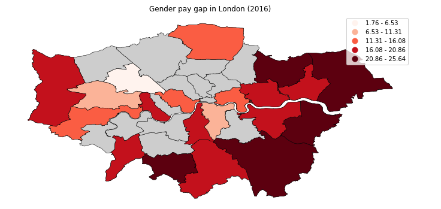

More information on vector data and the different ways of representing and accessing vector data using Python is described in the [Introduction to geospatial data using Python](/learningpaths/data-analysis-using-python/introduction-to-geospatial-data-using-python/) article. In this tutorial, we use code snippets to explain how to work with vector data.

## Prerequisites

To complete this tutorial, you need:

* An <a href="https://cloud.ibm.com?cm_sp=ibmdev-_-developer-tutorials-_-cloudreg" target="_blank" rel="noopener noreferrer">IBM Cloud</a> account
* <a href="https://dataplatform.cloud.ibm.com/docs/content/wsj/getting-started/overview-ws.html?cm_sp=ibmdev-_-developer-tutorials-_-cloudreg" target="_blank" rel="noopener noreferrer">Watson Studio</a>

## Steps

### Set up

1. Sign up or log in to IBM Cloud.

1. Click **Create resource** at the top of the Resources page. You can find the resources under the hamburger menu at the upper left.

    

1. Search for **Watson Studio**, and click that tile.

    

1. Select the Lite plan, and click **Create**.
1. Go back to the Resources list, click your Watson Studio service, and then click **Get Started**.

    

    You should now be in Watson Studio.

1. Click either **Create a project** or **New project**.
1. Select **Create an empty project**.
1. Give the project a name.
1. Choose an existing Object Storage service instance or create a new one. This is used to store the notebooks and data. Note: Don't forget to click refresh when returning to the Project page.
1. Click **Create**.

### Create a project Access token

To load data into a notebook, you need an Access token.

1. Go the Settings tab at the top of the project and scroll down to **Access tokens**.
1. Click **New token**.
1. Name the new token, select **Editor**, and click **Create**.

    

    You will need this later in the notebook.

### Create a custom Python environment

Because the required libraries are not installed in the default Python environment, you must create a customized environment by using `conda create`. However, because the environment is running in IBM Cloud, there are a few steps to go through.

1. Go to the environments tab at the top of your project.
1. Click **New environment definition**.

    

1. Name your new environment.
1. Keep the default, select the free hardware configuration **Free - 1 vCPU and 4 GB RAM**, **Default Python 3.6**, and click **Create**.

    

1. Customize the new environment. Scroll down, and click **Create** link under Customization

    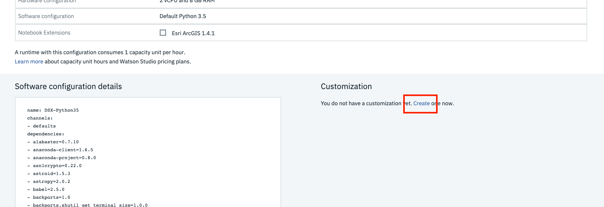

1. A text field opens that you can edit. Delete all of the text, and copy and paste the following code into the text field.

    ```
    channels:
    - defaults
    - conda-forge

    # Please add conda packages here
    dependencies:
    - geopandas=0.4.1
    - geoplot=0.2.4
    - pysal=2.0.0
    - folium=0.9.1
    - python=3.6.8

    # Please add pip packages here
    # To add pip packages, please comment out the next line
    #- pip:
    ```

1. Click **Apply**.

Now you can use this new environment to run notebooks

## Load and run a notebook

To add a new notebook:

1. Click **Add to project**, and choose **Notebook**.

    

1. Choose **New notebook from URL**.
1. Name your notebook, and copy the URL <a href="https://github.com/IBM/data-analysis-using-python/blob/master/notebooks/vector-data-using-geopandas.ipynb" target="_blank" rel="noopener noreferrer">https://github.com/IBM/data-analysis-using-python/blob/master/notebooks/vector-data-using-geopandas.ipynb</a>.
1. Select the **Custom runtime environment** that you created, and click **Create Notebook**.

The notebook loads. Follow the instructions in the notebook, and run all cells. Then, return to this tutorial.

## Notebook overview

### About the data set

Initially, we begin by creating a simple vector data set that contains information about five cities in the United Kingdom. After going through the basics, we use a data set with information about London Boroughs. We then move on to analyzing vector data from <a href="https://www.openstreetmap.org/about" target="_blank" rel="noopener noreferrer">Open Street Map(OSM)</a>.

The following list provides some of the capabilities of vector data that you explore with GeoPandas in Python.

* Attributes and methods
* Points versus lines versus polygons
* Overlay
* Buffer
* Spatial relationships (contains, within, intersects, crosses, disjoint)
* Dissolve
* Join

The <a href="https://github.com/IBM/data-analysis-using-python/blob/master/notebooks/vector-data-using-geopandas.ipynb" target="_blank" rel="noopener noreferrer">notebook</a> associated with this tutorial displays these functions of GeoPandas.

### Initialize GeoDataFrame

In addition to using <a href="https://geopandas.org" target="_blank" rel="noopener noreferrer">GeoPandas</a>, which is an extension to pandas, we use [Shapely](https://shapely.readthedocs.io/en/latest/) to define geometric objects and <a href="https://matplotlib.org" target="_blank" rel="noopener noreferrer">matplotlib</a> to visualize some of the features. The following image shows the list of `import`s that were used.


We begin by creating a simple DataFrame using pandas. The following image shows sample vector data that contains the latitude and longitude information of the different cities.


We then create an additional column named *point* that combines the longitude and latitude columns from the DataFrame defined previously. The entries in this column are converted into a `Point` object by initializing it using Shapely. This column is named *geometry*.


#### GeoSeries and GeoDataFrame

GeoPandas extends two of its main data structures, GeoSeries and GeoDataFrame, from pandas. GeoSeries, much like a pandas Series is a vector in which each entry represents one or more shapes corresponding to a row. GeoDataFrame, much like a pandas DataFrame is a two-dimensional data structure that has a column that is the GeoSeries, along with other information. The GeoSeries column within the GeoDataFrame is referred to as the *geometry*.

The following figure is the code snippet that shows how a GeoDataFrame is created by extending an existing DataFrame. We drop the point column now because it is not needed any longer.


### Attributes and methods

This new GeoDataFrame has the same attributes and methods defined as a pandas DataFrame. For example, the code in the following figure shows how the mean of the population column and the minimum of the area column is calculated.


The following image shows the code that illustrates how density is calculated using population and area. Nothing so far has changed with this GeoDataFrame in terms of its property of a pandas DataFrame.


But there are several additional attributes and methods that come with this GeoDataFrame. When a method or attribute is applied, it is applied on the *geometry* column. The complete list of the function can be found in the <a href="https://geopandas.org/reference.html" target="_blank" rel="noopener noreferrer">API Reference</a>. Let's begin by looking at some of the popular built-in attributes. They are `area`, `bounds`, `total_bounds`, and `geom_type`.

Because our cities DataFrame only contains Points, `area` returns a GeoSeries of 0s.


`total_bounds` returns the minimum and maximum bounds of x and y coordinates across entries from the DataFrame.


`geom_type` returns the geometry type of each entry. A GeoDataFrame can have more than one type of geometry.


In the following example, `distance` helps calculate the distance of each of the four other cities from London.


We now create another GeoDataFrame, which is a subset of the original cities data set. By dropping two rows from the original data set, let's try a few other attributes and methods to further understand the capabilities of GeoPandas.

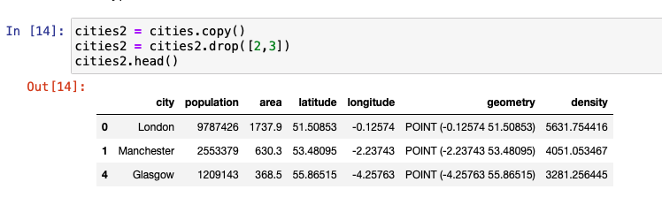

`area` returns a similar DataSeries similar to the one we saw previously.

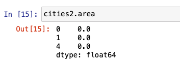

`bounds` is different from `total-bounds` (see above) in the sense that `bounds` returns an array of min and max for x and y for each entry in the DataFrame, whereas `total-bounds` returns one set for the entire DataFrame.

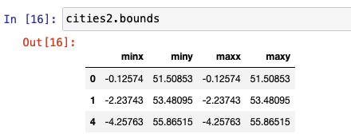

`geom-type` is the same as we saw previously for the cities data set.


The `centroid` method returns a GeoSeries of the center point for each geometry. In the case of a Point, the point itself is removed. However, the behavior on the Line or Polygon geometry will be different.


The `representative-point` method returns a point that is guaranteed to be within the geometry. It could be the centroid, but not necessarily. Similar to centroid, for a Point geometry the point itself is returned.


### Points versus Lines versus Polygons

Because we used Shapely to previously define Points in the cities GeoDataFrame, we can use the `squeeze` method to extract the points that represent each city. The following image shows the code for this.


By combining two points and applying Shapely's `LineString` object, a GeoSeries representing the line is built. The following code snippet shows how several lines are constructed between cities using this method.


Three or more points can be combined in a similar way to form a polygon. Shapely has a Polygon interface to define this polygon and create a GeoSeries.


The graph shown in the previous image shows lines between each city in different colors and the two polygons that are formed by connecting three cities. We use the built-in `plot` method to represent the graph.

### Overlay

To observe interactions between more than one data set, we use the overlay library. `union`, `difference`, `symmetrical difference`, and `intersection` are some of the operations that can be performed.

The following figure shows the union of the two polygons displayed in the previous graph.


### Buffer

Buffer is the method of adding a buffer around the object to identify the area. The unit and the measure of the buffer varies based on the use case. Buffer can be applied to a point, line, or polygon, and the result is always a polygon.

In the following code, we create a DataFrame with just one row to show how the buffer size varies based on the distance provided each time to the same entry.


The inner red dot in the following graph represents the actual point. The three other concentric rings around this point represent different buffer sizes. An example to applying buffer is to identify what amount of area from the epicenter of a virus needs to be quarantined.


### Spatial relationship

GeoPandas provides several binary predicates that can be applied to a GeoDataFrame to understand the relationship between two data sets. For example, consider the two data sets, cities and cities2 that we set up in this tutorial. The following figures help you to better visualize the results.


`contains` is one of the most popular relationship test methods used. We provide four different examples of `contains` that can be used to find relationships between geospatial features or geometries.

To calculate what points from cities2 exist in the cities data set, we use the following code.


To find out which geometries in the cities2 data set contains London, we use the following code.


To display the entry of the previous query, we call the entry as stated below.

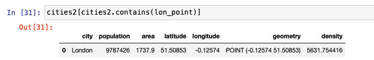

The following figure shows similar code for finding out which entry contains the Manchester data point.

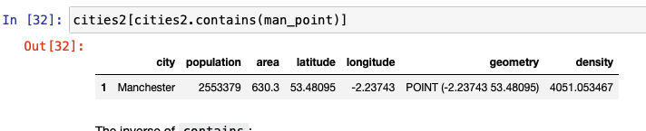

`within` is another relationship test that is used to find whether a point lies within another. The following figures show examples of the input and output of how `within` can be used. `intersects`, `crosses`, and `disjoint` are also used to in the same way, as shown below.


### Dissolve

When we want to combine the geography of one or more rows within the same data set, we use the `dissolve` method. This can be useful to get a macro level view of the geometric objects from either the subset or the entire data set. To show how `dissolve` works, we create the following GeoDataFrame by loading a JSON file from the URL.

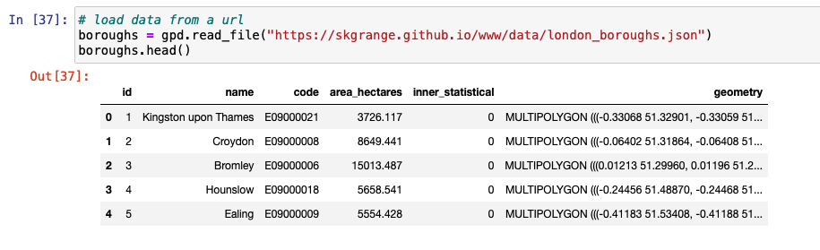

We then proceed to plot the boroughs to display how the boroughs look before dissolving.

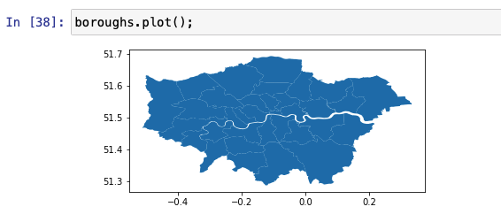

We create a column named *all* and set it to 1 so that all rows are aggregated into one row. The aggregate function parameter - `aggfunc` can be one of *first*, *last*, *min*, *max*, *sum*, *mean*, or *median* to indicate how the number fields need to be aggregated. The following example indicates that information from all rows needs to be added.

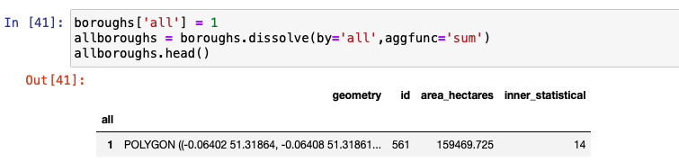

Notice how all individual polygons are combined into one Multipolygon. The fine lines that separated each of these boroughs as shown in the graph are not present in the graph. The axis label is turned off, and the size of the plot is increased to get some more clarity.


### Join

`join` is used to combine rows from multiple data sets into one.

We first create a pandas DataFrame by importing a .csv file. Notice how the number of rows is 5 and number of columns is 84 on this DataFrame. The original boroughs DataFrame has just 6 columns.


After setting the index column to *code* and then applying `join`, we notice that the new GeoDataFrame contains the same number of rows, which is 5, but the column is now 89, which is an addition of columns from both DataFrames.


The following code shows classifying and visualizing inner and outer boroughs of London. This is done by applying dissolve on the *Inner/_Outer_London* column and using mean as the aggregate function.


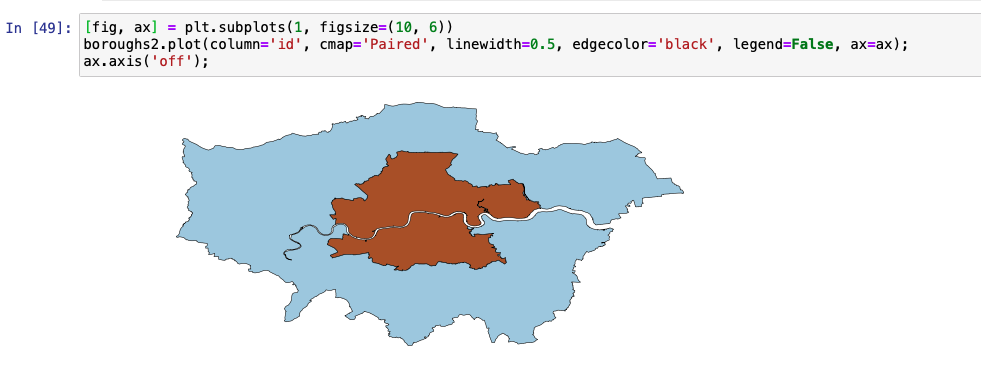

In the following example, we create an average gender pay gap map. We do this by creating a column named *paygap* that holds the average pay gap. We then plot the pay gap information on the boroughs plot.


### Open Street Map data

Open Street Map (OSM) is open source map information that is contributed by a community of mappers. In the last section of the <a href="https://github.com/IBM/data-analysis-using-python/blob/master/notebooks/vector-data-using-geopandas.ipynb" target="_blank" rel="noopener noreferrer">notebook</a>, we use data from OSM with information about points of interest (POIs) in and around London. Combining this information along with the boroughs data set from the previous section, interesting inferences are made and visual maps are constructed. We encourage you to run this section of the notebook to get more practice with vector geospatial data.

## Conclusion

This tutorial walked you through the basics of geospatial vector data. It gave you an overview of ways to analyze data using GeoPandas, Shapely, and matplotlib in Python. It also gave you code snippets for defining Shapely objects and using different attributes and methods. We discussed, overlay, buffer, spatial relationships, `dissolve` and `join`. Finally, we gave an overview of how OSM data is used in the notebook.