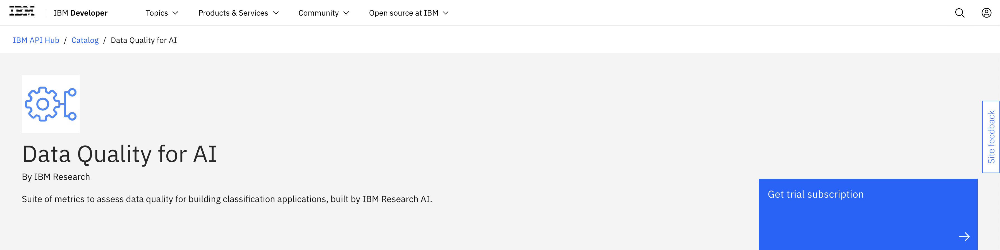
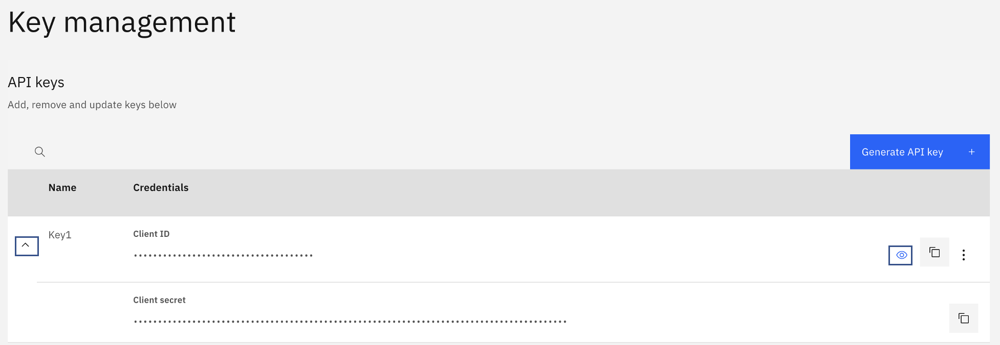

IBM Researchが提供する<a href="https://developer.ibm.com/apis/catalog/dataquality4ai--data-quality-for-ai/Introduction" target="_blank" rel="noopener noreferrer">Data Quality for AI</a>は、さまざまなデータ・プロファイリングや品質評価メトリクスを提供し、取り込まれたデータの品質を体系的かつ客観的に評価するためのAPIスイートです。このチュートリアルでは、いくつかのAPIコールを呼び出すことで、データ・セットのデータ品質評価を得る方法をステップ・バイ・ステップで説明します。また、APIを使い始めるのに役立つ詳細なコード例もご紹介します。このチュートリアルでは、IBM API Hub プラットフォームで Data Quality for AI のトライアル・サブスクリプションにアクセスするなど、いくつかの基本的な手順を説明します。  

このチュートリアルでは、Pythonコード・スニペットを使用して完全なユースケースを紹介しています。ただし、API を呼び出すために独自のプログラミング言語を選択することができます。リファレンス・コード・スニペットは、<a href="https://developer.ibm.com/apis/catalog/dataquality4ai--data-quality-for-ai/Introduction" target="_blank" rel="noopener noreferrer">API documentation</a>ページで、一部の言語(例えば、cURL、Java、Node、PHP、Go、Swift、Ruby)に対応しています。利用可能なデータ品質APIについては、このチュートリアルを利用することができます。

* クラスオーバーラップ
* クラス・パリティ
* ラベルの純度
* 外れ値検出
* データの重複
* データの同質性
* データプロファイラ
* データの完全性
* 相関関係の検出

## 前提条件

このチュートリアルを完了するには、以下のものが必要です。

* IBM ID
* CSV形式の表形式（構造化）データセット
* Python 3

## 見積もり時間

このチュートリアルを完了するには、約15分かかります。

## 手順

### ステップ 1.環境設定

環境を整えるために

1. <a href="https://developer.ibm.com/apis/catalog/dataquality4ai--data-quality-for-ai/Introduction/" target="_blank" rel="noopener noreferrer">Data Quality for AI</a> APIsのドキュメントページに移動し、「**Get trial subscription**」をクリックします。

    

1. 新しいタブで登録ページが起動します。すでにIBM IDをお持ちの方は、**Log in**を選択してください。IBM IDをお持ちでない方は、新規にIBM IDを作成してください。

1. ログインすると、システムはお客様にトライアル・サブスクリプションの権利を与え、My IBM ページに移動します。Data Quality for AI API 試用版のタイルを見つけて、**Launch**をクリックします。

1. My APIs］ページで［Data Quality for AI］タイルをクリックし、ページが開いたら［Key management］セクションを見つけます。行を展開して、クライアントIDとクライアントシークレットの両方を確認します。可視性（目）のアイコンをクリックすると、実際の値が表示されます。これらの値は、このチュートリアルで使用するAPIキーなので、注意してください。

    

1. 受け取ったAPIキーの値でconfig.jsonファイルを作成します。