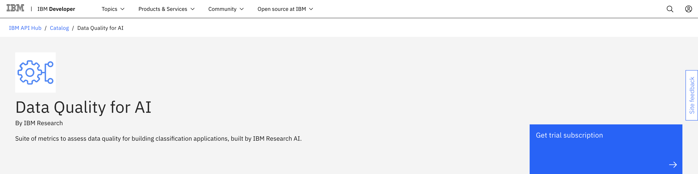
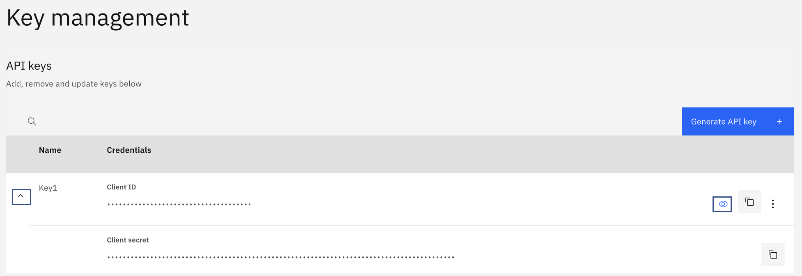

<a href="https://developer.ibm.com/apis/catalog/dataquality4ai--data-quality-for-ai/Introduction" target="_blank" rel="noopener noreferrer">Data Quality for AI</a> from IBM Research is a suite of APIs that provide various data profiling and quality estimation metrics to assess the quality of ingested data in a systematic and objective manner. In this tutorial, we provide a step-by-step guide on how you can get a data quality assessment for your data set by invoking a few API calls. We also give example code snippets with details to help you get started using the APIs. This tutorial covers a few basic steps such as getting access to a trial subscription of Data Quality for AI on the IBM API Hub platform.  

The tutorial uses Python code snippets to showcase a complete use case. However, you can choose your own programming language to invoke the APIs. Reference code snippets are available for select languages (for example, cURL, Java, Node, PHP, Go, Swift, and Ruby) on the <a href="https://developer.ibm.com/apis/catalog/dataquality4ai--data-quality-for-ai/Introduction" target="_blank" rel="noopener noreferrer">API documentation</a> page. You can use this tutorial for available data quality APIs:

* Class overlap
* Class parity
* Label purity
* Outlier detection
* Data duplicates
* Data homogeneity
* Data profiler
* Data completeness
* Correlation detection

## Prerequisites

To complete this tutorial, you need:

* An IBM ID
* A tabular (structured) data set in a CSV format
* Python 3

## Estimated time

It should take you approximately 15 minutes to complete this tutorial.

## Steps

### Step 1. Environment setup

To set up your environment:

1. Navigate to the <a href="https://developer.ibm.com/apis/catalog/dataquality4ai--data-quality-for-ai/Introduction/" target="_blank" rel="noopener noreferrer">Data Quality for AI</a> APIs documentation page, and click **Get trial subscription**.

    

1. This launches a registration page in a new tab. If you already have an IBM ID, select **Log in**. Otherwise, create a new IBM ID for yourself.

1. After you've logged in, the system entitles you with a trial subscription and takes you to the My IBM page. Locate the Trial for Data Quality for AI API tile, and click **Launch**.

1. On the My APIs page, click the **Data Quality for AI** tile, and when the page opens, locate the Key management section. Expand the row to see both the Client ID and Client secret. Click the visibility (eye) icon to reveal the actual values. Note these values because they are the API keys you'll use throughout this tutorial.

    

1. Create a config.json file with the API key values you received.

    ```json
    {
        "x-ibm-client-id":  "REPLACE_THIS_WITH_YOUR_CLIENT_ID",
        "x-ibm-client-secret": "REPLACE_WITH_YOUR_CLIENT_SECRET"
    }
    ```

1. Install a `requests` Python package using `pip`.

    ```bash
    pip install requests
    ```

### Step 2. Invoke data quality assessment APIs

On the <a href="https://developer.ibm.com/apis/catalog/dataquality4ai--data-quality-for-ai/Introduction" target="_blank" rel="noopener noreferrer">API documentation</a> page, you see several API operations that can be invoked against your data set. In this example, we use the class overlap metric. This API detects the presence of data points that belong to different classes, but lying very close to each other in the data space.

**Note:** All of the details related to metric definition and interpretation of output are provided on the metric page.


#### Request

```python
import json
import requests

# Loading the credentials headers from config.json  
credentials_headers = json.load(open("config.json", "r"))

with open('test_dataset_file.csv', 'r') as fp:
    response = requests.post(
        'https://api.ibm.com/dataquality4ai/run/data_quality/structured/class_overlap',
        headers=credentials_headers,
        files={'data_file': fp}
    )
    print("Response JSON -", response.json())
    print("\nResponse headers -", response.headers)
```

#### Response

The response headers tell you the balance of the hourly and daily limit of calls that you can still make. Also, notice that this API call returns a `job_id` (a Hexadecimal string). This `job-id` is needed to check when the assessment operation will complete.

Response JSON:

```json
{
    "job_id": "b07096f9-aaaa-xxx-xxx-015cf309f89",
    "message": "Job Submitted",
    "response": null
}
```
Response headers:

```
{
    'x-ratelimit-limit': 'name=hourlly-limit,20; name=daily-limit,100;',
    'x-ratelimit-remaining': 'name=hourlly-limit,19; name=daily-limit,99;',
    'content-encoding': 'gzip'
}
```

### Step 3. Check the job status and output

With the `job_id` returned in the previous step, you must invoke another API for the completion status of the initial
operation.

#### Request

```python
import json
import requests

# Loading the credentials headers from config.json
credentials_headers = json.load(open("config.json", "r"))

response = requests.post(
    'https://api.ibm.com/dataquality4ai/run/get_result',
    headers=credentials_headers,
    data={"job_id": "YOUR_JOB_ID"}
)

print(response.json())
```

#### Response

The following code shows the output for a job that is still running.

```json
{
    "job_id": "b07096f9-aaaa-xxx-xxx-015cf309f89",
    "message": "Job Running: Analysing Data Quality",
    "response": null
}
```

The following code shows the output for a job that is complete.

```json
{"job_id": "b07096f9-aaaa-xxx-xxx-015cf309f89", "message": "Job Finished", "response": {"metadata": {"dataset_details":[{"name":"test_dataset_file.csv","path":"","type":"Structured"}],"method_details":{"categorical_encoding":"nominal","definition":"Finds class wise overlapping regions in the data to give an aggregated class overlap score and feature ranges contributing to overlap. Score equal to 1 indicates no class overlap.","hyperparameters":{},"name":"Class Overlap","type":"Quality"},"runtime":0.595196,"starting_timestamp":"2021-06-18 10:12:34","user_input_details":{"label_column":"class"}},"results":{"details":{"class_overlap_statistic":{"definition":"Number of data points for a given class in overlap region / Total number of points in the given class","value":{"0":0.09,"1":0.03,"2":0,"3":0.07,"4":0.07,"5":0,"6":0,"7":0.13,"8":0,"9":0,"10":0.02}},"overlap_distribution_in_classes":{"definition":"Number of data points for a given class in overlap region / Total overlapping points in dataset","value":{"0":0.22,"1":0.07,"2":0,"3":0.17,"4":0.17,"5":0,"6":0,"7":0.32,"8":0,"9":0,"10":0.06}},"overlapping_indices":[24,29,38,5436,5473],"overlapping_regions":{"definition":"Region wise features/columns ranges and points which are overlapping","regions":[{"feature_ranges":{"V1":{"max":0.14,"min":-1.316},"V10":{"max":-0.056,"min":-0.764}},"points":[2051,1936,2036]},{"feature_ranges":{"V1":{"max":-0.993,"min":-1.167},"V10":{"max":-0.424,"min":-0.749}},"points":[938,3505,3836]}]},"total_overlap_fraction":{"definition":"Total number of points in all overlapping regions / Total number of points in the dataset","value":0.04}},"explanation":" Total overlapping fraction present in dataset: 0.04<br> Number of overlapping rows: 212<br> Number of classes with overlap: 7<br> Class: 9.0 has highest amount of overlap i.e 31.6% of total overlap.","score":0.96,"title":"Class Overlap"}}}
```

**Response details**

The JSON consists of three fields: `job_id`, `message`, and `response`. The `job_id` field has the same value as the user request. The `message` field gives the status of the job. If your job is still in progress, you receive a message indicating the status of your job. If your job is complete, you receive a `Job Finished` message, and the output of the data quality job is present in the response field as data quality JSON.

To learn more about how to interpret input/output, data quality JSON, and different job messages, refer to the <a href="https://developer.ibm.com/apis/catalog/dataquality4ai--data-quality-for-ai/Getting%20Started" target="_blank" rel="noopener noreferrer">Getting Started</a> page.

### Step 4. Other operations in the API suite

Using Step 2 and Step 3, you can invoke class parity, label purity, outlier detection, data duplicates, data homogeneity, data profiler, data completeness, and correlation detection operations by referring
to an individual endpoint's documentation (request URL and expected parameters) from the <a href="https://developer.ibm.com/apis/catalog/dataquality4ai--data-quality-for-ai/Introduction" target="_blank" rel="noopener noreferrer">API documentation</a> page.

**Note:** The API documentation page also has a Try this API feature, which is a REST client UI. You can use this to invoke the APIs by reading the documentation in the same context.

## Summary

This tutorial explained how to secure API keys and easily invoke the Data Quality APIs hosted in IBM Cloud. The APIs in the suite help with invoking different algorithms work with your data's quality needs. If you have any questions or queries, join our <a href="https://join.slack.com/t/dqai/shared_invite/zt-ra98jfbm-KgZwRlokg~5_3_A7FyFm3g" target="_blank" rel="noopener noreferrer">Slack workspace</a>.