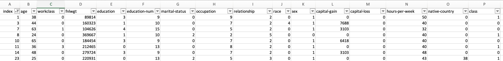

In this tutorial, learn how you can assess class overlap and label purity-based data quality for your classification tabular (structured) data using Data Quality for AI APIs that are available on the IBM API Hub platform. The tutorial covers what is meant by the class overlap and label  purity metrics as well as how you can invoke and explore these APIs.

## Prerequisites

To complete this tutorial, you need:

* A tabular (structured) data set in a CSV format
* Python 3

##  Estimated time

It should take you approximately 15 minutes to complete the tutorial.

## Data set

In this tutorial, we use a publicly available <a href="https://datahub.io/machine-learning/adult" target="_blank" rel="noopener noreferrer">Adult</a> data set from DataHub. This data set is based on a classification task to assess whether a person makes over 50K a year. We use this data set to illustrate the functionality of the class overlap and label purity APIs.

## Initial setup

To get started:

1. Create a config.json file with the following API key values in it. The previous tutorial in this learning path explained how to [get the Client ID and Client secret](https://developer.ibm.com/learningpaths/data-quality-ai-toolkit/assessing-quality-of-tabular-data-sets-using-apis/).

    ```json
    {
      "x-ibm-client-id": "REPLACE_THIS_WITH_YOUR_CLIENT_ID",
      "x-ibm-client-secret": "REPLACE_WITH_YOUR_CLIENT_SECRET"
    }
    ```

1.  Install the `requests` Python package using pip.

    ```bash
    $ pip install requests
    ```

1. Download the CSV file for the <a href="https://datahub.io/machine-learning/adult" target="_blank" rel="noopener noreferrer">Adult</a> data set from DataHub.

## Class overlap

For classification data sets, having overlapping regions in the data set is problematic. Overlapping regions are when data points from different classes are very close to each other or class boundaries are overlapping with each other. These overlapping regions affect the classification task and the decision made during the modeling of the data set. Such overlapping regions are hard to detect and can cause machine learning classifiers to misclassify points in that region.

This metric analyzes the data set to find samples that reside in the overlapping region of the data space. It identifies class-wise overlapping regions in the data to give an aggregated class overlap score and feature ranges contributing to the overlap. A score equal to 1 indicates no class overlap.

### Step 1. Submit your data quality job for the class overlap metric using the API

You can run the following code to submit a class overlap-based data quality request for the Adult data set.

#### Request

```python
import json
import requests

# Loading the credentials headers from config.json
credentials_headers = json.load(open("config.json", "r"))

with open('adult.csv', 'r') as fp:
  response = requests.post(
    'https://api.ibm.com/dataquality4ai/run/data_quality/structured/class_overlap',
    headers=credentials_headers,
    files={'data_file': fp}
  )
print("Response JSON -", response.json())
```

#### Response JSON

You receive a job ID as a response, and you can use this job ID to fetch the results of the data sets after the analysis is complete.

```json
{
  "job_id": "b07096f9-aaaa-xxx-xxx-015cf309f89",
  "message": "Job Submitted",
  "response": null
}
```

### Step 2. Get your class overlap result using job ID

You can invoke a `get_result` API call to get the result or status of your job with the `job_id` returned in the previous step.

#### Request

```python
import json
import requests

# Loading the credentials headers from config.json
credentials_headers = json.load(open("config.json", "r"))

response = requests.post(
  'https://api.ibm.com/dataquality4ai/run/get_result',
  headers=credentials_headers,
  data={"job_id": "YOUR_JOB_ID"}
)
print(response.json())
```

#### Response JSON

The following code shows a shortened example code of a job that is complete.

```json
{
  "job_id": "b07096f9-aaaa-xxx-xxx-015cf309f89",
  "message": "Job Finished",
  "response": {
    "results": {
      "title": "Class Overlap",
      "score": 0.68,
      "explanation": "Total overlapping fraction present in dataset: 0.32",
      "details": {
        "total_overlap_fraction": {
          "definition": "Total number of points in all overlapping regions / Total number of points in the dataset",
          "value": 0.32
        },
        "overlapping_regions": {
          "definition": "Region wise features/columns ranges and points which are overlapping",
          "regions": [{
              "points": [1,3,7,10],
              "feature_ranges": {}
            }
          ]
        },
        "class_overlap_statistic": {
          "definition": "Number of data points for a given class in overlap region / Total number of points in the given class",
          "value": {
                      "<=50K": 0.22,
                      ">50K": 0.62
                  }
        },
        "overlap_distribution_in_classes": {
          "definition": "Number of data points for a given class in overlap region / Total overlapping points in dataset",
          "value": {
                                "<=50K": 0.53,
                                ">50K": 0.47
                  }
        },
        "overlapping_indices": [1, 3, 7, 8, 10, 11, 14, 23, 25]
      }
    },
    "metadata": {}
  }
}
```

### Step 3. Interpret the class overlap JSON output

You can find all of the information-related results of the class overlap analysis under the `results` field of the `response`, as shown in the previous code example. Along with the class overlap score and explanation, you can get multiple class overlap-related information in the `details` field. The following fields are quick ways to access them.  

* `results->score` - Data quality score based on a fraction of data points non-overlapping regions. A score equal to 1 indicates no class overlap. The Adult data set score is 0.68, which means that 68% of data points in the data set are in non-overlapping regions.
* `results->details->overlapping_regions` - Region-wise features/columns ranges and points that are overlapping. It has a list of regions where each region consists of indices of overlapping points and feature ranges (min and max) for the region. In the previous example, you can see points `1,3,7,10` belong to regions 1.  
* `results->details->class_overlap_statistic` - For each class, the number of data points for a given class in an overlap region / Total number of points in the given class. In the Adult data set, 62% of the data points of class `>50K` are from overlapping regions.
* `results->details->overlap_distribution_in_classes` - For each class, the number of data points for a given class in an overlap region / Total overlapping points in a data set. In the Adult data set, 47% of overall overlapping data point belong to class `>50K`.
* `results->details->overlapping_indices` - This contains the list of indices of overlapping data points. In the Adult data set, this list has points `1, 3, 7, 8, 10, 11...`, as seen in the previous JSON response. Step 4 shows a snippet of these overlapping data points. 

### Step 4. Overlapping data snippet

You can select the overlapping data points based on indices present in `results->details->overlapping_indices`. The following image shows a small subset of such overlapping data points.



## Label purity

Most of the large data in machine learning is either generated or annotated using crowd source platforms. In many cases, such data sets have some inconsistent or incorrectly marked labels. This metric helps you to identify the label errors or inconsistencies in labels and helps identify potential problems with model building. It identifies noise ratio and noisy samples in the data. A score of 1 indicates no noise is present in the data.

The metric also provides suggested labels for each data sample that is flagged as noisy. The index of data points that are deemed as having incorrect labels can be accessed by the `details` field within the `results` field in the JSON output.

### Step 1. Submit your data quality job for the label purity metric using the API

You can run the following code to submit a label purity-based data quality request for the Adult data set.

#### Request

```python
import json
import requests

# Loading the credentials headers from config.json
credentials_headers = json.load(open("config.json", "r"))

with open('adult.csv', 'r') as fp:
  response = requests.post(
    'https://api.ibm.com/dataquality4ai/run/data_quality/structured/label_purity',
    headers=credentials_headers,
    files={'data_file': fp}
  )
print("Response JSON -", response.json())
```

#### Response JSON

You receive a job ID as a response. You can use this job ID to fetch the results of the data sets after the analysis is complete.

```json
{
  "job_id": "b07096f9-aaaa-xxx-xxx-015cf309f89",
  "message": "Job Submitted",
  "response": null
}
```

### Step 2. Get your label purity result using the job ID

You can invoke a `get_result` API call to get the result or status of your job with the `job_id` returned in the previous step.

#### Request

```python
import json
import requests

# Loading the credentials headers from config.json
credentials_headers = json.load(open("config.json", "r"))

response = requests.post(
  'https://api.ibm.com/dataquality4ai/run/get_result',
  headers=credentials_headers,
  data={"job_id": "YOUR_JOB_ID"}
)
print(response.json())
```

#### Response JSON

The following code shows a shortened example code snipped of a job that is complete.

```json
{
  "job_id": "b07096f9-aaaa-xxx-xxx-015cf309f89",
  "message": "Job Finished",
  "response": {
    "results": {
      "title": "Label Purity",
      "score": 0.99,
      "explanation": "Noisy labels detected in 466 / 48842 rows giving a quality of 0.99.",
      "details": {
        "confusing_noisy_samples": {
          "reason": "Noisy samples lying in confusion region.",
          "samples_list": []
        },
        "noisy_samples": [
          {
            "actual_label": 0,
            "row": 345,
            "suggested_label": 1
          }
        ],
        "non_processed_classes": {
          "class_list": {},
          "reason": "Classes have less than minimum 5 samples"
        }
      }
    },
    "metadata": {}
  }
}
```

### Step 3. Interpret the label purity JSON output

You can find all of the information-related results of the label purity analysis under the `results` field of the `response`, as shown in the previous code example. Along with the label purity score and explanation, you can get more label purity-related information in the `details` field. The following fields are quick ways to access them.

* `results->score` - Data quality score that is based on the presence of incorrect labels in the data set. For the Adult data set, this score is 0.99, which means that 99% of the data points have correct labels and only 1% have incorrect labels.
* `results->details->confusing_noisy_samples` - Contains the reason and indices of all of the incorrectly labeled data points.
* `results->details->noisy_samples` - Contains the information related to noisy data points and their new suggested labels.

## Summary

In this tutorial, you learned how you can assess the quality of a data set based on two metrics: class overlap and label purity. You can use the data quality scores, explanations, and details while building your machine learning models. This information can help you to enhance the performance of your downstream machine learning tasks. Explore more data quality APIs in the <a href="https://developer.ibm.com/apis/catalog/dataquality4ai--data-quality-for-ai/Introduction" target="_blank" rel="noopener noreferrer">Data Quality for AI</a> suite. If you have any questions or queries, join our <a href="https://join.slack.com/t/dqai/shared_invite/zt-ra98jfbm-KgZwRlokg~5_3_A7FyFm3g" target="_blank" rel="noopener noreferrer">Slack workspace</a>.