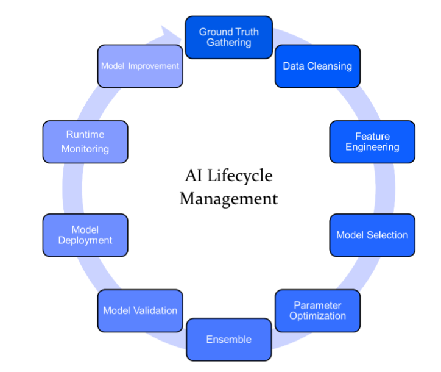
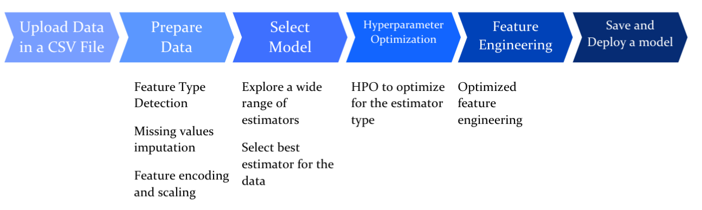

AutoMLは、現在のバズワードとして、多くの技術業界の記事や研究に登場し、多くのベンダーの製品カタログにも掲載されています。また、"AutoML製品にどのようにアプローチすればよいか"、"これらの製品は機械学習のライフサイクルのすべてのステップを実行しながら、データサイエンティストである私がパラメータをある程度コントロールできるのか "など、私がよく質問されるテーマの一つでもあります。話題になっている中で、AutoMLとは何か？なぜ私たちはAutoMLの製品を選ぶのか？IBM&reg; Watson&trade; AutoAIとは何か？なぜこのような包括的なソリューションなのか、そしてどのようにしてその能力を最大限に発揮できるのか？これらの情報をすべてここで提供しようと思います。

機械学習のパイプラインが自動的に完成するのを見るのは、便利でストレスが少ないと思いませんか？データサイエンティストが数週間、あるいは数ヶ月かけて完成させる作業を自動化する？これがAutoMLの基本的なコンセプトです。AutoMLは、データをソフトウェアに取り込み、自動的にデータを分析して確かな予測結果を導き出すことができます。この「ソフトウェア」とは、現実世界のさまざまなユースケースを解決するために使用できる、実装された機械学習モデル全体のことを指しています。

主な疑問の1つは、"なぜ自動機械学習なのか？"ということです。まず始めに、従来の機械学習のデメリットを説明する必要があります。世界中でデータサイエンティストや機械学習の専門家に大きな需要がありますが、私たちが持っている現在のスキルではその需要に応えることができません。これはなぜでしょうか？予測モデルの構築には時間がかかり、多大な労力を必要とし、これらの複雑な機械学習アルゴリズムのすべてについて膨大な知識を必要とするからです。

AIのライフサイクルの中には、ありふれた単調な作業であっても自動化できるものがあり、基本的には「AIを設計するAIとAIを最適化するAI」の段階に持っていくことができます。これが、現在のAutoMLの主な目的です。そこで、データを自動的に準備し、機械学習アルゴリズムを適用し、データセットやユースケースに最適なモデルパイプラインを構築するIBMクラウド製品「Watson AutoAI」が登場しました。AutoAIは、回帰や分類に関する問題を数秒で解決してくれます。なんてクールなんでしょう。

データの準備段階から、モデルの展開（ハイパーパラメータの最適化を含む）、最適なアルゴリズム／モデルの選択、特徴量のエンジニアリングまで、AutoAIがすべてを行います。どのようなデータセットやユースケースにどのようなモデルが最適なのかを理解するために、初心者が使うには便利なツールです。

では、AutoAIが自動化してくれるいくつかのステージについて、もう少し深く掘り下げてみましょう。

**データの準備**。開発者やデータサイエンティストであれば、誰もが欠落した値や冗長な値を含む矛盾したデータセットを目にしたことがあるでしょう。個人的には、Data Refineryを使ってデータセットの準備に何時間も費やしてきました。非常に面倒な作業ですよね？このような欠損値の処理、属性タイプの変換、データセットの正規化は、データサイエンス・パイプラインの最初のステージの一つですが、このステップはAutoAIによって数秒で実行されます。AutoAIは複数のアルゴリズムを用いて、データセットのクリーニングと準備を行います。また、特徴を数値やカテゴリーに分類したり、変数のスケーリングを行うことで、機械学習のバイアスを減らすことができます。

**自動化された特徴量エンジニアリング**。ユースケースを最もよく表すデータセット内の特徴の完璧な組み合わせを選ぶのは、時間のかかるプロセスです。AutoAIは、独自のアプローチで特徴空間と選択肢を絞り込み、強化学習を用いてモデルの精度を向上させます。

**ハイパーパラメータ最適化**。機械学習モデルを検討する際に直面する最も困難な問題の1つは、与えられたユースケースと入力データに対してどのようなハイパーパラメータ設定が最適かということです。AutoAIでは、コストのかかる関数評価に最適化されたハイパーパラメータ最適化アルゴリズムを使用して、最高のパフォーマンスを発揮するパイプラインを精製します。

**自動モデル選択**:ランダムフォレスト分類器とLightGBM分類器のどちらを使用するか？どちらがデータセットやユースケースに適しているか？自動モデル選択は、AutoAIが行う最も重要なステップの一つです。候補となるアルゴリズムをデータの小さなサブセットに対してランク付けする準備をし、最も有望なアルゴリズムのサブセットのサイズを徐々に大きくしていき、最適なものにたどり着くという革新的なアプローチを採用しています。

データセットをアップロードし、予測したいカラムを選択して、**Run experiment**をクリックするだけです。このように、たった2つのステップを踏むだけで、初心者でもすぐに実践することができます。また、特定のユースケースに最適な機械学習アルゴリズムの理解も深まります。AutoAIは、開発者が最終的なモデルパイプラインをウェブサービスとしてデプロイしたり、Pythonスクリプトとしてエクスポートしたりする利便性を提供します。

## まとめ

要約すると、AutoAIは、データの準備からモデルのデプロイまでをあなたに代わって自動化することで、複雑で時間のかかるAI開発プロセスを簡素化することができます。データサイエンティストである私たちは、手動でデータをクレンジングし、ユースケースに最適な機械学習モデルを探索、構築、監視するプロセスから解放され、パイプライン内のより主要なタスクに時間を向けることができます。

AutoAIによるデータ準備、モデル開発、フィーチャーエンジニアリング、ハイパーパラメータ最適化の自動化については、[AutoAI: Humans and machines better together](/articles/autoai-humans-and-machines-better-together/)を参照してください。