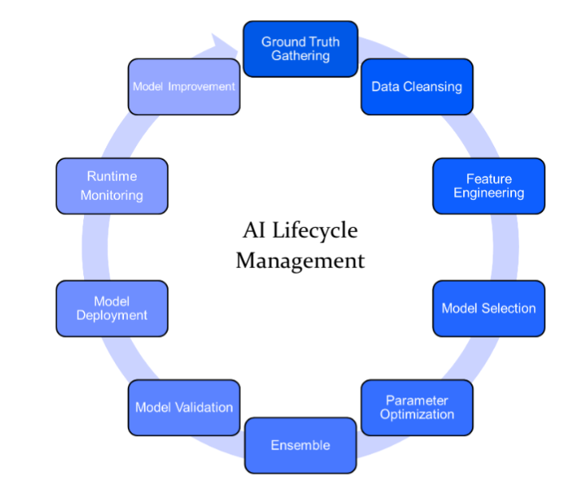
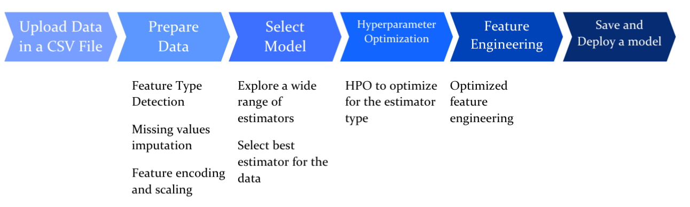

AutoML is a current buzzword that appears in a lot of tech industry articles and research, and is a product offering in many vendor product catalogs. It's also one of the topics that I get asked about, such as "How to approach AutoML products", "Will these products perform all of the steps of the machine learning lifecycle while giving me as a data scientist some control over the parameters?" Given all of the buzz, what does AutoML mean? Why do we opt for AutoML product offerings? What is IBM&reg; Watson&trade; AutoAI? Why is it such a comprehensive solution, and how can it be used to its best capabilities? I'll try to provide all of this information here.

Wouldn't it be convenient and less stressful to watch your machine learning pipeline be completed automatically? Automating tasks that take data scientists weeks or even months to finish? This is the underlying concept behind AutoML. It's essentially you taking your data and ingesting it into a piece of software that will automatically analyze your data and churn out solid predictions. This "software" that I am referring to is an entire implemented machine learning model that can be used to solve many different real-world use cases.

One of the main questions is "Why automated machine learning?" To begin, we need to first walk through the disadvantages of traditional machine learning. There's a huge demand of data scientists and machine learning experts across the world, but the current skills we have cannot meet that demand. Why is this? Because building a predictive model is time consuming, takes a lot of effort, and requires an extensive amount of knowledge of all of these complex machine learning algorithms.

There are some tasks within the AI lifecycle that are mundane and monotonous and can be automated, essentially taking us to "AI designing AI and AI optimizing AI" stages. This is the main objective behind any current AutoML. This takes us to Watson AutoAI, an IBM Cloud offering that automatically prepares data, applies machine learning algorithms, and builds model pipelines that are best suited for your data sets and use cases. AutoAI can help solve your regression- or classification-related problems within a few seconds. How cool is that?

From the data preparation stage to model deployment (including hyperparameter optimization), best algorithm/model selection, and feature engineering, AutoAI takes care of it all. It's a handy tool for beginners to use to understand what model works best for what kind of data set and use case.

Now, let's dive a little deeper into a few stages that AutoAI can automate for us.

**Data preparation**: As developers or data scientists, we've all seen inconsistent data sets with either missing or redundant values. Personally, I've spent hours preparing data sets using Data Refinery. Quite a cumbersome task, isn't it? Handling these missing values, converting attribute types, and normalizing data sets is one of the first stages in a data science pipeline, and this step is performed by AutoAI in a few seconds. AutoAI uses multiple algorithms to clean and prepare the data sets. It can also classify features as numerical or categorical, and perform variable scaling, which in turn reduces machine learning bias.

**Automated feature engineering**: Picking the perfect combination of features within a data set that best represents the use case is a time-consuming process. AutoAI uses a one-of-a-kind approach to prune the feature space and choices, while improving model accuracy by using reinforcement learning.

**Hyperparameter optimization**: When looking at machine learning models, one of the most challenging questions faced is what hyperparameter settings work best for a given use case and input data. AutoAI uses a hyperparameter optimization algorithm that is optimized for costly function evaluations refining the best performing pipelines

**Automated model selection**: Do we use a random forest classifier or a LightGBM classifier for our use case? Which one suits our data set and use case best? Automated model selection is one of the most crucial steps performed by AutoAI. It uses an innovative approach that prepares ranking candidate algorithms against small subsets of the data, gradually increasing the size of the subset for the most promising algorithms to arrive at the best match.

You just need to upload your data sets, select the column that you want to predict, and click **Run experiment**. This makes it easy for a beginner to get hands-on by performing only two steps. It also encourages a better understanding of the best machine learning algorithms for specific use cases. AutoAI gives developers the convenience of deploying their final model pipelines as a web service or exporting it as a Python script.

## Summary

To summarize, AutoAI can help simplify the complicated and time-intensive AI development process by automating it for you, from data preparation to model deployment. As data scientists, we are relieved from the processes of manually cleansing the data and exploring, building, and monitoring machine learning models that are best for our use case, and can direct our time towards more principal tasks within the pipeline.

To learn more about how AutoAI can automate data preparation, model development, feature engineering, and hyperparameter optimization, see [AutoAI: Humans and machines better together](/articles/autoai-humans-and-machines-better-together/).