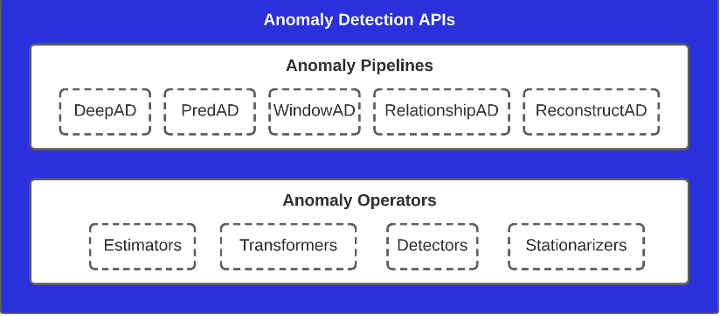
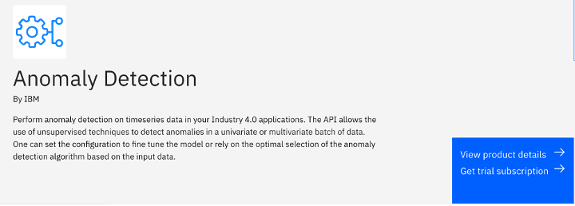
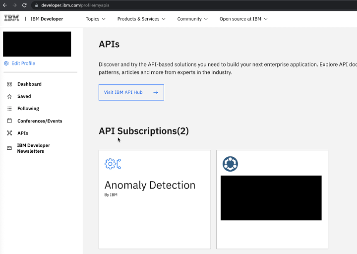
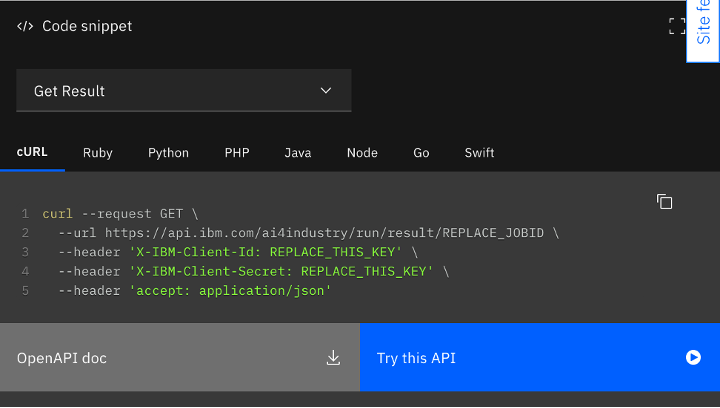
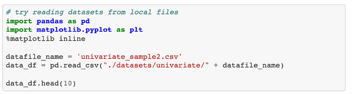
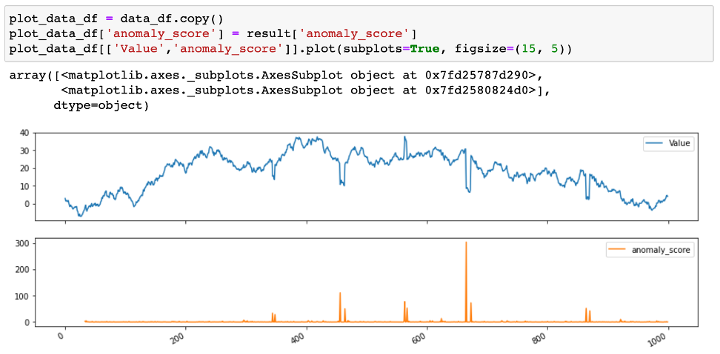

Anomaly Detection APIは、IBM Researchの早期アクセス製品の一部です。この製品は、時系列データセットの異常検知を行うための最先端の技術を、その技術にアクセスするための統一されたフレームワークとともにパッケージ化したものです。

 
* 図1.異常検知のためのAPI

一番下の層は、*Anomaly Operators*で構成されており、Estimators、Transformer、Outlier Detectors、Data Stationarizersなどの基本的な機械学習のプリミティブです。これらのコンポーネントは、ある特定のタスクや機能を実行する傾向があり、オペレーターと呼ばれています。

2番目の層である*Anomaly Pipelines*は、下の層の異なるコンポーネントを論理的に接続するAnomaly Pipelineの形で、高度な機械学習プリミティブを実装します。このチュートリアルでは、5種類のアノマリー・パイプラインを取り上げます。

* PredAD
* ディープAD
* リレーションシップAD
* WindowAD
* リコンストラクトAD

これら5つのパイプラインは、異常検知のアプローチを幅広くカバーしています。PredADは時系列予測モデルを使用し、DeepADは学習データに時系列予測モデルのアンサンブルを使用して、パフォーマンスの低い領域を検出し、異常スコアを生成することで異常検出を行います。

PredADはDeepADの単数形で、モデルの数は1つです。RelationshipADは、変数間のペアの関係に基づいて、正常時の変数間の関係とテスト期間中に観測された関係の動作を比較して異常を検出します。WindowADは、時系列データに対してウィンドウ処理を行い、各データポイントに連続したウィンドウを生成し、時系列をフラットにして生成された表形式のデータに対して異常検知を行う。ReconstructADは、元のデータを再構成して異常検知を行い、再構成の品質を比較して異常を検知するアルゴリズムです。

各パイプラインは、異常スコアの生成とは別に、異常ラベル（正常なサンプルには+1、異常なサンプルには-1）を生成するための*異常閾値*という追加機能を提供しています。パイプラインは、2種類の異常ラベル付け方法をサポートしています。StaticとDynamicです。

* Static Thresholdingは、異常スコアの全範囲に対して単一の値の閾値を提供し、この閾値よりも大きい異常スコアの値はすべて異常としてラベル付けされます。

* 動的しきい値は、スコアの範囲内で変化するしきい値や文脈に応じたしきい値を提供し、対応する動的しきい値よりも大きい異常スコア値は異常とラベル付けされます。

## Anomaly Detection APIの使用方法

Anomaly Detection APIは、これまでに説明した各メソッドへのアクセスを、使いやすい形で提供します。このAPIサービスは[IBM API Hubプラットフォーム](https://developer.ibm.com/apis/catalog/ai4industry--anomaly-detection-product/api/API--ai4industry--anomaly-detection-api#connection_check)でホストされており、サービスを試すための無料トライアルを受けることができます。   

このチュートリアルでは、API サービスを使用して一変量または多変量時系列の異常を検出する方法をステップ・バイ・ステップで説明します。チュートリアルではPythonのコードスニペットを使用していますが、APIを呼び出すために独自のプログラミング言語を選択することができます。現在、このサービスは以下のエンドポイントをサポートしています。

* `/connection-check`:異常検知サービスの接続状態を確認します。
* `/anomaly-detection/timeseries/univariate/batch`: 異常検知サービスの接続状態を確認します。ユーザーから提供された一変量時系列から異常を検出するジョブを投入する場合
* `/anomaly-detection/timeseries/multivariate/batch`:ユーザーから提供された多変量時系列の異常を検出するジョブを投入する場合
* ``/result/{jobId}`:jobId` に基づいた異常検知の結果を取得します。

また、[comprehensive API documentation](https://developer.ibm.com/apis/catalog/ai4industry--anomaly-detection-product/)も参考にしてください。

## 前提条件

このチュートリアルを完了するには、以下が必要です。

* IBM ID
* Python 3 と pip

## 見積もり時間

このチュートリアルを完了するには、約15分かかります。

## 手順

### ステップ 1.ユーザー認証

各APIリクエストには、リクエストヘッダーに認証情報が必要です。認証クレデンシャルには、クライアントIDとクライアントシークレットが含まれます。新しいクレデンシャルを作成するには

1. Anomaly Detection APIページの**Get trial subscription**をクリックします。

    

1. IBMid を使用して、無料トライアルに登録します。IBMid をお持ちでない場合は、プロセス中に IBMid を作成してください。
1. IBMid を使用してログインし、お客様の開発者プロファイルの [ダッシュボード](https://developer.ibm.com/profile/dashboard) に移動します。
1. 「APIs**」をクリックし、「Anomaly Detection**」をクリックします。

    

1. 「Key Management」で、APIキーのドロップダウンリストを展開します。「Client ID」と「Client secret」はすぐに使用できます。

    

### ステップ2.一変型異常検知のAPIを呼び出す

次に、一変量異常検知のジョブを送信し、異常の結果を取得するためのAPIを呼び出します。このチュートリアルのコードスニペットはPythonで書かれています。

1. 必要なPythonパッケージをpipでインストールします。

1. 異常検知に使用する一変量の時系列データをCSVファイルで用意してください。データには最低でもタイムスタンプと特徴量の2つのカラムが含まれている必要があり、1行目にはカラム名が入ります。自分の時系列データがない場合は、[sample univariate data set](https://github.com/IBM/anomaly-detection-code-pattern/blob/main/notebooks/datasets/univariate/univariate_sample2.csv)を使用することができます。

1. `以下のコードを使ってAPIを呼び出し，一変量の異常検知ジョブを送信します．headers`の内容を、ステップ1で取得した認証情報に置き換えます。

    **注:** 一変異検知で利用可能なすべてのパラメータについては、[API Hub documentation](https://developer.ibm.com/apis/catalog/ai4industry--anomaly-detection-product/api/API--ai4industry--anomaly-detection-api/#batch_uni)で説明しています。

1. ジョブの投入に成功すると、レスポンスに`jobId`が返されます。この`jobId`はステップに必要です。以下のコードは、レスポンスの例です。

1. 投稿されたジョブの結果を取得するには、`/result/{jobId}` APIコールを呼び出します。

1. ジョブが完了すると、異常スコアや異常ラベルが他の情報とともにレスポンスで返されます。以下のコードは、レスポンスの例を示しています。

アノマリーの結果のさまざまなケースについては、[more detailed documentation](https://developer.ibm.com/apis/catalog/ai4industry--anomaly-detection-product/api/API--ai4industry--anomaly-detection-api/#get_result_by_id)をお読みください。

### Step 3.APIスイートの他の操作

前のステップで説明した一変量時系列データの異常検知に加えて、APIサービスは多変量異常検知にも対応しています。使い方は一変量異常検知と似ていますが、多変量リクエストでは、`target_columns`パラメータに対象となる列のリストが必要になります。これについては、完全な[API documentation](https://developer.ibm.com/apis/catalog/ai4industry--anomaly-detection-product/api/API--ai4industry--anomaly-detection-api/#batch_multi)で読むことができます。IBM API Hubでは、各コード・スニペットの下にある**Try this API**をクリックすることで、UIを通してAPIを呼び出すこともできます。手順を説明した完全な[getting started tutorial](https://developer.ibm.com/apis/catalog/ai4industry--anomaly-detection-product/Getting%20Started/)があります。

## Jupyter ノートブック

Anomaly Detection APIサービスをすぐに使い始められるように、[GitHubリポジトリ](https://github.com/IBM/anomaly-detection-code-pattern)にサンプルデータを使ったMultivariate_Anomaly_Detection_ServiceとUnivariate_Anomaly_Detection_Serviceのノートブックを用意しました。ノートブックには、以下のような各ステップが記載されています。

* サンプルデータの読み込み、データの異常性の可視化
* 異常検知ジョブの作成と、APIコールのペイロードの入力
* 異常検知の結果の取得、可視化、および解釈

ノートブックを実行するには

1. リポジトリをローカルディレクトリーにクローンする。

1. 必要なPythonパッケージをpipでインストールします。

1. ノートブックを実行します。

1. ノートブックの最初のセクションで、プレースホルダーをあなたの認証情報に置き換えます。

    

1. datasets/フォルダにファイルを追加し、以下のコードを修正することで、独自のデータでノートブックを実行することができます。現在、ノートブックはdatasetsディレクトリのサンプルデータを使用しています。

    

1. パラメータ設定の例を示します。各パラメータの定義は、[API Hub documentation](https://developer.ibm.com/apis/catalog/ai4industry--anomaly-detection-product/api/API--ai4industry--anomaly-detection-api/#batch_uni)に記載されています。エンドポイントを変えることで、一変量、多変量の異常検知を試すことができます。

    

1. 異常検知のジョブが完了し、結果が取得されたら、データと異常スコアを並べてプロットし、結果を解釈・検証することができます。次の例では、異常スコアが入力時系列の値の急激な変化を代表していることがわかります。

    

## まとめ

このチュートリアルでは、Anomaly Detection API の無料トライアルにサブスクライブする方法と、IBM Cloud にホストされている API を呼び出す方法について説明しました。ご不明な点がありましたら、[API documentation](https://developer.ibm.com/apis/catalog/ai4industry--anomaly-detection-product/Introduction)をご確認ください。
