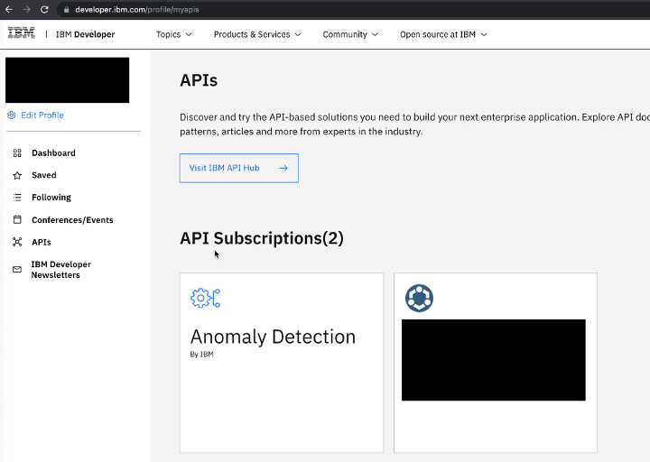
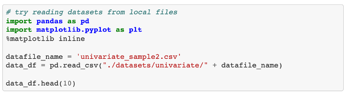

Anomaly Detection APIs are part of an IBM Research early access offering. The offering packages some of the state-of-the-art techniques for doing anomaly detection for a time series data set along with a unified framework to access the techniques.

<br/>
*Figure 1. Anomaly Detection APIs*

The bottom layer consists of *Anomaly Operators*, which are basic machine learning primitives such as Estimators, Transformers, Outlier Detectors, and Data Stationarizers. These components tend to perform one specific task or function and are referred to as Operators.

The second layer, *Anomaly Pipelines*, implements advanced machine learning primitives in the form of an anomaly pipeline that logically connects different components from the lower layer. This tutorial covers five types of anomaly pipelines:

*  PredAD
*  DeepAD
*  RelationshipAD
*  WindowAD
*  ReconstructAD

These five pipelines cover a wide range of anomaly detection approaches. PredAD uses a time series forecasting model, whereas DeepAD uses an ensemble of time series forecasting models on the training data to perform anomaly detection, by detecting areas with low performance and generating an anomaly score.

PredAD is the singular form of DeepAD, with the number of models being one. RelationshipAD is based on the pair-wise relationship between variables for anomaly detection by comparing the behavior of relationships between variables under normal operation with that of the relationships observed during a test period. WindowAD performs windowing on the time series data to generate sequential windows at each data point and performs anomaly detection on the tabular data that is generated by flattening the time series. ReconstructAD is an algorithm that performs anomaly detection based on the reconstruction of the original data and comparing the quality of reconstruction to detect anomalies.

Apart from generating the anomaly score, each of the pipelines provides an additional capability in the form of *anomaly thresholding* to generate the anomaly labels (+1 for normal sample and -1 for anomalous). The pipeline supports two types of anomaly labeling methods: Static and Dynamic. 

* Static thresholding provides a single-value threshold for the entire range of anomaly scores, and all anomaly score values greater than this threshold are labeled as an anomaly.

* Dynamic thresholding provides changing or contextual thresholds throughout the range of the scores, and anomaly score values that are greater than their corresponding dynamic threshold values are labeled as an anomaly.

## Getting started with Anomaly Detection APIs

The Anomaly Detection APIs provide access to each of the methods described previously in an easy-to-use manner. The API service is hosted in an [IBM API Hub platform](https://developer.ibm.com/apis/catalog/ai4industry--anomaly-detection-product/api/API--ai4industry--anomaly-detection-api#connection_check) where you can get a free trial to try the service.   

This tutorial provides a step-by-step guide on how to use the API service to detect anomalies on univariate or multivariate time series. The tutorial uses Python code snippets, but you can choose your own programming language to call the APIs. Currently, the service supports the following endpoints:

*  `/connection-check`: To check the connection status of the anomaly detection service
*  `/anomaly-detection/timeseries/univariate/batch`: To submit a job of detecting anomalies on univariate time series provided by users
*  `/anomaly-detection/timeseries/multivariate/batch`: To submit a job of detecting anomalies on multivariate time series provided by users
*  `/result/{jobId}`: To get the anomaly detection result based on the `jobId`

You can also look at the [comprehensive API documentation](https://developer.ibm.com/apis/catalog/ai4industry--anomaly-detection-product/).

## Prerequisites

To complete this tutorial, you need:

*  An IBM ID
*  Python 3 and pip

## Estimated time

It should take you approximately 15 minutes to complete this tutorial.

## Steps

### Step 1. Authentication

Each API request requires authentication information in the request header. The authentication credential includes the Client ID and the Client secret. To create a new credential:

1. Click **Get trial subscription** on the Anomaly Detection API Page.

    

1. Subscribe to a free trial using your IBMid. If you don’t have a IBMid, create one during the process.
1. Log in using your IBMid, and navigate to the [dashboard](https://developer.ibm.com/profile/dashboard) of your developer profile.
1. Click **APIs**, then click **Anomaly Detection**.

    

1. In the Key Management, expand the drop-down list of API keys. The Client ID and Client secret are ready to use.

    

### Step 2. Invoke univariate anomaly detection APIs

Next, you invoke APIs to submit a univariate anomaly detection job and retrieve the anomaly result. The code snippets in this tutorial are written in Python.

1. Install the required Python package using pip.

    ```
    pip install requests
    ```

1. Prepare your own univariate time series data in a CSV file that you'll use for anomaly detection. The data must contain at least two columns: timestamp and feature value, and the first row is the column name. If you don't have your own time series data, you can use a [sample univariate data set](https://github.com/IBM/anomaly-detection-code-pattern/blob/main/notebooks/datasets/univariate/univariate_sample2.csv).

1. Use the following code to invoke the API to submit a univariate anomaly detection job. Replace the `headers` content with the credentials you obtained from Step 1.

    **Note:** All of the parameters that are available for the univariate anomaly detection are discussed in the [API Hub documentation](https://developer.ibm.com/apis/catalog/ai4industry--anomaly-detection-product/api/API--ai4industry--anomaly-detection-api/#batch_uni).

    ```
    import requests

    # prepare the headers
    headers = {
        'X-IBM-Client-Id': "replace-with-valid-client-ID",  # replace with your cliend id      
        'X-IBM-Client-Secret': "replace-with-valid-client-Secret",  # replace with your client secret
        'accept': "application/json",
        }

    # prepare the data file
    datafile_name = 'sample.csv'  # replace with your data file name
    file_path = './sample.csv'    # replace with your file path
    files = {'data_file': (datafile_name, open(file_path, 'rb'))}

    # prepare the parameter settings
    data = {
        'target_column': 'Value',
        'time_column': 'Time',
        'time_format': '%Y-%m-%d %H:%M:%S',
        'prediction_type': 'entire',
        'algorithm_type': 'DeepAD',
        'lookback_window': 'auto',
        'observation_window': 10,
        'labeling_method': 'IID',
        'labeling_threshold': 10,
        'anomaly_estimator': 'Default',
    }

    post_response = requests.post("https://api.ibm.com/ai4industry/run/anomaly-detection/timeseries/univariate/batch",
                                  data=data,
                                  files=files,
                                  headers=headers)

    print(post_response.json())
    ```

1. When the job is successfully submitted, a `jobId` is returned in the response. This `jobId` is required for the step. The following code shows an example of a response.

    ```
    {
        "filename": "sample.csv",
        "jobId": "00cf0cd5-d54c-xxxx-xxxx-d36b36a861ba",
        "status": "The job is submitted. Please record the jobId and use it in the GET /result/<jobId> request to get the result."
    }
    ```

1. To retrieve the result of a submitted job, invoke the `/result/{jobId}` API call.

    ```
    import requests
    headers = {
        'X-IBM-Client-Id': "replace-with-valid-client-ID",  # replace with your client id      
        'X-IBM-Client-Secret': "replace-with-valid-client-Secret",  # replace with your client secret
        'accept': "application/json",
        }
    jobId = 'replace-with-your-job-id'  # replace with your jobId

    get_response = requests.get("https://api.ibm.com/ai4industry/run/result/" + jobId, headers=headers)
    print(get_response.json())
    ```

1. If the job is complete, the anomaly scores or anomaly labels are returned with other information in the response. The following code shows an example of a response.

    ```
    {
        "filename": "sample.csv",
        "jobId": "00cf0cd5-d54c-xxxx-xxxx-d36b36a861ba",
        "status": "done",
        "prediction_type": "entire",
        "update_on": 1627949731,
        "summary": {
          "lookback_window": "33",
          "result": [
              {
                  "timestamp": "2017-01-01 00:00:00",
                  "value": {
                      "anomaly_score": [NaN]
                  }
              },
              ...
              {
                  "timestamp": "2017-01-04 11:15:00",
                  "value": {
                      "anomaly_score": [0.8944499905844097]
                  }
              }
          ],
          "total_excution_time (sec)": "87.03370666503906"
      }
    }
    ```

You can read [more detailed documentation](https://developer.ibm.com/apis/catalog/ai4industry--anomaly-detection-product/api/API--ai4industry--anomaly-detection-api/#get_result_by_id) to learn about the different cases of the anomaly results.

### Step 3. Other operations in the API suite

In addition to detecting anomalies on univariate time series data that is described in the previous step, the API service also supports multivariate anomaly detection. The usage is similar to univariate anomaly detection except that a multivariate request requires a list of target columns in the `target_columns` parameter. You can read more about it in the full [API documentation](https://developer.ibm.com/apis/catalog/ai4industry--anomaly-detection-product/api/API--ai4industry--anomaly-detection-api/#batch_multi). In the IBM API Hub, you can also invoke the APIs through the UI by clicking **Try this API** under each code snippet. There is a full [getting started tutorial](https://developer.ibm.com/apis/catalog/ai4industry--anomaly-detection-product/Getting%20Started/) that walks you through the steps.


## Jupyter Notebooks

To help you get started quickly using the Anomaly Detection API service, we prepared Multivariate_Anomaly_Detection_Service and Univariate_Anomaly_Detection_Service notebooks with sample data in the [GitHub repository](https://github.com/IBM/anomaly-detection-code-pattern). The notebooks describe each step, including:

*  Loading the sample data and visualizing the anomalies in the data
*  Creating an anomaly detection job and populating the API call payload
*  Fetching, visualizing, and interpreting the anomaly detection results

To run the notebooks:

1. Clone the repository to the local directory.

    ```
    git clone https://github.com/IBM/anomaly-detection-code-pattern.git
    cd anomaly-detection-code-pattern/
    ```

1. Install the required Python packages using pip.

    ```
    pip install requests pandas matplotlib notebook
    ```

1. Run the notebook.

    ```
    cd notebooks/
    jupyter notebook
    ```

1. Replace the placeholders with your credentials in the first section of the notebook.

    

1. You can run the notebook with your own data by adding the file in the datasets/ folder and modifying the following code. Currently, the notebook uses sample data in the datasets directory.

    

1. We provide an example for the parameter settings. The definitions of each parameter are described in the [API Hub documentation](https://developer.ibm.com/apis/catalog/ai4industry--anomaly-detection-product/api/API--ai4industry--anomaly-detection-api/#batch_uni). You can try univariate or multivariate anomaly detection by changing the endpoint.

    

1. When the anomaly detection job completes and the result is retrieved, you can plot the data and anomaly scores side by side to interpret and validate the result. In the following example, you see that the anomaly score is representative of the abrupt changes in value in the input time series.

    

## Summary

This tutorial discussed how to subscribe to a free trial of the Anomaly Detection API and how to invoke the APIs hosted in IBM Cloud. If you have any questions, check the [API documentation](https://developer.ibm.com/apis/catalog/ai4industry--anomaly-detection-product/Introduction).
