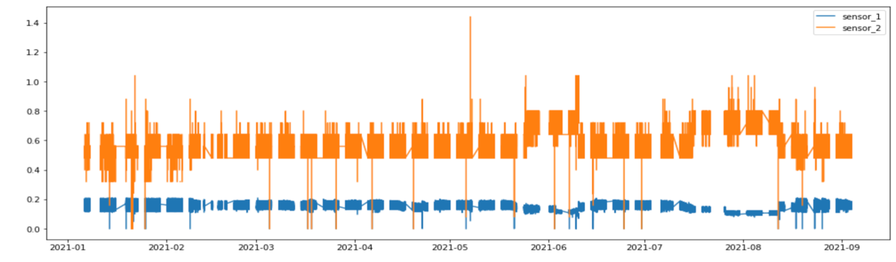
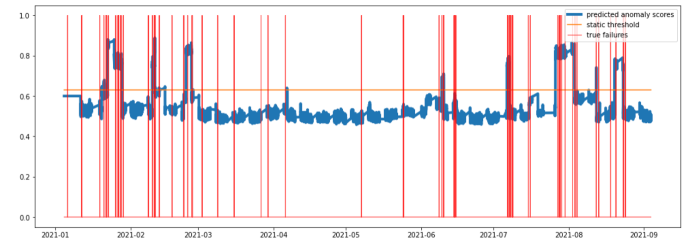

世界の製造業や自動車産業では、AI技術を利用して資産の健全性管理のための手作業を減らすという幅広いビジョンに向かっています。このような先進的なシステムは、資産のメンテナンスに必要なアクションを提供することで、メンテナンスエンジニアを支援し、重大な故障のリスクとそれに伴う経済的コストを削減することができます。また、効果的な異常検知により、運転者に危害を加えたり、車両の性能に影響を与えたりする可能性のある車両の高リスクな故障を未然に防ぐことができます。これらのシステムはIndustry 4.0において非常に興味深いものです。なぜなら、ほとんどの製造システムには複雑なダイナミクス（マルチボディおよびマルチスケールの相互作用、時間遅延ダイナミクス、フィードバックループ、外因性の力など）があり、これらの問題は技術的に困難だからです。

自動車のような複雑な資産には、問題を検出するのに役立つ多くのセンサーやアラームサブシステムがあります。例えば、センサーは、内部変数、システム変数、外因性変数などを示します。アラームは、エンジンオイルの量が少ないとか、回転数が異常に多いなど、非標準的な機器の状態を示すことがあります。これらのアラームには、警告アラームと重要アラームがあり、故障コードによって区別されます。これらの複数のサブシステムとそのコンポーネントのうち、各故障コードは、1つのセンサー、またはその故障コードを決定するセンサーと警告アラームの組み合わせによって影響を受ける可能性があります。例えば、図1の例では、変数`sensor_1`と`sensor_2`がコード=1の故障を発生させる原因となっています。これらのセンサーに異常な動作があれば、システムの異常につながり、それを機械学習分析で検出して警告を発することができます。

 
*図1.生のセンサー値と真の失敗例*。

生のセンサーデータを使用して、適切な特徴エンジニアリングを行い、2つのセンサーから価値のある情報を生成し、その動作の異常を検出することができます。WindowADを使用することで、先に述べた教師なし異常検知を行い、対象となる故障ラベルを使用せずに多変量時系列データの異常な挙動を検知することができます。WindowADは、時系列データから特徴量を生成してウィンドウ化によりグループ化し、IsolationForestのようなベース学習者でGeneralized Anomaly Modelをフィッティングしてモデルを生成し、データ全体または将来のデータストリームに対して異常スコアを生成することで適用されます。

`lookback_win`、`observation_window`、`scoring_threshold`などのパラメータはすべてデフォルト値に設定されています。また，`feature_columns`と`target_columns`のパラメータには，生のセンサの値が設定され，`time_column`と`time_format`には，タイムスタンプを使用するように指定されています．図2では，「prediction_type」パラメータを「BATCH」に，「scoring_method」パラメータを「ADAPTIVE_SLIDING_WINDOW」に設定したWindowADから予測される異常スコアを青で，グランドトゥルースとなる真の故障ラベルを赤の線で表しています．オレンジ色の線は静的なしきい値で、異常スコアがしきい値よりも大きいポイントでアラートを生成するためのカットオフ値として使用されます。異常スコアが閾値よりも小さいその他のポイントでは、資産は正常な状態にあると考えられます。

 
*図2.Anomalyスコアと真のラベル*について

したがって、この手法では、障害がある領域の周辺にスパイクを示す、良好なアノマリースコアのセットが得られます。異常スコアの小さなスパイクは、閾値を下回るため、故障の予測には至りません。本手法の有効性は良好であり、産業界のデータに対しても良好な結果が得られた。したがって、これらの技術は他の資産や資産グループにも適用できる。

## まとめ

この記事では、資産の健全性管理のための手作業を減らすために、AI技術をどのように使用できるかを説明しました。このような先進的なシステムは、資産のメンテナンスのための規定行動を支援し、致命的な故障のリスクとそれに伴う経済的コストを削減することができます。