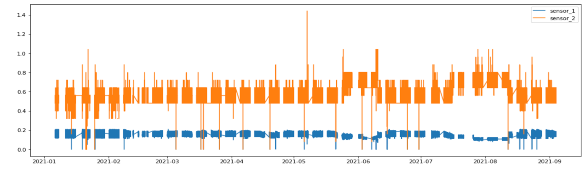
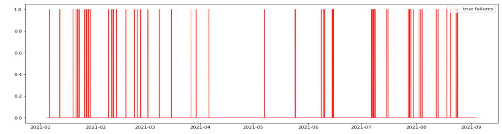
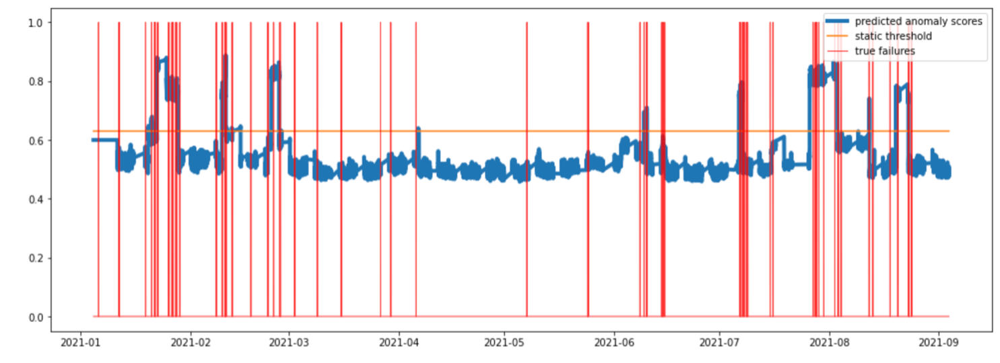

The Manufacturing and Automotive industries worldwide are moving toward a broad vision of using AI techniques to reduce manual efforts for asset health management. Such advanced systems can aid the maintenance engineer by providing prescriptive actions for asset maintenance, which can reduce the risk of critical failures and their associated financial costs. Effective anomaly detection can also preempt high-risk failures in a vehicle that might end up harming the driver or affecting the performance of the vehicle. These systems are of immense interest in Industry 4.0 because most manufacturing systems contain complex dynamics (for example, multibody and multiscale interactions, time-delay dynamics, feedback loops, and exogenous forces) that make these problems technically challenging.

Most complex automotive assets like vehicles have many sensors and alarm subsystems that can help detect issues. For example, the sensors might indicate things like internal, systemic, and exogenous variables. Alarms might indicate nonstandard equipment states like low engine oil or abnormally high rotation counts. These alarms might be either warning alarms or critical alarms, which can be distinguished by their failure codes. Out of these multiple subsystems and their components, each failure code might be affected by one sensor, or a combination of sensors and warning alarms that determine that failure code. For example, in the example in Figure 1, the variables `sensor_1` and `sensor_2` are responsible for generating the failure with code = 1. Any aberrant behavior in these sensors leads to an anomaly in the system, which can be detected by machine learning analysis to raise alerts.

 
*Figure 1. Raw sensor values and true failures*

Using the raw sensor data, you can perform appropriate feature engineering to generate valuable information from the two sensors to detect an anomaly in their behavior. Using WindowAD, unsupervised anomaly detection that was previously mentioned, can be performed to detect anomalous behavior in the multivariate time series data without using the target failure labels. WindowAD is applied by generating features from the time series data to group them by a windowing technique, and fitting a Generalized Anomaly Model with a base learner like IsolationForest to produce a model that can then generate anomaly scores on the entire data or future streams of data.

Parameters like `lookback_win`, `observation_window,` and `scoring_threshold` are all set to their default values. The `feature_columns` and `target_columns` parameters are set to the values of the raw sensors, and `time_column` and `time_format` are specified to use the timestamps. In Figure 2, the predicted anomaly scores from WindowAD with the `prediction_type` parameter set to BATCH and the `scoring_method` parameter set to ADAPTIVE_SLIDING_WINDOW are represented in blue, and the true failure labels that serve as ground truth are represented by the red lines. The orange line serves as a static threshold that is a cut-off value that is used to generate alerts at points where the anomaly score is greater than the threshold. At all other points where the anomaly score is lesser than the threshold, the asset is considered to be present in a normal state.

 
*Figure 2. Anomaly scores and true labels*

Therefore, the method provides a good set of anomaly scores that show spikes around the regions where there is a fault. The smaller spikes in the anomaly score do not result in a prediction of fault because they fall below the threshold. The efficacy of the method is good and performs well on the industry data. Therefore, these techniques can be applied to other such assets or groups of assets.

## Summary

This article explained how AI techniques can be used to reduce manual efforts for asset health management. Such advanced systems can help with prescriptive actions for asset maintenance, which can reduce the risk of critical failures and their associated financial costs.