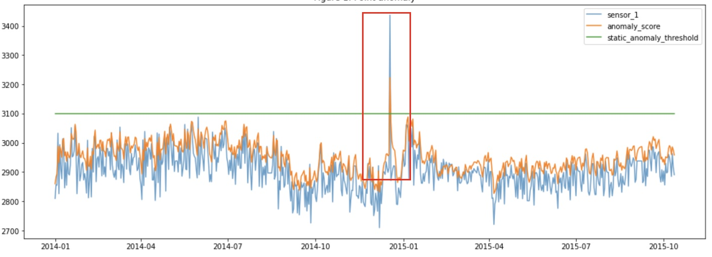
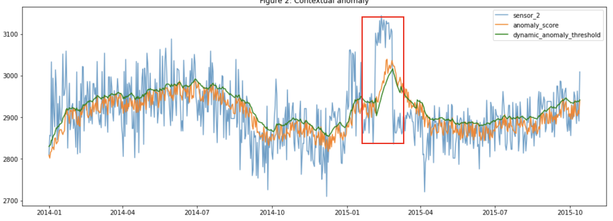
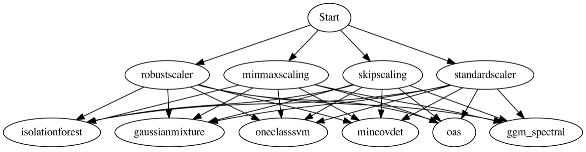

Anomaly detection is a process in machine learning that identifies data points, events, and observations that deviate from a data set’s normal behavior. And, detecting anomalies from time series data is a pain point that is critical to address for industrial applications.

According to an [IDC survey](https://www.idc.com/getdoc.jsp?containerId=US47601921) in April 2021, the manufacturing industry followed by the finance, transportation, communication, and utilities industries are at the forefront of using advanced machine learning for predictive and prescriptive maintenance. The survey states that with the reduced cost of capturing data through sensors as well as the increased connectivity between devices, anomaly detection powered by machine learning will be increasingly mainstream.

To have an effective predictive maintenance program, it's crucial to be able to detect anomalous behavior so that action can be taken to avoid downtime loss. However, identifying anomalies before a failure event is difficult because, generally, failures are comparatively rare events, so there is often a scarcity of tagged data for building predictive models.

## Types of anomaly detection

Broadly, anomaly detection use cases can be categorized into three types depending on the type of the data available. *Supervised* anomaly detection aims to learn a model by using labeled data that represents previous failures or anomalies. In the *unsupervised* setting, no labeled data is provided. The third category, *semi-supervised* anomaly detection, relies on a small amount of labeled data to validate and select the best performing model trained on normal data (or data with no anomalies). Given the scarcity of labeled failure data, the most applicable use cases are those of unsupervised and semi-supervised anomaly detection.

Anomaly detection for time series data brings its own challenges due to the inherent complexity in separating noise from an anomalous pattern. Knowing if the data is stationary, and considering trends and seasonality are critical for doing time series analysis. Additionally, anomalies can be global outliers (also called *point anomalies*), or *contextual anomalies*, which means that there is a departure from a set of data points in context.

 
*Figure 1. Point anomaly*

 
*Figure 2. Contextural anomalies*

## Process of anomaly detection

The task of finding the best anomaly detection model for a data set requires multiple steps that include data preparation, parameter optimization, validation, and model selection. Each of these steps could have multiple sub-steps. For example, data preparation could include scaling, dimensionality reduction, and feature engineering. Scaling could be done using a variety of techniques like min-max-scaling, robust-scaling, and standard-scaling. All possible steps to be performed on a data set could be expressed in a Directed Acyclic Graph (DAG). In the DAG, each stage or step contains multiple options that can be used for that level. For example, to build an end-to-end pipeline, one block or node from each step is to be combined in a forward fashion with a block or node from the subsequent steps, in the order of the direction. Thus, an end-to-end pipeline would be built with one transformer followed by an estimator. This is done internally in the algorithm before fitting a model on the train data and need not be provided by the user. The DAG is an implementation strategy that aids in parallel execution and fast execution of models to produce the best-performing results.

With *t* number of transformers, and *e* number of estimators, there are *t X e* combinations of pipelines that can be constructed from the following DAG. Each path explored is independent of the other paths, and they can all be explored in parallel with optimized runtimes. Parameter tuning is done on each of the pipelines, generating multiple configurations of each of the pipelines created by the DAG. After all of the pipeline configurations are executed, they are ranked based on performance metrics, and the top pipelines are returned to refit on the entire training data and proceed with prediction.

 
*Figure 3. Directed Acyclic Graph*

In terms of usage, the user provides an optional `anomaly_estimator` parameter for each of the anomaly detection algorithms. For example, in the case of DEEPAD anomaly detection, the `anomaly_estimator` is left empty (keeping its default value). This dynamically initializes a DAG with multiple nodes for each level of the graph, which are created with respect to the size of the data, number of features, and so on. This allows the exploration of many paths or combinations of feature extractors and estimators to generate the best anomaly pipeline to use for prediction.

## Generating anomaly labels

The estimator in the final step produces anomaly scores, which indicate the severity of an anomaly in the data point, with lower values indicating the absence of anomalies and higher values indicating the presence of high-intensity anomalies. They also provide a prediction value of an anomaly label, which labels the data with whether each data point can be interpreted as an anomaly, based on a user-provided or derived threshold. This threshold can be a static threshold (single threshold for all data points) or dynamic threshold (moving threshold that adapts to the nature or context of the nearby data points), which is useful for determining contextual anomalies.

In Figure 1, you see that the blue line is the raw data, the orange line depicts the anomaly score, and the green line is the anomaly threshold, which is a static value that is used on the entire anomaly scores for the entire data. The region where the anomaly score crosses the threshold gives rise to a point anomaly. Similarly, in Figure 2, the blue line is the raw data, the orange line is anomaly scores that seem to rise in the area where there is a disturbance in the distribution of data, and the green line is a dynamic anomaly threshold, which is generated at each point, similar to the anomaly score and based on contextual information or local information to find local anomalies or contextual anomalies.

## Anomaly detection use cases

Anomaly detection can be performed for a variety of reasons, such as:

* *Outlier detection*, which is used to detect any outliers or data that largely varies in range from the normal operating range or state of the system within the training data. In this case, the complete data is analyzed to find outliers outside the range.

* *Novelty detection* is a type of anomaly detection where the training data consists of sensors or values operating under normal conditions where an anomaly does not occur, and the goal is to identify if the testing data or new data from the stream contains any novel behavior, therefore, labeling it an anomaly, or a novelty.

* *Event extraction* can be done if the data operates under multiple states (for example, a sensor could be in the ON or OFF stage), and the goal is to identify when the sensors behave in a different way when an event occurs.

* *Data cleaning* can be done by ensuring that any outliers or sudden infrequent changes in the distribution of the data are removed.

## Summary

This article provided an overview of anomaly detection for time series data, challenges associated with it, and techniques that can help identify the best anomaly model for a data set.

## Advanced reading

* [Multi-task Multi-modal Models for Collective Anomaly Detection](https://ide-research.net/papers/2017_ICDM_Ide.pdf)
* [L0-Regularized Sparsity for Probabilistic Mixture Models](https://epubs.siam.org/doi/pdf/10.1137/1.9781611975673.20)
* [Pruning Deep Neural Networks with L0-constrained Optimization](https://ieeexplore.ieee.org/document/9338363)
* [On the Solution of L0-Constrained Sparse Inverse Covariance Estimation Problems](https://pubsonline.informs.org/doi/abs/10.1287/ijoc.2020.0991)
* [A Novel l0-constrained Gaussian Graphical Model for Anomaly Localization](https://ide-research.net/papers/2017_OEDM_Dzung.pdf)
* [Smart-ML: A System for Machine Learning Model Exploration using Pipeline Graph](https://www.computer.org/csdl/proceedings-article/big-data/2020/09378082/1s64yTqpKfK)
* [FLOps: On Learning Important Time Series Features for Real-Valued Prediction](https://ieeexplore.ieee.org/document/9378499)
* [An End-to-End Context Aware Anomaly Detection System](https://research.ibm.com/publications/an-end-to-end-context-aware-anomaly-detection-system)
* [An Unsupervised Framework for Semantics Driven Causal Explanations for Anomalies](http://ceur-ws.org/Vol-2721/paper509.pdf)