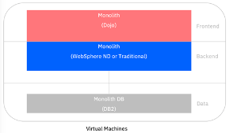
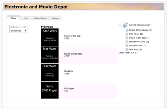
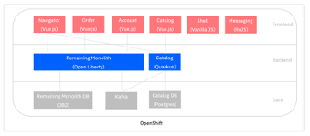
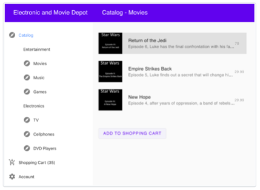
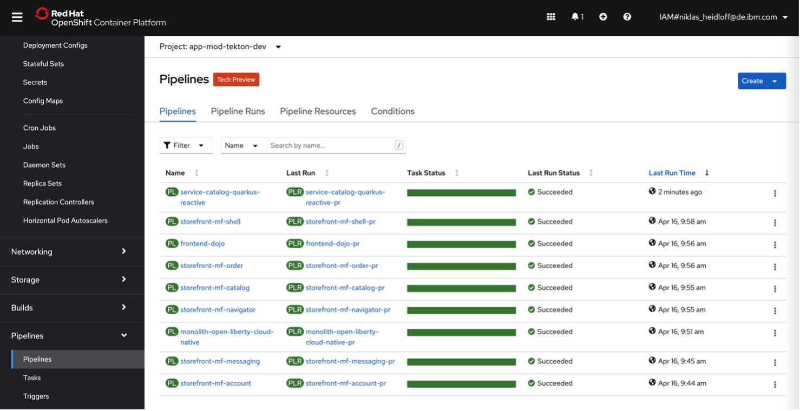

アプリケーションをモダナイズする方法を学ぶために、最新のJavaランタイムを使用したクラウド・ネイティブ技術でレガシーのJava EEアプリケーションをモダナイズできる<a href="https://github.com/IBM/application-modernization-javaee-quarkus/" target="_blank" rel="noopener noreferrer">_sample application_</a>を公開しています。  レガシーアプリはWebSphere Application Server traditionalにデプロイされていましたが、モダナイズされたアプリはOpen Liberty（Jakarta EEとMicroProfile互換の実装）で構築され、KubernetesのエンタープライズディストリビューションであるRed Hat OpenShiftにデプロイされて運用されています。

シンプルなEコマースアプリであるこのサンプルアプリケーションは、アプリケーションをモダナイズすることによる[アプリケーションモダナイズ戦略](/learningpaths/get-started-application-modernization/intro-app-mod/strategies/)の適用と[メリットの実感](/learningpaths/get-started-application-modernization/intro-app-mod/benefits/)に役立ちます。

<iframe width="480" height="270" src="https://www.ustream.tv/embed/recorded/130909606" scrolling="no" allowfullscreen webkitallowfullscreen frameborder="0" style="border:0 none transparent;"></iframe> </iframe

## レガシーアプリケーションのアーキテクチャ

このサンプルアプリケーションは、2008年に典型的な3層構造で構築されました。

Java EE 6 のアプリケーションで、WebSphere Application Server traditional, version 8.5.5 上で動作し、2 つの仮想マシンに展開されていました。

EJBとREST APIを使用して構築されており、<a href="https://kgb1001001.github.io/cloudadoptionpatterns/Microservices/Backend-For-Frontend/" target="_blank" rel="noopener noreferrer nofollow">_Backends for Frontends_</a>パターンではなく、<a href="https://en.wikipedia.org/wiki/Representational_state_transfer" target="_blank" rel="noopener noreferrer nofollow">_RESTful APIパターン</a>を使用していました。  

このサンプルアプリケーションには、本質的に3つのモノリスがありました。モノリスのDb2データベース、モノリスのバックエンド（WebSphere Application Server）、モノリスのフロントエンド（Dojoツールキットで構築）です。  次のアーキテクチャ図は、この3つのモノリスが仮想マシンで動作する3層アーキテクチャを示しています。

このサンプル電子商取引アプリでは、カテゴリのセットを使用してカタログ内の商品をナビゲートすることができます。そして、商品を選択し、ショッピングカートに追加することができます。

## モダナイズドアプリのアーキテクチャ

2020年の夏に、サンプルアプリのモダナイズを始めました。  

モダナイズされたアプリは、Open J9とOpen Liberty(Jakarta EE, MicroProfile)を使用した、クラウドネイティブでマイクロサービスベースのアプリケーションです。また、Quarkusを使用したバージョンもあります。

Red Hat OpenShiftに複数のコンテナで展開されています。  QuarkusまたはOpen Libertyバックエンド、Quarkusカタログサービス、マイクロフロントエンド（ナビゲーター、カタログ、アカウント、オーダー、シェル、メッセージング）、残りのモノリスDB（Db2）、Kafka、Postgres（カタログDB）。  以下の簡略化したアーキテクチャ図では、マイクロフロントエンド、マイクロサービス、残りのモノリスがRed Hat OpenShift上に展開されたコンテナで動作しています。

新しいモダナイズされたWebアプリケーションは、レガシーのものと同じ機能をサポートしています。このアプリケーションの近代化の取り組みでは、UI を改善することが目的ではなく、マイクロフロントエンドを互いに独立して更新できるように UI をモジュール化することが目的でした。

次の図は、マイクロフロントエンドの内訳を示しています。

## モダナイズされたアプリの結果

Red Hat OpenShift Container Platform で動作しているモダナイズドアプリを見ると、新しい機能を別々にデプロイできることがわかります。  例えば、商品に評価を追加したいとします。  残っているモノリスを触る必要はなく、異なるコンポーネントですべてを変更すればいいのです。

- カタログサービスのデータベース(Postgres)
- カタログマイクロサービス
- カタログマイクロフロントエンド

## まとめと次のステップ

レガシーのサンプルアプリケーションのアーキテクチャを理解し、モダナイズされたサンプルアプリケーションのアーキテクチャを理解したところで、次のビデオを見て、ランタイムのみのモダナイズ、ランタイムと運用のモダナイズ、またはアーキテクチャ、ランタイム、運用のモダナイズという典型的なアプリケーションのモダナイズの旅を確認してください。

<iframe width="480" height="270" src="https://www.ustream.tv/embed/recorded/130909635" scrolling="no" allowfullscreen webkitallowfullscreen frameborder="0" style="border:0 none transparent;"></iframe>。

その後、レガシーアプリケーションのモダナイゼーションを行うためのベイビーステップを紹介する、本ラーニングパスのこれらのチュートリアルを完了します。

* アプリケーションのコンテナ化
* アプリケーションのランタイムの近代化
* Stranglerパターンを使用してモノリスをマイクロサービスにリファクタリングする。
* フロントエンドを分離し、マイクロフロントエンドを開発する <チュートリアルへのリンク

<!--これらのチュートリアルを追加する際には、これを元に戻してください。
    * 疎結合のイベント駆動型マイクロサービスを構築する <link to tutorial>
    * リアクティブ・マイクロサービス・アプリケーションを構築する <link to tutorial> -->