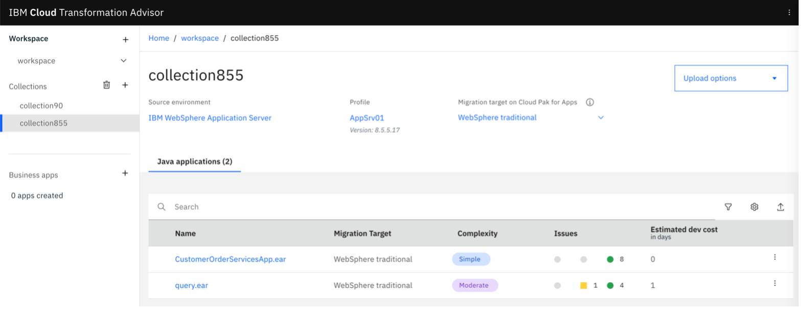
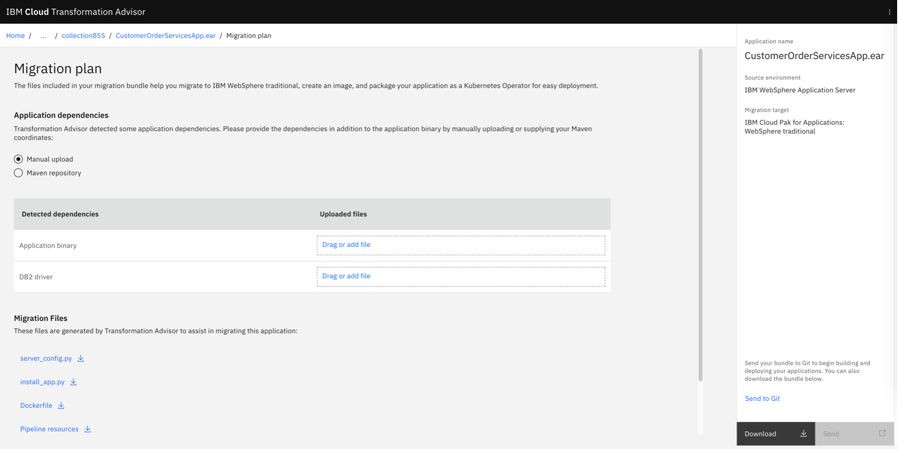

モダナイゼーションの最初のステップは、アプリケーションのコンテナ化です。サンプルアプリケーションのようなWebSphereアプリケーションをコンテナで実行するには、<a href="https://www.ibm.com/garage/method/practices/learn/ibm-transformation-advisor" target="_blank" rel="noopener noreferrer">_IBM Cloud Transformation Advisor_</a>を使用します。Transformation Advisorは、<a href="https://www.ibm.com/jp-ja/cloud/websphere-hybrid-edition" target="_blank" rel="noopener noreferrer">_IBM WebSphere Hybrid Edition_</a>に含まれていますが、別途ダウンロードしてDocker Hub（またはPodman）を使ってローカルで実行することも可能です。

IBM Cloud Transformation Advisorを使用してサンプル・アプリのモダナイズを行う方法については、次のビデオをご覧ください。

<iframe width="480" height="270" src="https://www.ustream.tv/embed/recorded/130909610" scrolling="no" allowfullscreen webkitallowfullscreen frameborder="0" style="border:0 none transparent;"></iframe>。

## 前提条件

このラーニングパスのチュートリアルで使用している[サンプル例](/learningpaths/get-started-application-modernization/modernizing-apps-step-by-step/architecture-sample-app/)を確認しておいてください。

次に、このリポジトリをクローンして、サンプルアプリケーションの完全なソースコードを入手します。

サンプルアプリケーションを仮想マシンやベアメタルサーバーにセットアップするのはそれほど簡単ではないので、WebSphere 8.5.5アプリケーションは<a href="https://www.docker.com/get-started" target="_blank" rel="noopener noreferrer">_Docker desktop_</a>のコンテナ内で動作するようにシミュレートされています。Dockerデスクトップのライセンスを持っていない場合、Podmanはその代わりに使用できる強固な代替手段です。この<a href="https://www.stevemar.net/docker-to-podman/" target="_blank" rel="noopener noreferrer">_blog post_</a>に記載されているコマンドに従うだけです。なお、Podmanツールは問題点を修正するために頻繁に更新されているため、説明の一部が不要になっている場合があります。

次に、<a href="https://www.ibm.com/docs/en/cta?topic=started-non-ocp-install" target="_blank" rel="noopener noreferrer">_Transformation Advisor_</a>のローカル版をインストールして、<a href="https://www.docker.com/get-started" target="_blank" rel="noopener noreferrer">_Docker desktop_</a>を使って開発者のマシンで実行します。なお、ローカルのインストールサイトでは、podmanを直接サポートしていましたので、そちらをご利用になることもできます。

Transformation Advisorを使ってモノリシックアプリをアップグレードするデモを次のビデオでご覧ください。

<iframe width="480" height="270" src="https://www.ustream.tv/embed/recorded/130909611" scrolling="no" allowfullscreen webkitallowfullscreen frameborder="0" style="border:0 none transparent;"></iframe>。

## ステップ

1. WebSphere 8.5.5のアプリをWebSphere 9にアップグレードする。
2.コンテナでアプリを実行する

### ステップ 1: WebSphere 8.5.5 アプリの WebSphere 9 へのアップグレード

ここでは、Transformation Advisor のデータコレクタを使用します。  まず、`http://localhost:3000/` を開きます。次に、`workspace`という名前のワークスペースと、`collection855`という名前のコレクションを作成します。コレクションのページで、Linux用のデータコレクタ、`transformationadvisor-Linux_workspace_collection855.tgz`をダウンロードします。その後，データコレクタを `${ROOT_FOLDER}/transformation-advisor/tool` にコピーします．

まず、WebSphere 8.5.5のレガシーアプリを実行するコンテナをビルドして実行する必要があります。

次に、データコレクタツールをWebSphereコンテナにコピーし、コンテナのターミナルを開きます。

次に、圧縮されたデータコレクタファイルを解凍します。

次に、設定ファイルをコンテナにコピーします。

この例では、「org.pwte」パッケージのクラスを含めるように定義することが重要です。

データコレクタと設定ファイルがコンテナにコピーされたら、コレクタツールを実行できます。

通常、結果はTransformation Advisorに自動的にアップロードされます。うまくいかない場合は、手動で行うことができます。

Transformation Advisorは、<a href="https://github.com/IBM/application-modernization-javaee-quarkus/blob/master/transformation-advisor/wast855-to-wast90/AppSrv01.zip" target="_blank" rel="noopener noreferrer">_AppSrv01.zip_</a>という出力ファイルを生成します。

Web コンソールで Transformation Advisor を実行した結果を示します。「CustomerOrderServicesApp.ear」はコンテナ化が想定されているアプリケーションであり、推定工数が低いことがわかります。それは、1行もコードを変更する必要がないからです!

代わりに Transformation Advisor は、同じアプリケーションをコンテナで実行するための <a href="https://github.com/IBM/application-modernization-javaee-quarkus/blob/master/transformation-advisor/wast855-to-wast90/customerorderservicesapp_migrationBundle/Dockerfile" target="_blank" rel="noopener noreferrer">_Dockerfile_</a> と 2 つの Python スクリプト (これらは <a href="https://github.com/IBM/application-modernization-javaee-quarkus/blob/master/transformation-advisor/wast855-to-wast90/AppSrv01.zip" target="_blank" rel="noopener noreferrer">_AppSrv01.zip_</a> ファイルに含まれています) を自動的に生成します。  私たちのアプリの名前をクリックすると、移行プランが表示されます。

<a href="https://github.com/IBM/application-modernization-javaee-quarkus/blob/master/transformation-advisor/wast855-to-wast90/customerorderservicesapp_migrationBundle/Dockerfile" target="_blank" rel="noopener noreferrer">_Dockerfile_</a>で行う必要のある唯一の変更は、`{APPLICATION_BINARY}`を`.ear`ファイルの実際の名前に置き換えることです。

### Step 2: コンテナでサンプルアプリを実行する

アプリケーションをローカルに実行するには、Dockerデスクトップ（または、上記[前提条件](#prerequisites)の項で説明したPodman）を使用します。

以下のコマンドを実行して、WebSphere Traditional 9.0上で動作するコンテナ版を実行します。

## まとめと次のステップ

このチュートリアルでは、Transformation Advisor を使用してサンプルアプリケーションをコンテナ化することで、サンプルアプリケーションの近代化の第一歩を踏み出しました。  また、サンプルアプリケーションをアップグレードして、コンテナ内で動作するWebSphere Application Server traditionalのより最新のバージョンを使用しました。

次のステップは、サンプルアプリケーションのランタイムの近代化です。