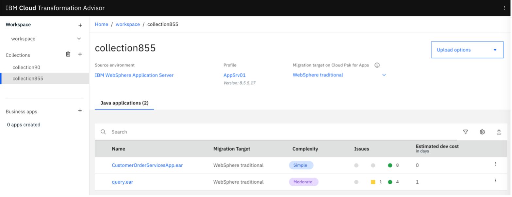

The first step in the modernization journey is to containerize applications. To run WebSphere applications like our sample application in a container, we will use <a href="https://www.ibm.com/garage/method/practices/learn/ibm-transformation-advisor" target="_blank" rel="noopener noreferrer">_IBM Cloud Transformation Advisor_</a>. Transformation Advisor is available in <a href="https://www.ibm.com/cloud/websphere-hybrid-edition" target="_blank" rel="noopener noreferrer">_IBM WebSphere Hybrid Edition_</a>, but it is also available to download separately and run locally using Docker Hub (or Podman).

Watch the following video for an introduction to using IBM Cloud Transformation Advisor to help modernize the sample app.

<iframe width="480" height="270" src="https://www.ustream.tv/embed/recorded/130909610" scrolling="no" allowfullscreen webkitallowfullscreen frameborder="0" style="border: 0 none transparent;"></iframe>

## Prerequisites

Make sure that you’ve reviewed the [sample example](/learningpaths/get-started-application-modernization/modernizing-apps-step-by-step/architecture-sample-app/) that we are using for the tutorials in this learning path.

Next, clone the repo to get the complete source code for the sample application:

```
$ git clone https://github.com/ibm/application-modernization-javaee-quarkus.git && cd application-modernization-javaee-quarkus
$ ROOT_FOLDER=$(pwd)
```

Because setting up the sample application in virtual machines or on bare metal servers is not that easy, the WebSphere 8.5.5 application is simulated running in a container in <a href="https://www.docker.com/get-started" target="_blank" rel="noopener noreferrer">_Docker desktop_</a>. If you no longer have a license for Docker desktop, Podman is a solid alternative that can be used in its place. Simply follow the commands in this <a href="https://www.stevemar.net/docker-to-podman/" target="_blank" rel="noopener noreferrer">_blog post_</a>. Note that the Podman tooling undergoes frequent updates to correct any issues so some of the instructions may no longer be required.

Then, install the local version of <a href="https://www.ibm.com/docs/en/cta?topic=started-non-ocp-install" target="_blank" rel="noopener noreferrer">_Transformation Advisor_</a> to run on your developer machine using <a href="https://www.docker.com/get-started" target="_blank" rel="noopener noreferrer">_Docker desktop_</a>. Note that the local install site also had direct support for podman, should you want to use it.

Watch the following video for a demonstration of using Transformation Advisor to upgrade the monolithic app:

<iframe width="480" height="270" src="https://www.ustream.tv/embed/recorded/130909611" scrolling="no" allowfullscreen webkitallowfullscreen frameborder="0" style="border: 0 none transparent;"></iframe>

## Steps

1. Upgrade the WebSphere 8.5.5 app to WebSphere 9
2. Run the app in a container

### Step 1: Upgrade the WebSphere 8.5.5 app to WebSphere 9

You’ll use the data collector from Transformation Advisor.  First, open `http://localhost:3000/`. Then, create a workspace named `workspace` and a collection named `collection855`. On the Collections page, download the data collector for Linux, `transformationadvisor-Linux_workspace_collection855.tgz`. Then, copy the data collector to `${ROOT_FOLDER}/transformation-advisor/tool`.

First, you must build and run the container that is running the WebSphere 8.5.5 legacy app.

```
$ sh ${ROOT_FOLDER}/scripts/install-dojo.sh
$ sh ${ROOT_FOLDER}/scripts/install-was-dependencies.sh
$ sh ${ROOT_FOLDER}/scripts-docker/build-and-run-monolith-app-was855.sh
```

Next, copy the data collector tool to the WebSphere container and open the container’s terminal:

```
$ docker cp {ROOT_FOLDER}/transformation-advisor/tool/transformationadvisor-Linux_workspace_collection855.tgz storefront-was855:/tmp
$ docker exec -it storefront-was855 /bin/bash

```

Then, extract the compressed data collector file:

```
$ cd /tmp
$ tar xvfz transformationadvisor-Linux_workspace_collection855.tgz
$ exit

```

Then, copy the configuration file on to the container:

```
$ docker cp ${ROOT_FOLDER}/transformation-advisor/wast855-to-wast90/customCmd.properties storefront-was855:/tmp/transformationadvisor-2.4.0/conf

```

For this particular example it’s important to define to include the classes from the ‘org.pwte’ packages.

```
--includePackages=org.pwte
```

Once the data collector and the configuration file has been copied onto the container, the collector tool can be run:

```
$ docker exec -it storefront-was855 /bin/bash
$ cd /tmp/transformationadvisor-2.4.0
$ ./bin/transformationadvisor -w /opt/IBM/WebSphere/AppServer -p AppSrv01
$ exit
```

Usually the results are uploaded to Transformation Advisor automatically. If this doesn’t work, you can do this manually:

```
$ cd ${ROOT_FOLDER}/transformation-advisor/wast855-to-wast90
$ docker cp storefront-was855:/tmp/transformationadvisor-2.4.0/AppSrv01.zip .

```

Transformation Advisor generates an output file, <a href="https://github.com/IBM/application-modernization-javaee-quarkus/blob/master/transformation-advisor/wast855-to-wast90/AppSrv01.zip" target="_blank" rel="noopener noreferrer">_AppSrv01.zip_</a>.

Here is the result of running Transformation Advisor in the Web Console. `CustomerOrderServicesApp.ear` is the application that is supposed to be containerized and the estimated effort is low. That’s because not a single line of code needs to be changed!



Instead Transformation Advisor automatically generates a  <a href="https://github.com/IBM/application-modernization-javaee-quarkus/blob/master/transformation-advisor/wast855-to-wast90/customerorderservicesapp_migrationBundle/Dockerfile" target="_blank" rel="noopener noreferrer">_Dockerfile_</a> and two Python scripts (which are included in the <a href="https://github.com/IBM/application-modernization-javaee-quarkus/blob/master/transformation-advisor/wast855-to-wast90/AppSrv01.zip" target="_blank" rel="noopener noreferrer">_AppSrv01.zip_</a> file) to run the same application in a container.  Click on the name of our app to display the migration plan.


The only change that needs to be done in the <a href="https://github.com/IBM/application-modernization-javaee-quarkus/blob/master/transformation-advisor/wast855-to-wast90/customerorderservicesapp_migrationBundle/Dockerfile" target="_blank" rel="noopener noreferrer">_Dockerfile_</a> is to replace `{APPLICATION_BINARY}` with the actual name for the `.ear` file.

```
FROM ibmcom/websphere-traditional:latest-ubi

# Manual fix: Replace {APPLICATION_BINARY} with CustomerOrderServicesApp-0.1.0-SNAPSHOT.ear
COPY --chown=was:root CustomerOrderServicesApp-0.1.0-SNAPSHOT.ear /work/config/CustomerOrderServicesApp-0.1.0-SNAPSHOT.ear
COPY --chown=was:root ./src/config /work/config
COPY --chown=was:root ./lib /work/config/lib
RUN /work/configure.sh
```

### Step 2: Run the sample app in a container

To run the application locally, you can use Docker desktop (or Podman, as described in the [Prerequisites](#prerequisites) section above).

Run these commands to run the containerized version that is running on WebSphere Traditional 9.0:

```
$ sh ${ROOT_FOLDER}/scripts/install-dojo.sh
$ sh ${ROOT_FOLDER}/scripts/install-was-dependencies.sh
$ sh ${ROOT_FOLDER}/scripts-docker/build-and-run-monolith-app-was90.sh
```

## Summary and next steps

In this tutorial, we took the first step in modernizing our sample application by using Transformation Advisor to containerize the sample application.  We also upgraded the sample app to use a more modern version of WebSphere Application Server traditional running in a container.

Our next step is to modernize the runtime for our sample app.