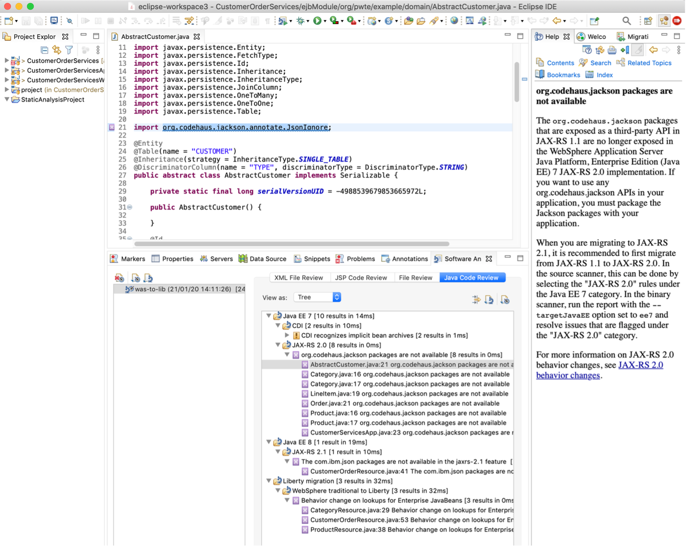
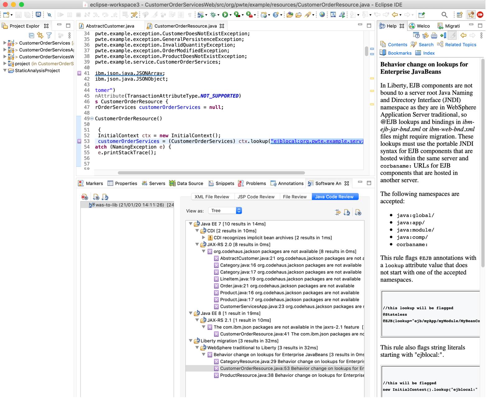

In this second step of our application modernization journey, the WebSphere application is converted into a Liberty application. WebSphere Liberty is built on the open source Open Liberty project and is a fast, dynamic, and easy-to-use Jakarta EE and MicroProfile application server. Liberty is a more efficient runtime for containerized workloads (which we just enabled in the previous tutorial) that is optimized for cloud-native microservices-based applications.

Because we are taking baby steps as we modernize our application, we will first migrate our app to use WebSphere Liberty.  For the code changes for running on WebSphere Liberty,  we will use the WebSphere Application Server migration tools, both the Migration Toolkit for Application Binaries (informally known as the binary scanner) and the WebSphere Application Server Migration Toolkit (also known as the source scanner). Only a couple of lines of code have to be changed. In particular, the EJB code needs to be updated.

Then, our next step is to migrate to use Open Liberty. By moving to <a href="https://developer.ibm.com/articles/6-reasons-why-open-liberty-is-an-ideal-choice-for-developing-and-deploying-microservices/" target="_blank" rel="noopener noreferrer">_use Open Liberty_</a>, you join an active open source community, get the latest new features first, and potentially incur less license costs.  When we move to Open Liberty we will restructure our app to increase developer productivity by taking advantage of hot code replacements and debugging with state of the art tooling.

## Prerequisites

Make sure that you’ve reviewed the [sample example](/learningpaths/get-started-application-modernization/modernizing-apps-step-by-step/architecture-sample-app/) that we are using for the tutorials in this learning path.

Next, if you haven’t already done so, clone the repo to get the complete source code for the sample application:

```
$ git clone https://github.com/ibm/application-modernization-javaee-quarkus.git && cd application-modernization-javaee-quarkus
$ ROOT_FOLDER=$(pwd)
```

## Steps

1. Migrate to WebSphere Liberty
2. Migrate to Open Liberty

### Step 1: Migrate to WebSphere Liberty

We start out our runtime modernization by migrating to WebSphere Liberty. We will keep the existing project structure, which has 4 sub projects with zips of EAR files.  We will first define and configure the runtime by updating the Dockerfile and pom.xml files. Although you could start from the files that were generated from Transformation Adviser when we [containerized our monolith](/learningpaths/get-started-application-modernization/modernizing-apps-step-by-step/containerize-app/), it’s straightforward enough to just define the Dockerfile manually.

### Step 1a: Define and configure the runtime of the application

There are a number of different WebSphere Liberty images available with different pros and cons. They differentiate in several ways: JVMs, JDK versions, Java versions, UBI images, etc. Check out the tags of these images on DockerHub:

* <a href="https://hub.docker.com/r/ibmcom/websphere-liberty" target="_blank" rel="noopener noreferrer nofollow">_ibmcom/websphere-liberty_</a>
* <a href=" https://hub.docker.com/_/websphere-liberty " target="_blank" rel="noopener noreferrer nofollow">_websphere-liberty_</a>

Here is the <a href="https://github.com/IBM/application-modernization-javaee-quarkus/blob/master/monolith-websphere-liberty/Dockerfile" target="_blank" rel="noopener noreferrer">_Dockerfile_</a> from my sample application:

```
FROM ibmcom/websphere-liberty:20.0.0.12-kernel-java8-openj9-ubi
USER root
COPY ./liberty/server.xml /config
COPY ./liberty/server.env /config
COPY ./liberty/jvm.options /config

ARG SSL=false
ARG MP_MONITORING=false
ARG HTTP_ENDPOINT=false

COPY ./CustomerOrderServicesApp/target/CustomerOrderServicesApp-0.1.0-SNAPSHOT.ear /config/apps/CustomerOrderServicesApp-0.1.0-SNAPSHOT.ear
COPY ./resources/ /opt/ibm/wlp/usr/shared/resources/
RUN chown -R 1001.0 /config /opt/ibm/wlp/usr/servers/defaultServer /opt/ibm/wlp/usr/shared/resources && chmod -R g+rw /config /opt/ibm/wlp/usr/servers/defaultServer  /opt/ibm/wlp/usr/shared/resources

USER 1001
RUN configure.sh
```

The last line (`RUN configure.sh`) can be ignored in development environments since it runs optimizations like caching. You can comment the line out so that building images and restarting containers will be much faster.

In the next step you need to define the pom.xml file or actually in this case the different pom.xml files. Old Java projects often used various <a href="https://github.com/IBM/application-modernization-javaee-quarkus/tree/master/monolith-websphere-liberty" target="_blank" rel="noopener noreferrer">_sub-projects_</a> generating the different artefacts: `.ear`, `.war` and `.jar` files.

In the `pom.xml` you should declare the dependency to Java EE or now Jakarta EE. In many cases this covers most of the necessary dependencies.

```
<dependency>
   <groupId>javaee</groupId>
   <artifactId>javaee-api</artifactId>
   <version>8</version>
   <scope>provided</scope>
</dependency>
```

Next the <a href="https://github.com/IBM/application-modernization-javaee-quarkus/blob/master/monolith-websphere-liberty/liberty/server.xml" target="_blank" rel="noopener noreferrer">_WebSphere Liberty server configuration_ (the server.xml file)</a> needs to be defined that describes which features to use, how to access databases, the HTTP endpoints, and so on.  Here is what I’ve used:

```
<server>
  <featureManager>
      <feature>appSecurity-2.0</feature>
      <feature>ldapRegistry-3.0</feature>
      <feature>localConnector-1.0</feature>
      <feature>ejbLite-3.1</feature>
      <feature>jaxrs-1.1</feature>
      <feature>jdbc-4.1</feature>
      <feature>jpa-2.0</feature>
      <feature>jsp-2.3</feature>
      <feature>servlet-3.1</feature>
  </featureManager>

  <library id="DB2Lib">
    <fileset dir="/opt/ibm/wlp/usr/shared/resources/db2" includes="db2jcc4.jar db2jcc_license_cu.jar"/>
  </library>

  <dataSource id="OrderDS" jndiName="jdbc/orderds" type="javax.sql.XADataSource">
    <jdbcDriver libraryRef="DB2Lib"/>
    <properties.db2.jcc databaseName="${env.DB2_DBNAME}" password="${env.DB2_PASSWORD}" portNumber="${env.DB2_PORT}" serverName="${env.DB2_HOST}" user="${env.DB2_USER}"/>
    <connectionManager agedTimeout="0" connectionTimeout="180" maxIdleTime="1800" maxPoolSize="10" minPoolSize="1" reapTime="180"/>
  </dataSource>

  <httpEndpoint host="*" httpPort="9080" httpsPort="9443" id="defaultHttpEndpoint">
    <tcpOptions soReuseAddr="true"/>
  </httpEndpoint>

  <application id="customerOrderServicesApp" name="CustomerOrderServicesApp-0.1.0-SNAPSHOT.ear" type="ear" location="CustomerOrderServicesApp-0.1.0-SNAPSHOT.ear">
    <classloader apiTypeVisibility="spec, ibm-api, third-party" />
  </application>
</server>
```

### Step 1b: Make the necessary code changes

<sidebar>
Complete the “<a href="https://developer.ibm.com/learningpaths/app-mod-liberty/" target="_blank" rel="noopener noreferrer">_Modernizing your applications to use WebSphere Liberty_</a>” learning path to learn more about all the migration tools that are available to WebSphere users.
</sidebar>

We will use the WebSphere Application Server Migration Toolkit to make our code changes.

Watch the following video for an introduction of using WebSphere Application Server Migration Toolkit:

<iframe width="480" height="270" src="https://www.ustream.tv/embed/recorded/130909621" scrolling="no" allowfullscreen webkitallowfullscreen frameborder="0" style="border: 0 none transparent;"></iframe>

<!-- IF YOU WANT DEMO, USE THIS ONE:
<iframe width="480" height="270" src="https://www.ustream.tv/embed/recorded/130909625" scrolling="no" allowfullscreen webkitallowfullscreen frameborder="0" style="border: 0 none transparent;"></iframe> -->

Use these instructions to install the <a href="https://www.ibm.com/support/pages/websphere-application-server-migration-toolkit" target="_blank" rel="noopener noreferrer nofollow">_WebSphere Application Server Migration Toolkit_</a> into Eclipse.

Then, create a Software Analyzer Configuration named `was-to-lib`.


Then, from the Rules tab, select the WebSphere Application Server Version Migration.


On the Rule set configuration dialog, choose the source application server and target application server.


In this example, three code changes need to be done. The results can be found in the ‘Software Analyzer Configuration’ view, especially under the Java Code Review tab.

The first necessary change is to replace the usages of ‘org.codehaus.jackson’. The Eclipse ‘Help’ view describes easily what needs to be changed.



The next required change is to replace ‘com.ibm.json’ with an open source package in Java EE.


The third change are the EJB lookups (which might not be necessary anymore with the latest Liberty versions).



### Step 2: Migrate to Open Liberty

Now that you’ve got the sample app running on WebSphere Liberty, let’s take the next baby step and migrate it to run on Open Liberty.  As part of migrating to Open Liberty, we will simplify the structure of the app to be more of a cloud-native app.

To learn more about the benefits of using Open Liberty, watch this video:

<iframe width="480" height="270" src="https://www.ustream.tv/embed/recorded/130909633" scrolling="no" allowfullscreen webkitallowfullscreen frameborder="0" style="border: 0 none transparent;"></iframe>

### Step 2a: Define and configure the runtime of the application

Since WebSphere Liberty is based on Open Liberty there aren’t too many changes that need to be done, but there are some differences.

The first thing that needs to be changed is the Dockerfile. The <a href=" https://github.com/IBM/application-modernization-javaee-quarkus/blob/master/monolith-websphere-liberty/Dockerfile.multistage" target="_blank" rel="noopener noreferrer">_WebSphere Liberty Dockerfile_</a> is similar to the <a href=" https://github.com/IBM/application-modernization-javaee-quarkus/blob/master/monolith-open-liberty-cloud-native/Dockerfile.multistage" target="_blank" rel="noopener noreferrer">_Open Liberty version_</a>, which you should manually create:

```
FROM adoptopenjdk/maven-openjdk11 as BUILD
COPY . /usr/src/app/src
WORKDIR /usr/src/app/src/CustomerOrderServicesProject
RUN mvn clean package

FROM open-liberty:kernel-slim-java11-openj9
USER root
COPY --chown=1001:0 ./liberty/server.xml /config
COPY --chown=1001:0 ./liberty/server.env /config
COPY --chown=1001:0 ./liberty/jvm.options /config

ARG SSL=false
ARG HTTP_ENDPOINT=false

RUN features.sh

COPY --from=build --chown=1001:0 /usr/src/app/src/CustomerOrderServicesApp/target/CustomerOrderServicesApp-0.1.0-SNAPSHOT.ear /config/apps/CustomerOrderServicesApp-0.1.0-SNAPSHOT.ear
COPY --from=build --chown=1001:0 /usr/src/app/src/resources/ /opt/ol/wlp/usr/shared/resources/
RUN chown -R 1001.0 /config /opt/ol/wlp/usr/servers/defaultServer /opt/ol/wlp/usr/shared/resources && chmod -R g+rw /config /opt/ol/wlp/usr/servers/defaultServer  /opt/ol/wlp/usr/shared/resources

USER 1001
RUN configure.sh
```

For Java applications I always use a multistage `Dockerfile` to make sure that the Maven build always returns the same result, no matter where you build the code. This eliminates issues with different JVMs, Maven versions, JDK versions, etc.

To pick the right Open Liberty image, check out the <a href="https://github.com/OpenLiberty/ci.docker#container-images" target="_blank" rel="noopener noreferrer nofollow">_Open Liberty documentation_</a>. There are different Open Liberty projects on DockerHub, but the recommended images are not the Docker Official images (<a href="https://hub.docker.com/_/open-liberty" target="_blank" rel="noopener noreferrer nofollow">_open-liberty_</a>) but instead the Universal Base Image (UBI) (<a href="https://hub.docker.com/r/openliberty/open-liberty" target="_blank" rel="noopener noreferrer nofollow">_openliberty/open-liberty_</a>).

In order to start using the Open Liberty it might make sense to start with the images tagged with `full`. These images contain the full runtime which means they are bigger, but easier to use initially. After this, you can optimize the images by using the `slim` versions and running the ‘features.sh’ script to only pull the features you need.

And, once again, you can comment out the last line (`RUN configure.sh`) so that building images and restarting containers will be much faster.

Next, you need to manually create a single <a href="https://github.com/IBM/application-modernization-javaee-quarkus/blob/master/monolith-open-liberty-cloud-native/pom.xml" target="_blank" rel="noopener noreferrer">_pom.xml_</a> file and change some dependencies in the file. To make migrations as easy as possible, use the `umbrella` dependencies, Jakarta and MicroProfile, and pick the latest versions. You can also change the Java compilation version in the `pom.xml` file.

```
<dependency>
   <groupId>jakarta.platform</groupId>
   <artifactId>jakarta.jakartaee-api</artifactId>
   <version>8.0.0</version>
   <scope>provided</scope>
</dependency>
<dependency>
   <groupId>org.eclipse.microprofile</groupId>
   <artifactId>microprofile</artifactId>
   <version>3.3</version>
   <type>pom</type>
   <scope>provided</scope>
</dependency>
```
Next, you must define the features that Open Liberty uses in the <a href="https://github.com/IBM/application-modernization-javaee-quarkus/blob/master/monolith-open-liberty-cloud-native/src/main/liberty/config/server.xml" target="_blank" rel="noopener noreferrer">_server.xml file_</a>, which you manually create.  In server.xml, use the ‘umbrella’ features again. Since the MicroProfile reactive features are not part of MicroProfile core, they need to be defined separately.

```
<feature>microProfile-3.3</feature>
<feature>jakartaee-8.0</feature>
<feature>mpReactiveStreams-1.0</feature>
<feature>mpReactiveMessaging-1.0</feature>
```

### Step 2b: Make the necessary code changes

These days developers are used to leveraging certain functionality when writing code with modern frameworks, for example:

* Hot code replacements
* Debugging, including debugging in containers
* IDE support like errors, warnings, auto-complete, and much more

I like that Open Liberty provides this functionality, especially dev mode:

* To start Open Liberty in dev mode, <a href="https://github.com/OpenLiberty/ci.maven/blob/master/docs/dev.md#dev" target="_blank" rel="noopener noreferrer nofollow">_mvn_liberty:dev_</a>
* To start Open Liberty in dev mode with container support, use this command:  <a href="https://github.com/OpenLiberty/ci.maven/blob/master/docs/dev.md#devc-container-mode" target="_blank" rel="noopener noreferrer nofollow">_mvn_liberty:devc_</a>

Unfortunately this functionality doesn’t work for several legacy projects which use multi-modules. These projects often have multiple sub-projects generating different artifacts, for example ear, jar and war files. The sub-projects even have their own pom.xml files with dependencies between each other. For these types of projects the dev mode does not work.

In order to use the productivity tools in dev mode in Open Liberty, I changed the structure of my project:

* <a href="https://github.com/IBM/application-modernization-javaee-quarkus/tree/master/monolith-open-liberty" target="_blank" rel="noopener noreferrer">_Original code with multiple modules_</a>
* <a href="https://github.com/IBM/application-modernization-javaee-quarkus/tree/master/monolith-open-liberty-cloud-native" target="_blank" rel="noopener noreferrer">_Modernized code with one project_</a>

In summary I had to make the following changes:

* Create a new Open Liberty project and copy the source code from all sub-projects in it
* Merge all pom.xml files
* Take over the configuration files (server.xml, persistence.xml, etc.)
* Update the paths in the Dockerfile

The project structure on the left hand side shows the original multi-modules structure, the right side shows the simplified new structure.


To simplify the code, I also replaced the EJBs (Enterprise Java Beans) with CDI (Contexts and Dependency Injection) since all code runs in the same context now. For example this was the original EJB code:

```
@Stateless
public class ProductSearchServiceImpl implements ProductSearchService {
   ...
}
public class CategoryResource {
   @EJB ProductSearchService productSearch;
   ...  
   productSearch = (ProductSearchService) new InitialContext().lookup("java:app/CustomerOrderServices/ProductSearchServiceImpl!org.pwte.example.service.ProductSearchService");
   ...
}
```
This is the converted code using CDI:

```
@ApplicationScoped
public class ProductSearchServiceImpl implements ProductSearchService {
   ...
}
@ApplicationScoped
public class CategoryResource {
   @Inject
   ProductSearchServiceImpl productSearch;
   ...
}
```
In order to handle transactions, you can use `@Transactional` which is part of the Java/Jakarta EE standard Java Transaction API (JTA). In the easiest case you simply use the annotation on your method.

```
@Transactional
public void updateLineItem(String productId, String newPrice) {
   ...
}  
```
If you need more control, you can also manage the transactions manually:

```
@PersistenceContext
protected EntityManager em;

@Resource
UserTransaction utx;

@Transactional
public void updateLineItem(String productId, String newPrice) {
   utx.begin();
   em.persist(lineItem);
   utx.commit();
   ...
}
```

## Summary and next steps

In this tutorial, we took the next step in modernizing our sample application by modernizing the runtimes. First, we migrated to use WebSphere Liberty; then, we migrated to use Open Liberty.

The next step in our application modernization journey is to refactor the monolithic app into microservices.