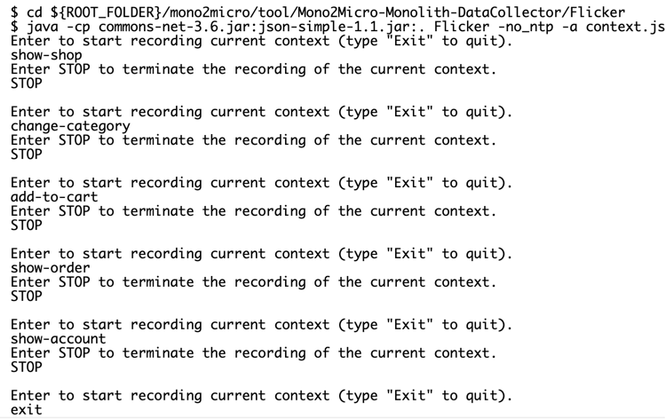

アプリケーション・モダナイゼーションの旅の第3ステップでは、モノリシック・アプリケーションの機能を1つだけ選んでマイクロサービスにリファクタリングするという、小さくてシンプルなステップを行います。  ここでは、Martin FowlerのStrangler Fig Pattern（またはStrangler Pattern）を使用します。

<sidebar><p>Stranglerパターンの詳細については、Kyle Brown氏の記事「<a href="https://developer.ibm.com/articles/cl-strangler-application-pattern-microservices-apps-trs/" target="_blank" rel="noopener noreferrer">_Apply the Strangler Fig Application pattern to microservices applications_</a>」をご覧ください。</p></sidebar>

基本的にStranglerパターンは、同時に多くの変更を行うのではなく、新しいマイクロサービスアーキテクチャを実験するために、モノリスから1つのサービスを分割することを推奨しています。モノリスは機能を維持し、新しいマイクロサービスはモノリスを豊かにします。

しかし、モノリスから分割される最初のマイクロサービスを特定することは、簡単なことではありません。私たちが取り組んできた[サンプル例](/learningpaths/get-started-application-modernization/modernizing-apps-step-by-step/architecture-sample-app/)を見てみましょう。

最初に考えたのは、カタログ機能を別のサービスに移すことでした。Eコマースサイトを利用するユーザーの多くは、さまざまな商品を見て回ると思いますが、実際にログインしてショッピングカートに商品を入れ、注文するユーザーはほとんどいません。モノリスからカタログ機能を分離することの利点は、アプリケーションのこの部分が他のアプリケーションから独立してスケールできることです。経済的には、CPUやメモリなどのリソースが少なくて済むので、コスト削減にもつながります。

カタログサービスをモノリスから分離するもう1つの理由は、残りの機能への依存関係がわずかであるということです。  マイクロサービスはマイクロ過ぎてはいけない。

<sidebar>より複雑なモノリスでIBM Mono2Microを使用する方法については、「<a href="https://developer.ibm.com/learningpaths/intro-ibm-mono2micro/" target="_blank" rel="noopener noreferrer">_Introduction to IBM Mono2Micro_</a>」ラーニングパスを完了してください。</sidebar>

IBM は <a href="https://www.ibm.com/jp-ja/cloud/blog/announcements/ibm-mono2micro" target="_blank" rel="noopener noreferrer">_Mono2Micro_</a> というツールを提供しており、特に複雑なモノリシック・アプリケーションの場合、マイクロサービスの候補を特定するのに役立ちます。  Mono2Microは単体でも利用できますが、WebSphere Hybrid Editionの一部としても利用できます。  このチュートリアルでは、サンプル・アプリで Mono2Micro を使用する方法を紹介し、どの機能をマイクロサービスにリファクタリングすることを推奨しているかを見ていきます。

## 前提条件

このラーニングパスのチュートリアルで使用している[サンプル例](/learningpaths/get-started-application-modernization/modernizing-apps-step-by-step/architecture-sample-app/)を確認しておいてください。

次に、まだやっていなければ、サンプルアプリケーションの完全なソースコードを取得するために、リポジトリをクローンします。


最後に、<a href="https://www.ibm.com/docs/en/mono2micro?topic=installing-mono2micro" target="_blank" rel="noopener noreferrer">_download and install IBM Mono2Micro_</a>（データコレクタツールを含む）をインストールします。

## ステップ

1. IBM Mono2Micro のデータコレクタを使用して、サンプルアプリの使用状況を記録する。
2.Mono2Microツールを使用して、モノリスを分割するための提案を作成する。
3.モノリス化したカタログサービスの構築

## Step 1.IBM Mono2Micro の Data Collector を使用して、サンプルアプリの使用状況を記録します。

IBM Mono2Microでデータコレクタを使用する前に、どのクラスやメソッドが呼び出されたかというデバッグ情報を含むようにソースコードを修正する必要があります。

??ヘルプ?NIKLAS: CANNOT FIND THIS DIRECTORY: `monolith-open-liberty-klu`（このディレクトリは見つかりません。


次に、修正したソースコードでアプリケーションを起動する必要があります。


次に、アプリケーションをブラウザで開きます。  `http://localhost/CustomerOrderServicesWeb `.

最後に、IBM Mono2MicroのData Collectorを使って、ユーザーが通常どのようにアプリケーションを操作するかを記録します。  以下の各フローはユースケースです。  これらのコマンドを使用して、サンプルの電子商取引アプリケーションの典型的なユースケースを記録します。



<!-- フォーマットの問題を避けるためにスクリーンショットを撮りました -->
`<!-- ```
$ cd ${ROOT_FOLDER}/mono2micro/tool/Mono2Micro-Monolith-DataCollector/Flicker
$ java -cp commons-net-3.6.jar:json-simple-1.1.jar:.Flicker -no_ntp -a context.json

Enterキーで現在のコンテキストの記録を開始します（終了する場合は "Exit "と入力してください）。
ショー・ショップ
現在のコンテキストの記録を終了するには、STOP と入力してください。
STOP

現在のコンテキストの記録を開始するにはEnterキーを押します（終了するには「Exit」と入力します）。
カテゴリー変更
現在のコンテキストの記録を終了するには、STOP を入力します。
STOP

現在のコンテキストの記録を開始するにはEnterキーを押してください（終了するには「Exit」と入力してください）。
カートに追加
現在のコンテキストの記録を終了するには、STOPを入力してください。
STOP

Enterで現在のコンテキストの記録を開始します（終了するには "Exit "と入力します）。
ショーオーダー
現在のコンテキストの記録を終了するには、STOP を入力します。
STOP

現在のコンテキストの記録を開始するには、Enter キーを押します（終了するには「Exit」と入力します）。
ショー・アカウント
STOP を入力して、現在のコンテキストの記録を終了します。
STOP

Enterで現在のコンテキストの記録を開始します（終了するには「Exit」と入力します）。
exit

$ cp ${ROOT_FOLDER}/mono2micro/tool/Mono2Micro-Monolith-DataCollector/Flicker/context.json ${ROOT_FOLDER}/mono2micro/output/contexts
$ docker cp storefront-backend-open:/logs/messages.log .
$ cp messages.log ${ROOT_FOLDER}/mono2micro/output/logs
$ docker run --rm -it -v ${ROOT_FOLDER}/mono2micro/output:/var/application ibmcom/mono2micro-aipl
$ docker run -d -p 3000:3000 ibmcom/mono2micro-ui