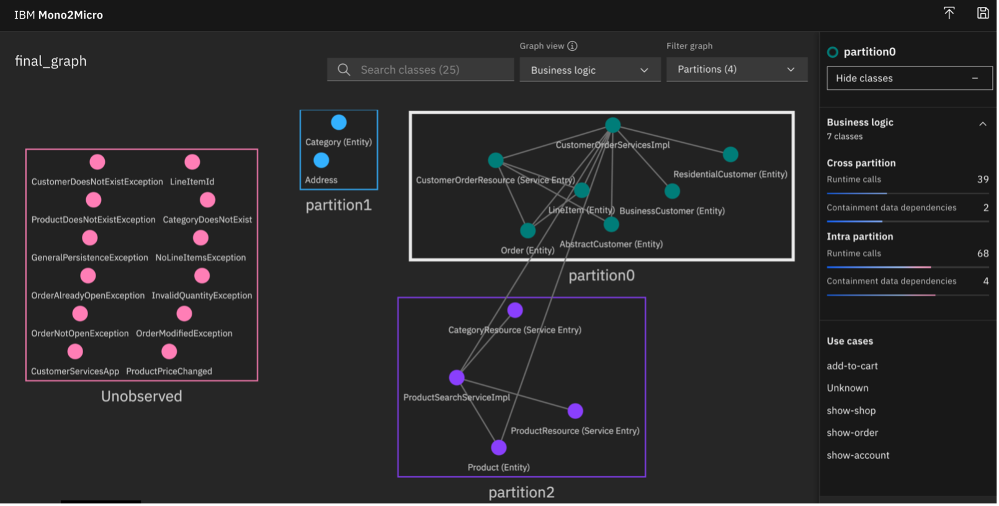
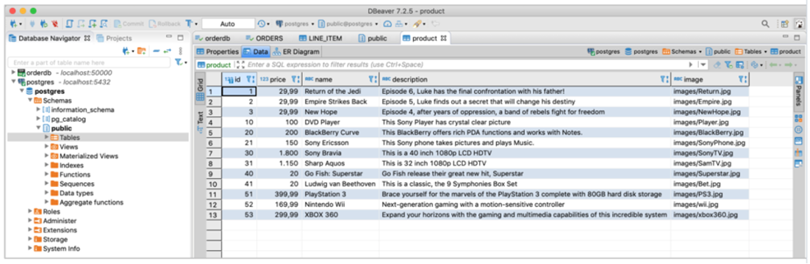

In the third step of our application modernization journey, we will take the small, simple step of selecting just one function of our monolithic application to refactor to a microservice.  We will use Martin Fowler’s Strangler Fig Pattern (or just Strangler Pattern).

<sidebar><p>To read more about the Strangler pattern, read Kyle Brown’s article, "<a href="https://developer.ibm.com/articles/cl-strangler-application-pattern-microservices-apps-trs/" target="_blank" rel="noopener noreferrer">_Apply the Strangler Fig Application pattern to microservices applications_</a>."</p></sidebar>

Essentially the Strangler pattern recommends splitting one service from monoliths to experiment with new microservices architectures rather than doing too many changes at the same time. The monoliths remain functional and the new microservices enrich the monoliths.

The identification of the first microservice to be split from the monolith is not trivial though. Let’s take a look at my [sample example](/learningpaths/get-started-application-modernization/modernizing-apps-step-by-step/architecture-sample-app/) that we’ve been working with.

My first idea was to move the catalog functionality into a separate service. Most users of e-commerce sites probably navigate through different offers while only few users actually log in, add something to their shopping carts, and then order something. The advantage of splitting the catalog functionality from the monolith is this part of the application can be scaled independently from the rest of the application. Economically, this means you need less resources like CPU and memory, which also leads to less costs.

The other reason for splitting the catalog service from the monolith is there are only a few dependencies to the remaining functionality, which leads you down the path of creating distributed monoliths, which I don’t recommend.  Microservices shouldn’t be too micro.

<sidebar>To learn more about how to use IBM Mono2Micro on your more complex monoliths, complete the "<a href="https://developer.ibm.com/learningpaths/intro-ibm-mono2micro/" target="_blank" rel="noopener noreferrer">_Introduction to IBM Mono2Micro_</a>" learning path.</sidebar>

IBM provides a tool called <a href="https://www.ibm.com/cloud/blog/announcements/ibm-mono2micro" target="_blank" rel="noopener noreferrer">_Mono2Micro_</a> that can help you identify microservices candidates, especially for more complex monolithic applications.  Mono2Micro is available separately but also as part of WebSphere Hybrid Edition.  In this tutorial, I’ll show you how to use Mono2Micro on our sample app, and we’ll see which functions it recommends refactoring into microservices.

## Prerequisites

Make sure that you’ve reviewed the [sample example](/learningpaths/get-started-application-modernization/modernizing-apps-step-by-step/architecture-sample-app/) that we are using for the tutorials in this learning path.

Next, if you haven’t already done so, clone the repo to get the complete source code for the sample application:

```
$ git clone https://github.com/ibm/application-modernization-javaee-quarkus.git && cd application-modernization-javaee-quarkus
$ ROOT_FOLDER=$(pwd)
```

Finally, <a href="https://www.ibm.com/docs/en/mono2micro?topic=installing-mono2micro" target="_blank" rel="noopener noreferrer">_download and install IBM Mono2Micro_</a>, including the data collector tools.

## Steps

1. Use the Data Collector in IBM Mono2Micro to record how the sample app is used
2. Use the Mono2Micro tool to generate suggestions on how to split our monolith
3. Building the strangled Catalog service

## Step 1. Use the Data Collector in IBM Mono2Micro to record how the sample app is used

Before we use the Data Collector in IBM Mono2Micro, we need to modify the source code to contain debug information for when which classes and methods are invoked.

??HELP?? NIKLAS: CANNOT FIND THIS DIRECTORY: `monolith-open-liberty-klu`

```
$ docker run --rm -it -v ${ROOT_FOLDER}/:/var/application ibmcom/mono2micro-bluejay /var/application/monolith-open-liberty
$ cp ${ROOT_FOLDER}/monolith-open-liberty-klu/refTable.json ${ROOT_FOLDER}/mono2micro/output/tables
$ cp ${ROOT_FOLDER}/monolith-open-liberty-klu/symTable.json ${ROOT_FOLDER}/mono2micro/output/tables
```

Next, we need to launch the application with the modified source code.

```
$ sh ${ROOT_FOLDER}/scripts-docker/build-and-run-monolith-db2.sh
$ sh ${ROOT_FOLDER}/scripts-docker/build-and-run-splitted-frontend-open-klu.sh
```

Next, open the application in a browser:  `http://localhost/CustomerOrderServicesWeb `.

Finally, we’ll use the Data Collector of IBM Mono2Micro to record how users typically interact with the application.  Each of the following flows is a use case.  Use these commands to record typical use cases of our sample e-commerce application:


<!-- TOOK SCREENSHOT TO AVOID FORMATTING ISSUES -->
<!-- ```
$ cd ${ROOT_FOLDER}/mono2micro/tool/Mono2Micro-Monolith-DataCollector/Flicker
$ java -cp commons-net-3.6.jar:json-simple-1.1.jar:. Flicker -no_ntp -a context.json

Enter to start recording current context (type "Exit" to quit).
show-shop
Enter STOP to terminate the recording of the current context.
STOP

Enter to start recording current context (type "Exit" to quit).
change-category
Enter STOP to terminate the recording of the current context.
STOP

Enter to start recording current context (type "Exit" to quit).
add-to-cart
Enter STOP to terminate the recording of the current context.
STOP

Enter to start recording current context (type "Exit" to quit).
show-order
Enter STOP to terminate the recording of the current context.
STOP

Enter to start recording current context (type "Exit" to quit).
show-account
Enter STOP to terminate the recording of the current context.
STOP

Enter to start recording current context (type "Exit" to quit).
exit

``` -->

## Step 2. Use the Mono2Micro tool to generate suggestions on how to split our monolith

Now, let’s use the Mono2Micro tool to generate suggestions on how to split our monolith up into microservices.

```
$ cp ${ROOT_FOLDER}/mono2micro/tool/Mono2Micro-Monolith-DataCollector/Flicker/context.json ${ROOT_FOLDER}/mono2micro/output/contexts
$ docker cp storefront-backend-open:/logs/messages.log .
$ cp messages.log ${ROOT_FOLDER}/mono2micro/output/logs
$ docker run --rm -it -v ${ROOT_FOLDER}/mono2micro/output:/var/application ibmcom/mono2micro-aipl
$ docker run -d -p 3000:3000 ibmcom/mono2micro-ui
```

Open the Mono2Micro web application in a browser: `http://localhost:3000/`

Then, open the `final_graph.json` file (`${ROOT_FOLDER}/mono2micro/output/mono2micro-output/oriole/final_graph.json`) in Mono2Micro to display the suggestions.

Mono2Micro suggests to move the catalog functionality into a separate service. This makes a lot of sense since this functionality can be scaled separately now. Users are browsing the catalog more often than actually buying items.

The purple rectangle is essentially the catalog service (except of the missing Category class). The green classes make up the remaining monolith (except of Address). The red classes need to be assigned to either the catalog service of the remaining monolith dependent of class dependencies. Most of them are exceptions which weren’t covered in the use cases.



## Step 3.  Building the strangled Catalog service

In our previous application modernization step, we modernized our monolith to take advantage of Open Liberty with a new project structure and only one pom and one project.  Also, we used Contexts and Dependency Injection (CDI) rather than the EJBs.

<sidebar>The full name of the Panache Quarkus library is <a href="https://quarkus.io/guides/hibernate-orm-panacheRL" target="_blank" rel="noopener noreferrer nofollow">_Hibernate ORM with Panache_</a>, which you can learn more in this guide.
</sidebar>

Since the Mono2Micro tool confirmed my suspicions that we should strangle the Catalog service of our sample application, I proceeded to refactor it into a microservice by using the Quarkus library, Panache, which is an extraction of JPA.

You can explore the <a href="https://github.com/IBM/application-modernization-javaee-quarkus/tree/master/service-catalog-quarkus-synch/src/main/java/com/ibm/catalog" target="_blank" rel="noopener noreferrer">_code of my refactored Catalog service in my GitHub repo_</a>.

As part of strangling the Catalog service, I also modernized the monolithic DB2 database to use the open source <a href="https://www.postgresql.org/" target="_blank" rel="noopener noreferrer nofollow">_Postgres database_</a>.



## Summary and next steps

In this tutorial, we took the next step in modernizing our sample application by refactoring one of the functions in the monolith into a microservice.  

<!-- USE THIS AFTER WE ADD IN THIS TUTORIAL:  Our next step is to move to using an event-driven architecture to build loosely coupled event-driven microservices. -->

Our next step is to separate the frontend and build micro frontends.