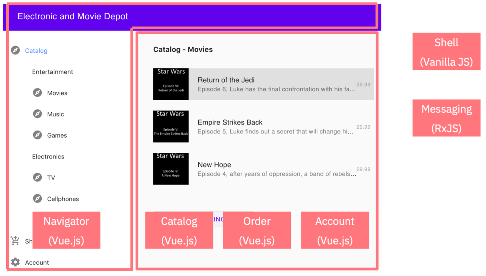

アプリケーションモダナイゼーションの第5ステップである今回は、マイクロサービスの概念をWebアプリケーションに適用してマイクロフロントエンドを開発します。

マイクロサービス・ベースのアーキテクチャの利点の1つは、アプリケーションの一部を互いに独立して更新できることです。しかし、アプリケーションをモジュール化する過程では、フロントエンドが忘れられがちです。バックエンドの機能は複数のマイクロサービスに分割されることが多いのですが、ユーザーインターフェースはモノリスのままであることが多いのです。  しかし、もう大丈夫です。

マーティン・ファウラーは、<a href="https://martinfowler.com/articles/micro-frontends.html" target="_blank" rel="noopener noreferrer nofollow">_micro-frontends_</a>を「独立して提供可能なフロントエンド・アプリケーションを、より大きな全体に構成するアーキテクチャ・スタイル」と定義しています。Webアプリケーション全体を更新することなく、ユーザーインターフェースの一部を更新できるようにしたい。最適なケースでは、ユーザーインターフェースの異なる部分のために、別々のCI/CDパイプラインが存在することさえあります。

## 前提条件

このラーニングパスのチュートリアルで使用している[サンプル例](/learningpaths/get-started-application-modernization/modernizing-apps-step-by-step/architecture-sample-app/)を確認してください。

次に、まだやっていなければ、サンプルアプリケーションの完全なソースコードを取得するために、リポジトリをクローンします。

## ステップ

1. Webアプリケーションのモジュール化
2.マイクロフロントエンドの構築

    a. シェルの構築
    b. UIフロントエンドの構築
    c. メッセージングの構築

## Step 1.  Webアプリケーションのモジュール化

このラーニングパスで扱ってきた<a href="https://github.com/IBM/application-modernization-javaee-quarkus/tree/master/frontend-monolith" target="_blank" rel="noopener noreferrer">_sample e-commerce application_</a>には、ショップの閲覧、ショッピングカートの表示、アカウント情報の管理など、さまざまなページがあります。そして、そのフロントエンドはモノリスでした。

左の列にはナビゲーターがあります。ナビゲーターでの選択に基づいて、異なる情報がウィンドウのメインエリアに表示されます。

例えば、レーティング機能を追加したいとしましょう。評価機能は，電子商取引アプリケーションのカタログでのみ必要とされる。他のサービス、`ショッピングカート`や`アカウント情報`は、ほとんどそれとは別のものです。

この新しいレーティング機能を実装するためには、古典的な3層構造のアプリケーションスタックのさまざまな部分を変更する必要があります。

* データベース
* ビジネス機能/バックエンド・マイクロサービス
* ユーザーインターフェース／マイクロフロントエンド

ここでは、Webアプリケーションを6つのパーツに分解してみました。

ナビゲーター、カタログ、注文インターフェース、アカウントページは、それぞれ別の Web アプリケーションです。ここではVue.jsを使用して各部分を実装しましたが、バニラJavaScript、JavaベースのUIフレームワーク、React、Web Components、Angularなど、他の技術を使用することもできます。ただし、あまり多くのWebフレームワークを混在させないように注意し、Webアプリ全体で使用するフレームワークを標準化するようにしてください。

## Step 2.マイクロフロントエンドの開発

私が使用したウェブフレームワークは、<a href="https://single-spa.js.org/docs/getting-started-overview/" target="_blank" rel="noopener noreferrer">_single-spa_</a> (single single-page-applicationの略)です。single-spaフレームワークは、マイクロフロントエンドと呼ばれる技術を使って、このようなモジュール式のウェブアプリケーションを構築する際に使用すると良いフレームワークです。基本的には、フロントエンドのマイクロサービス用のJavascriptルーターです。

single-spaフレームワークは、クライアント側のさまざまなユーザー・インターフェース・コンポーネントを連携させます。私のサンプルでは、JavaScriptでシェルコンポーネントが実装されています。このコンポーネントは、アプリケーションの構造を定義します。メッセージング・コンポーネントも同様にJavaScriptで実装されており、より正確には<a href="https://github.com/ReactiveX/rxjs" target="_blank" rel="noopener noreferrer">_RxJS_</a>で実装されています。このコンポーネントは、バックエンドのKafkaのようなメッセージングサービスに対応するものです。RxJSを使うと、イベントドリブンなアーキテクチャでコンポーネントをゆるやかに結合することができます。

JavaScriptには長い間、バックエンドにモジュールを構築する機能がありました。Node.jsの開発者は、この機能を日常的に使っています。最近では、モダンブラウザがWebアプリケーションにも同じ機能を採用しています。このモジュールベースのアプローチにより、開発者はブラウザ上で潜在的に異なるソースからのモジュールをまとめて、フロントエンドで「マイクロサービス」（マイクロフロントエンド）を構築することができます。

いつものことですが、新機能のサポートが他よりも早いブラウザもあります。JavaScriptモジュールをまだサポートしていないブラウザには、<a href="https://developer.mozilla.org/en-US/docs/Glossary/Polyfill" target="_blank" rel="noopener noreferrer">_polyfills_</a>などがあり、シングル・スパで使用されている<a href="https://github.com/systemjs/systemjs" target="_blank" rel="noopener noreferrer">_SystemJS_</a>などがあります。

single-spaには開発ツールが組み込まれています。デフォルトでは、single-spaは、ウェブアプリのメインのindex.htmlファイルで定義された場所からすべてのコンポーネントを読み込みます。このツールでは、これらの場所を上書きすることもできます。アプリケーションのほとんどの部分を、オブジェクト・ストレージ、ファイル・サーバー、またはウェブ・サーバーから読み込むことができます。開発者が作業しているアプリケーションのモジュールは、webpackのようなメカニズムでローカルに提供することができます。

次のスクリーンショットは、シングルスパの開発ツールをブラウザで表示し、モジュールのどの場所を上書きできるかを示しています。

### シェルの構築

Webアプリケーションの<a href="https://github.com/IBM/application-modernization-javaee-quarkus/tree/master/frontend-single-spa/shell/src" target="_blank" rel="noopener noreferrer">_shell_</a>は、主に`index.html`ファイルとJavaScriptファイルで構成されています。

index.htmlファイルでは、3つの重要なことが行われます。

* アプリケーションのモジュールが読み込まれます。
* グローバルな依存関係が読み込まれる
* アプリケーションのコア・レイアウトが定義される

さらに、アプリケーションのさまざまなユーザーインターフェースコンポーネントを登録するために、<a href="https://github.com/IBM/application-modernization-javaee-quarkus/blob/master/frontend-single-spa/shell/src/vue-app-mod-shell.js" target="_blank" rel="noopener noreferrer">_a JavaScript file_</a>が必要です。

### UIの構築

マイクロフロントエンドは、一般的なWebフレームワーク、バニラJavaScript、Webコンポーネントのいずれでも実装できます。私は、<a href="https://vuejs.org/" target="_blank" rel="noopener noreferrer">_Vue.js_</a>フレームワークを使って、UIのマイクロフロントエンドを実装しました。

* アカウントUI
* カタログUI
* ナビゲーターUI
* 注文画面

ここでは、Vue.jsを使ってナビゲーター・マイクロフロントエンドを構築した例を紹介します。

ここでは、<a href="https://github.com/IBM/application-modernization-javaee-quarkus/blob/master/frontend-single-spa/navigator/src/set-public-path.js" target="_blank" rel="noopener noreferrer">_public path_</a>ファイルの定義を示しています。

ここでは、Vue.jsのナビゲーターアプリケーションの<a href="https://github.com/IBM/application-modernization-javaee-quarkus/blob/master/frontend-single-spa/navigator/src/main.js" target="_blank" rel="noopener noreferrer">_main.js_</a>ファイルを紹介します。

Webアプリケーションの他のモジュールのために、他のマイクロフロントエンドをどのように実装したかは、サンプルアプリケーションの<a href="https://github.com/IBM/application-modernization-javaee-quarkus/tree/master/frontend-single-spa" target="_blank" rel="noopener noreferrer">_GitHub repo_</a>で見ることができます。

### メッセージングの構築

他のマイクロフロントエンドのメッセージングは、UIマイクロフロントエンドとは大きく異なります（このマイクロフロントエンドの詳細はこちら。  実際のところ、この点についてだけでも別のチュートリアルを書くことができます。  しかし今は、<a href="https://github.com/IBM/application-modernization-javaee-quarkus/blob/master/frontend-single-spa/messaging/src/messaging.js" target="_blank" rel="noopener noreferrer">_messaging.js_</a> ファイルを見ることで、マイクロフロントエンドのメッセージングをどのように実装したのか、その詳細を知ることができます。

## まとめと次のステップ

このチュートリアルでは、サンプルアプリケーションのマイクロフロントエンドを開発することで、サンプルアプリケーションの近代化の次のステップに進みました。