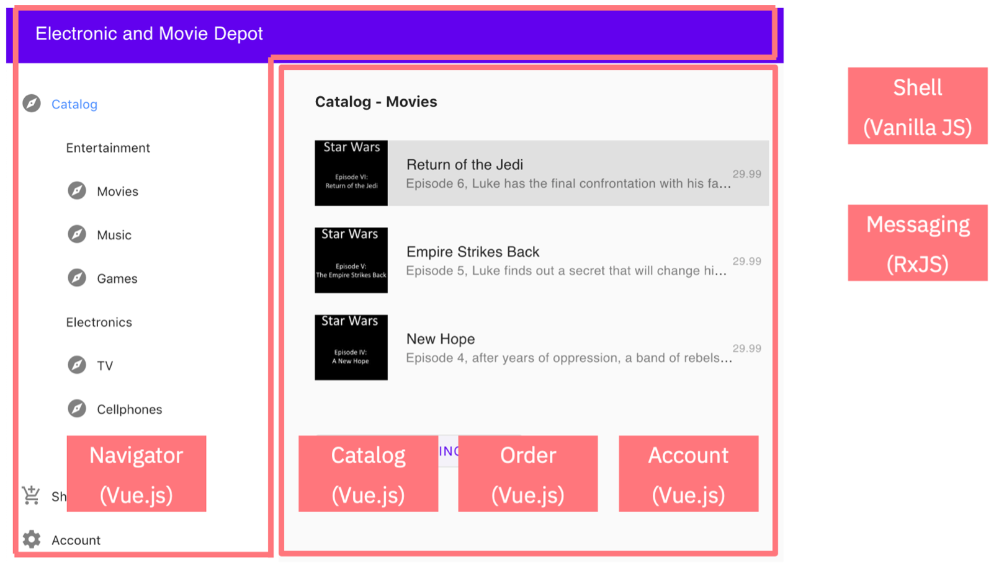
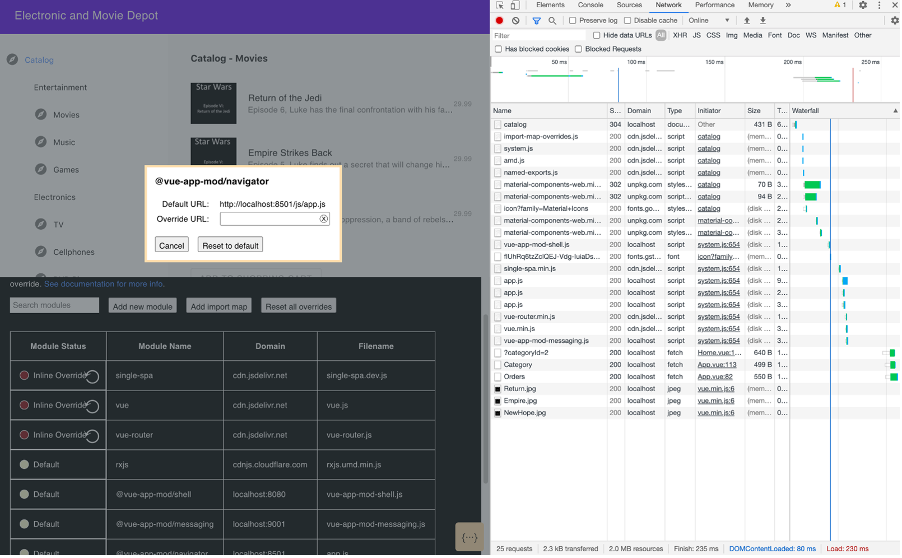

In this fifth step of our application modernization journey, we will develop micro-frontends by applying the concept of microservices for web applications.

One of the advantages of microservices-based architectures is that parts of applications can be updated independently from each other. However, in the process of modularizing applications, the frontends are often forgotten. While backend functionality is often split in multiple microservices, the user interfaces often remain as monoliths.  But, no more!

Martin Fowler defines <a href="https://martinfowler.com/articles/micro-frontends.html" target="_blank" rel="noopener noreferrer nofollow">_micro-frontends_</a> as "An architectural style where independently deliverable frontend applications are composed into a greater whole." You want to be able to update parts of the user interface without having to update the complete web application. In the optimal case, there are even separate CI/CD pipelines for the different parts of the user interface.

## Prerequisites

Make sure that you’ve reviewed the [sample example](/learningpaths/get-started-application-modernization/modernizing-apps-step-by-step/architecture-sample-app/) that we are using for the tutorials in this learning path.

Next, if you haven’t already done so, clone the repo to get the complete source code for the sample application:

```
$ git clone https://github.com/ibm/application-modernization-javaee-quarkus.git && cd application-modernization-javaee-quarkus
$ ROOT_FOLDER=$(pwd)
```

## Steps

1. Modularize the web application
2. Build the micro-frontends

    a. Build the shell
    b. Build the UI frontends
    c. Build the messaging

## Step 1.  Modularize the web application

The <a href="https://github.com/IBM/application-modernization-javaee-quarkus/tree/master/frontend-monolith" target="_blank" rel="noopener noreferrer">_sample e-commerce application_</a> that we’ve been working with in this learning path has different pages for browsing the shop, displaying the shopping cart and managing account information. And, its frontend was a monolith.

There is a navigator in the left column. Based on the selection in the navigator, different information is displayed in the main area of the window.

So, let’s say we want to add rating functionality. Rating functionality is only needed in the catalog of the e-commerce application. The other services, `shopping cart` and `account information`, are mostly separate from it.

To implement this new rating functionality, different parts of the classic 3-tiered application stack need to be changed:

* Database
* Business functionality / backend microservice
* User interface / micro-frontends

Here is how I’ve broken down the web application in six parts.



The navigator, the catalog, the order interface, and the account page are separate web applications. I’ve used Vue.js to implement the different parts, but you can use any other technology, such as vanilla JavaScript, Java based UI frameworks, React, Web Components, Angular, and so on. Be careful not to mix too many web frameworks, though, and try to standardize on the frameworks to use for the overall web app.

## Step 2. Develop the micro-frontends

The web framework I’ve used is <a href="https://single-spa.js.org/docs/getting-started-overview/" target="_blank" rel="noopener noreferrer">_single-spa_</a> (which stands for single single-page-application). The single-spa framework is a nice framework to use when building these modular web applications using a technique called micro-frontends. Essentially, it is a Javascript router for front-end microservices.

The single-spa framework federates the different user interface components on the client side. The shell component in my sample has been implemented with JavaScript. It defines the structure of the application. The messaging component has been implemented with JavaScript as well or to be more precise with <a href="https://github.com/ReactiveX/rxjs" target="_blank" rel="noopener noreferrer">_RxJS_</a>. This component is the counterpart to messaging services like Kafka in the backend. RxJS allows you to loosely couple  components through event driven architectures.

JavaScript has had the ability to build modules in the backend for a long time. Node.js developers use this capability on a daily basis. Recently, modern browsers have picked up the same capability for web applications. This modules-based approach allows developers to build “microservices” (micro-frontends) in the frontend by pulling together modules from potentially different sources in browsers.

As always, some browsers are faster than others to support new features. For browsers that don’t support JavaScript modules yet there are <a href="https://developer.mozilla.org/en-US/docs/Glossary/Polyfill" target="_blank" rel="noopener noreferrer">_polyfills_</a>, such as <a href="https://github.com/systemjs/systemjs" target="_blank" rel="noopener noreferrer">_SystemJS_</a>, which is used by single-spa.

Single-spa comes with a built-in development tool. By default, single-spa loads all components from the location defined in the main index.html file for the web app. With the tool, you can also overwrite these locations. You can load most parts of the application from object storage, file servers, or web servers. The modules of the application that developers are working on can be served locally via mechanisms like a webpack.

The following screenshot shows the single-spa development tool in the browser showing which locations of modules can be overwritten.



### Build the shell

The <a href="https://github.com/IBM/application-modernization-javaee-quarkus/tree/master/frontend-single-spa/shell/src" target="_blank" rel="noopener noreferrer">_shell_</a> for our web application consists mainly of an `index.html` file and a JavaScript file.

In the index.html file three essential things are done:

* Modules of the application are loaded
* Global dependencies are loaded
* Core layout of the application is defined

```
<html lang="en">

<head>
  <meta charset="UTF-8">
  <meta name="viewport" content="width=device-width, initial-scale=1.0">
  <meta http-equiv="X-UA-Compatible" content="ie=edge">
  <title>Electronic and Movie Depot</title>
  <meta name="importmap-type" content="systemjs-importmap" />
  <script type="systemjs-importmap">
    {
      "imports": {
        "single-spa": "https://cdn.jsdelivr.net/npm/single-spa@5.5.1/lib/system/single-spa.min.js",
        "vue": "https://cdn.jsdelivr.net/npm/vue@2.6.11/dist/vue.min.js",
        "vue-router": "https://cdn.jsdelivr.net/npm/vue-router@3.1.6/dist/vue-router.min.js",
        "rxjs": "http://cdnjs.cloudflare.com/ajax/libs/rxjs/6.6.3/rxjs.umd.min.js",
        "@vue-app-mod/shell": "http://localhost:8080/vue-app-mod-shell.js",        
        "@vue-app-mod/messaging": "http://localhost:9001/vue-app-mod-messaging.js",
        "@vue-app-mod/navigator": "http://localhost:8501/js/app.js",
        "@vue-app-mod/order": "http://localhost:8504/js/app.js",          
        "@vue-app-mod/catalog": "http://localhost:8503/js/app.js",
        "@vue-app-mod/account": "http://localhost:8502/js/app.js"                   
      }
    }
  </script>
  <script src="https://cdn.jsdelivr.net/npm/import-map-overrides/dist/import-map-overrides.js"></script>
  <script src="https://cdn.jsdelivr.net/npm/systemjs/dist/system.js"></script>
  <script src="https://cdn.jsdelivr.net/npm/systemjs/dist/extras/amd.js"></script>
  <script src="https://cdn.jsdelivr.net/npm/systemjs/dist/extras/named-exports.js"></script>
  <link href="https://unpkg.com/material-components-web@latest/dist/material-components-web.min.css" rel="stylesheet">
  <script src="https://unpkg.com/material-components-web@latest/dist/material-components-web.min.js"></script>
  <link rel="stylesheet" href="https://fonts.googleapis.com/icon?family=Material+Icons">
</head>

<body>
  <div style="display: flex;flex-direction: row;">
    <div id="navigator" style="order: 1;flex-grow: 2;max-width: 300px;width:300px"></div>
    <div id="catalog" style="order: 2; flex-grow: 10;left: 320px;position: fixed;"></div>
    <div id="order" style="order: 2; flex-grow: 10;left: 320px;position: fixed;"></div>
    <div id="account" style="order: 2; flex-grow: 10;left: 320px;position: fixed;"></div>
  </div>
  <script>
    System.import('@vue-app-mod/shell');
  </script>
</body>

</html>
```

Additionally, you need <a href="https://github.com/IBM/application-modernization-javaee-quarkus/blob/master/frontend-single-spa/shell/src/vue-app-mod-shell.js" target="_blank" rel="noopener noreferrer">_a JavaScript file_</a> to register the different user interface components of the application.

```
import { registerApplication, start } from "single-spa";

registerApplication({
  name: "@vue-app-mod/navigator",
  app: () => System.import("@vue-app-mod/navigator"),
  activeWhen: ["/"],
});

registerApplication({
  name: "@vue-app-mod/order",
  app: () => System.import("@vue-app-mod/order"),
  activeWhen: ["/", "/catalog", "/order"],
});

registerApplication({
  name: "@vue-app-mod/account",
  app: () => System.import("@vue-app-mod/account"),
  activeWhen: "/account",
});

registerApplication({
  name: "@vue-app-mod/catalog",
  app: () => System.import("@vue-app-mod/catalog"),
  activeWhen: ["/", "/catalog"],
});

start();
```

### Build the UIs

The micro-frontends can be implemented with all common web frameworks, vanilla JavaScript, or web components. I used the <a href="https://vuejs.org/" target="_blank" rel="noopener noreferrer">_Vue.js_</a> framework to implement the UI micro-frontends:

* Account UI
* Catalog UI
* Navigator UI
* Order UI

Here is an example of how the navigator micro-frontend has been built with Vue.js.

Here is the definition of the <a href="https://github.com/IBM/application-modernization-javaee-quarkus/blob/master/frontend-single-spa/navigator/src/set-public-path.js" target="_blank" rel="noopener noreferrer">_public path_</a> file:

```
import { setPublicPath } from "systemjs-webpack-interop";
setPublicPath("@vue-app-mod/navigator");

```

Here is the <a href="https://github.com/IBM/application-modernization-javaee-quarkus/blob/master/frontend-single-spa/navigator/src/main.js" target="_blank" rel="noopener noreferrer">_main.js_</a> file of the Vue.js navigator application:

```
import "./set-public-path";
import Vue from "vue";
import singleSpaVue from "single-spa-vue";

import App from "./App.vue";
import router from "./router";

Vue.config.productionTip = false;

import VueMaterial from 'vue-material'
import 'vue-material/dist/vue-material.min.css'
import 'vue-material/dist/theme/default.css'

Vue.use(VueMaterial)

const vueLifecycles = singleSpaVue({
  Vue,
  appOptions: {
    el: '#navigator',
    render(h) {
      return h(App, { props: { githubLink: this.githubLink } });
    },
    router,
  },
});

export const bootstrap = vueLifecycles.bootstrap;
export const mount = vueLifecycles.mount;
export const unmount = vueLifecycles.unmount;
```


You can explore how I implemented the other micro-frontends for the other modules of our web application in my <a href="https://github.com/IBM/application-modernization-javaee-quarkus/tree/master/frontend-single-spa" target="_blank" rel="noopener noreferrer">_GitHub repo_</a> for the sample application.

### Build the messaging

The messaging for the other micro-frontends is very different from the UI micro-frontends (for more details on this micro-frontend.  In fact, I could write another separate tutorial about just this.  However, for now, you can explore the details of how I implemented the messaging for the micro-frontends by reviewing the <a href="https://github.com/IBM/application-modernization-javaee-quarkus/blob/master/frontend-single-spa/messaging/src/messaging.js" target="_blank" rel="noopener noreferrer">_messaging.js_</a> file.


## Summary and next steps

In this tutorial, we took the next step in modernizing our sample application by developing micro-frontends for our sample application.