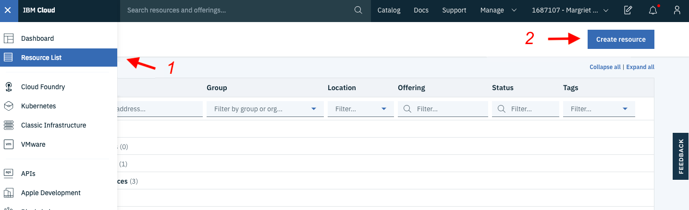

## Python の概要

Pythonは開発者やコンピュータサイエンスの学位を持つ人だけが使うものだと思うかもしれません。しかし、Pythonは無料で、オープンソースで、どんなプラットフォームでも動作するので、コーディングの経験が少ない初心者にも最適です。Pythonパッケージのドキュメントは素晴らしく、<a href="https://cognitiveclass.ai/learn/data-science-with-python" target="_blank" rel="noopener noreferrer">入門コース</a>を受講すれば、良い基礎を築くことができます。

Pythonは汎用性の高い高レベルのプログラミング言語で、データを扱う以外にも使用されます。例えば、デスクトップのGUIアプリケーションやWebサイト、Webアプリケーションの開発にも適しています。しかし、このチュートリアルでは、データに焦点を当て、データを使い始めるところまでしか説明しません。

## 非構造化データと構造化データ

データは、非構造化データと構造化データに大別されます。非構造化データとは、一貫したデータタイプを持たない情報を持つ、ほとんどが自由形式のデータを指します。医師の手書きのメモや、ブログで集めた映画のレビューなどは、非構造化データの一例です。一方、構造化データとは、読みやすいように整理された形式で提供されている情報のことです。構造化データの例としては、変数を列、レコードを行としたテーブルや、noSQLデータベースのキーと値のペアなどがあります。

## pandasの紹介

pandasは、高性能なデータ操作と分析を提供するオープンソースのPythonライブラリです。Pythonとpandasの組み合わせにより、データの起源に関わらず、データの処理や分析における典型的な5つのステップ、すなわち、ロード、準備、操作、モデル、分析を実現することができます。

pandasを使ってデータを扱う際には、多くの選択肢があります。以下のリストは、pandasを使ってできることの一部です。

* 欠損値の削除や置換によるデータのクリーニング
* データフォーマットの変換
* 行の並べ替え
* 行や列の削除や追加
* データフレームのマージまたは結合
* ピボットまたはリシェイピングによるデータのサマライズ
* ビジュアライゼーションの作成

このリストは完全ではありません。できることの詳細については、<a href="https://pandas.pydata.org/docs/" target="_blank" rel="noopener noreferrer">pandas documentation</a>をご覧ください。

このチュートリアルでは、ロンドンの行政区に関する情報を含む構造化データを使って、pandasの最も興味深い機能のいくつかを紹介します。チュートリアルで使用したデータは、<a href="https://data.gov.uk/dataset/248f5f04-23cf-4470-9216-0d0be9b877a8/london-borough-profiles-and-atlas" target="_blank" rel="noopener noreferrer">data.gov.uk</a>からダウンロードできます。

## Jupyter Notebooksを始めよう

テキストファイルにコードを書いて、ターミナルでPythonコマンドを使ってコードを実行する代わりに、データ分析のすべてを1つの場所で行うことができます。<a href="https://jupyter.org/" target="_blank" rel="noopener noreferrer">Jupyter Notebooks</a>を使えば、コード、出力、表、グラフのすべてを1つのウィンドウで編集し、任意のWebブラウザで見ることができます。その名の通り、アイデアやデータの探求を一箇所にまとめておくためのノートブックです。このチュートリアルでは、<a href="https://dataplatform.cloud.ibm.com/docs/content/wsj/getting-started/overview-ws.html?cm_sp=ibmdev-_-developer-tutorials-_-cloudreg" target="_blank" rel="noopener noreferrer">IBM Watson Studio</a>を使ってノートブックを実行します。そのためには、無料の IBM Cloud アカウントが必要です。以下のステップでは、サインアップして開始する方法を紹介します。ノートブックを起動したら、ノートブックを見てみましょう。

## 前提条件

このチュートリアルを完了するには、以下が必要です。

* <a href="https://cloud.ibm.com?cm_sp=ibmdev-_-developer-tutorials-_-cloudreg" target="_blank" rel="noopener noreferrer">IBM Cloud</a> が必要です。
* <a href="https://dataplatform.cloud.ibm.com/docs/content/wsj/getting-started/overview-ws.html?cm_sp=ibmdev-_-developer-tutorials-_-cloudreg" target="_blank" rel="noopener noreferrer">IBM Watson Studio</a> です。

## ステップ

### セットアップ

1. IBM Cloud にサインアップまたはログインします。

1. 「リソース」ページの上部にある「**Create Resource**」をクリックします。左上のハンバーガー・メニューの下にリソースが表示されます。

    

1. 「**Watson Studio**」を検索して、そのタイルをクリックします。

    

1. Lite プランを選択して、**Create** をクリックします。
1. リソースリストに戻り、Watson Studio サービスをクリックして、**Get Started**をクリックします。

    

    これで Watson Studio になっているはずです。

1. **Create a project** または **New project** のいずれかをクリックします。
1. **Create an empty project**（空のプロジェクトの作成）を選択します。
1. プロジェクトに名前を付けます。
1. 既存のObject Storageサービスインスタンスを選択するか、新しいインスタンスを作成します。これはノートブックとデータを保存するために使用されます。注：「プロジェクト」ページに戻るときは、「更新」を忘れずにクリックしてください。
1. **Create**をクリックします。

### ノートブックの読み込みと実行

1. **Add to project**をクリックし、次に**Notebook**をクリックして新しいノートブックを追加します。

    

1. [ノートブック](static/Working-with-structured-data-in-Python-using-Pandas.ipynb)をダウンロードします。
1. 新しいノートブックを選択する **From File**.
1. ダウンロードしたノートブックを選択する。
1. デフォルトのランタイムを選択する。
1. 「ノートブックの作成」をクリックします。ノートブックがロードされます。
1. ノートブックを実行します。開いているノートブックで、**実行**をクリックすると、セルが1つずつ実行されます。

## ノートブックの概要

以下のリストは、このチュートリアルで取り上げているpandas内の機能の一部です。

* データ探索（データ、Series、DataFramesの読み込み）
* データの変換（データのクリーニング、データの選択、データの結合、データのグループ化）
* データの視覚化

このチュートリアルに関連する[notebook](static/Working-with-structured-data-in-Python-using-Pandas.ipynb)には、pandasのより詳細な機能が表示されています。

### データ探索

#### データの読み込み

データのフォーマットが統一されていて、数字やテキスト、日付などの複数のレコードがある場合は、通常、pandasでデータを読み込むことができます。例えば、エクセルの表から保存したカンマ区切りのテキストファイルは、以下のコマンドでノートブックに読み込むことができます。