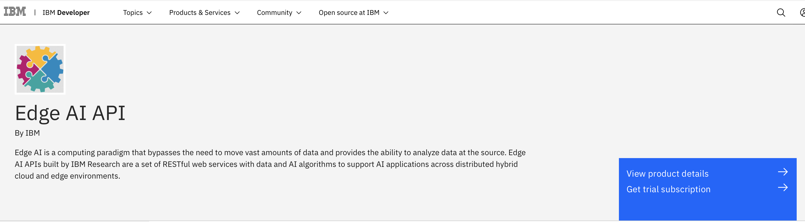
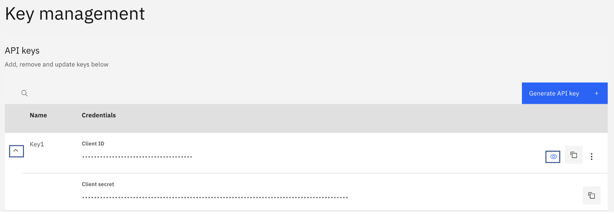

The Coreset API enables Edge AI by efficiently transferring data between the edge and the cloud or core. Its algorithms intelligently compress and extract data – at the edge of the network -- before transporting it to the cloud for AI processing.

In edge computing, there are many applications where data collected from edge locations needs to be transmitted to a central location for processing (for example, model training, model creation, or inferencing) so that knowledge obtained at the edges can be combined to produce a global view. Because the amount of data collected at the edges can be huge, you need data compression to efficiently deliver different types of data over networks due to transmission cost and latency.

The Coreset API is designed for this purpose and implements a set of compression algorithms with the primary focus on the creation of AI models when collecting training data from edge locations.

Let's look at an example of a machine learning engineer, Meera, who works at a large enterprise company that has hundreds of thousands of edge devices in the network, including mobile and robotic IoT devices. The edge device data is constantly being created and flowing through the network, from the edge to the core cloud centers. It's been hard for the company to efficiently analyze and use the edge data, much of it gets overwritten and is unanalyzed. Meera and her team are focused on video edge device data and are tasked with monitoring the data for security violations. Her company wants the insights to be as real-time as possible. Meera’s team has been asked to add AI processing to the edge devices to analyze the video for anomalies. To improve data latency times and reduce costs, Meera realizes that it would be more efficient if the edge device data could be compressed efficiently — without the loss of critical information — before being transmitted through the network. What she’s looking for is smart compression and data extraction. Ideally, because the AI models and the edge device data differ from edge to edge, she will have a rich set of algorithms to choose from so that she can match the right compression or extraction algorithm to the right data.

The Coreset API supports 17 different types of machine learning algorithms to compress and extract characteristics of the data to significantly reduce the size of the raw data set without loss of the fidelity of the data. This prepares the data for training at the cloud (or core). The Coreset API supports a variety of data types: audio, video, images, and text, and has implemented the following algorithms:

1.  Lossless compression, which removes redundant information from a data set to achieve compression. It has no change in model fidelity, but data reduction is not significant.

1. Feature extraction, which uses domain-specific feature extractors to significantly reduce the amount of data. It has high compression but no change in model fidelity.

1. Lossy compression, which extracts features from the frequency or temporal domain and then encodes them. Typical examples are standard compression algorithms such as MP3, JPEG, and MP4.

1. Advanced algorithms:

    * Principle component analysis, which computes the principal components and uses them to perform a change of basis on the data.
    * Clustering-based approach, which characterizes data with centroids and sample distributions.
    * Autoencoder, which is an artificial neural network that learns the distribution inherent in the data and recreates statistically similar data at the core location.
    * MFCC extraction from sound data, which can be used for audio analysis.

## Smart compression and data extraction with the Coreset API

In edge computing, the amount of data collected at the edges can be huge, so data compression is needed to reduce network transmission latency and cost.

The Coreset API implements a set of compression and extraction algorithms with the primary focus on the creation of AI models when collecting training data from edge locations.

This tutorial provides a step-by-step guide on using the Edge AI Coreset API to extract features from a specified data set using an autoencoder. It includes example code snippets to help you get started using the APIs and covers a few basic steps such as getting access to a trial subscription of Edge AI on the IBM API Hub platform.

The tutorial uses Python code snippets, but you can choose your own programming language to invoke the APIs. Reference code snippets are available for select languages (for example, cURL, the Java&trade; language, Node, PHP, Go, Swift, and Ruby) on the API documentation page. You can use this tutorial for the following Edge AI Coreset APIs:

* /jpeg_compress: Compress the specified image with the give quality factor.
* /jpeg_decompress: Decompress the specified JPEG image.
* /wav_to_mp3: Compress the specified .wav file to a .mp3 file at the given bit rate (for example, '128k', '192k', or '256k').
* /mp3_to_wav: Decompress the specified .mp3 file to a .wav file.
* /compress_nparray: Losslessly compress the specified `nparray` data using the default algorithm.
* /decompress_nparray: Decompress the specified `nparray` data using the default algorithm.
* /compress_nparray_zlib: Losslessly compress the specified `nparray` data using zlib.
* /decompress_nparray_zlib: Decompress the specified `nparray` data using zlib.
* /compress_nparray_bz2: Losslessly compress the specified `nparray` data using bz2.
* /decompress_nparray_bz2: Decompress the specified `nparray` data using bz2.
* /compress_obj: Losslessly compress the specified `object` data.
* /decompress_obj: Decompress the specified `object` data.
* /clustering_compress_dataset: Compress the specified data set using the clustering approach.
* /clustering_decompress_dataset: Decompress the specified data set using the clustering approach.
* /ae_extract_feature: Extract features from the specified data set using an autoencoder.
* /extract_mfcc: Extract labels and MFCC from the specified audio data set.
* /pca_analysis: Train a model with the training data set and then extract PCA components from the test data set using the model.

## Prerequisites

To complete this tutorial, you need:

* An IBM ID
* Python 3

## Estimated time

It should take you approximately 15 minutes to complete this tutorial.

## Steps

### Step 1. Environment setup

To set up your environment:

1. Navigate to the Edge AI API documentation page, and click **Get trial subscription**.

    

1. Log in on the registration page if you already have an IBM ID. Otherwise, [create a new IBM ID](https://www.ibm.com/account/reg/us-en/signup?formid=urx-19776&target=https%3A%2F%2Flogin.ibm.com%2F) for yourself.

1. After you log in, the system entitles you with a trial subscription and takes you to the My IBM page. Locate the Trial for Edge AI API tile, and click **Launch**.

1. On the My APIs page, click the **Edge AI** tile. When the page opens, locate the Key management section, expand the row to see both the Client ID and Client secret, and click the visibility (eye) icon to reveal the actual values. Make a note of these values because they are the API keys you use throughout this tutorial.

    

1. Create a config.json file with the API key values that you received.

1. Install a `requests` Python package using pip.

### Step 2. Invoke the Coreset autoencoder extract feature API

On the API documentation page, you see several API operations that you can invoke against your data set. In this example, we use the autoencoder extract feature. This API uses an autoencoder to extract features from a specified data set without any loss of information.

**<Add screenshot>**

### Step 3. Code snippet

The following example code takes MNIST data (a data set of 60,000 28x28 grayscale images of the 0-9 handwritten digits, along with a test set of 10,000 images) and uses the Edge AI autoencoder to extract features without any data loss. In the scenario with the machine learning engineer Meera, she might have a large image data set that would require this same feature extraction step. Here is how to do it.

When running this Python code, you might have to run these presteps at the command prompt, depending on your Python environment:

*  `pip install requests`
*  `pip install tensorflow`
*  `pip install keras`

```
import json
import pickle
from io import BytesIO
import requests
from keras.datasets import mnist


def ae_extract_feature():
    # get mnist data set and prepare for feature extraction
    (x_train_0, y_train_0), (x_test_0, y_test_0) = mnist.load_data()
    n_img, dim_x, dim_y = x_train_0.shape[0], x_train_0.shape[1], x_train_0.shape[2]
    train_x_0 = x_train_0.reshape(n_img, dim_x*dim_y) / 255
    n_img, dim_x, dim_y = x_test_0.shape[0], x_test_0.shape[1], x_test_0.shape[2]
    val_x_0 = x_test_0.reshape(n_img, dim_x*dim_y) / 255


    # serialize training data set
    memfile_train = BytesIO()
    pickle.dump(train_x_0, memfile_train, protocol=pickle.HIGHEST_PROTOCOL)
    memfile_train.seek(0)


    # serialize test data set
    memfile_test = BytesIO()
    pickle.dump(val_x_0, memfile_test, protocol=pickle.HIGHEST_PROTOCOL)
    memfile_test.seek(0)


    # set autoencoder configuration
    meta_data = {'input_dim': 784, 'output_dim': 16, 'num_layers': 7, 'epochs': 10}


    # set file
    file_data = {'file_train': memfile_train, 'file_test': memfile_test}

    # send request to server
    res = requests.post(url=' https://api.ibm.com/edgeai/run/coreset/structured/ae_extract_feature', data=meta_data, files=file_data, verify=False)


    # receive features
    if res.ok:
        features = res.content


        # deserialize features
        memfile = BytesIO(features)
        features = pickle.load(memfile)


        print('features:', features)
    else:
        error = json.load(BytesIO(res.content))
        print("error: ", error.get('message'))


if __name__ == "__main__":
requests.packages.urllib3.disable_warnings(requests.packages.urllib3.exceptions.InsecureRequestWarning)
ae_extract_feature()
```

### Step 4. Other operations in the API suite

Using Step 2 and Step 3, you can invoke the following Coreset APIs by referring to each endpoint's documentation (request URL and expected parameters) from the API documentation page.

* jpeg_compress
* jpeg_decompress
* wav_to_mp3
* mp3_to_wav
* compress_nparray
* decompress_nparray
* compress_nparray_zlib
* decompress_nparray_zlib
* compress_nparray_bz2
* decompress_nparray_bz2
* compress_obj
* decompress_obj
* clustering_compress_dataset
* clustering_decompress_dataset
* extract_mfcc
* pca_analysis

**Note**: The API documentation page also has a Try this API feature, which is a REST client UI. You can use this to invoke the APIs by reading the documentation in the same context.

## Summary

This tutorial explained how to secure API keys and easily invoke the Edge AI APIs hosted in IBM Cloud. The APIs in the suite help with invoking different algorithms work with your application needs. If you have any questions or queries, send them to EdgeAI.User@ibm.com.