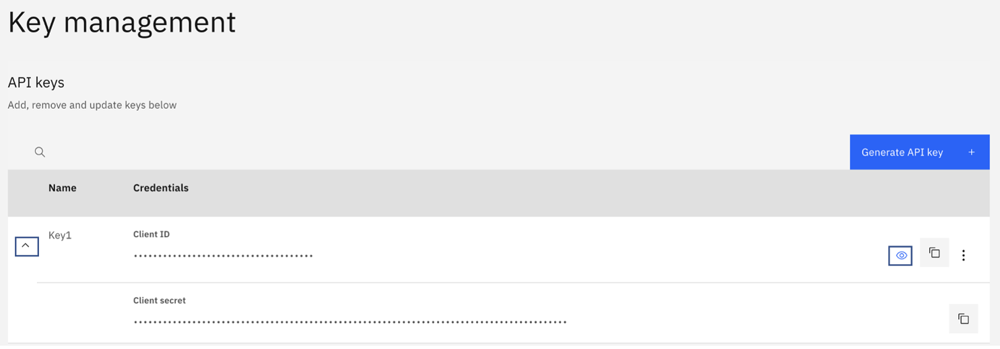

In complex edge environments, the edges might be geographically varied, and each edge might be collecting and training with disparate data based on its own environmental context as compared to other edges. Fusion of that disparate machine learning model edge data can help you train an aggregate model that benefits from and improves each of the individual edge models. However, there are some key challenges:

* Security and privacy. Data at individual edges might contain private data that should not be shared with others in its raw form.
* Collaboration without data sharing. Without sharing private, raw edge data, you would still like to enhance individual edge models by learning from other edge models.
* Scaling. In a multi-edge cloud architecture, you would like to scale model training beyond the core cloud center while keeping data secure.

In this tutorial, learn how you can use the Model Fusion API to allow AI machine learning models to learn from data distributed across multiple edges, such as:

* Aggregate model learning from edges without sharing raw data to better ensure data privacy
* Independent edge learning with model sharing
* Model ensembles from edges

The Model Fusion API is designed for this purpose and implements a set of federated DataOps algorithms to:

* Create aggregate fused machine learning edge models while maintaining data privacy
* Improve individual edge models, also while maintaining data privacy

The Model Fusion API uses federated learning, a method for distributed multi-agent training where each agent is an edge model. In each round, a random subset of agents is selected and performs model training and shares only the parameter (model weight) updates to ensure data privacy. Additionally, the model parameter aggregation is optimized so that aggregation only occurs when necessary. For example, if different agents have similar data, the amount of model parameter aggregation is reduced. Federated learning is a secure model training method for distributed edge AI. You can have shared learning without shared data.

We again use the example of Meera, the machine learning engineer who works at a large enterprise company that has hundreds of thousands of edge devices in the network, including mobile and robotic IoT devices. She and her team have deployed hundreds of machine learning models on the various edge devices in geographically varied locations. In analyzing some of the edge data, they are finding that some edge devices are performing better than others. They would like one set of similar edge devices to learn from the best machine learning model in their set.

In this tutorial, we provide a step-by-step guide on using the Edge AI Model Fusion API to aggregate two edge models, both convolutional neural networks (CNNs). Following is a complete Python notebook to help you get started using the API. This tutorial also covers a few basic steps such as getting access to a trial subscription of Edge AI on the IBM API Hub platform.

The tutorial uses a Python notebook, which you can run in your preferred integrated development environment (IDE).

## Prerequisites

To complete this tutorial, you need:

* An IBM ID
* Python 3
* Python notebook IDE

## Estimated time

It should take you approximately 30 minutes to complete this tutorial.

## Steps

### Step 1. Environment setup

To set up your environment:

1. Navigate to the Edge AI API documentation page, and click **Get trial subscription**.

    

1. Log in on the registration page if you already have an IBM ID. Otherwise, [create a new IBM ID](https://www.ibm.com/account/reg/us-en/signup?formid=urx-19776&target=https%3A%2F%2Flogin.ibm.com%2F) for yourself.

1. After you log in, the system entitles you with a trial subscription and takes you to the My IBM page. Locate the Trial for Edge AI API tile, and click **Launch**.

1. On the My APIs page, click the **Edge AI** tile. When the page opens, locate the Key management section, expand the row to see both the Client ID and Client secret, and click the visibility (eye) icon to reveal the actual values. Make a note of these values because they are the API keys you use throughout this tutorial.

    

1. Create a config.json file with the API key values that you received.

1. Install a `requests` Python package using pip.

## Step 2. Invoke the Model Fusion API

On the API documentation page, look for the Model Fusion API.

<Add screenshot>

### Step 3. Python Notebook example

This [example Python notebook](static/model-fusion) creates an aggregate fused model from two CNN edge models. You can use your preferred Python notebook IDE to work through the notebook.

#### Model Fusion

Model Fusion is a framework for federated learning in edge environments. Federated Learning is a distributed machine learning process in which each participant node (or party) retains its data locally and interacts with the other participants through a learning protocol. The main driver behind federated learning is a need to not share data with others, mainly driven by privacy and confidentiality concerns.

```
Import libraries for calling APIs and data serialization
import requests
import pickle
import json
import os
```

#### Model Fusion requirements

Federated learning requires that all parties use the same model architecture for model fusion. For this example, we define a Pytorch CNN for all parties to use.

```
import torch
from torch import nn

model = nn.Sequential(nn.Conv2d(1, 32, 3, 1),
                      nn.ReLU(),
                      nn.Conv2d(32, 64, 3, 1),
                      nn.ReLU(),
                      nn.MaxPool2d(2, 2),
                      nn.Dropout2d(p=0.25),
                      nn.Flatten(),
                      nn.Linear(9216, 128),
                      nn.ReLU(),
                      nn.Dropout2d(p=0.5),
                      nn.Linear(128, 10),
                      nn.LogSoftmax(dim=1))

fname = 'torch_mnist_cnn.pt'
torch.save(model, fname)
```

#### Prepare parameters for aggregator

The aggregator is in charge of running the fusion algorithm, which queries the registered parties to carry out the federated learning process. The queries sent vary according to the model or algorithm type. In return, parties send their reply as a model update object, and these model updates are then aggregated according to the fusion algorithm that is specified through a fusion handler class.

#### Configuration components

The following is a list of parameters to set the aggregator configuration:

* `fusion_algorithm`: The name of the fusion algorithm for the federation learning process. Options includes `'fedavg'`, `'iter_avg'`, and `'doc2vec'`.
* `fedavg`: The `fedavg` fusion algorithm is a well-known method to train a machine learning model in a federated learning fashion. The aggregator requests the updated local model's weights and the sample size from all parties at each round, and weighted averaging aggregation is performed over the collected model weights based on their sample sizes used for training. Then, the global model's weights are updated by the weighted average of all collected local models' weights.
* `iter_avg`: This iterative average fusion algorithm iteratively sends out queries to all registered parties every global training round for information and uses the collected information from the parties to update the global model. In particular, the aggregator requests the updated local model's weights from all parties at each round, then a simple averaging aggregation is performed over the collected model weights. The global model's weights are then updated by the mean of all collected local models' weights.
* `doc2vec`: `doc2vec` is an unsupervised algorithm to learn vector embeddings of text documents, similar to `word2vec`. The fusion method for `doc2vec` models is an adaptation of the federated averaging algorithm to a semantic vector embedding setting.
* `model_type`: The type of model used for fusion. Options include '`keras'`, `'pytorch'`, and `'doc2vec'`.
* `model_file`: The saved initial model to distribute to parties by the aggregator to train in isolation with each party’s private data set. The model_file is defined by the user.
* `num_parties`: The number of nodes participating in the fusion.
* `rounds`: The number of fusion rounds to complete.
* `epochs`: The number of epochs to train for each fusion round.
* `learning_rate`: The learning rate for the parties to use for training.
* `optimizer`: The name of the optimizer used for training (not applicable for `doc2vec`). This should be the name used by the Keras or PyTorch libraries (for example, optim.Adam for PyTorch)

```
fusion = 'fedavg'
model_type = 'pytorch'
model_file = 'torch_mnist_cnn.pt'
num_parties = 2
rounds = 5
epochs = 3
lr = 1
optimizer = 'optim.Adadelta'
```

#### Start the aggregator

With the aggregator configuration file defined, you can start the aggregator from the `edgeai_model_fusion` service. If successful, the service returns an ID for the parties to use to register with the aggregator.

```
url = 'https://<model_fusion_api_url>/start-aggregator' # insert the correct url

payload = {'fusion_algorithm': fusion, 'model_type': model_type, 'num_parties': num_parties, 'rounds': rounds, 'learning_rate': lr, 'epochs': epochs, 'optimizer': optimizer}

files = {'model_file': open(model_file, 'rb'), }

r = requests.post(url,  data=payload, files=files, verify=False)

r.text

agg_id = r.json()['aggregator_id']
```

#### Prepare local data for each party

Because each party retains its own data set to train a model in isolation, we obtain a subset of the MNIST data set for each party and split uniformly.

```
def print_statistics(i, x_test_pi, x_train_pi, nb_labels, y_train_pi):
    print('Party_', i)
    print('nb_x_train: ', np.shape(x_train_pi),
          'nb_x_test: ', np.shape(x_test_pi))
    for l in range(nb_labels):
        print('* Label ', l, ' samples: ', (y_train_pi == l).sum())

## import numpy as np
## from keras import utils
## from keras.datasets import mnist

img_rows, img_cols = 28, 28
nb_dp_per_party = [500,500]

(x_train, y_train), (x_test, y_test) = mnist.load_data()
x_train = x_train.astype('float32').reshape(x_train.shape[0], 1, img_rows, img_cols) / 255.
y_train = y_train.astype('int64')
x_test = x_test.astype('float32').reshape(x_test.shape[0], 1, img_rows, img_cols) / 255.
y_test = y_test.astype('int64')

labels, train_counts = np.unique(y_train, return_counts=True)
te_labels, test_counts = np.unique(y_test, return_counts=True)

if np.all(np.isin(labels, te_labels)):
    print("Warning: test set and train set contain different labels")

num_train = np.shape(y_train)[0]
num_test = np.shape(y_test)[0]
num_labels = np.shape(np.unique(y_test))[0]
nb_parties = len(nb_dp_per_party)


train_probs = {label: 1.0 / len(labels) for label in labels}
test_probs = {label: 1.0 / len(te_labels) for label in te_labels}

for idx, dp in enumerate(nb_dp_per_party):
    train_p = np.array([train_probs[y_train[idx]] for idx in range(num_train)])
    train_p /= np.sum(train_p)
    train_indices = np.random.choice(num_train, dp, p=train_p)
    test_p = np.array([test_probs[y_test[idx]] for idx in range(num_test)])
    test_p /= np.sum(test_p)

    # Split test evenly
    test_indices = np.random.choice(num_test, int(num_test / nb_parties), p=test_p)
    x_train_pi = x_train[train_indices]
    y_train_pi = y_train[train_indices]
    x_test_pi = x_test[test_indices]
    y_test_pi = y_test[test_indices]

    # Now put it all in an npz
    name_file = 'data_party' + str(idx) + '.npz'
    print(name_file)
    np.savez(name_file, x_train=x_train_pi, y_train=y_train_pi,
             x_test=x_test_pi, y_test=y_test_pi)

    print_statistics(idx, x_test_pi, x_train_pi, num_labels, y_train_pi)
```

#### Start party nodes

We start each party to join the federation. The following parameters are required to register with an aggregator.

* `aggregator_id`: The ID of the aggregator to connect to for fusion.
* `data`: The path to the data file to train with.
* `data_handler_class_name`: The name of the data handler to train with. Model fusion requires a data_handler to preprocess data. The APIs include handlers for popular data sets such as 'cifar10_keras' and 'mnist_keras' for Keras model types; 'mnist_pytorch' for PyTorch model types; and '20_newsgroup' and 'wikipedia' for `doc2vec`. If a custom `datahandler` is provided, the name of the class should be listed.
* `custom_data_handler` (optional): The path to the user-created data handler Python module for training. For information on how to create a customer data handler, see here. **NEED LINK***

If successful, the service notifies how many remaining parties are left to register with the service.

```
data_handler = 'mnist_pytorch'

url = 'https://<model_fusion_API_URL>/start-party' # add your API URL

payload = {'aggregator_id': agg_id, 'data_handler_class_name': data_handler}

files = {'data': open('data_party0.npz', 'rb'), }

r = requests.post(url,  data=payload, files=files, verify=False)

r.text

url = 'https://<model_fusion_API_URL>/start-party' # add your API URL

payload = {'aggregator_id': agg_id, 'data_handler_class_name': 'mnist_pytorch'}

files = {'data': open('data_party1.npz', 'rb'), }

r = requests.post(url,  data=payload, files=files, verify=False)

r.text
```

#### Initiate federated training (Model Fusion)

After both parties register successfully with the aggregator, the federated learning process can begin. We issue a `train` command to the `model_fusion` service to initiate the training.

The `aggregator_id` parameter is required to initiate the correct aggregator. Upon successful training, the service should return the model weights of the global model acquired through fusion.

```
url = 'https://<model_fusion_API_URL>/train' # insert your API URL
payload = {'aggregator_id': agg_id}
r = requests.post(url, json=payload, verify=False)

r

Get global model (parameters) from model training process that allow parties to reconstruct the global model
global_model = r.json()['global_model'] # can be saved and provided to pytorch model as weights

End Federation
url = 'https://<model_fusion_API_URL>/stop' # insert correct URL

payload = {'aggregator_id': agg_id}

r = requests.post(url,  json=payload, verify=False)

r.text
```

**Note**: The API documentation page also has a Try this API feature, which is a REST client UI. You can use this to invoke the APIs by reading the documentation in the same context.

## Summary

This tutorial explained how to secure API keys and easily invoke the Edge AI APIs hosted in IBM Cloud. The APIs in the suite help with invoking different algorithms to work with your application needs. If you have any questions or queries, send them to EdgeAI.User@ibm.com.