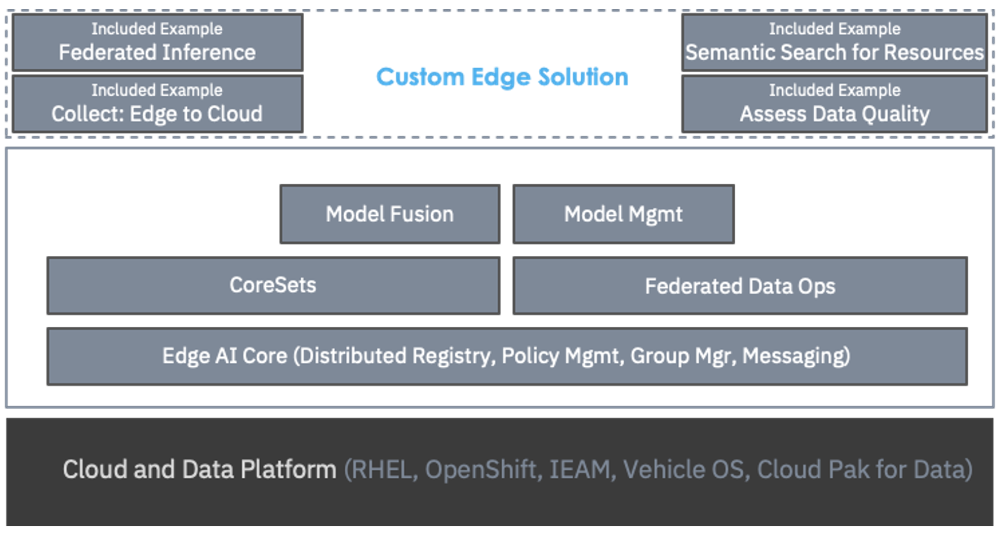
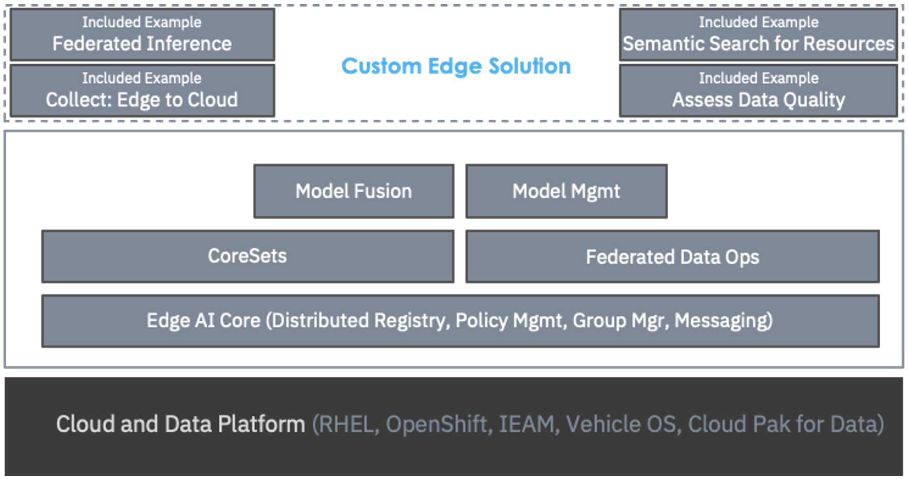

Edge AI APIは、エッジでのAIを実現するためにIBM Researchが提供する早期アクセス製品です。分散されたハイブリッド・クラウド環境でのAIアプリケーションをサポートするために、Edge AI APIをパッケージ化しています。これらのAPIは汎用的で、例えば、視覚、音響、センサー、ネットワークログ、時系列、自然言語など、多くのデータのモダリティをサポートします。これらのAPIを使用して、さまざまなAIベースのアプリケーションを作成することができます。次の図は、Edge AIのハイレベルアーキテクチャを示しています。

図の下から順に、エッジサイトには最低でもDockerのようなコンテナランタイムを搭載したLinux&reg;ベースのサーバーがあることが想定されています。Red Hat OpenShiftやIBM Cloud Pak for Dataのような追加のソフトウェアがあるかもしれませんが、必須ではありません。また、IBM Edge Application ManagerやRed Hat OpenShift Advanced Cluster Managementの機能を使って、これらのコンテナの展開や管理を自動化することも有効です。

その上にあるのが「Edge AI Core」です。エッジサイトとクラウドの連携を可能にするために、いくつかの必須サービスを備えています。「レジストリ」はリソースの発見と共有を可能にし、「ポリシー・マネージャー」はアプリケーションの動作を制御するポリシーの指定と実施を可能にします。グループマネージャーは、ダイナミックな環境でエッジデバイスが参加・離脱する際に、エッジとクラウド間で利用可能なすべてのサービスエンドポイントを追跡します。

次に、分散データ層の機能である「Coresets」と「Federated Data Ops」です。Coresetsは、生データをインテリジェントにサブサンプリングしたり、生データの圧縮されたセマンティック表現を計算して、エッジからのデータ収集を最適化するための一連のアルゴリズムです。Federated Data Opsは、データの品質を自動的に評価し、データの欠落やノイズなどの問題を特定し、そのようなデータを置き換えたり廃棄したりすることができます。

データレイヤーの上には、AI機能があります。Model Managementは、エッジサイトに最適なモデルの選択、エッジサイトに対するモデルの最適化、パフォーマンスの監視など、先に述べたセカンドパターンの質問にすべて対応します。「モデルフュージョン」は、3つ目のパターンである「すべてのトレーニングデータを1つの場所に集約できない」という状況下で、連携学習や連携推論を可能にすることに重点を置いています。

最後に、一番上にあるのは、特定のビジネス問題を解決するためにAPIを使用して作成されたEdge AIアプリケーションです。Edge AI APIがどのように機能するか、またAPIを使用してどのようにアプリケーションを作成できるかを説明するために、いくつかの例が作成されています。

企業の中には、業務の中に計測器がほとんどない場合があるため、自動化の機会を妨げてしまうことがあります。IBMは、Boston Dynamics社との最近のパートナーシップにおいて、Edge AIがどのように役立つかを示しました。

レガシーな機器を計測するためにセンサーを導入すると、コストがかさみます。しかし、Boston Dynamics社のロボット「SPOT」は、ローミング可能なエッジサーバーであり、センサープラットフォームでもあります。SPOTは、目視や音響検査を搭載することで、歩き回って異常を見たり聞いたりすることができ、必要に応じて機器と対話することができます。SPOTロボット上で動作するエッジAI APIは、資産の健全性に関する洞察と、よりタイムリーなアクションのための膨大な機会を解き放つことができます。

****ボストンダイナミックSPOTロボットのデモ映像

## Edge AI APIを使いこなす

Edge AI APIsは、分散したハイブリッドクラウド環境でのAIアプリケーションをサポートするための、データとAIアルゴリズムを備えたRESTful Webサービスのセットです。アルゴリズムは、これらの分散した異種環境で発生する多くの課題に対応しています。例えば、生データをネットワークで伝送する前に意味的にサブサンプリングしたり、データ品質の問題を評価して修復したり、最適なモデルを選択してエッジ用にモデルを最適化したり、展開後にモデルのパフォーマンスを監視したりします。これらのAPIは、汎用的に使用できるように設計されており、視覚、音響、センサー、ネットワークログ、時系列、自然言語データなど、多くのデータのモダリティをサポートしています。そのため、このAPIをベースに様々なAIアプリケーションを開発することができます。

## Edge AI APIs

Edge AI APIsは、複数のライブラリで構成されており、それぞれがエッジでのAI実現に向けた課題の一部に対応しています。Edge AI APIsは、AIパイプラインを作成して展開するための基本的な要件、例えばモデルトレーニングやモデルサービングなどには焦点を当てていません。そのためには、TensorFlowやPyTorchなどのお気に入りのオープンソースパッケージを使うことになるでしょう。そして、AIパイプラインを含むアプリケーションをコンテナ化し、これらのコンテナをエッジにデプロイすることができます。多くの場合、KubernetesやOpenShiftオペレーターなどのコンテナオーケストレーターを使って、デプロイプロセスを自動化することが有効です。

Edge AI APIは、クラウドとエッジのフレームワーク間でデータ管理やモデル管理を最適化する際に発生する、自明ではない課題の解決に役立ちます。具体的には、以下のようなシナリオを可能にします。

* エッジからデータを収集する際、下流のAIタスクに応じてデータをセマンティックに圧縮し、データの移動にかかるコストとリソースを最小化する

* エッジサイト間のスキーマの不一致など、品質問題を特定して修復する。

* モデルをトレーニングした後、エッジのリソース制約が満たされていることを確認するために、それぞれのユニークなエッジ環境に対してモデルを最適化し、エッジのデータ分布に適応させる

* モデルをデプロイした後、新しいエッジサンプルが異常値でないか、データ分布が変化していないかを確認する

* データがエッジサイトから離れられない場合は、ローカルエッジモデルをグローバルモデルに融合し、各エッジサイトに配置できるようにします。

* エッジサイトが論理グループを形成し、サイトグループ全体のリソースを発見し、グループ間で通信できるようにする。

* エッジデータのアクセスに関するポリシーを定義し、それをエッジで実施する

## ハイレベルアーキテクチャ

* エッジAIコアAPI

    * 分散型レジストリ。リソース（データセット、モデル、その他）の登録と検索
    * グループマネージャー。サービスエンドポイントの参加と離脱の状況を把握する
    * ポリシーマネージャ。ポリシーマネージャー：ポリシールールの作成と適用
    * メッセージング。メッセージング：エッジサイトとクラウド間のパブサブスタイルのメッセージング

* Coreset API。Coreset API：ネットワーク上でデータを転送する前に、データをインテリジェントにサブサンプリングするアルゴリズム

* Federated Data Ops API。データの品質を評価し、ラベルや欠損値を修復するアルゴリズム

* Model Fusion API。多くのサイトにデータが常駐している状態でモデルを学習するためのアルゴリズム

* モデル管理API。各サイトに最適なモデルを維持するためのアルゴリズム

## まとめ

本記事では、分散したハイブリッドクラウド環境でのAIアプリケーションをサポートするための、データとAIアルゴリズムを備えたRESTful Webサービス群である「Edge AI APIs」の概要を紹介しました。これらのアルゴリズムを使用することで、分散環境や異種環境で発生する多くの課題に対処することができます。