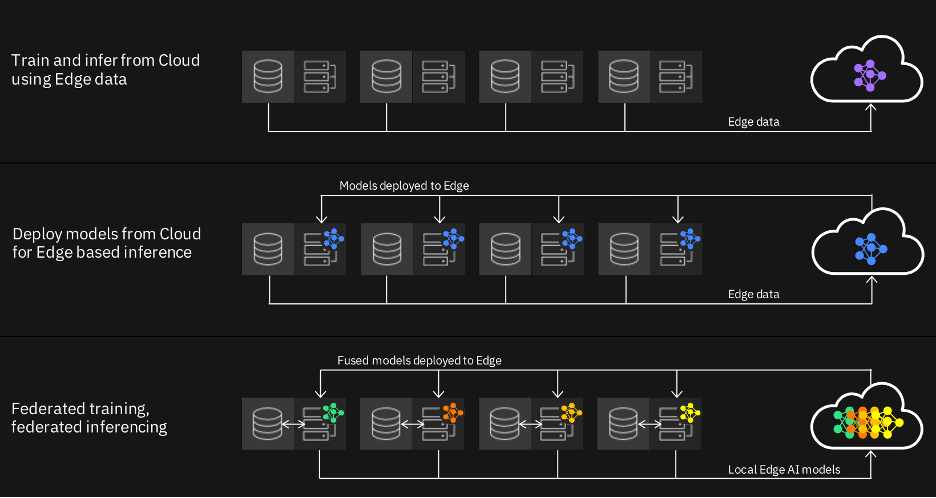

エッジAIは、膨大な量のデータを移動させる必要性を回避し、データをソースで分析する機能を提供するコンピューティングパラダイムです。ビジネスインサイトを提供するグローバル企業であるガートナー社は、2025年までに、<a href="https://www.gartner.com/smarterwithgartner/what-edge-computing-means-for-infrastructure-and-operations-leaders/" target="_blank" rel="noopener noreferrer">75%のデータが、従来のデータセンターやクラウドの外で作成され、処理されるようになると予測しています</a>。モバイル機器、IoT（Internet of Things）、生産現場からの機械データなど、人や機械が生み出すデータが爆発的に増加することで、どこでコンピューティングを行う必要があるのかを再考する必要があります。

企業や消費者による5G通信技術の導入が浸透するにつれ、データの規模と複雑さはネットワークインフラの能力を上回り、ますます複雑になっています。すべてのデータを集中データセンターやクラウドに送信すると、帯域幅や遅延、送信するための電力を調達する能力に課題が生じます。

エッジコンピューティングは、計算、ストレージ、ネットワーク、通信、電力、アプリケーションの各機能をデータソースの近くに設置することで、これらの課題の多くを解決します。さらに、プライバシー規制を管理・遵守するための機能により、データセキュリティを強化することができます。

IBMのお客様は、業務をデジタル化し、品質と業務効率を向上させるための旅を続けています。AIとデジタル化は
AIとデジタル化は、業務の合理化と自動化を支援し、場合によっては新しいビジネスを可能にしています。しかし、これらのデータを活用して次のレベルの自動化を推進することは、大きな課題です。AIはこの問題に対処するためのゲームチェンジャーとなり得ますが、いくつかの大きな問題があります。

1. 収集しなければならないデータが多すぎて、ネットワークに負担がかかり、レイテンシーの問題が発生する。
1. 資産が接続されておらず、監視されていないため、意味のあるインサイトを得るために利用できるデータが少なすぎる

このようなデータに関する課題に対処したとしても、様々な運用環境や自動化タスクにおいてAI能力を拡張することは、解決が難しい問題であることがわかります。その一例として、製品の安全上の問題や製造上の欠陥を特定するための目視検査があります。一般的に、クライアントは多くの製造現場を持ち、数百台のカメラで様々な工程を検査しています。これらの映像データを常にクラウドに送って分析するのはコストがかかります。また、これらのデータの多くは潜在的な機密情報であり、お客様はそのデータを社外に持ち出すことに自信がありません。

別の例としては、様々なセンサーやIoTデバイスが多用され、膨大な量のデータが非常に速く生成されるインダストリー4.0環境があり、そのデータにどのように追いついていくかということがあります。最後に、計測器の数が限られていたり、なかったりする現場も多く、それらをアップグレードするためのコストは膨大なものになります。

データの移動は、クラウドのコスト、感度、規制、レイテンシー、クラウドへの接続性など様々な理由から、多くの業界で共通の課題となっています。世界がますますデータ駆動型になっていく中で、これらの課題に対処することは非常に重要になります。

エッジAIは、データを移動させる必要性を回避し、ソースでデータを分析する機能により、これらの課題の多くを解決します。IBM Researchは、AIベースのアプリケーションをエッジで実現する際の課題を調査してきました。この場合の「エッジ」とは、単にデータのソースを意味します。多くのクライアントにとってエッジは、製造現場、小売店や倉庫、支店、病院など、業務を行う場所です。一般的に、クライアントは、コンピューティングが発生する現場に、限られたコンピュートリソースとストレージリソースを備えたサーバーラックやIoTハブをすでに持っています。

5G MEC（Mobile Edge Compute）などの別のトレンドは、企業ネットワークへの低遅延接続を備えたエッジにサーバーを持つという新しい機会を提供します。主なアイデアは、これらのエッジサーバーを使用して、エッジでローカルにデータを分析することです。

では、これまでに遭遇したよくあるユースケースのパターンを見てみましょう。

次の図に示すように、エッジAIの使用パターンの一番上から順に、企業はエッジからデータを収集し、エッジに比べて豊富な計算リソースを持つクラウドで分析したいと考えています。AIモデルを学習し、クラウドに展開して推論することができます。

この場合、IBMの研究は、データの効率的な収集を可能にするための技術に焦点を当てています。しかし、すべてのデータが価値あるものとは限りません。では、どのようにして収集すべきデータを決めるのでしょうか。データがどのような質問に答えてくれるかによって、生データを送信するのではなく、データをサブサンプリングしたり、前処理をして特徴を抽出したりすることができるかもしれません。

クラウドでAIモデルを学習し、それをエッジに展開するのが次のパターンで、中図のようになります。モデルはエッジサイトにローカルに配置されているため、推論や意思決定はすべてローカルで行うことができ、運用データを継続的にクラウドに送信する必要はありません。これは簡単に聞こえるかもしれませんが、多くの課題があります。各エッジは微妙に異なる環境であるかもしれません。例えば、製造している部品が違ったり、監視する機器が違ったりします。クラウドで学習した単一のモデルでは、すべてのエッジの現場でうまく機能しません。適切なAIモデルを各エッジサイトに展開するにはどうすればいいのか？また、エッジサイトのリソースに制約がある中で、モデルの性能を確保するにはどうすればよいのでしょうか。最後に、グランドトゥルースデータがない状態で、実際のモデルのパフォーマンスを自動的に監視するにはどうすればよいのでしょうか。IBMリサーチは、これらの問題に対処するために、いくつかのユニークなアルゴリズムを開発しました。

多くの場合、規制、プライバシー、その他の制約により、エッジサイトからのデータ収集は実行不可能です。そのため、すべてのトレーニングデータを一箇所に集めずにAIモデルをトレーニングする必要があります。そして、これらのモデルをエッジサイトに配置して推論を行うというのは、これまでのパターンと同じです。さらに、推論中にエッジサイト同士が必要に応じて連携し、一括して推論精度を向上させることも可能です。これは非常に興味深い研究分野であり、私たちはこれらのシナリオを実現するためのいくつかの技術を開発しました。

## まとめ

本記事では、膨大な量のデータを移動させる必要性を回避し、データをソースで分析する能力を提供するコンピューティングパラダイムである、エッジAIの概要を説明しました。エッジコンピューティングは、計算、ストレージ、ネットワーク、通信、電力、アプリケーションの各機能をデータソースに近づけて行動することで、多くの課題を解決します。さらに、プライバシー規制を管理・遵守する機能により、企業はデータセキュリティを強化することができます。