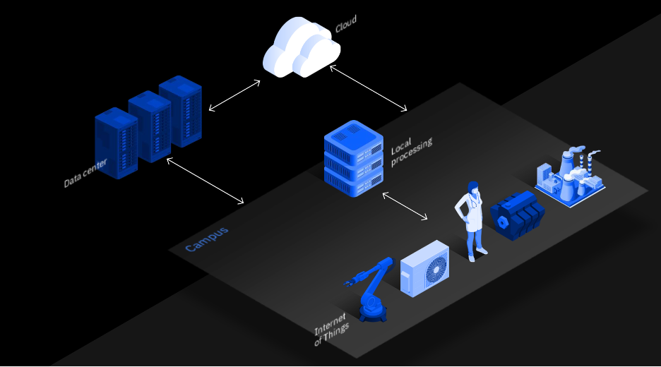

Edge AI is a computing paradigm that bypasses the need to move vast amounts of data and provides the ability to analyze data at the source. Gartner, a global provider of business insights, estimates that by 2025, <a href="https://www.gartner.com/smarterwithgartner/what-edge-computing-means-for-infrastructure-and-operations-leaders/" target="_blank" rel="noopener noreferrer">75 percent of data will be created and processed outside the traditional data center or cloud</a>. This explosion of data being generated by people and machines from mobile devices, IoTs (Internet of Things), and machine data from production floors makes us rethink where computing needs to be performed.

As adoption of 5G telecommunication technology by enterprises and consumers becomes pervasive, the scale and complexity of data outpace the network infrastructure capabilities and are becoming increasingly complex. Sending all of the data to the centralized data center or cloud can cause challenges with bandwidth, latency, and the ability to source power to transmit.

Edge computing solves many of these challenges by bringing computation, storage, network, communication, power, and application functions closer to data sources at the point of action. Additionally, it enables businesses to tighten data security with capabilities to control and comply with privacy regulations.

IBM clients have been on a journey to digitize their operations and drive quality and operational efficiencies. AI and Digitization is
helping them streamline and automate their operations and, in some cases, enable new businesses. They have a lot of operational data across their locations, but tapping into this data to drive the next level of automation is a huge challenge. AI can be a game changer in addressing this, but there are a few major problems:

1. Too much data that needs to be collected, which overburdens networks and generates latency issues
1. Too little data available to drive meaningful insights because the assets are not connected and monitored

Even after addressing these data challenges, you can find that scaling AI capabilities across a variety of operational environment and automation tasks is a difficult problem to solve. One example of this is visual inspections to identify safety issues or manufacturing defects in products. Typically, clients have many manufacturing sites with hundreds of cameras inspecting various stages of the process. Constantly piping all of that video data to the cloud for analytics increases costs. Also, much of this data is potentially sensitive, and clients are not confident about allowing it to leave their premises.

Another example is an Industry 4.0 environment that is heavily instrumented with a variety of sensors and IoT devices, generating a vast amount of data very quickly, and how to keep up with that data. Finally, there are many sites with limited or no instrumentation, and the cost of upgrading them is prohibitive.

Moving data around is a common challenge across many industries due to various reasons including cloud costs, sensitivity, regulation, latency, and connectivity to the cloud. As the world becomes increasingly data-driven, these challenges become critical to address.

Edge AI solves many of these challenges with the ability to analyze data at the source, bypassing the need to move the data. IBM Research has been investigating the challenges that are associated with enabling AI-based applications at the edge. In this case, "edge" simply means the source of the data. For many clients, edge is where they perform their operations, whether in manufacturing sites, retail stores and warehouses, branch offices, or hospitals. Typically, clients already have a server rack or an IoT hub with limited compute and storage resources at the sites where computing occurs.

Another trend such as 5G MEC (Mobile Edge Compute) offers a new opportunity to have a server at the edge with low-latency connectivity to the enterprise networks. The main idea is to use these edge servers to analyze the data locally at the edge.

Now, let's look at some common use case patterns we have come across.

Starting at the top of the Edge AI usage patterns, as shown in the following figure, companies want to collect the data from the edge and analyze it in the cloud with abundant compute resources as compared to the edge. AI models can be trained and deployed in the cloud for inference.

In this case, IBM research focuses on technologies for enabling efficient collection of data. However, not all data is valuable. Therefore, how do we decide what data to collect? Depending on what question the data is helping to answer, we might be able to sub-sample the data or preprocess it to extract features instead of transmitting the raw data.

Training the AI models in the cloud and deploying them at the edge is the next pattern, as shown in the middle. As the models are locally deployed at edge sites, all inferencing and decision making can take place locally, bypassing the need to continually send operational data to the cloud. This might sound simple, but there are numerous challenges. Each edge might be a slightly different environment. For example, they manufacture different parts and have different equipment to monitor. A single cloud-trained model does not perform well across all edge sites. How do we ensure that the right AI models are deployed to each edge site? How do we ensure that the models perform well despite of the resource constraints at the edge? Finally, how do we automatically monitor actual model performance without ground truth data? IBM Research has developed some unique algorithms to address these issues.

In many cases, data collection from edge sites is not feasible due to regulatory, privacy, or other constraints. Therefore, we must train AI models without having all of the training data in one place. These models then get deployed at the edge sites for inference, just like the previous pattern. Further, the edge sites can collaborate with each other as needed during inferencing to improve inference accuracy collectively. This is a very interesting area of research, and we have developed some techniques to achieve these scenarios.

## Summary

This article provided an overview of Edge AI, a computing paradigm that bypasses the need to move vast amounts of data and provides the ability to analyze data at the source. Edge computing solves many challenges by bringing computation, storage, network, communication, power, and application functions closer to data sources at the point of action. Additionally, it enables businesses to tighten data security with capabilities to control and comply with privacy regulations.