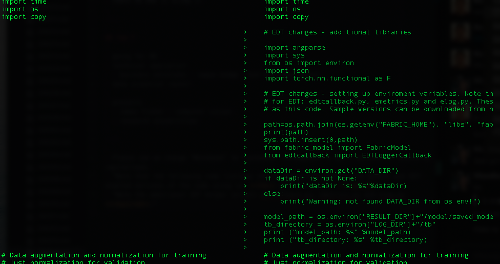
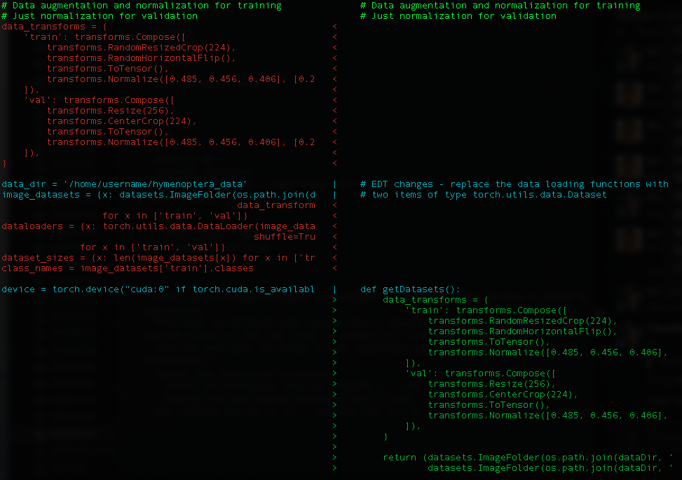
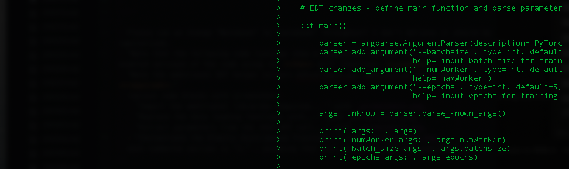

Watson Machine Learning Accelerator Elastic Distributed Training（EDT）は、データサイエンティストのトレーニングワークロードの分散を簡素化します。モデルの分散はエンドユーザーにとって透過的であり、分散のトポロジーを特に知る必要はありません。使い方は簡単で、トレーニングジョブの最大GPU数を定義すると、Watson Machine Learning Acceleratorが既存のクラスタリソース上でジョブを同時にスケジューリングします。複数のジョブに対するGPUの割り当ては、実行中のジョブを中断することなく、フェアシェアまたはプライオリティのスケジューリングに基づいて動的に増減することができます。

EDTは、複数のデータサイエンティストがダイナミックにGPUを共有することで、生産性を向上させると同時に、全体のGPU利用率を高めることができます。

## 例

以下の例を参考にしてください。

* Watson Machine Learning Accelerator オンプレミス版
* IBM Cloud Pak for Data の Watson Machine Learning Accelerator

### 例Watson Machine Learning Acceleratorをオンプレミスで利用する場合

この例では、<a href="https://github.com/IBM/wmla-assets/blob/master/dli-learning-path/tutorials-cpd-wmla/WMLA123-elastic-distributed-training-via-WMLA-api.ipynb" target="_blank" rel="noopener noreferrer">Watson Machine Learning Accelerator 1.2.3 Jupyter Notebook</a>または<a href="https://github.com/IBM/wmla-assets/blob/master/WMLA-learning-journey/elastic-distributed-training-module/elastic_distributed_training_demonstration.ipynb" target="_blank" rel="noopener noreferrer">Watson Machine Learning Accelerator 1.2.2 Jupyter Notebook</a>では、コミュニティから PyTorch モデルを受け取り、Elastic Distributed Training を使用してトレーニングを分散するために必要なコード変更を行うプロセスを説明しています。この例とノートブックは以下をカバーしています。

* Elastic Distributed TrainingによるPyTorchモデルのトレーニング
* 実行中のジョブの状態を監視し、問題があればデバッグする方法を紹介します。

### 手順

この記事の詳細な手順は、関連する <a href="https://github.com/IBM/wmla-assets/blob/master/WMLA-learning-journey/elastic-distributed-training-module/elastic_distributed_training_demonstration.ipynb" target="_blank" rel="noopener noreferrer">Jupyter Notebook</a> に記載されています。  このノートブックでは、以下のことができます。

* コードに変更を加える
* データセットを利用可能にする
* APIエンドポイントを設定し、ログオンする
* APIを通じてジョブを投入する
* 実行中のジョブの監視
* 出力と保存されたモデルの取得
* 問題のデバッグ

### お客様のコードの変更

なお、以下の画像は、`diff`コマンドを使って、_before_と_EDT-enabled_のコードを比較したものです。

1. Elastic Distributed Trainingに必要な追加のライブラリをインポートし、環境変数を設定します。EDTヘルパースクリプトの `edtcallback.py`, `emetrics.py`, `elog.py` が必要です。これらは、変更したコードと同じディレクトリにコピーする必要があります。サンプルバージョンは、<a href="https://github.com/IBM/wmla-assets/blob/master/WMLA-learning-journey/elastic-distributed-training-module/pytorch-mnist-edt-model.zip" target="_blank" rel="noopener noreferrer">tutorial repo</a>のtarballに含まれています。また、http://ibm.biz/WMLA-samples からダウンロードすることもできます。

    

1. データロード関数を、`torch.utils.data.Dataset` 型の 2 つのアイテムを含むタプルを返す EDT 互換の関数で置き換えます。

    

1. トレーニングループとテストループを EDT 相当の関数で置き換えます。これには、`main`関数の作成が必要です。APIコールでパラメータを指定して、そのパラメータをモデルに渡すことも可能です。

   

1. Elastic Distributed Trainingインスタンスをインスタンス化し、特定のパラメータを指定してEDTジョブを起動します。

    * エポック
    * エフェクティブ・バッチ・サイズ
    * EDTトレーニングジョブあたりのGPUの最大数
    * チェックポイント作成頻度（エポック数

    

## 例データ用クラウドパックのWatson Machine Learning Accelerator

この例を Cloud Pak for Data で試すには、<a href="https://github.com/IBM/wmla-assets/blob/master/dli-learning-path/tutorials-cpd-wmla/CPD35x-elastic-distributed-training-via-WMLA-api.ipynb" target="_blank" rel="noopener noreferrer">Watson Machine Learning Accelerator 2.2 Jupyter Notebook</a>を使用します。

## 結論

本記事では、Watson Machine Learning Accelerator の Elastic Distributed Training 機能の概要について説明しました。