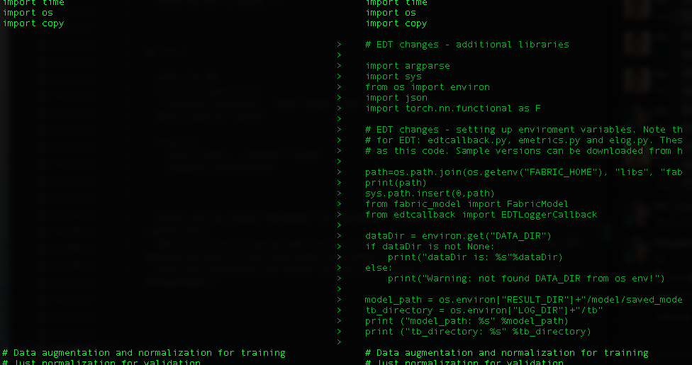
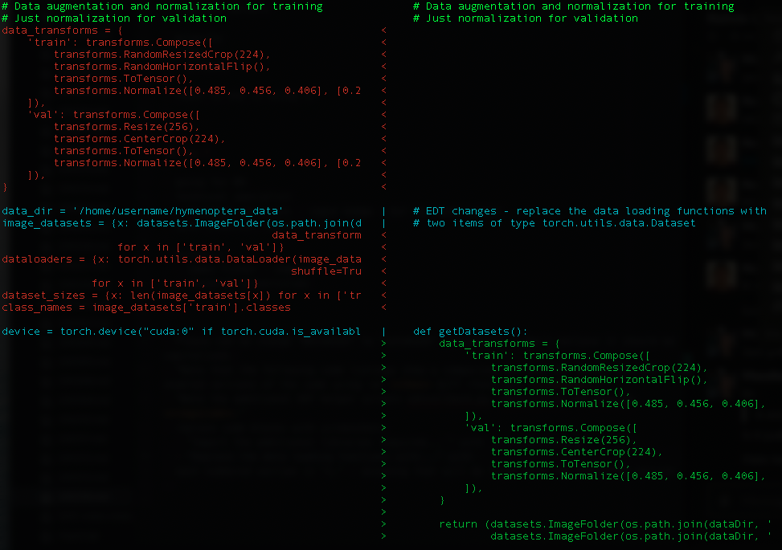
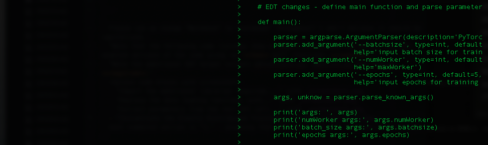
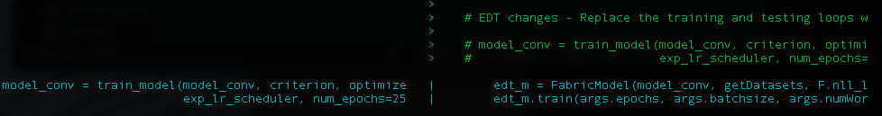

Watson Machine Learning Accelerator Elastic Distributed Training (EDT) simplifies the distribution of training workloads for the data scientist. The model distribution is transparent to the end user, with no need to specifically know the topology of the distribution. The usage is simple, define a maximum GPU count for training jobs, and Watson Machine Learning Accelerator schedules the jobs simultaneously on the existing cluster resources. GPU allocation for multiple jobs can grow and shrink dynamically based on fair share or priority scheduling and without interrupting running jobs.

EDT enables multiple data scientists to share GPUs in a dynamic fashion, increasing productivity while also increasing overall GPU utilization.

## Examples

Depending on your installation, refer to one of the following examples:

* Watson Machine Learning Accelerator on-premises
* Watson Machine Learning Accelerator in IBM Cloud Pak for Data

### Example: Watson Machine Learning Accelerator on-premises

In this example, we use a <a href="https://github.com/IBM/wmla-assets/blob/master/dli-learning-path/tutorials-cpd-wmla/WMLA123-elastic-distributed-training-via-WMLA-api.ipynb" target="_blank" rel="noopener noreferrer">Watson Machine Learning Accelerator 1.2.3 Jupyter Notebook</a> or <a href="https://github.com/IBM/wmla-assets/blob/master/WMLA-learning-journey/elastic-distributed-training-module/elastic_distributed_training_demonstration.ipynb" target="_blank" rel="noopener noreferrer">Watson Machine Learning Accelerator 1.2.2 Jupyter Notebook</a> to walk through the process of taking a PyTorch model from the community and making the required code changes to distribute the training using Elastic Distributed Training. This example and notebook cover:

* Training the PyTorch Model with Elastic Distributed Training
* Monitoring the running job status and showing how to debug any issues

### Instructions

The detailed steps for this article can be found in the associated <a href="https://github.com/IBM/wmla-assets/blob/master/WMLA-learning-journey/elastic-distributed-training-module/elastic_distributed_training_demonstration.ipynb" target="_blank" rel="noopener noreferrer">Jupyter Notebook</a>.  Within this notebook, you'll:

* Make changes to your code
* Make your data set available
* Set up an API end point and log on
* Submit a job through an API
* Monitor a running job
* Retrieve output and saved models
* Debug any issues

### Changes to your code

Note that the following images show a comparison between the _before_ and _EDT-enabled_ versions of the code using the `diff` command.

1. Import the additional libraries required for Elastic Distributed Training and set up the environment variables. Note that the additional EDT helper scripts `edtcallback.py`, `emetrics.py` and `elog.py` are required. These must be copied to the same directory as your modified code. Sample versions can be found in the tarball in the <a href="https://github.com/IBM/wmla-assets/blob/master/WMLA-learning-journey/elastic-distributed-training-module/pytorch-mnist-edt-model.zip" target="_blank" rel="noopener noreferrer">tutorial repo</a>. Additionally, they can be downloaded from http://ibm.biz/WMLA-samples.

    

1. Replace the data loading functions with EDT-compatible functions that return a tuple containing two items of type `torch.utils.data.Dataset`.

    

1. Replace the training and testing loops with the EDT-equivalent function. This requires the creation of a `main` function. You could also potentially specify parameters in the API call and pass these parameters into the model.

   

1. Instantiate the Elastic Distributed Training instance and launch the EDT job with specific parameters.

    * epoch
    * effective_batch_size
    * max number of GPUs per EDT training job
    * checkpoint creation frequency in number of epochs

    

## Example: Watson Machine Learning Accelerator in Cloud Pak for Data

To try this example in Cloud Pak for Data, use the <a href="https://github.com/IBM/wmla-assets/blob/master/dli-learning-path/tutorials-cpd-wmla/CPD35x-elastic-distributed-training-via-WMLA-api.ipynb" target="_blank" rel="noopener noreferrer">Watson Machine Learning Accelerator 2.2 Jupyter Notebook</a>.

## Conclusion

This article provided an overview of the Elastic Distributed Training feature of Watson Machine Learning Accelerator.