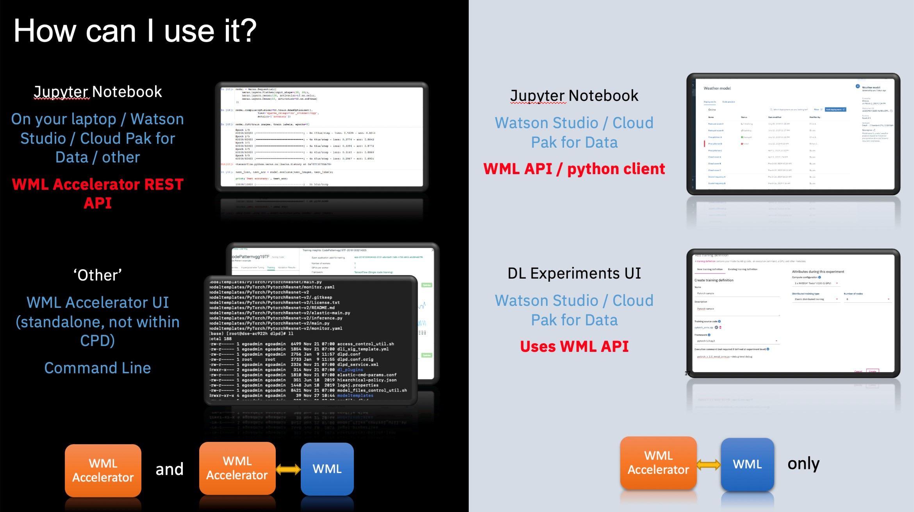

IBM Cloud Pak for DataのIBM Watson StudioとIBM Watson Machine Learningは、IBM Watson Machine Learning Acceleratorと組み合わせることで、モデルのトレーニングプロセスを加速させるエンタープライズAIプラットフォームを形成します。このプラットフォームは、価値を高めるためのより高いスピードと精度を提供し、モデルを市場に投入するまでの時間を短縮します。Watson Machine Learning AcceleratorによるモデルトレーニングはGPUで加速され、自動的にスケールアップできるため、必要に応じてより多くのGPUを割り当てることができます。データサイエンティストは、当社のエンタープライズAIプラットフォームを使用することで、より早く結果を得て、必要な精度レベルに到達することができます。テクノロジーは以下のように連携して動作します。

* IBM Cloud Pak for DataのIBM Watson StudioとWatson Machine Learningは、モデルの構築、トレーニング、デプロイに必要なツールを提供します。
* Watson Machine Learning Accelerator は、ハイパーパラメータの検索を並行して自動化することで、トレーニングの速度を最適化します。
* Watson Machine Learning Accelerator には、弾性分散トレーニングエンジンが含まれており、モデルのトレーニングを複数の GPU やコンピュートノードに分散させるのに役立ちます。トレーニングジョブの分散は、GPUが動的に割り当てられ、GPUの追加や削除によって実行中のジョブが中断されることのない、弾力的なものです。スケジューラが動的にGPUを割り当てるため、モデルにGPUトポロジーを組み込む必要はありません。その代わり、エラスティック分散型トレーニングは、スタンドアロンシステム上で構築されたモデルの分散を処理し、データサイエンティストにその分散を明らかにします。

この記事では、以下の方法を学びます。

* IBM Cloud Pak for Data の IBM Watson Studio と IBM Watson Machine Learning Accelerator との間のリンクを構成して有効にする。
* IBM Watson Studio から IBM Watson Machine Learning Accelerator に深層学習ワークロードを送信するためのメソッドを使用する。これには、Watson Machine Learning Accelerator Rest API を通じてモデルのハイパーパラメーター検索を自動化すること、Watson Studio の Experiment Builder UI を通じて elastic distributed training engine でトレーニングを弾力的に分散させること、Watson Machine Learning API を使用して Watson Machine Learning Python クライアントを通じてモデルをトレーニングしてデプロイすることが含まれる。

## インストールと設定

IBM Watson Studio と IBM Watson Machine Learning Accelerator をインストールして構成するには、以下のオプションを検討します。

Cloud Pak for Data では、Watson Machine Learning Accelerator と Watson Machine Learning の両方をインストールして、AI の完全なライフサイクルを実現します。<a href="https://www.ibm.com/docs/en/SSQNUZ_4.0/svc-wml/wml-install.html" target="_blank" rel="noopener noreferrer">Watson Machine Learning のインストール</a>と<a href="https://www.ibm.com/docs/en/SSQNUZ_4.0/svc-wmla/wmla-install-overview.html" target="_blank" rel="noopener noreferrer">Watson Machine Learning Accelerator のインストール</a>を参照してください。これらの 2 つのサービスを必ず接続してください。<a href="https://www.ibm.com/docs/en/SSQNUZ_4.0/svc-wmla/wmla-connect-wml.html" target="_blank" rel="noopener noreferrer">Watson Machine Learning Accelerator の接続</a>を参照してください。

あるいは、Watson Machine Learning Accelerator を使用したオンプレミスのソリューションの場合は、Watson Machine Learning Accelerator 環境を IBM Cloud Pak for Data 上の IBM Watson Studio に接続する方法をご覧ください。インストールと構成の詳細については、<a href="https://www.ibm.com/docs/en/SSFHA8_1.2.3/wmla_wsl_wml_install.html" target="_blank" rel="noopener noreferrer">Watson Machine Learning または Watson Studio でのインストール</a>を参照してください。

*図1.セットアップとコンフィグレーション*の様子

## 使用方法

Watson Machine Learning Accelerator クラスターの設定方法に応じて、深層学習のワークロード投入時に Watson Machine Learning Accelerator を活用する方法は複数あります。Watson Studio や Watson Machine Learning とリンクさせずに、単に Watson Machine Learning Accelerator クラスターをお持ちの場合は、Watson Machine Learning Accelerator API に直接アクセスできます。しかし、Watson Machine Learning Accelerator クラスターが IBM Cloud Pak for Data の Watson Studio と Watson Machine Learning にリンクされている場合は、追加の深層学習ワークロードのサブミッション方法が利用できます。

*図2.ベストプラクティス*のご紹介

これらの方法の主な違いは、Watson Machine Learning Accelerator への基本的なアクセス方法です。それは、Watson Machine Learning Accelerator API を直接利用する場合と、Watson Machine Learning API を介して利用する場合があります。

## Watson Machine Learning Accelerator API

Watson Machine Learning Accelerator REST API を直接使用する場合、Watson Machine Learning Accelerator Rest API で確立されたネットワーク接続を使用して Watson Machine Learning Accelerator クラスタにアクセスすることで、Jupyter Notebook を起動することができます。この Jupyter Notebook は、ラップトップ上のローカルなものや、Cloud Pak for Data の Watson Studio として広く設定されたものの一部など、どのようなプラットフォームにも対応しています。

Watson Machine Learning Accelerator Rest API を介したモデルのハイパーパラメータ検索の自動化を実演している <a href="https://github.com/IBM/wmla-assets/blob/master/dli-learning-path/tutorials-cpd-wmla/CPD3.5.0-model-hyperparameter-optimization-via-wmla-api.ipynb" target="_blank" rel="noopener noreferrer">Cloud Pak for Data 3.5.0 notebook</a> または <a href="https://github.com/IBM/wmla-assets/blob/master/dli-learning-path/tutorials-cpd-wmla/05-wmla-api-submitting-hyperparameter-optimization.ipynb" target="_blank" rel="noopener noreferrer">Cloud Pak for Data 3.0.1 notebook</a> をお試しください。

Watson Machine Learning Accelerator Rest API の詳細については、IBM Knowledge Center でご覧いただけます。

* <a href="https://www.ibm.com/docs/en/SSFHA8_2.3.0/cm/deeplearning.html" target="_blank" rel="noopener noreferrer">Watson Machine Learning Accelerator 2.3 における REST 深層学習のための REST API </a>。
* <a href="https://www.ibm.com/docs/en/SSFHA8_1.2.3/cm/deeplearning.html" target="_blank" rel="noopener noreferrer">REST深層学習用REST APIs V1</a
* <a href="https://www.ibm.com/docs/en/SSZU2E_2.5.0/reference_s/api_references.html" target="_blank" rel="noopener noreferrer">RESTful API リファレンス</a>

## Watson Machine Learning API

次の 2 つのメソッドは、IBM Cloud Pak for Data と Watson Machine Learning Accelerator が接続されている場合にのみ利用できます。これらのメソッドはいずれも、Watson ML Python クライアントまたは Watson Studio の Experiments Builder を使用して、Watson Machine Learning API を間接的に使用します。

Watson Machine Learning Accelerator Rest API を介したモデルのハイパーパラメーター検索の自動化を実演している <a href="https://github.com/IBM/wmla-assets/blob/master/dli-learning-path/tutorials-cpd-wmla/CPD3.5.0-model-train-in-wmla-via-wml-api.ipynb" target="_blank" rel="noopener noreferrer">Cloud Pak for Data 3.5.0 notebook</a> を試してみてください。

### Watson Machine Learning Python クライアント

この方法は、Cloud Pak for Data の Watson Studio の一部である Jupyter Notebook に基づいています。これは Watson Machine Learning API を使用しており、API コードから直接アクセスすることも、Python クライアントからアクセスすることもできます。

<a href="https://github.com/IBM/wmla-assets/blob/master/dli-learning-path/tutorials-cpd-wmla/05_cpd2.5-wmla-python-client-e2e-flow.ipynb" target="_blank" rel="noopener noreferrer">Cloud Pak for Data 2.5.0 notebook</a>と<a href="https://github.com/IBM/wmla-assets/blob/master/dli-learning-path/tutorials-cpd-wmla/05_cpd3.0-wmla-python-client-e2e-flow.ipynb" target="_blank" rel="noopener noreferrer">Cloud Pak for Data 3.0.1 notebook</a>を試してみてください。これらは、Watson Machine Learning Accelerator でモデルをトレーニングし、Watson Machine Learning scoring service でモデルをデプロイするための Watson Machine Learning Python クライアントを実行します。  

Watson Machine Learning Python クライアントの詳細は、<a href="http://wml-api-pyclient-v4.mybluemix.net/" target="_blank" rel="noopener noreferrer">Watson Machine Learning documentation</a>に記載されています。

### Watson Studio の Experiment Builder

このメソッドは、Watson Machine Learning API を間接的に使用します。これは Watson Studio の UI を使用する方法で、データが用意され、トレーニングワークロードのコードが作成されると、Watson Studio の Experiment Builder UI からモデルを作成できます。  適切な指標共有ライブラリを導入すれば、トレーニング実行による精度のレポートを見ることも可能です。

詳細については、<a href="https://www.ibm.com/docs/en/cloud-paks/cp-data/latest?topic=builder-deep-learning-experiment-tutorial" target="_blank" rel="noopener noreferrer">Watson Deep Learning Experiment UI for submitting distributed training</a>をご覧ください。

## 結論

IBM Cloud Pak for DataのIBM Watson StudioとIBM Watson Machine Learning Acceleratorを合わせて、強力なエンタープライズAIプラットフォームの基盤を形成します。この基盤を利用することで、結果をより早く得ることができ、モデルの精度レベルを向上させることができます。この記事では、複数の方法論を用いて、Watson Machine Learning Accelerator でモデルトレーニングを加速する方法を説明しました。

Watson Machine Learning Accelerator の最新リリースについては、<a href="https://www.ibm.com/docs/en/SSQNUZ_4.0/svc-welcome/wmlaccelerator.html" target="_blank" rel="noopener noreferrer">IBM Cloud Pak for Data 4.0</a>および<a href="https://www.ibm.com/docs/en/SSFHA8_2.3.0/wmla_overview.html" target="_blank" rel="noopener noreferrer">GWatson Machine Learning Accelerator 2.3</a>のドキュメントを参照してください。