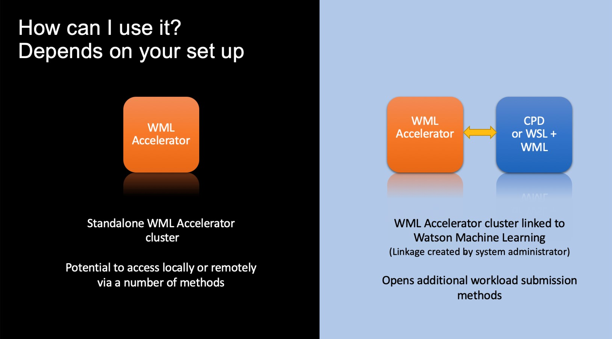
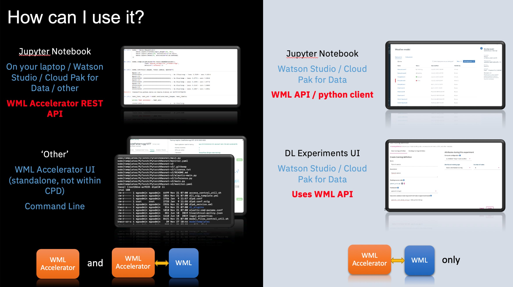

IBM Watson Studio and IBM Watson Machine Learning in IBM Cloud Pak for Data combine with IBM Watson Machine Learning Accelerator to form an enterprise AI platform for accelerating the model training process. The platform provides you with greater speed and accuracy to drive value and reduce the time it takes to bring a model to market. Model training with Watson Machine Learning Accelerator is GPU-accelerated and can scale up automatically, which allows for the allocation of more GPUs when needed. A data scientist can get results faster and reach the accuracy level needed with our enterprise AI platform. The technologies work in concert, as follows:

* IBM Watson Studio and Watson Machine Learning in IBM Cloud Pak for Data provide the tools you need to build, train, and deploy models.
* Watson Machine Learning Accelerator optimizes the speed of training by automating hyperparameter searches in parallel.
* Watson Machine Learning Accelerator includes an elastic distributed training engine, which helps with distributing model training across multiple GPUs and compute nodes. The distribution of training jobs is elastic, meaning that GPUs are dynamically allocated, and adding or removing GPUs does not interrupt running jobs. Because the scheduler dynamically allocates GPUs, you do not need to code GPU topology into the model. Instead, elastic distributed training handles the distribution for models that are built on standalone systems and makes the distribution apparent to the data scientist.

In this article, you will learn how to:

* Configure and enable the link between IBM Watson Studio in IBM Cloud Pak for Data and IBM Watson Machine Learning Accelerator.
* Use methods for submitting deep learning workload from IBM Watson Studio to IBM Watson Machine Learning Accelerator, including automating model hyperparameter search through the Watson Machine Learning Accelerator Rest API, elastically distributing training with the elastic distributed training engine through the Experiment Builder UI in Watson Studio, and training and deploying a model through the Watson Machine Learning Python client using the Watson Machine Learning API.

## Installing and configuring

To install and configure IBM Watson Studio and IBM Watson Machine Learning Accelerator, consider these options: 

On Cloud Pak for Data, install both Watson Machine Learning Accelerator and Watson Machine Learning for full AI lifecycle. See <a href="https://www.ibm.com/docs/en/SSQNUZ_4.0/svc-wml/wml-install.html" target="_blank" rel="noopener noreferrer">Installing Watson Machine Learning</a> and <a href="https://www.ibm.com/docs/en/SSQNUZ_4.0/svc-wmla/wmla-install-overview.html" target="_blank" rel="noopener noreferrer">Installing Watson Machine Learning Accelerator</a>. Make sure to connect these two services, see <a href="https://www.ibm.com/docs/en/SSQNUZ_4.0/svc-wmla/wmla-connect-wml.html" target="_blank" rel="noopener noreferrer">Connecting Watson Machine Learning Accelerator to Watson Machine Learning</a>.

Alternatively, for an on premises solution with Watson Machine Learning Accelerator, learn how to connect your Watson Machine Learning Accelerator environment to IBM Watson Studio on IBM Cloud Pak for Data. To learn more about installing and configuring, see <a href="https://www.ibm.com/docs/en/SSFHA8_1.2.3/wmla_wsl_wml_install.html" target="_blank" rel="noopener noreferrer">Installing with Watson Machine Learning or Watson Studio</a>.

*Figure 1. Set up and configuration*

## How to use it

Depending on how your Watson Machine Learning Accelerator cluster is set up, there are multiple methods for taking advantage of Watson Machine Learning Accelerator when it comes to deep learning workload submission. If you simply have a Watson Machine Learning Accelerator cluster without linking it to Watson Studio and Watson Machine Learning, you can access the Watson Machine Learning Accelerator API directly. However, if your Watson Machine Learning Accelerator cluster is linked to Watson Studio and Watson Machine Learning in IBM Cloud Pak for Data, you will have additional deep learning workload submission methods available.

*Figure 2. Best practice*

The key differences between these methods are the underlying access to Watson Machine Learning Accelerator. It might be Watson Machine Learning Accelerator API direct or through the Watson Machine Learning API.

## Watson Machine Learning Accelerator API

If using the Watson Machine Learning Accelerator REST API directly, you can launch your Jupyter Notebook by accessing the Watson Machine Learning Accelerator cluster using a network connection established by the Watson Machine Learning Accelerator Rest API directly. This Jupyter Notebook can be on any platform, such as locally on your laptop or part of a wider set up as Watson Studio in Cloud Pak for Data.

Try out the <a href="https://github.com/IBM/wmla-assets/blob/master/dli-learning-path/tutorials-cpd-wmla/CPD3.5.0-model-hyperparameter-optimization-via-wmla-api.ipynb" target="_blank" rel="noopener noreferrer">Cloud Pak for Data 3.5.0 notebook</a> or <a href="https://github.com/IBM/wmla-assets/blob/master/dli-learning-path/tutorials-cpd-wmla/05-wmla-api-submitting-hyperparameter-optimization.ipynb" target="_blank" rel="noopener noreferrer">Cloud Pak for Data 3.0.1 notebook</a>, which demonstrates the automation of model hyperparameter search through the Watson Machine Learning Accelerator Rest API.

You can find more details about the Watson Machine Learning Accelerator Rest API in IBM Knowledge Center:

* <a href="https://www.ibm.com/docs/en/SSFHA8_2.3.0/cm/deeplearning.html" target="_blank" rel="noopener noreferrer">REST APIs for REST deep learning in Watson Machine Learning Accelerator 2.3</a>
* <a href="https://www.ibm.com/docs/en/SSFHA8_1.2.3/cm/deeplearning.html" target="_blank" rel="noopener noreferrer">REST APIs for REST deep learning V1</a>
* <a href="https://www.ibm.com/docs/en/SSZU2E_2.5.0/reference_s/api_references.html" target="_blank" rel="noopener noreferrer">RESTful API references</a>

## Watson Machine Learning API

The next two methods are available only where there is a connection between IBM Cloud Pak for Data and Watson Machine Learning Accelerator. Both these methods use the Watson Machine Learning API indirectly, either using the Watson ML Python client or the Experiments Builder in Watson Studio.

Try out the <a href="https://github.com/IBM/wmla-assets/blob/master/dli-learning-path/tutorials-cpd-wmla/CPD3.5.0-model-train-in-wmla-via-wml-api.ipynb" target="_blank" rel="noopener noreferrer">Cloud Pak for Data 3.5.0 notebook</a>, which demonstrates the automation of model hyperparameter search through Watson Machine Learning Accelerator Rest API.

### Watson Machine Learning Python client

This method is based on a Jupyter Notebook as part of Watson Studio in Cloud Pak for Data. This uses the Watson Machine Learning API, which can be accessed either directly through the API code or the Python client.

Try out the <a href="https://github.com/IBM/wmla-assets/blob/master/dli-learning-path/tutorials-cpd-wmla/05_cpd2.5-wmla-python-client-e2e-flow.ipynb" target="_blank" rel="noopener noreferrer">Cloud Pak for Data 2.5.0 notebook</a> and <a href="https://github.com/IBM/wmla-assets/blob/master/dli-learning-path/tutorials-cpd-wmla/05_cpd3.0-wmla-python-client-e2e-flow.ipynb" target="_blank" rel="noopener noreferrer">Cloud Pak for Data 3.0.1 notebook</a>, which execute the Watson Machine Learning Python client for training the model with Watson Machine Learning Accelerator and deploying the model with Watson Machine Learning scoring service.  

You can find more details on the Watson Machine Learning Python client in the <a href="http://wml-api-pyclient-v4.mybluemix.net/" target="_blank" rel="noopener noreferrer">Watson Machine Learning documentation</a>.

### Experiment Builder in Watson Studio

This method uses the Watson Machine Learning API indirectly. It is a method that uses the Watson Studio UI -- where, once the data is in place and the code for the training workload has been created -- models can be created from the Experiment Builder UI in Watson Studio.  With the right metric-sharing libraries in place, it is even possible to see reports of accuracy from training runs.

Check out the <a href="https://www.ibm.com/docs/en/cloud-paks/cp-data/latest?topic=builder-deep-learning-experiment-tutorial" target="_blank" rel="noopener noreferrer">Watson Deep Learning Experiment UI for submitting distributed training</a> for more information.

## Conclusion

IBM Watson Studio and IBM Watson Machine Learning in IBM Cloud Pak for Data and IBM Watson Machine Learning Accelerator together form a strong enterprise AI platform foundation. This foundation can help you get results faster and improve the accuracy level of models. In this article, we described how you can accelerate model training with Watson Machine Learning Accelerator using multiple methodologies. 

For the latest release of Watson Machine Learning Accelerator, refer to the <a href="https://www.ibm.com/docs/en/SSQNUZ_4.0/svc-welcome/wmlaccelerator.html" target="_blank" rel="noopener noreferrer">IBM Cloud Pak for Data 4.0</a> and <a href="https://www.ibm.com/docs/en/SSFHA8_2.3.0/wmla_overview.html" target="_blank" rel="noopener noreferrer">GWatson Machine Learning Accelerator 2.3</a> documentation.