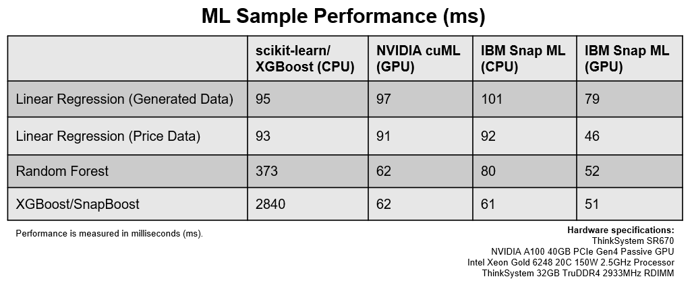

Snap MLは、最新の計算機システム上で高性能な機械学習のトレーニングと推論を行うためのPythonライブラリです。Snap MLは、最先端のCPUパフォーマンスを提供し、GPUアクセラレーションをサポートしているほか、MPIやSparkバインディングを使用して分散学習を行うことができます。Snap MLは、以下のような現在最も人気のある[機械学習モデル](https://www.kaggle.com/kaggle-survey-2020)をサポートしています。

* 線形回帰
* ロジスティック回帰
* サポートベクターマシン(SVM)
* 決定木
* ランダムフォレスト
* グラディエント・ブースト・マシン

Snap MLは、使い慣れたscikit-learnのAPIに完全に準拠しているため、簡単に使用することができます。Pythonとscikit-learnの機能を使用しているデータサイエンティストは、Snap MLライブラリをインポートするというたった1行のコードを追加するだけで、アプリケーションを劇的に高速化できます。また、Snap MLはscikit-learnのデータ構造にシームレスに対応しているため、データ処理やフィーチャリングなどのタスクに使用されるscikit-learnの幅広い機能をユーザーに提供します。

データサイエンティストのチームが様々な機械学習プロジェクトを効率的に同時進行するためには、リソースを効率的に共有することが重要です。IBM Cloud Pak for DataのWatson Studio GPU Elastic Computing（Watson Machine Learning Acceleratorベースサービスで利用可能）を使えば、データサイエンティストのチーム間でGPUリソースをシームレスに共有することができます。公平なリソース共有を可能にするWatson Studioと、高性能なモデルのトレーニングと推論を可能にするSnap MLを組み合わせることで、データサイエンティストのチームはデータをより速く実験することができ、より多くのインサイトとそれに伴う生産性の向上を実現します。

#### 説明書

このブログの詳しい手順とサンプルノートブックは、こちらの[GitHub repo](https://github.com/IBM/wmla-assets/tree/master/dli-learning-path/accelerate-ml-with-gpu)にあります。

#### おわりに

オープンソースとIBMの技術で機械学習アルゴリズムを学習する場合の違いを以下の表にまとめました。    

この表から、Watson Machine Learning AcceleratorでSnap MLとGPUを使用してトレーニングを行うことで、データサイエンティストの時間と労力が大幅に削減されることがわかります。また、データサイエンティストのチームは、いつでもGPUにアクセスしてデータを迅速に実験することができ、より多くのインサイトとそれに伴う生産性の向上につながります。