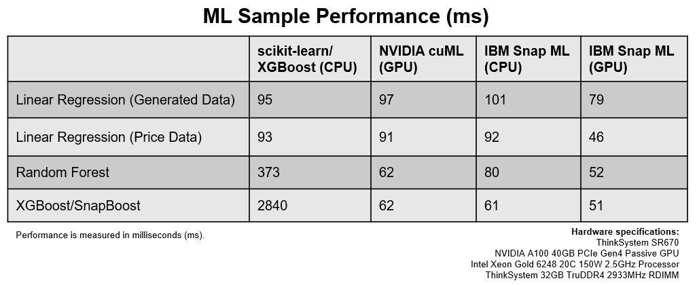

Snap ML is a Python library for high-performance machine learning training and inference on modern computing systems. It offers state-of-the-art CPU performance and has support for GPU acceleration as well as MPI and Spark bindings for distributed training. Snap ML supports some of today's most popular [machine learning models](https://www.kaggle.com/kaggle-survey-2020), including:

* Linear regression
* Logistic regression
* Support vector machine (SVM)
* Decision tree
* Random forest
* Gradient boosting machine

Snap ML adheres fully to the familiar scikit-learn API, offering ease of use. Data scientists using Python and scikit-learn functions can dramatically accelerate their applications by adding a single line of code, namely importing the Snap ML library. In addition, Snap ML interfaces seamlessly with scikit-learn data structures, offering users the broad spectrum of scikit-learn functions for tasks like data processing and feature engineering.

For a team of data scientists to efficiently work concurrently on various machine learning projects, it's crucial to be able to share resources effectively. With Watson Studio GPU Elastic Computing in IBM Cloud Pak for Data (available with the Watson Machine Learning Accelerator base service), GPU resources can be shared seamlessly across teams of data scientists. By combining Watson Studio, for fair resource sharing, and Snap ML, for high-performance model training and inference, teams of data scientists can experiment with data faster, leading to more insights and associated productivity increases.

#### Instructions  

You can find the detailed steps for this blog and sample notebooks in this [GitHub repo](https://github.com/IBM/wmla-assets/tree/master/dli-learning-path/accelerate-ml-with-gpu).

#### Conclusion

The following table summarizes the differences of training machine learning algorithms with open source and IBM technology.    

From the table, you see how training with Snap ML and GPU in Watson Machine Learning Accelerator saves data scientists significant time and effort, while teams of data scientists can get access of the GPU at any time to experiment with data faster, leading to more insights and associated productivity increases.