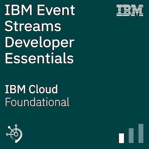

## まとめ

このラーニングパスでは、Apache KafkaとIBM Event Streamsのコア・コンセプトを学び、サンプル・アプリケーションを介してIBM Event Streamsインスタンスを実際に体験し、問題に対するソリューションを開発するコーディング・チャレンジに挑戦し、簡単なエラーや接続性の問題をトラブルシューティングおよびデバッグする方法を学びました。

## バッジの申し込み

バッジを手にする準備はできていますか？

。

[**IBM Event Streams Developer Essentials Badge quiz**](https://learn.ibm.com/course/view.php?id=8767)のページに行き、クイズを受け、80%以上で合格して証明してください!

クイズに答えてバッジを請求するには、[Credlyアカウント](https://www.credly.com/users/sign_up)と[IBMアカウント](https://www.ibm.com/account/) (IBM ID)が必要になります。

あなたのバッジがLinkedInやTwitter、メールの署名で共有されるのを楽しみにしています。  おめでとうございます。

**注意: **IBM は、IBM デジタルバッジ・プログラムの管理を支援するために、IBM が認可した米国のサードパーティ・データ・プロセッサである Credly のサービスを利用しています。IBM デジタルバッジを発行するために、お客様の個人情報 (氏名、メールアドレス、取得したバッジ) が Credly と共有されます。バッジの請求方法を記載した通知メールが Credly から届きます。お客様の個人情報は、バッジの発行、プログラムの報告と運営の目的で使用されます。個人情報は、IBM のプライバシー・ポリシーに沿った方法で取り扱われます。  IBM プライバシー・ステートメントはこちらでご覧いただけます： https://www.ibm.com/privacy/us/en/.

## 次のステップ

<!-- LPへのリンクが変換されたら更新する -->
[IBM Event Streams topics using the Kafka Admin API](/tutorials/managing-ibm-event-streams-topics-using-the-kafka-admin-api/)の方法を学んで、学習とスキルの向上を続けてください。