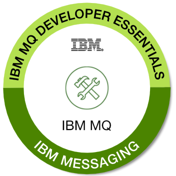

## まとめ

IBM MQ は、堅牢で信頼性の高い、安全なメッセージング・ソリューションです。IBM MQ は、複数のプラットフォームにまたがるさまざまなアプリケーションの統合を簡素化および高速化し、さまざまな API や言語をサポートします。IBM MQは、サーバー・インフラストラクチャーがデータセンター、メインフレーム、クラウド・フレームワークにまたがることを可能にします。MQは、アプリケーションが信頼性と拡張性のある方法でデータを通信・交換することを可能にし、1つのアプリケーションを別のアプリケーションから切り離します。

この学習パスでは、IBM MQ メッセージングのコア・コンセプトを学び、キュー・マネージャー、キュー、トピックを作成して構成し、キュー・マネージャーと対話するシンプルなポイント・ツー・ポイントの JMS アプリケーションを開発してデバッグしました。

## バッジの申請

バッジを手にする準備はできていますか？

。

<a href="https://learn.ibm.com/course/view.php?id=3603" target="_blank" rel="noopener noreferrer">_IBM MQ Developer Essentials Badge quiz_</a>のページに行き、クイズに挑戦し、80%以上で合格して証明してください。

気をつけて!このラーニングパスに含まれるすべてのチュートリアルから問題が出題されますので、すべての内容を確認してください。

クイズに答えてバッジを請求するには、 <a href="https://www.credly.com/users/sign_up" target="_blank" rel="noopener noreferrer nofollow">_Credly account_</a>と<a href="https://www.ibm.com/account/" target="_blank" rel="noopener noreferrer nofollow">_IBM account_</a> (IBM ID)が必要になります。

バッジは、LinkedInやTwitter、Eメールの署名で共有されることを楽しみにしています。  おめでとうございます。これであなたもMQアプリ開発のスーパーヒーローです!

**注意: **IBM は、IBM デジタルバッジプログラムの管理を支援するために、IBM が認可した米国に所在する第三者データ処理業者である Credly のサービスを活用しています。IBM デジタルバッジを発行するために、お客様の個人情報 (氏名、メールアドレス、取得したバッジ) が Credly と共有されます。バッジの請求方法を記載したメール通知が Credly から届きます。お客様の個人情報は、バッジの発行、プログラムの報告と運営の目的で使用されます。個人情報は、IBM のプライバシー・プラクティスに沿った方法で取り扱われます。  IBM プライバシー・ステートメントはこちらでご覧いただけます： https://www.ibm.com/privacy/us/en/.

## 次のステップ

メッセージング・アプリケーションに本格的に取り組むために、<a href="https://developer.ibm.com/articles/mq-downloads/" target="_blank" rel="noopener noreferrer">_MQ クライアント・ライブラリーをダウンロードする準備ができたのではないでしょうか。  また、IBM MQの<a href="https://ibm.biz/mq-dev-patterns" target="_blank" rel="noopener noreferrer">github repo</a>をチェックしてみてください。  また、<a href="https://doyoumq.com/" target="_blank" rel="noopener noreferrer">doYouMQ? ポッドキャスト</a>では、IBMのシニア・エキスパートがエンタープライズ・メッセージングにおいてMQが果たす重要な役割について考えを述べています。