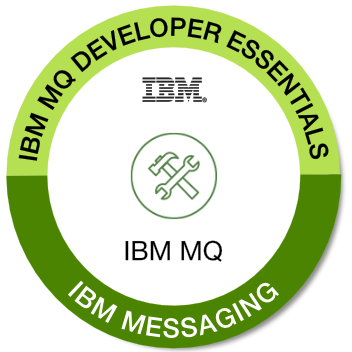

## Summary

IBM MQ is a robust, reliable, and secure messaging solution. It simplifies and accelerates the integration of different applications across multiple platforms, and it supports a wide range of APIs and languages. IBM MQ allows the server infrastructure to span data center, mainframe, and cloud frameworks. MQ enables applications to communicate and exchange data in a reliable and scalable way, that decouples one application from another.

In this learning path, you learned the core IBM MQ messaging concepts, created and configured a queue manager, queue, and topic, and developed and debugged a simple point-to-point JMS application that interacts with the queue manager.

## Apply for the badge

Are you ready to get your hands on the badge?

Go to the <a href="https://learn.ibm.com/course/view.php?id=3603" target="_blank" rel="noopener noreferrer">_IBM MQ Developer Essentials Badge quiz_</a> page, take the quiz, and pass with 80% or more and prove it!

Beware! You’ll get hit by questions from all the tutorials that are part of this learning path, so make sure you’ve gone over everything.

You’ll need a  <a href="https://www.credly.com/users/sign_up" target="_blank" rel="noopener noreferrer nofollow">_Credly account_</a> and an <a href="https://www.ibm.com/account/" target="_blank" rel="noopener noreferrer nofollow">_IBM account_</a> (IBM Id) to complete the quiz and claim your badge.

We look forward to seeing your badges shared on LinkedIn, Twitter and in your email signatures.  Congratulations! You're now an MQ app dev superhero!

**NOTICE:** IBM leverages the services of Credly, a 3rd party data processor authorized by IBM and located in the United States, to assist in the administration of the IBM Digital Badge program. In order to issue you an IBM Digital Badge, your personal information (name, email address, and badge earned) will be shared with Credly. You will receive an email notification from Credly with instructions for claiming the badge. Your personal information is used to issue your badge and for program reporting and operational purposes. It will be handled in a manner consistent with IBM privacy practices.  The IBM Privacy Statement can be viewed here:  https://www.ibm.com/privacy/us/en/.

## Next steps

Perhaps you're ready to <a href="https://developer.ibm.com/articles/mq-downloads/" target="_blank" rel="noopener noreferrer">download the _MQ client libraries_</a> to really dive into your messaging application.  Or, check out the IBM MQ <a href="https://ibm.biz/mq-dev-patterns" target="_blank" rel="noopener noreferrer">github repo</a>, which contains some code samples that can use in your own projects.  Or, check out the <a href="https://doyoumq.com/" target="_blank" rel="noopener noreferrer">doYouMQ? podcast</a>, where senior experts at IBM sharing their thoughts on the vital role that MQ plays in enterprise messaging.