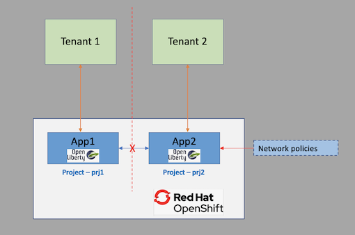

To achieve multitenancy, you need to isolate the networks for the different tenants. This tutorial shows you  how to achieve network isolation for your applications and services deployed on a OpenShift cluster on IBM Cloud using projects and network policies.

In this tutorial, you will learn how to:

- Create a project in OpenShift and deploy a web application that runs on Open Liberty using [odo](https://odo.dev/).
- Configure multitenant isolation by using network policies for a project.
- Test the multitenant mode configuration.

### Review of OpenShift access controls

As a reminder, a project in OpenShift requires authentitcation and authorization in order to access a namespace. This ensures that only authorized users can access the resources within a project. _Network policies_ are resources that control the traffic between pods and network endpoints in an OpenShift cluster. They are configured as rules specified in YAML files and applied to the OpenShift cluster.

Examples of what you can do with network policies include:

- Block all traffic between projects in an OpenShift cluster
- Block all inbound external traffic for a service within a project
- Allow traffic between services within a project

### Tutorial overview

This tutorial demonstrates how to configure a multitenant mode using two sample applications: App1 and App2.

First you will deploy your applications to specific projects.

  * App1 is deployed in a project `prj1`.
  * App2 is deployed in a project `prj2`.

Once deployed, App1 exposes an endpoint that, in turn, invokes App2 and returns the results.

Next, you will isolate App2 by applying network policies to project `prj2`.

Then you will test the multitenant mode configuration for `prj2` by again invoking the endpoint on App1. This time the invocation should not return a result because App1 cannot invoke App2. The following diagram shows the workflow:




## Prerequisites

To complete the steps in this tutorial you need to:

- [Create an IBM Cloud account](https://cloud.ibm.com)
- [Install odo](https://odo.dev/) - odo is a command-line interface (CLI) that helps developers iterate their code on Red Hat OpenShift and Kubernetes.
- [Install oc client](https://docs.openshift.com/container-platform/4.6/cli_reference/openshift_cli/getting-started-cli.html) - With OpenShift command-line interface (CLI), the oc command, you can create applications and manage OpenShift Container Platform projects from a terminal.
- [Install Git client](https://git-scm.com/downloads)

## Estimated time

Completing this tutorial should take about 30 minutes.

## Steps

### Create an OpenShift cluster

Create an instance of OpenShift cluster. Follow the prompts in the [IBM Cloud Catalog](https://cloud.ibm.com/kubernetes/catalog/create?platformType=openshift) to create a cluster hosted on IBM Cloud.

### Clone the repo

Clone the repo by running this command:

```
git clone https://github.com/IBM/multitenant-network-isolation-tutorial.git
```

This creates a folder named `multitenant-network-isolation-tutorial`. The folder contains the source code for two applications - `App1` and `App2`, and the configuration files for network policies.

### Log in to your OpenShift cluster on IBM Cloud

Open the OpenShift web console for the cluster you created earlier. Click on the logged-in user ID on the top right and select **Copy Login Command**.

Open a terminal window. Log in to OpenShift using the login command you just copied.

### Create projects

Run the following commands to create two projects, one for each of your sample applications:

```
oc new-project prj1
oc new-project prj2
```

### Deploy the applications

Now you will deploy application `App1` into project `prj1` and deploy `App2` into project `prj2`.

Run the following commands to deploy the application `App1` into the project `prj1`:

```
oc project prj1
cd multitenant-network-isolation-tutorial
cd app1
odo create app1
odo push
cd ..
```

Get the URL for the deployed application `App1`:

```
odo url list
```

This retursn the URL for accessing `App1`. Make a note of the URL.

```
Found the following URLs for component app1
NAME     STATE      URL                                                      PORT     SECURE     KIND
ep1      Pushed     http://ep1-app1-prj1.xxxx.containers.appdomain.cloud     9080     false      route
```

Next, run the following commands to deploy the application `app2` into project `prj2`:
```
oc project prj2
cd app2
odo create app2
odo push
cd ..
```

Get the URL for the deployed application.

```
odo url list
```

This returns the URL for accessing `App2`. Make a note of the URL.

```
Found the following URLs for component app2
NAME     STATE      URL                                                      PORT     SECURE     KIND
ep1      Pushed     http://ep1-app2-prj2.xxxx.containers.appdomain.cloud     9080     false      route
```

### Invoke an endpoint on App1

Use the following CURL command to invoke an endpoint `getdata` exposed by `App1`. Internally, this invokes an endpoint on `App2` and returns the result.

```
curl http://ep1-app1-prj1.xxxx.containers.appdomain.cloud/app1/getdata
```

The URL invoked above is [App1 URL noted earlier]/app1/getdata.

Take a look at the `getRequest` method in the source Java file `GetData.java` located at `../multitenant-network-isolation-tutorial/app1/src/main/java/com/example/GetData.java`. 

Here, you invoke the end point `http://app2.prj2.svc.cluster.local:9080/app2/resource` on `App2` in the getRequest method.

```
@GET
  public String getRequest() {
    URL url;
    StringBuffer content = new StringBuffer();
    try {
      url = new URL("http://app2.prj2.svc.cluster.local:9080/app2/resource");
      HttpURLConnection con = (HttpURLConnection) url.openConnection();
      con.setRequestMethod("GET");
      con.connect();
      BufferedReader in = new BufferedReader(new InputStreamReader(con.getInputStream()));
      String inputLine;

      while ((inputLine = in.readLine()) != null) {
        content.append(inputLine);
      }
      in.close();

    } catch (Exception e) {
      // TODO Auto-generated catch block
      e.printStackTrace();
      return "java.net.UnknownHostException encountered - Could not invoke App2!";
    }

    return content.toString();
  }
```

You should see output like below if `App1` is able to invoke the endpoint on `App2`.

```
Successful invocation - This is a resource from App2!
```

### Configure multitenant mode for prj2 using network policy

In this section, you will configure network policies for project `prj2` in order to isolate `App2` in `prj2`.

As part of the multitenant mode, you will create three network policies:

* Allow from OpenShift ingress
* Allow from same namespace
* Allow from OpenShift monitoring

The YAML files with the rules are provided below. You will apply these policies on the cluster using the OpenShift CLI interface.

- **Allow from OpenShift Ingress** - Ingress is an object that allows access to your Kubernetes services from outside the cluster.

This policy allows incoming requests through ingress into the project `prj2`, which enables you to invoke the exposed endpoints on `App2`. The policy described below applies to all pods in the project. But, you can restrict this policy to pods whose services need to be exposed using the `podSelector`.

```
apiVersion: networking.k8s.io/v1
kind: NetworkPolicy
metadata:
  name: allow-from-openshift-ingress
spec:
  ingress:
  - from:
    - namespaceSelector:
        matchLabels:
          network.openshift.io/policy-group: ingress
  podSelector: {}
  policyTypes:
  - Ingress
```

- **Allow from same namespace** - This policy only accepts connections from pods within the project. After setting this, `App1` in `prj1` will not be able to send requests to `App2` in `prj2`. The invocation to the URL  `http://app2.prj2.svc.cluster.local:9080/app2/resource` in `App1` will fail after setting the following network policy.

```
kind: NetworkPolicy
apiVersion: networking.k8s.io/v1
metadata:
  name: allow-same-namespace
spec:
  podSelector:
  ingress:
  - from:
    - podSelector: {}
```

- **Allow from OpenShift monitoring** - This policy allows monitoring of your services for metrics using OpenShift monitoring.

```
apiVersion: networking.k8s.io/v1
kind: NetworkPolicy
metadata:
  name: allow-from-openshift-monitoring
spec:
  ingress:
  - from:
    - namespaceSelector:
        matchLabels:
          network.openshift.io/policy-group: monitoring
  podSelector: {}
  policyTypes:
  - Ingress
```

Now, run the following commands to configure a multitenant mode for project `prj2`.

```
oc project prj2
cd resources
oc create -f allow-from-openshift-ingress.yaml -n prj2
oc create -f allow-same-namespace -n prj2
oc create -f allow-from-openshift-monitoring.yaml -n prj2
```

Check that the network policies are set correctly by running the following command:

```
oc get networkpolicy
```

The below output should be displayed:

```
NAME                              POD-SELECTOR   AGE
allow-from-openshift-ingress      <none>         43s
allow-from-openshift-monitoring   <none>         20s
allow-same-namespace              <none>         30s
```

### Invoke the endpoint on App1 after multitenant mode configuration for prj2

Use the following command to again invoke an endpoint `getdata` exposed by `App1`.

```
curl http://ep1-app1-prj1.xxxx.containers.appdomain.cloud/app1/getdata
```

As you can see from the following output, `App1` is unable to invoke an endpoint on `App2`.

```
java.net.UnknownHostException encountered - Could not invoke App2!
```

If you access the pod logs for `App1` in your OpenShift web console, you can see the following error:
```
[INFO] [err] java.net.UnknownHostException: app2.project2.svc.cluster.local
[INFO] [err]   at java.base/java.net.AbstractPlainSocketImpl.connect(AbstractPlainSocketImpl.java:220)
[INFO] [err]   at java.base/java.net.Socket.connect(Socket.java:609)
[INFO] [err]   at java.base/java.net.Socket.connect(Socket.java:558)
[INFO] [err]   at java.base/sun.net.NetworkClient.doConnect(NetworkClient.java:182)
[INFO] [err]   at java.base/sun.net.www.http.HttpClient.openServer(HttpClient.java:474)
[INFO] [err]   at java.base/sun.net.www.http.HttpClient.openServer(HttpClient.java:569)
[INFO] [err]   at java.base/sun.net.www.http.HttpClient.<init>(HttpClient.java:242)
[INFO] [err]   at java.base/sun.net.www.http.HttpClient.New(HttpClient.java:341)
[INFO] [err]   at java.base/sun.net.www.http.HttpClient.New(HttpClient.java:362)
[INFO] [err]   at java.base/sun.net.www.protocol.http.HttpURLConnection.getNewHttpClient(HttpURLConnection.java:1253)
[INFO] [err]   at java.base/sun.net.www.protocol.http.HttpURLConnection.plainConnect0(HttpURLConnection.java:1187)
[INFO] [err]   at java.base/sun.net.www.protocol.http.HttpURLConnection.plainConnect(HttpURLConnection.java:1081)
[INFO] [err]   at java.base/sun.net.www.protocol.http.HttpURLConnection.connect(HttpURLConnection.java:1015)
[INFO] [err]   at com.example.GetData.getRequest(GetData.java:36)
```

### IBM Cloud's Calico network plug-in

Every Red Hat® OpenShift® on IBM Cloud™ cluster is set up with a network plug-in called [Calico](https://cloud.ibm.com/docs/openshift?topic=openshift-network_policies). Default network policies are set up to secure the public network interface of every worker node in the cluster. You can use Calico and Kubernetes to create network policies for a cluster. With Kubernetes network policies, you can specify the network traffic that you want to allow or block to and from a pod within a cluster. To set more advanced network policies such as blocking inbound (ingress) traffic to network load balancer (NLB) services, you can use Calico network policies.

### Summary

In this tutorial, you configured the multitenant isolation mode for a project using Kubernetes network policies. Also you learned about OpenShift network policies and how to configure your cluster for isolation using them.

Please refer the below links for further reading:
- [Controlling traffic with network policies for OpenShift on IBM Cloud](https://cloud.ibm.com/docs/openshift?topic=openshift-network_policies)
- [Networking in OpenShift](https://docs.openshift.com/container-platform/4.6/networking/understanding-networking.html)
- [Using odo for OpenShift](https://docs.openshift.com/container-platform/4.6/cli_reference/developer_cli_odo/understanding-odo.html)