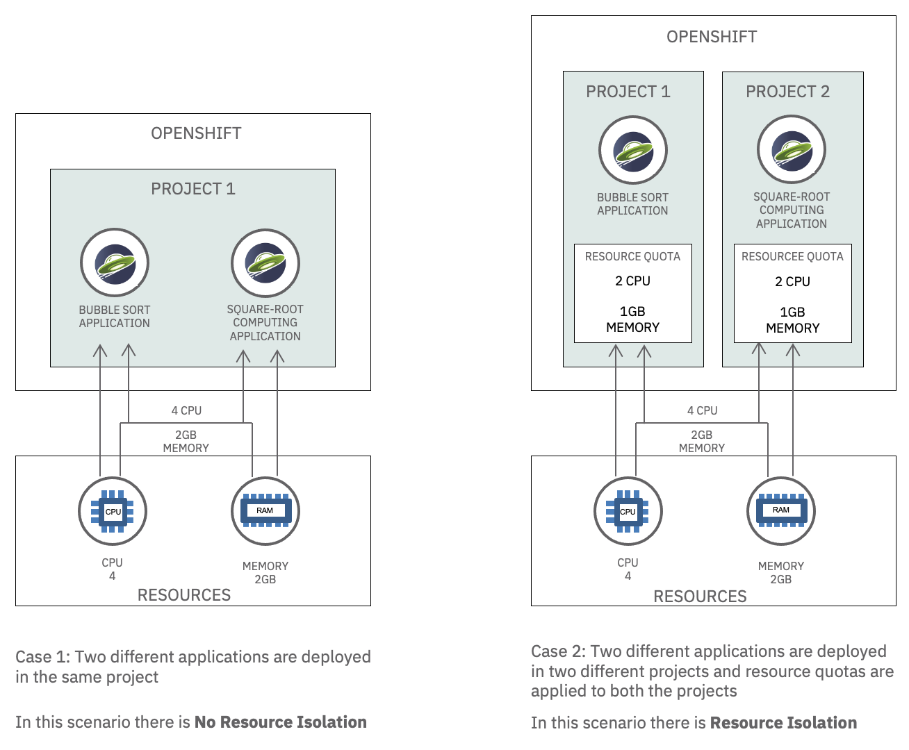

多くのクラウド事業者は、SaaSアーキテクチャにおけるリソースの利用を最適化するためにマルチテナンシーを採用しています。マルチテナンシーを実現する一般的な方法は2つあります。

1. リソースの分離。テナント間でCPUやメモリなどのリソースを分離する。
2.2.ネットワーク・アイソレーションテナント間のネットワークアクセスを分離すること。

マルチテナンシーについては、【Introduction to Multitenancy on Red Hat OpenShift】(https://github.ibm.com/TT-ISV-org/multitenancy/tree/master/Introduction-to-Multitenancy-Article)をご参照ください。

このチュートリアルでは、OpenShift でリソースアイソレーションを使用してマルチテナンシーを実現する方法を学びます。また、[ODO CLI](https://odo.dev)を使用してOpenShift上にJava Libertyアプリケーションをデプロイする方法についても学習します。

具体的には、2つの異なるシナリオでリソース・アイソレーションがどのように機能するかを見ていきます。

- ケース1では、アプリケーションのパフォーマンスは、リソースクォータが適用されていない同一プロジェクト内の別のアプリケーションのリソース使用率に影響されます。
- ケース2では、アプリケーションのパフォーマンスは、別のプロジェクトにデプロイされ、リソースクオータが適用された別のアプリケーションのリソース使用率に影響されません。

各シナリオの詳細は以下のとおりです。

### ケース1：リソースアイソレーションされていない2つのアプリケーション

このシナリオでは、2つの異なるアプリケーションを同じプロジェクトに配置し、それらが分離されていないことを示します。

- OpenShift でプロジェクト `project1` を作成します。
- 2つの異なるアプリケーション `app1` と `app2` をプロジェクト `project1` にデプロイします。
- `app1` を実行して、アプリケーションのパフォーマンスとレスポンスタイムを確認する。
- CPUとメモリの消費量が増加する`app2`を実行し、同時に`app1`を実行して、`app2`が最大のリソースを消費するために`app1`のパフォーマンスと応答時間が阻害されることに気づく

### ケース 2: リソースを分離した 2 つのアプリケーション

このシナリオでは、2つの異なるアプリケーションを2つの異なるプロジェクトに展開し、両方のプロジェクトにリソースクォータを設定します。このシナリオでは、2つのアプリケーションを2つのプロジェクトに配置し、両方のプロジェクトにリソース割り当てを設定します。

- `project1`から`app2`を削除します。
- OpenShift で別のプロジェクト `project2` を作成します。
- `project2` に `app2` をデプロイします。
- 両方のプロジェクトにリソース・クオータを割り当てます。
- `app2` を実行して、設定した制限内でのリソース使用量を確認する
- `app1` を実行して、パフォーマンスと応答時間の向上を確認する
- 分離された環境で `app1` と `app2` を同時に実行し、リソースの使用状況を観察する

### 比較

この図は、2つのシナリオの違いを示しています。

## 前提条件

このチュートリアルの手順を完了するには、以下が必要です。

- [IBM Cloud Account](https://cloud.ibm.com)にログインします。
- [OC CLI](https://docs.openshift.com/container-platform/4.6/cli_reference/openshift_cli/getting-started-cli.html)ツールをインストールします。
- [ODO CLI](https://odo.dev)をインストールし、OCログインでOpenShiftクラスタにログインします。
- [Git Client](https://git-scm.com/downloads)のCLIをインストールします。

## 見積もり時間

このチュートリアルを完了するには、約30分かかります。

## 手順

このチュートリアルの手順は以下の通りです。
1. 初期設定
1. ケース1 - リソースが分離されていない2つのアプリケーション
1. ケース2 - リソースを分離した2つのアプリケーション

### Step 1: 初期設定

以下の手順を実行して、2つのテストシナリオを実行する準備をします。

#### 1.1 OpenShift クラスタの作成

OpenShift クラスターのインスタンスを作成します。[IBM Cloud Catalog](https://cloud.ibm.com/kubernetes/catalog/create?platformType=openshift)のプロンプトに従って、IBM Cloud にホストされているクラスターを作成します。

#### 1.2 OpenShift クラスターへの接続

お使いのクラスターの OpenShift Web コンソールを開きます。CLIからクラスターにログインするには、OpenShiftコンソールで、右上のログインしたユーザーIDをクリックして、**Copy Login Command**を選択し、ターミナルで`oc login`コマンドを実行します。

#### 1.3 レポをクローンする

[`multitenant-resource-isolation-tutorial`](https://github.com/IBM/multitenant-resource-isolation-tutorial)のレポをローカルにクローンします。ターミナルで、次のように実行します。

    $ cd .../app2/
    $ odo url list

    コンポーネント app1 について、以下の URL を発見しました。
    name state url port secure kind
    ep1 Pushed http://ep2-app2-project1.xxxx.containers.appdomain.cloud 9080 false route

#### 2.6 再びapp1を呼び出す

2つ目のアプリケーションがまだ動作している状態で、1つ目のアプリケーションを再度実行して、そのパフォーマンスを確認します。

1. シェルスクリプト `multitenant-resource-isolation-tutorial/app1/run.sh` に app1 の URL を指定して実行します。このスクリプトは、一貫した結果を得るために、エンドポイントを呼び出してアプリケーションを5回ループで実行します。

apiVersion: v1
kind:リソースクオータ
メタデータです。
  name: compute-resources
仕様です。
  ハード
    ポッド数: '1'
    requests.cpu: '1'
    リクエストズ.メモリー: 1Gi
    リミット.cpu: '1'
    リミット.メモリ: 2Gi

**プロジェクト2のリソースクォータを設定する**。

[compute-resources.yaml](https://github.com/IBM/multitenant-resource-isolation-tutorial/blob/main/app2/compute-resources.yaml)を使って、プロジェクト2のリソースクォータを設定します。
1. `multitenant-resource-isolation-tutorial/app2/` ディレクトリに移動し、以下のコマンドを実行します。