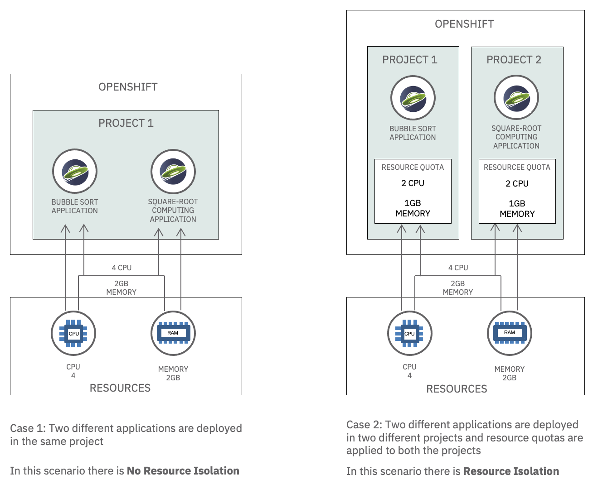
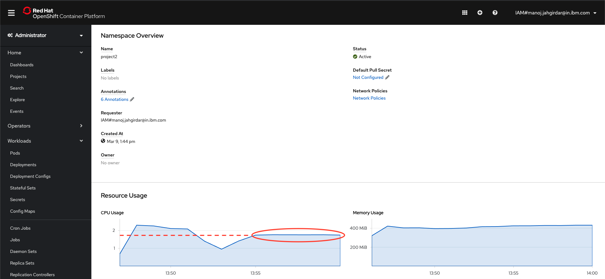

Many cloud providers use multitenancy to optimize resource usage in a SaaS architecture. There are two common ways to achieve multitenancy:

1. Resource isolation: Isolating resources like CPU and Memory between tenants.
2. Network isolation: Isolating network access between tenants.

For a refresher on multitenancy, please refer to [Introduction to Multitenancy on Red Hat OpenShift](https://github.ibm.com/TT-ISV-org/multitenancy/tree/master/Introduction-to-Multitenancy-Article).

In this tutorial, you will learn how to achieve multitenancy using resource isolation in OpenShift. You will also learn how to deploy a Java Liberty application on OpenShift using the [ODO CLI](https://odo.dev).

Specifically, you will look at how resource isolation works in two different scenarios.

- In Case 1, the performance of an application is affected by the resource utilization of another application in the same project without resource quotas applied.
- In Case 2, the performance of an application is unaffected by the resource utilization of another application deployed in a different project and with resource quotas applied.

Details of the scenarios are as follows:

### Case 1: Two applications with no resource isolation

This scenario deploys two different applications in the same project and shows that they are not isolated.

- Create a project `project1` in OpenShift
- Deploy two different applications `app1` and `app2` in the project `project1`
- Run `app1` and notice performance and response time of the application
- Run `app2` that increases the CPU and memory consumption, simultaneously run `app1` and notice performance and response times of `app1` hindered as `app2` consumes maximum resources

### Case 2: Two applications with resource isolation

This scenario deploys two different applications in two different projects and configures resource quotas for both the projects. It then shows that the two applications are isolated from each other.

- Delete `app2` from `project1`
- Create another project `project2` in OpenShift
- Deploy `app2` in `project2`
- Allocate resource quotas to both the projects
- Run `app2` and see the resource usage within the limits set
- Run `app1` and notice better performance and response times
- Run `app1` and `app2` simultaneously and observe the resource utilization in an isolated environment

### Comparison

This diagram illustrates the differences between the two scenarios.



## Prerequisites

To complete the steps in this tutorial you need to:

- Log in to an [IBM Cloud Account](https://cloud.ibm.com).
- Install the [OC CLI](https://docs.openshift.com/container-platform/4.6/cli_reference/openshift_cli/getting-started-cli.html) tool.
- Install the [ODO CLI](https://odo.dev) and log in to your OpenShift cluster through OC login.
- Install the [Git Client](https://git-scm.com/downloads) CLI.

## Estimated time

Completing this tutorial should take about 30 minutes.

## Steps

The steps in this tutorial are:
1. Initial set up
1. Case 1 - Two applications with no resource isolation
1. Case 2 - Two applications with resource isolation

### Step 1: Initial set up

Perform these steps to prepare to run the two test scenarios.

#### 1.1 Create an OpenShift cluster

Create an instance of OpenShift cluster. Follow the prompts in the [IBM Cloud Catalog](https://cloud.ibm.com/kubernetes/catalog/create?platformType=openshift) to create a cluster hosted on IBM Cloud.

#### 1.2 Connect to your OpenShift cluster

Open the OpenShift web console for your cluster. To log in to your cluster from the CLI, in the OpenShift console, click on the logged in user ID on the top right and select **Copy Login Command**, then run the `oc login` command in a terminal.

#### 1.3 Clone the repo

Clone the [`multitenant-resource-isolation-tutorial`](https://github.com/IBM/multitenant-resource-isolation-tutorial) repo locally. In a terminal, run:

```bash
$ git clone https://github.com/IBM/multitenant-resource-isolation-tutorial.git
```

The source code for the two apps is in these folders:

- `multitenant-resource-isolation-tutorial/app1/`
- `multitenant-resource-isolation-tutorial/app2/`


### Step 2: Case 1 - Two applications with no resource isolation

These steps will show that two applications deployed to the same project are not isolated.

#### 2.1 Create a project in OpenShift

1. In your terminal, run the following command to create a project in OpenShift.

    ```bash
    $ oc new-project project1
    ```

[Working with projects](https://docs.openshift.com/container-platform/4.6/applications/projects/working-with-projects.html) has more details about the purpose of projects and users in OpenShift.

#### 2.2 Deploy app1 in project1

In this section, you will deploy  `app1`.

1. In a terminal, switch to the project, go to the application's code directory, and run the `odo` commands to create the application and deploy it on OpenShift.

    ```bash
    $ oc project project1
    $ cd app1/
    $ odo create app1
    $ odo push
    ```

#### 2.3 Invoke app1

The first application performs a bubble sort to consume CPU and measure how much time the sort takes. You can run the application by invoking the `<app-url>/app1/bubblesort` endpoint.

1. In your terminal, run `odo url list` to get the application's URL.

    ```bash
    $ cd ../app1/
    $ odo url list

    Found the following URLs for component app1
    NAME     STATE      URL                                                                                                               PORT     SECURE     KIND
    ep1      Pushed     http://ep1-app1-project1.xxxx.containers.appdomain.cloud     9080     false      route
    ```

1. Run the `multitenant-resource-isolation-tutorial/app1/run.sh` shell script, providing the URL that you just copied. This script invokes the endpoint to run the application in a loop five times to get a consistent result.

    ```bash
    $ chmod +x run.sh
    $ ./run.sh http://ep1-app1-project1.xxxx.containers.appdomain.cloud

    This is an example application running Bubble Sort Algorithm
     - An array of n=79999 elements were sorted in ascending order using Bubble sort in: 19737ms.

    This is an example application running Bubble Sort Algorithm
     - An array of n=79999 elements were sorted in ascending order using Bubble sort in: 17610ms.

    This is an example application running Bubble Sort Algorithm
     - An array of n=79999 elements were sorted in ascending order using Bubble sort in: 11881ms.

    This is an example application running Bubble Sort Algorithm
     - An array of n=79999 elements were sorted in ascending order using Bubble sort in: 11862ms.

    This is an example application running Bubble Sort Algorithm
     - An array of n=79999 elements were sorted in ascending order using Bubble sort in: 18889ms.
    ```

Note that the **average time taken to execute algorithm is around: 15995ms**. This is the time that the bubble sort algorithm took to execute when it isn't competing with other applications for CPU.

To view the resource utilization graphically, in the OpenShift console, navigate to **Workloads > Pods** in `project1` and select the `app1-xxx` pod. The Pod Overview displays its resource utilization, as shown below:

  

#### 2.4 Deploy app2 in project1

In this section, you will deploy `app2`.

1. In a terminal, ensure that you are in the project, go to the application's code directory, and run the `odo` commands to create the application and deploy it on OpenShift.

    ```bash
    $ oc project project1
    $ cd ../app2/
    $ odo create app2
    $ odo push
    ```

#### 2.5 Invoke app2

The second application runs square-root computations, consuming as much CPU and memory as possible. You can run the application by invoking the `<app-url>/app2/loadresources` endpoint.

1. In your terminal, run `odo url list` to get the application's URL.

    ```bash
    $ cd ../app2/
    $ odo url list

    Found the following URLs for component app1
    NAME     STATE      URL                                                                                                               PORT     SECURE     KIND
    ep1      Pushed     http://ep2-app2-project1.xxxx.containers.appdomain.cloud     9080     false      route
    ```

1. Run the `multitenant-resource-isolation-tutorial/app1/run.sh` shell script, providing the URL that you just copied. This script invokes the endpoint to run the application in a loop 35 times to maximize the CPU and memory utilization for a longer time.

    ```bash
    $ chmod +x run.sh
    $ ./run.sh http://ep2-app2-project1.xxxx.containers.appdomain.cloud

    CPU was loaded with squareroot computations for : 13542ms

    CPU was loaded with squareroot computations for : 12968ms

    CPU was loaded with squareroot computations for : 13426ms

    CPU was loaded with squareroot computations for : 14712ms

    . . .

    ```

#### 2.6 Invoke app1 again

With the second application still running, run the first application again to see how well it performs.

1. Run the `multitenant-resource-isolation-tutorial/app1/run.sh` shell script, providing the URL for app1. This script invokes the endpoint to run the application in a loop five times to get a consistent result.

    ```bash
    $ cd ../app1/
    $ ./run.sh http://ep1-app1-project1.xxxx.containers.appdomain.cloud

    This is an example application running Bubble Sort Algorithm
     - An array of n=79999 elements were sorted in ascending order using Bubble sort in: 17184ms.

    This is an example application running Bubble Sort Algorithm
     - An array of n=79999 elements were sorted in ascending order using Bubble sort in: 22229ms.

    This is an example application running Bubble Sort Algorithm
     - An array of n=79999 elements were sorted in ascending order using Bubble sort in: 15497ms.

    This is an example application running Bubble Sort Algorithm
     - An array of n=79999 elements were sorted in ascending order using Bubble sort in: 17430ms.

    This is an example application running Bubble Sort Algorithm
     - An array of n=79999 elements were sorted in ascending order using Bubble sort in: 13525ms.
    ```

Note the **average time taken to execute algorithm this time is around: 17173ms**. This is the time that the bubble sort algorithm took to execute when the second application was consuming a significant amount of the available CPU. 17173ms is noticeably slower than the 15995ms average the first application took when the second application was not running.

You can view the resource utilization for the project in the OpenShift console by navigating to **Home > Projects > project1**.

  

#### 2.7 Conclusions

The exercise above shows how running two applications in a single project caused resource issues. The graph clearly shows that `app2` is consuming the maximum CPU resource of up to ***5 Cores*** and maximum memory of about ***400MB***. Because `app2` is using maximum resources, the response time for `app1` increased from 15 seconds to ***17 seconds***, so `app1` had lower performance.


### Step 3: Case 2 - Two applications with resource isolation

The performance degradation shown in Case 1 is undesirable. Ideally, the two apps should be isolated so that resource consumption by one app doesn't affect the other app. To achieve resource isolation, deploy the two applications to two different projects and assign resource quotas to the projects.

These steps will show that two applications deployed to two different projects with resource quotas are isolated.

#### 3.1 Delete app2 from project1

Before deploying app2 in another project, first delete it from this project.

1. In a terminal, ensure that you are in the project, go to the application's code directory, and run the `odo` commands to delete the application.

    ```bash
    $ oc project project1
    $ cd ../app2/
    $ odo delete
    ```

#### 3.2 Create another project in OpenShift

1. In your terminal, run the following command to create another project in OpenShift.

    ```bash
    $ oc new-project project2
    ```

#### 3.3 Redeploy app2 in project2

Deploy `app2` again.

1. In your terminal, ensure that you are in the project, go to the application's code directory, and run the `odo` commands to create the application and deploy it on OpenShift.

    ```bash
    $ oc project project2
    $ cd ../app2/
    $ odo create app2
    $ odo push
    ```

#### 3.4 Invoke app2 again

Run the application by invoking the `<app-url>/app2/loadresources` endpoint.

1. In your terminal, run `odo url list` to get the application's URL.

    ```bash
    $ cd ../app2/
    $ odo url list

    Found the following URLs for component app1
    NAME     STATE      URL                                                                                                               PORT     SECURE     KIND
    ep1      Pushed     http://ep2-app2-project1.xxxx.containers.appdomain.cloud     9080     false      route
    ```

1. Before Invoking the endpoint, the Pod Overview for `app2-xxx` in `project2` displays the application's resource utilization, as shown below:

- CPU Load **before running** the square-root application:

  

1. Run the `multitenant-resource-isolation-tutorial/app2/run.sh` shell script, providing the URL that you just copied. This script runs the application 35 times.

    ```bash
    $ chmod +x run.sh
    $ ./run.sh http://ep2-app2-project1.xxxx.containers.appdomain.cloud

    CPU was loaded with squareroot computations for : 13542ms

    CPU was loaded with squareroot computations for : 12968ms

    CPU was loaded with squareroot computations for : 13426ms

    CPU was loaded with squareroot computations for : 14712ms

    . . .

    ```

- By constantly calculating square roots, `app2` consumes as much CPU as it can get. Because of this high utilization, you wont see any output until `app2` completes its execution. However, you can verify the maximum CPU utilization using the Pod Overview for `app2-xxx` in `project2`, which displays the application's resource utilization as shown below:

- CPU Load **while running** the square-root application:

  

- Note that `app2` consumes more than ***2.5 Cores*** of CPU.

#### 3.5 Set the projects' resource quotas

As shown in Case 1, the square-root application consumes as much CPU as it can get, which adversely affects the performance of other applications such as the bubble-sort application. To avoid this, allocate a limited amount of resources to each application so that each one gets this amount of resources and can only consume this amount of resources.

In OpenShift, you can allocate [resource quotas per project](https://docs.openshift.com/container-platform/4.6/applications/quotas/quotas-setting-per-project.html). A resource quota controls the resources that the workloads in a project can consume. It can limit the number of objects by type that can be created as well as the total amount of computing and storage resources the containers can consume. To set the resource quotas for a project, deploy a resource quota manifest to that project in an OpenShift cluster.

To set the resource quota for a project, this tutorial uses the resource quota manifest stored in the YAML file named `compute-resources.yaml`:

```yaml
apiVersion: v1
kind: ResourceQuota
metadata:
  name: compute-resources
spec:
  hard:
    pods: '1'
    requests.cpu: '1'
    requests.memory: 1Gi
    limits.cpu: '1'
    limits.memory: 2Gi
```

This resource quota manifest specifies these settings for objects and containers in the project:
- **pods: '1'** specifies that no more than 1 pod in a non-terminal state can exist.
- **requests.cpu: '1'** specifies that, across all pods in a non-terminal state in the, the sum of CPU requests cannot exceed 1 core.
- **requests.memory: 1Gi** specifies that, across all pods in a non-terminal state, the sum of memory requests cannot exceed 1Gi.
- **limits.cpu: '1'** specifies that, across all pods in a non-terminal state, the sum of CPU limits cannot exceed 1 core.
- **limits.memory: 2Gi** specifies that across all pods in a non-terminal state, the sum of memory limits cannot exceed 2Gi.

For a project to enforce compute quotas, each pod deployed to that project must specify its resource requirements. [Specify the pod resource requirements](https://developer.ibm.com/learningpaths/universal-application-image/deploy-image/#2-specify-the-pod-resource-requirements) in [Implement and deploy a manageable application](https://developer.ibm.com/learningpaths/universal-application-image/deploy-image/) explains how to configure this in a pod. As it explains, requests specify the pod's initial size and limits specify the maximum size the pod can grow to. The sum of these for all the pods that can be deployed in a project is limited by the project's compute quota.

To view the resource quotas for a project, in the OpenShift console, navigate to **Home > Projects** and select the project. The project's Overview includes the Resource Quotas, if any.

**Set project 1's resource quota**

Use [compute-resources.yaml](https://github.com/IBM/multitenant-resource-isolation-tutorial/blob/main/app1/compute-resources.yaml) to set the resource quota for project 1:
1. Go to the `multitenant-resource-isolation-tutorial/app1/` directory and run the following command:

    ```bash
    $ cd ../app1/
    $ oc create -f compute-resources.yaml -n project1
    resourcequota/compute-resources created
    ```

**Set project 2's resource quota**

Use [compute-resources.yaml](https://github.com/IBM/multitenant-resource-isolation-tutorial/blob/main/app2/compute-resources.yaml) to set the resource quota for project 2:
1. Go to the `multitenant-resource-isolation-tutorial/app2/` directory and run the following command:

    ```bash
    $ cd ../app2/
    $ oc create -f compute-resources.yaml -n project2
    resourcequota/compute-resources created
    ```

#### 3.6 Invoke app1 and app2 simultaneously

Now that resource quotas are set for `project1` and `project2`, run both apps concurrently to see the difference in resource utilization in each project.

1. In your terminal, run the `app2` from `project2`:

    ```bash
    $ cd ../app2/
    $ ./run.sh http://ep2-app2-project2.xxxx.containers.appdomain.cloud
    ```

- In another terminal, run the `app1` from `project1` simultaneously:

    ```bash
    $ cd app1
    $ ./run.sh http://ep1-app1-project1.xxxx.containers.appdomain.cloud
    ```

#### 3.7 App 1 observations

Running `app1` produces output similar to this:

```
This is an example application running Bubble Sort Algorithm
 - An array of n=79999 elements were sorted in ascending order using Bubble sort in: 10807ms.

This is an example application running Bubble Sort Algorithm
 - An array of n=79999 elements were sorted in ascending order using Bubble sort in: 10906ms.

This is an example application running Bubble Sort Algorithm
 - An array of n=79999 elements were sorted in ascending order using Bubble sort in: 10900ms.

This is an example application running Bubble Sort Algorithm
 - An array of n=79999 elements were sorted in ascending order using Bubble sort in: 10808ms.

This is an example application running Bubble Sort Algorithm
 - An array of n=79999 elements were sorted in ascending order using Bubble sort in: 10846ms.
```

Note the **average time taken to execute the algorithm this time is 10853ms**. This is the time that the bubble sort algorithm took to execute even while the square-root application was running and consuming as much CPU as it could. This is faster than the 15995ms average when `app1` was running by itself in Case 1.

The Pod Overview for `app1-xxx` in `project1` displays the application's resource utilization, as shown below:


The performance of `app1` is now unaffected by the resource utilization of `app2` since both the projects were assigned resource quotas. Thus, resource isolation is achieved.


#### 3.8 App 2 observations

In [Step 2.6](#26-invoke-app1-again) and [Step 3.4](#34-invoke-app2-again), you saw that the CPU usage for `app2` was crossing ***5 Cores*** and ***2.5 Cores***, respectively. After you set the resource quota, note the flat line in the graph indicating the maximum CPU usage was capped at ***2 Cores*** as specified in the resource quota (created by [compute-resources.yaml](https://github.com/multitenant-resource-isolation-tutorial/app2/compute-resources.yaml)).



This ensures that the `app2` cannot consume more than 2 cores of CPU to run the square-root computations, so it won't consume CPU that should be available for `app1`.

## Summary

In this tutorial you have analysed two scenarios:

Case 1: Two different applications are deployed in the same project. The outcome of this scenario is that `app2` used maximum resources, causing decreased performance by `app1`.

Case 2: Two different applications were deployed in two different projects and resource quotas were applied to both the projects. The outcome of this scenario was that the performance of `app1` was unaffected by the resource utilization of `app2`due to resource isolation.

In summary, you saw resource isolation at work on the mutlitenant architecture supported by OpenShift.

As a next step, you can learn about [configuring explicit resource quotas in a project request template to apply specific resource quotas in new projects](https://docs.openshift.com/container-platform/4.6/applications/quotas/quotas-setting-per-project.html#configuring-explicit-resource-quotas_quotas-setting-per-project).