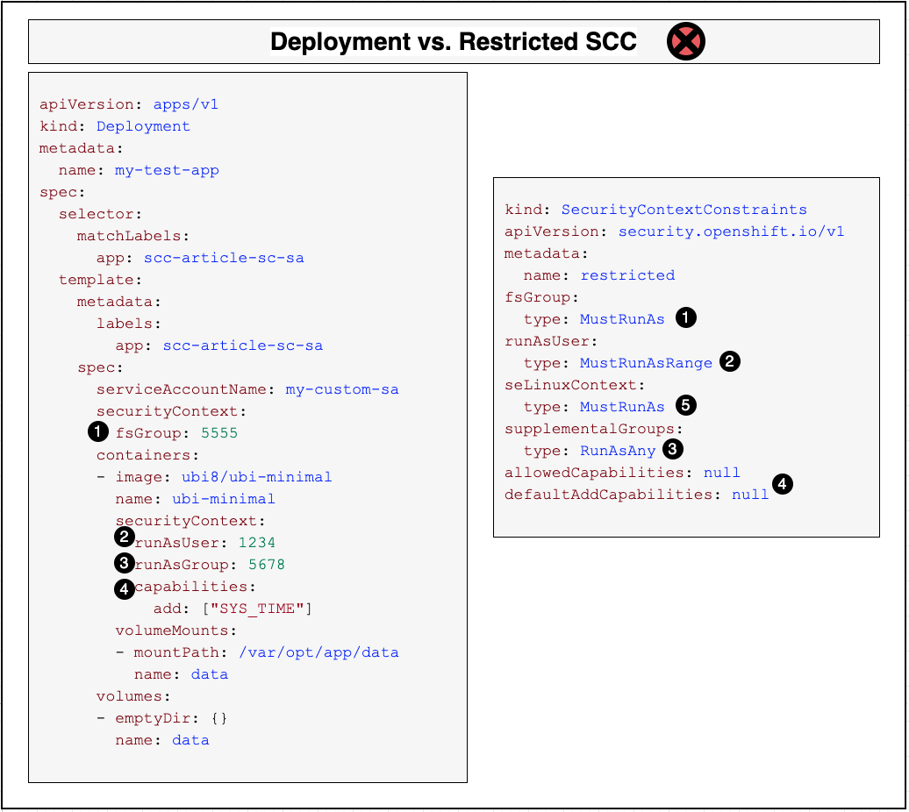
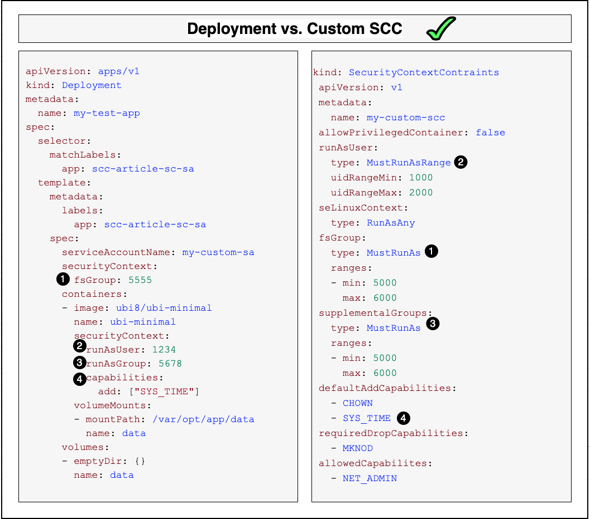

This learning path has covered numerous security context constraints (SCCs) concepts -- predefined and custom, how they specify permissions, and how they're assigned to service accounts. So when does an SCC ever actually get used? This article answers that question by showing you how deployments specify permissions, and by walking you through the SCC admission process.

An SCC is used by a deployment that contains an application that requires additional permissions to run correctly. The deployer specifies these permissions by configuring two fields in the deployment manifest. A deployer uses a deployment manifest to create a deployment, the object that deploys and manages pods. Here is an example of a YAML deployment manifest:

```yaml
apiVersion: apps/v1
kind: Deployment
metadata:
  name: my-test-app
spec:
  selector:
    matchLabels:
      app: scc-article-sc-sa
  template:
    metadata:
      labels:
        app: scc-article-sc-sa
    spec:
      serviceAccountName: my-custom-sa
      securityContext:
        fsGroup: 5555
      containers:
      - image: ubi8/ubi-minimal
        name: ubi-minimal
        command: ['sh', '-c', 'echo "Hello from user $(id -u)" && sleep infinity']
        securityContext:
          runAsUser: 1234
          runAsGroup: 5678
          capabilities:
            add: ["SYS_TIME"]
        volumeMounts:
        - mountPath: /var/opt/app/data
          name: data
      volumes:
      - emptyDir: {}
        name: data      
```

When the application running in a pod requires additional permissions, the deployment must request those permissions -- so the deployer must specify them in the manifest. The deployer uses two fields to specify the permissions:

* **`serviceAccountName`** -- Specifies the service account to use to deploy the pods. As shown earlier, the service account can have an SCC assigned to it either directly or indirectly via a role or group.
* **`securityContext`** -- Specifies the permissions needed either by a particular container or by all of the containers in the pod. To be accepted, the permissions must match those allowed by the service account's SCC.

The deployment manifest shown above contains two security contexts:

* **Pod security context** -- The `spec.template.spec.securityContext` field requests permissions for all of the containers in the pod (even though the pod only defines a single container).
* **Container security context** -- The `spec.template.spec.containers[].securityContext` field requests permissions needed by that particular container.

The pod's security context values specify the group IDs that can be assigned to all containers running in the pod. For example:

* **fsGroup: 5555** -- Requests that the owner for mounted volumes and files created in that volume is set to GID 5555.

The container's security context values specify how the cluster should configure the container. For example:

* **runAsUser: 1234** -- requests that the container run as user ID 1234.
* **runAsGroup: 5678** -- requests that the container run as group ID 5678.
* **capabilities:add** - requests that the container be allowed to run `SYS_TIME`.

Save this deployment manifest in a file named `my-test-app.yaml` and create the deployment by running this command:

```bash
oc create -f my-test-app.yaml
```

Once the workload is deployed, you can use the following commands to manage it:

```bash
oc describe deployment/my-test-app
oc get events | grep replicaset/my-test-app
oc delete deployment/my-test-app
```

## Putting it together: SCC admission process

Using the examples above, let's walk through the OpenShift SCC admission process to determine whether it allows the cluster to deploy our pod.

### Project SCC defaults

Each [project](https://docs.openshift.com/container-platform/4.6/applications/projects/working-with-projects.html) in an OpenShift cluster provides default values and ranges for some of the settings specified in an SCC. Each SCC can override these defaults. Let's take a look at these default settings.

Run this command to create a new project named `scc-test-project`:

```bash
oc new-project scc-test-project
```

The project's YAML includes annotations with default values for the project's SCCs (the values in your project will probably be different):

```yaml
$ oc get project scc-test-project -o yaml
...
apiVersion: project.openshift.io/v1
kind: Project
metadata:
  name: scc-test-project
  annotations:
    openshift.io/sa.scc.mcs: s0:c26,c5
    openshift.io/sa.scc.supplemental-groups: 1000000000/10000
    openshift.io/sa.scc.uid-range: 1000000000/10000
...
```

The annotations define default values for:

* **SELinux options** -- If the SCC sets `seLinuxContext.type` to `MustRunAs` and does not set the `seLinuxContext.seLinuxOptions`, then the project's Multi-Category Security (MCS) option is used as the default SELinux option.
* **group IDs** -- If the SCC sets the `supplementalGroups.type` to `MustRunAs` but does not specify the range, the project's supplemental groups range is used by default.
* **user IDs** -- If the SCC sets the `runAsUser.type` to `MustRunAsRange` but does not specify the range, the project's user ID range is used by default.

See [Creating a custom SCC](/learningpaths/secure-context-constraints-openshift/openshift-predefined-scc/#creating-a-custom-scc) and [Examining the restricted SCC](/learningpaths/secure-context-constraints-openshift/openshift-predefined-scc/#examining-the-restricted-scc) in the article "Predefined vs. custom SCCs," for examples of SCCs with these settings.

_**Note:** The range 1000000000/10000 means 10,000 values starting with ID 1000000000, so it specifies the range of IDs from 1000000000 to 1000009999._

Next, let's look at two examples of admission control deploying a manifest that specifies security options -- an example with an SCC that's too restrictive and an example with an SCC that has sufficient permissions.

### Admission with the restricted SCC

Let's see how admission control compares the example deployment manifest to the `restricted` SCC.



1. **FAIL**: The manifest requests `fsGroup: 5555`. The SCC is set to `MustRunAs`, which means the requested ID must be within the specified range. Since the SCC does not provide a range, the project's default range is used. In this case, `5555` is not in the range `1000000000-1000009999`.
1. **FAIL**: The manifest requests `runAsUser: 1234`. The SCC is set to `MustRunAsRange`, which means the requested ID  must be within the specified range. Since the SCC does not provide a range, the project's default range is used. In this case, `1234` is not in the range `1000000000-1000009999`.
1. **PASS**: The manifest request `runAsGroup: 5678`. The SCC is set to `RunAsAny`, which means the group ID `5678` is allowed and will be assigned to all containers.
1. **FAIL**: The `SYS_TIME` capability is not specifically allowed by the SCC (not listed in either `allowedCapabilities` or in `defaultAddCapabilities`).
1. **Note:** Since the SCC sets the `seLinuxContext` to `MustRunAs` but doesn't specify the context, the container is assigned the project's default context value, `s0:c26,c5`.

### Admission with a custom SCC

Now let's try admission control on the same deployment manifest and our *custom* SCC.



1. **PASS**: The manifest requests `fsGroup: 5555`. The SCC is set to `MustRunAs`, which means the requested ID must be within the specified range `5000-6000`, which it is.
1. **PASS**: The manifest requests `runAsUser: 1234`. The SCC is set to `MustRunAsRange`, which means the requested ID must be within the specified range `1000-2000`, which it is.
1. **PASS**: The manifest requests `runAsGroup: 5678`. The SCC is set to `MustRunAs`, which means the requested ID must be within the specified range `5000-6000`, which it is.
1. **PASS**: The `SYS_TIME` capability is allowed by default by the SCC.

## Summary

You should now have a good understanding of what SCCs are and how you can use them to enforce pod security in an OpenShift cluster.

The key concepts covered in this learning path so far include:

* To enable accessing protected functions, a deployer writes a deployment manifest for the pod that specifies:
  * A security context (for the pod and/or for each container) requesting the permissions needed by the application. This includes privileges, access control, and capabilities.
  * A service account that the deployer expects to be able to grant these permissions.
* For the request to be granted, the administrator must assign a security context constraint (SCC) that grants these permissions to the service account. The SCC can be assigned directly to the service account, or ideally via an RBAC role.
* SCCs are used to restrict pod capabilities. They can be tailored to allow specific pod permissions.
* An SCC may be one of OpenShift's predefined SCCs or may be a custom SCC.
* If the SCC grants the permissions that the pod requests, the admission process allows the pod to deploy.

To get hands-on experience using SCCs, see this article's accompanying tutorial, "[Use security context constraints to restrict and empower your OpenShift workloads](/learningpaths/secure-context-constraints-openshift/scc-tutorial/)."