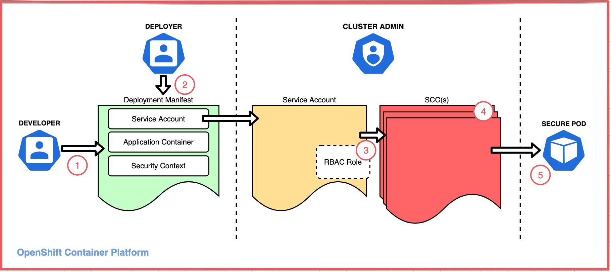
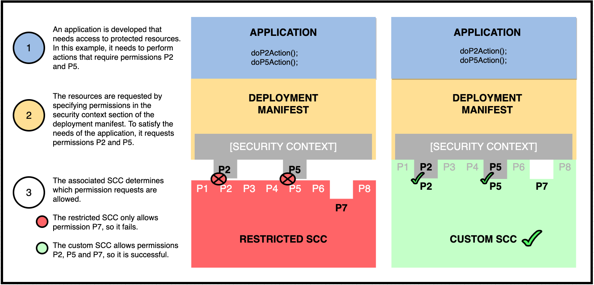
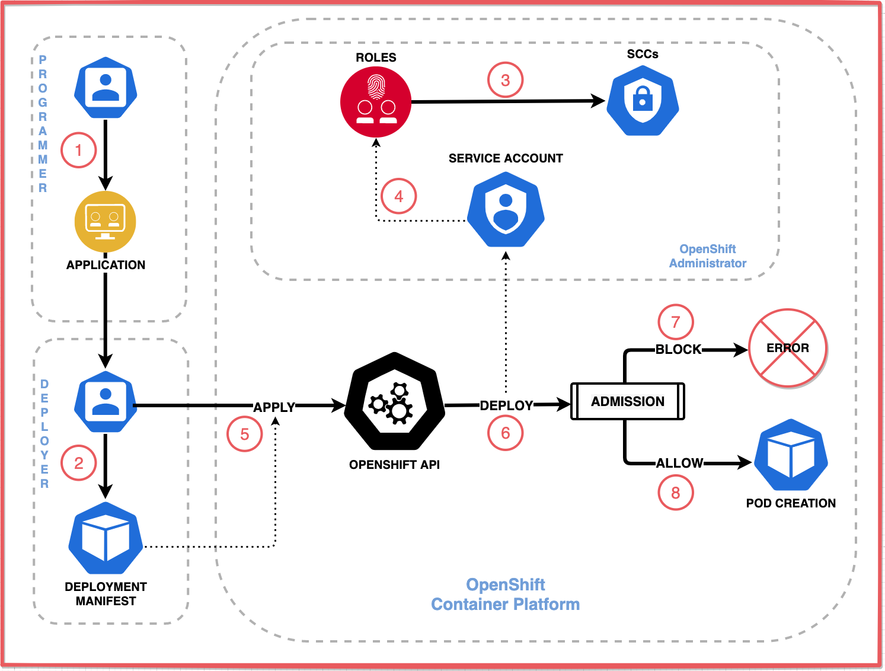

Red Hat OpenShift には、コンテナ化されたアプリケーションが保護された Linux 機能にアクセスできるようにする一対の重要な機能、セキュリティコンテキストとセキュリティコンテキスト制約が含まれています。この記事では、セキュリティコンテキスト (SC) とセキュリティコンテキスト制約 (SCC) を紹介し、コンテナ環境でのアクセス問題を解決する方法を説明します。このラーニングパスの今後の記事では、SC と SCC の実装と管理方法について説明します。

このラーニングパスでは、アプリケーションをOpenShiftクラスターにデプロイする方法と、クラスターがワークロードを管理する方法について一般的に理解していることを前提としています。

## コンテナで保護されたLinux機能にアクセスする

デフォルトでは、OpenShift はクラスタ内で実行されているコンテナが保護された機能にアクセスできないようになっています。これらの機能（共有ファイルシステム、ルートアクセス、`KILL`コマンドなどの一部のコア機能などのLinux機能）は、同じLinuxカーネルで実行されている他のコンテナに影響を与える可能性があるため、クラスターはアクセスを制限します。ほとんどのクラウド・ネイティブ・アプリケーションはこの制限で問題なく動作しますが、一部のアプリケーション（特にステートフルなワークロード）はより大きなアクセスを必要とします。これらの機能を必要とするアプリケーションは引き続き使用できますが、クラスターの許可が必要です。

アプリケーションの*セキュリティ・コンテキスト*は、アプリケーションが必要とするパーミッションを指定し、クラスタの*セキュリティ・コンテキスト制約*は、クラスタが許可するパーミッションを指定します。SCCを持つSCは、アプリケーションがアクセスを要求する一方で、クラスターが許可するアクセスを制限することができます。

## SCCによるアプリケーションの保護機能へのアクセス制御

保護された機能へのアクセスは、アプリケーションではなく、アプリケーションの環境で制御されます。これにより、不正なアプリケーションやハッキングされたアプリケーションであっても、保護された機能へのアクセスを自らに付与することはできません。アクセスの設定は、（危険性のある）アプリケーションではなく、アプリケーションコンテナを作成するポッドと、それを実行するクラスタによって行われます。アプリケーションは、ポッドが要求し、クラスターが承認した機能にのみアクセスできます。

ポッドは、そのアプリケーションが実行する必要のある保護された機能を指定します。もちろん、クラスターはアプリケーションが好きなようにアクセスを要求できるようにしてはいけません。そうでなければ、コンテナの隔離性が大幅に低下してしまいます。セキュリティを強化するために、クラスターはポッドが有効にできるアクセスを制限し、一部のポッドが他のポッドにはできないアクセスを有効にできるようにします。

ポッドは、アプリケーションのコンテナを作成する際に、指定したアクセスを許可するようにコンテナを構成します。アプリケーションが保護された機能を実行しようとすると、ポッドがその機能へのアクセスを許可するようにコンテナを構成していない限り、Linuxはそれをブロックする。

アプリケーションの保護された機能へのアクセスは、3つのペルソナ間の合意である。

* 保護された機能を実行するアプリケーションを作成する *開発者* 。
* アプリケーションが必要とするアクセスの種類を指定するデプロイメントマニフェストを作成する *デペロッパー*。
* 配置に指定されたアクセスを許可するかどうかを決定する *administrator* 。

この図は、アプリケーションが機能にアクセスするためのコンポーネントとプロセスを示しています。

1. 開発者が、保護された関数へのアクセスを必要とするアプリケーションを作成します。

1. 1. デプロイヤーは、アプリケーションをデプロイするための *デプロイメントマニフェスト* を、以下を構成するポッド仕様とともに作成します。
    * アプリケーションが必要とするアクセスを指定し、それを要求する *security context* (ポッドおよび/または各コンテナ用)
    * 要求されたアクセスを許可するための *サービスアカウント* 。
1. 管理者は、要求されたアクセスを許可するサービスアカウントに *セキュリティコンテキスト制約* を割り当てることで、ポッドが指定されたとおりに Linux を構成できるようにします。
    * SCCは、サービスアカウントに直接割り当てることも、ロールベースのアクセスコントロール（RBAC）のロールやグループを介して間接的に割り当てることもできます。
1. SCC は、OpenShift の定義済み SCC のいずれかであるか、またはカスタム SCC である可能性があります。
1. SCC がアクセスを許可した場合、アドミッションプロセスによってポッドのデプロイが許可され、ポッドは指定されたとおりにコンテナを構成します。

_**Note:** OpenShift のサービスアカウントは、通常のユーザーの認証情報を使用せずにプログラムで使用できる特別なタイプのユーザーアカウントです。

クラスタは、SCC がセキュリティコンテキストで要求された権限を付与した場合にのみ、ポッドを展開します。ポッドが起動すると、ポッドのセキュリティコンテキストに記載されているとおりにコンテナを構成します。

関係するペルソナと、そのペルソナがたどる一般的なプロセスがわかったところで、そのペルソナが使用するコンポーネントを詳しく見ていきましょう。

## セキュリティコンテキストとセキュリティコンテキスト制約とは？

ポッドは、ポッドのセキュリティコンテキストで要求され、クラスタのセキュリティコンテキスト制約で承認されたパーミッションでコンテナのアクセスを構成します。

ポッドで定義された_セキュリティコンテキスト(SC)により、デプロイヤーは保護された機能にアクセスするコンテナのパーミッションを指定することができます。ポッドはコンテナを作成する際に、これらのパーミッションを許可し、他のすべてのパーミッションをブロックするようにコンテナを構成します。クラスタは、ポッドが要求するパーミッションが対応するSCCによって許可されている場合にのみ、ポッドをデプロイします。

クラスタで定義された_[security context constraint](https://docs.openshift.com/container-platform/4.6/authentication/managing-security-context-constraints.html)_(SCC)により、管理者はポッドのパーミッション（保護されたLinux機能へのコンテナのアクセスを管理するパーミッション）を制御することができます。ロールベースのアクセスコントロール（RBAC）がユーザーのクラスタのリソースへのアクセスを管理するのと同様に、SCCはポッドのLinux機能へのアクセスを管理します。デフォルトでは、ポッドには、保護された機能へのアクセスをブロックする「restricted」という名前のSCCが割り当てられます。アプリケーションが保護された機能にアクセスするためには、クラスターはポッドが利用できるようにSCCを作成する必要があります。

_**Note:** SCCの施行は、Red Hat Enterprise Linux（RHEL）とRed Hat Enterprise Linux CoreOS（RHCOS）の両方のカーネルに含まれているセキュリティモジュール、SELinuxとAppArmorを使用して実装されています。OpenShift v4 クラスタのノードは、Red Hat の Linux ディストリビューションのいずれかでしか実行できないため、カーネルにこれらのモジュールが含まれていることが保証されています。

## ポッドが追加アクセスを要求する方法

SCCは保護された機能へのアクセスを許可しますが、そのアクセスを利用したい各ポッドはアクセスを要求する必要があります。アプリケーションが必要とする機能へのアクセスを要求するために、ポッドはポッドマニフェストのセキュリティコンテキストフィールドでパーミッションを指定します。マニフェストでは、このアクセスを許可するサービス アカウントも指定します。マニフェストがディプロイされると、クラスターはポッドをSCCに関連付けられたサービスアカウントに関連付けます。クラスタがポッドをディプロイするためには、SCCがポッドが要求するパーミッションを付与する必要があります。

この関係をイメージするには、SCCをLinuxの機能を保護するロック、マニフェストをキーと考えるとよいでしょう。鍵が合う場合にのみ、ポッドのデプロイが許可されます。

この図はその関係を表しています。

この図では、左のSCCでブロックされ、右のSCCで許可されている配置を示しています。どちらの例でも、ポッドはそのセキュリティコンテキストで、任意のラベルを付けた P2 と P5 の 2 つのパーミッションへのアクセスが必要であると指定しています。最初の例では、非常に制限的なSCCが、そのセキュリティコンテキストでマニフェストが要求したアクセスを許可しないため、クラスタはポッドのデプロイを拒否します。2 番目の例では、カスタム SCC がそのセキュリティ コンテキストでマニフェストが要求するアクセスを _does_ 許可しているため、クラスターはポッドのディプロイを続行します。

_**重要**です。ベストプラクティスとして、各カスタムSCCは[Principle of Least Privilege](https://redhat-connect.gitbook.io/best-practices-guide/principle-of-least-privilege)に従うべきであり、これは可能な限り少ないアクセスを許可することです。保護された機能がホテルの部屋のようなものだとすると、ユーザには必要な部屋へのアクセスのみを許可することが重要です。SCCを使用してポッドを特権ユーザーまたはルートユーザーとして実行することができますが、これは非常に控えめにポッドに付与すべきです。

## パーミッションの承認フローを示す展開シナリオ

SCC が OpenShift クラスタ上でどのようにアクセスを制御するかをよりよく理解するために、デプロイメント シナリオを見てみましょう。これにより、クラスタのアドミッション プロセスがデプロイメント マニフェスト、サービス アカウント、SCC を一緒に使用してポッドをデプロイするかどうかを決定する方法を確認できます。

この図は、デプロイメントプロセスを示しています。

1. *開発者*は、保護された機能へのアクセスを必要とするアプリケーションまたはサービスを実装し、そのアプリケーションをデプロイ担当者に渡します。
1. デプロイヤーは、アプリケーションのデプロイメント マニフェストを作成します。マニフェストでは、セキュリティ コンテキストとサービス アカウントを指定します。
1. *管理者*はロールを作成し、SCC を割り当てます。
1. *管理者*は、サービス・アカウントを作成し、ロールにバインドします。
1. 1. *deployer* はデプロイメント マニフェストを適用して、アプリケーションをデプロイします。
1. OpenShift はデプロイメントマニフェストを処理し、ポッドのデプロイを試みます。ディプロイメントプロセスは、マニフェストで指定されたサービスアカウントに基づいて使用する SCC を決定します。*アドミッションプロセス* は、マニフェストのセキュリティコンテキストを SCC と比較し、ポッドのディプロイをブロックするか許可するかを決定します。
1. *BLOCK:* 要求されたパーミッションの一部が付与されないため、ディプロイメントが失敗します。
1. 1. *ALLOW:* 要求されたパーミッションがすべて許可されるため、ディプロイメントはポッドを作成し、ポッドのセキュリティ コンテキストで説明されているようにコンテナを構成し、そのコンテナでアプリケーションを実行します。

要求されたパーミッションがポッドに与えられない場合、管理者は以下を行う必要があります。

* マニフェストに記載されている追加要求が実際に必要かどうかを判断する。
* 必要な場合は、要求されたパーミッションをSCCに割り当てるか、要求されたパーミッションをすでに持っているSCCを選択する。

## まとめ

SCとSCCとは何か、そしてSCCによってアプリケーションが保護された機能にアクセスできるようになることを理解したところで、この記事シリーズのパート2である「[How an SCC specifies permissions](/learningpaths/secure-context-constraints-openshift/scc-permissions/)」をチェックすることで、SCCがどのように機能するかの詳細をより深く理解することができます。

SCCの使用を実際に体験するには、付属のチュートリアル「[Use security context constraints to restrict and empower your OpenShift workloads](/learningpaths/secure-context-constraints-openshift/scc-tutorial/)」をチェックしてください。"

SCCがOpenShiftワークロードのセキュリティを確保する上で果たす役割を説明したビデオについては、"[Security-first certification for cloud-native workloads](https://developer.ibm.com/solutions/security/videos/security-first-certification-for-cloud-native-workloads/) "をご覧ください。

OpenShiftでのRBACロールバインディングの理解を深めるには、"[Multitenancy and role-based access control in Red Hat OpenShift](https://developer.ibm.com/technologies/containers/tutorials/multitenancy-and-role-based-access-control) "をご覧ください。