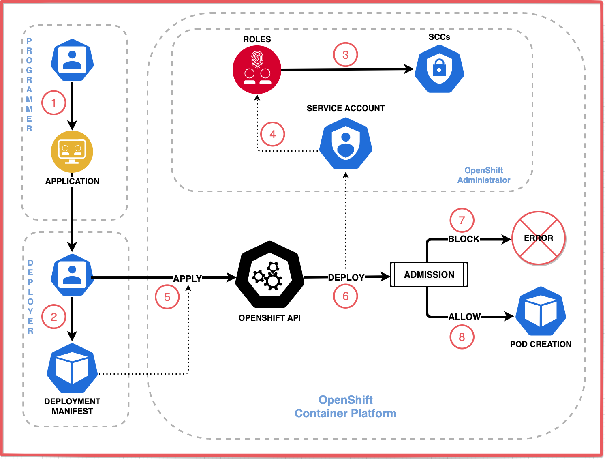

Red Hat OpenShift includes a pair of key features, security contexts and security context constraints, that allow containerized applications to access protected Linux functionality. This article introduces security contexts (SCs) and security context constraints (SCCs) and explains how they solve access problems in container environments. Upcoming articles in this learning path explain how to implement and administer SCs and SCCs.

This learning path assumes that you have a general understanding of how to deploy an application to an OpenShift cluster and how the cluster manages a workload.

## Accessing protected Linux functions in containers

By default, OpenShift prevents the containers running in a cluster from accessing protected functions. These functions -- Linux features such as shared file systems, root access, and some core capabilities such as the `KILL` command -- can affect other containers running in the same Linux kernel, so the cluster limits access to them. Most cloud-native applications work fine with these limitations, but some (especially stateful workloads) need greater access. Applications that need these functions can still use them, but they need the cluster's permission.

The application's *security context* specifies the permissions that the application needs, while the cluster's *security context constraints* specify the permissions that the cluster allows. An SC with an SCC enables an application to request access while limiting the access that the cluster will grant.

## Controlling applications' access to protected functions with SCCs

Access to protected functionality is not controlled by the application, but by the application's environment. This way, even a rogue or hacked application cannot grant itself access to protected functionality. The access is configured not by the application (which could be compromised) but rather by the pod that creates the application container and by the cluster that runs it. The application can only access the functions that the pod requests and that the cluster approves.

A pod specifies the protected functions its application needs to perform. Of course, the cluster shouldn't allow an application to request any access it wants, or containers would provide much less isolation. To enforce security, the cluster limits the access pods can enable, allowing some pods to enable access that others cannot.

When the pod creates the application's container, it configures the container to allow the access it specifies. If the application tries to perform a protected function, Linux will block it unless the pod has configured the container to allow access to that function.

An application's access to protected functions is an agreement between three personas:

* A *developer* who writes an application that performs protected functions
* A *deployer* who writes the deployment manifest that specifies which type of access the application requires
* An *administrator* who decides whether to grant the deployment the access it specifies

This diagram illustrates the components and process that allow an application to access functions:

1. A developer writes an application that needs access to protected functions.

1. A deployer creates a *deployment manifest* to deploy the application with a pod specification that configures:
    * A *security context* (for the pod and/or for each container) that specifies the access needed by the application, thereby requesting it
    * A *service account* to grant the requested access
1. An administrator assigns a *security context constraint* to the service account that grants the requested access, thereby allowing the pod to configure Linux as specified.
    * The SCC can be assigned directly to the service account or indirectly via an role-based access control (RBAC) role or group.
1. The SCC may be one of OpenShift's predefined SCCs or it may be a custom SCC.
1. If the SCC grants the access, the admission process allows the pod to deploy and the pod configures the container as specified.

_**Note:** An OpenShift service account is a special type of user account that can be used programmatically without using a regular user’s credentials._

A cluster only deploys a pod if the SCC grants the permissions requested in the security context. When the pod starts, it configures the container as described in the pod's security context.

Now that you know the personas involved and the general process that they follow, let's take a closer look at the components they use.

## What are security contexts and security context constraints?

A pod configures a container's access with permissions requested in the pod's security context and approved by the cluster's security context constraints:

A _security context_ (SC), defined in a pod, enables a deployer to specify a container's permissions to access protected functions. When the pod creates the container, it configures the container to allow these permissions and block all others. The cluster will only deploy the pod if the permissions it requests are allowed by a corresponding SCC.

A _[security context constraint](https://docs.openshift.com/container-platform/4.6/authentication/managing-security-context-constraints.html)_ (SCC), defined in a cluster, enables an administrator to control permissions for pods, permissions that manage containers' access to protected Linux functions. Similarly to how role-based access control (RBAC) manages users' access to a cluster's resources, an SCC manages pods' access to Linux functions. By default, a pod is assigned an SCC named `restricted` that blocks access to protected functions. For an application to access protected functions, the cluster must make an SCC that allows it to be available to the pod.

_**Note:** SCC enforcement is implemented using SELinux and AppArmor, security modules that are included in the kernel of both Red Hat Enterprise Linux (RHEL) and Red Hat Enterprise Linux CoreOS (RHCOS). The nodes in an OpenShift v4 cluster can only run on one of Red Hat's Linux distributions, guaranteeing that the kernel will include those modules._

## How a pod requests additional access

While an SCC grants access to protected functions, each pod that wants to use that access must request it. To request access to the functions its application needs, a pod specifies those permissions in the security context field of the pod manifest. The manifest also specifies the service account that should be able to grant this access. When the manifest is deployed, the cluster associates the pod with the service account, which is associated with the SCC. For the cluster to deploy the pod, the SCC must grant the permissions that the pod requests.

One way to envision this relationship is to think of the SCC as a lock that protects Linux functions, while the manifest is the key. The pod is allowed to deploy only if the key fits.

This diagram illustrates that relationship:

The diagram shows a deployment that is blocked by the SCC on the left and is allowed by the SCC on the right. In both examples, the pod specifies in its security context that it needs access to two permissions arbitrarily labeled P2 and P5. In the first example, a very restrictive SCC _does not_ grant the access the manifest requests in its security context, so the cluster refuses to deploy the pod. In the second example, a custom SCC _does_ grant the access the manifest requests in its security context, so the cluster proceeds with deploying the pod.

_**IMPORTANT**: As a best practice, each custom SCC should subscribe to the [Principle of Least Privilege](https://redhat-connect.gitbook.io/best-practices-guide/principle-of-least-privilege), which is to grant as little access as possible. If protected functions are like rooms in a hotel, it's important to only allow users access to the rooms they need. While an SCC can be used to allow a pod to run as a privileged user or the root user, this should be granted to pods very sparingly._

## Deployment scenario showing the permissions approval flow

To better understand how SCCs control access on an OpenShift cluster, let's walk through a deployment scenario so you can see how the cluster's admission process uses the deployment manifest, service account, and SCC together to determine whether to deploy a pod.

This diagram illustrates the deployment process:

1. The *developer* implements an application or service that requires access to protected functions, and delivers the application to the deployer.
1. The *deployer* creates a deployment manifest for the application. The manifest specifies a security context and a service account.
1. The *administrator* creates a role and assigns it an SCC.
1. The *administrator* also creates a service account and binds it to the role.
1. The *deployer* applies the deployment manifest, thereby deploying the application.
1. OpenShift processes the deployment manifest and attempts to deploy the pod. The deployment process determines which SCC to use based on the service account specified in the manifest. The *admission process* compares the security context of the manifest against the SCC and decides whether to block or allow the pod to deploy.
1. *BLOCK:* Some requested permissions are not granted, so the deployment fails.
1. *ALLOW:* All requested permissions are granted, so the deployment creates the pod, configures the container as described by the pod's security context, and runs the application in that container.

If the pod is denied the requested permissions, then the administrator needs to:

* Determine if the additional requests made in the manifest are in fact needed.
* If so, assign the requested permissions to the SCC or select an SCC that already has the requested permissions.

## Summary

Now that you understand what SCs and SCCs are and how they enable applications to gain access to protected functions, you can dig deeper into the details of how SCCs work by checking out part 2 of this article series, "[How an SCC specifies permissions](/learningpaths/secure-context-constraints-openshift/scc-permissions/)."

To get hands-on experience using SCCs, check out the accompanying tutorial, "[Use security context constraints to restrict and empower your OpenShift workloads](/learningpaths/secure-context-constraints-openshift/scc-tutorial/)."

For a video that describes the role SCCs play in securing OpenShift workloads, watch "[Security-first certification for cloud-native workloads](https://developer.ibm.com/solutions/security/videos/security-first-certification-for-cloud-native-workloads/)."

To gain a better understanding of RBAC role bindings in OpenShift, see "[Multitenancy and role-based access control in Red Hat OpenShift](https://developer.ibm.com/technologies/containers/tutorials/multitenancy-and-role-based-access-control)."