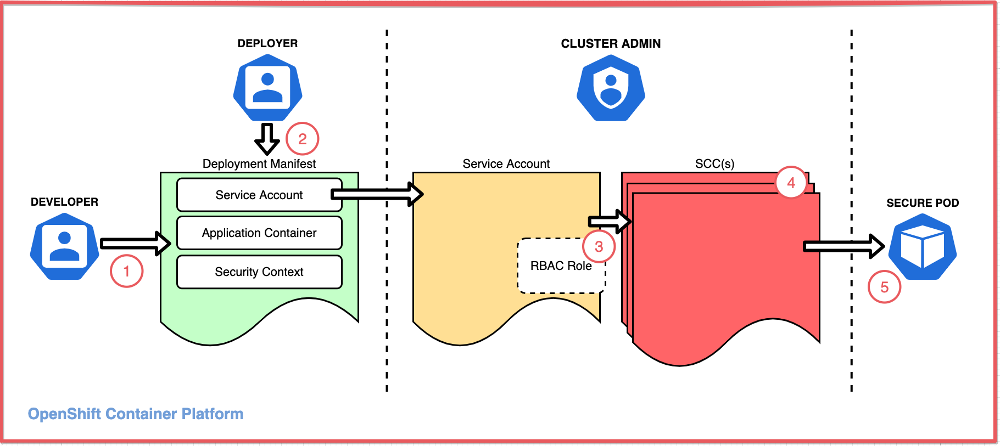

This hands-on tutorial is for developers and cluster administrators who are interested in learning how to deploy workloads on a Red Hat OpenShift cluster that need access to protected Linux functions. It shows you how to specify secure contexts (SCs) in the deployment manifest to configure the container with the access the application needs. It also teaches how to configure security context constraints (SCCs) to grant that access to the deployment.

By default, a container blocks its process from invoking protected functions. The security context (SC) must explicitly request access to perform functions such as:
* Run the process as a specific user or group
* Make the process a member of additional groups
* Run a privileged container
* Execute protected commands such as the `KILL` command

The deployment can request this access, but an SCC must approve it. This tutorial shows how to configure a custom SCC with the smallest set of permissions necessary to perform its work, and how to associate a deployment with this custom SCC. This best practice helps to protect your cluster from both intentional and accidental harm while providing a way to request and grant additional permissions when necessary.

## Learning objectives

In this tutorial, you will create a simple deployment. Deployments bring up pods as requested in a spec. This tutorial uses a simple pod that mounts an ephemeral volume and runs a single container. You can use a remote shell to run commands on the container to examine its runtime environment and permissions.

You will learn how to:

* Check the pod YAML to see what SC is configured and what SCC was assigned
* Test access permissions using a default service account and a default SC
* Find an error event that shows an SCC validation error
* Create an SCC and assign it to a service account
* Use an SC that requests special permissions with an SCC that allows them

## Security context constraints concepts

Before attempting this hands-on tutorial, you should understand how SCCs are used. The article "[Overview of security context constraints](https://developer.ibm.com/learningpaths/secure-context-constraints-openshift/intro/)" explains these overall concepts, which are summarized as follows.

An application's access to protected functions is an agreement between three personas:

* A **developer** who writes an application that accesses protected functions
* A **deployer** who writes the deployment manifest that must request the access the application requires
* An **administrator** who decides whether to grant the deployment the access it requests

This diagram illustrates the components and process that allow an application to access resources:



1. A developer writes an application that needs access to protected functions
1. A deployer creates a **deployment manifest** to deploy the application with a pod spec that configures:
    * A **security context (SC)** (for the pod and/or for each container) that requests the access needed by the application, thereby requesting it
    * A **service account** to grant the requested access
1. An administrator assigns a **security context constraint (SCC)** to the service account that grants the requested access. The SCC can be assigned directly to the service account or indirectly via an RBAC role or group.
1. The SCC may be one of OpenShift's predefined SCCs or it may be a custom SCC.
1. If the SCC grants the access, the admission process allows the pod to deploy and the pod configures the container as specified.

_**Note:** An OpenShift service account is a special type of user account that is used programmatically without using a regular user’s credentials._

## Prerequisites

* Access to an OpenShift cluster
* Cluster admin permissions
* The OpenShift CLI (`oc`)
* A bash or zsh terminal (or similar)
* An OpenShift project to work in

**Optional:** You'll need to copy and paste some code, either from this document or from the [GitHub repo](https://github.com/IBM/scc-tutorial-assets). You can either view the repo in a browser and copy the code from there, or you can clone the repo to create a local copy of the code.

_**Note:** This tutorial demonstrates how SCCs can manage file access permissions and ownership settings using Linux features like user, group, file system group, and supplemental groups. For a refresher on these features, check out "[Learn Linux, 101: Manage file permissions and ownership](https://developer.ibm.com/tutorials/l-lpic1-104-5/)."_

## Estimated time

It should take you about 1 hour to complete this tutorial.

## Steps

1. [Create a default deployment](#step-1-create-a-default-deployment)
    * Simulate an application using a base image
    * Examine the default SC and SCC
    * Test your container's runtime permissions
1. [Attempt a deployment with SCs](#step-2-attempt-a-deployment-with-scs)
    * Request special permissions for your deployment
    * See how a deployment fails when requesting privileges that are not assigned
1. [Create and assign an SCC](#step-3-create-and-assign-an-scc)
    * Create an SCC to allow your deployment's SCs
    * Create a role that uses the SCC
    * Bind the role to a service account
1. [Create a deployment using the service account that uses the SCC](#step-4-create-a-deployment-using-the-service-account-that-can-use-the-scc)
    * Validate the deployment with an SCC
    * Examine the resulting SCs and selected SCC
    * Test your container's new runtime permissions

### Personas

Steps 1, 2, and 4 are performed by a user with permission to create deployments (the deployer). The deployer is responsible for specifying SCs to request the permissions required by the pod and the container. The deployer can also select the service account that is used to validate the requested permissions.

Step 3 is performed by a cluster admin. Creating and assigning SCCs can be done to restrict permissions, but it can also relax permissions and create vulnerabilities. Because of this, the cluster admin must determine which SCCs should be allowed in the cluster and when to assign them to project service accounts.

_**WARNING**: Once privileges are given to an SCC and the SCC is granted to a project service account (for example, via a role binding), any deployer in the project can take advantage of those privileges._

### Step 1: Create a default deployment

This first step shows you how to:

* Simulate an application using a base image
* Examine the default SCs and SCC
* Test your container's runtime permissions

You will see:

* The SCC that was assigned by default
* The default SCs added for your pod and container
* The user ID assigned to run the container
* The user's group memberships
* How the user ID and group memberships affect data access

#### Simulate an application using a base image

You will experiment with permissions using a simple container to simulate an application writing to the file system. Instead of an application with a GUI, you'll run a container that is nothing more than a base image and use a shell in that container. Instead of a file system, you'll mount an `emptyDir` volume within the container. With this, you can run Linux commands on the ephemeral mounted volume to test the privileges and access controls.

1. Start in a terminal:

    * Log in with your credentials.
    * Switch to the project.

    ```bash
    oc login <your-credentials>
    oc project <your-project>
    ```

1. Download the deployment manifest YAML file from [this GitHub repo](https://github.com/IBM/scc-tutorial-assets/blob/main/deploy_default.yaml), or copy/paste and save it to a file named `deploy_default.yaml`.

    ```yaml
    apiVersion: apps/v1
    kind: Deployment
    metadata:
      name: scc-tutorial-deploy-default
    spec:
      selector:
        matchLabels:
          app: scc-tutorial-default
      template:
        metadata:
          labels:
            app: scc-tutorial-default
        spec:
          containers:
          - image: ubi8/ubi-minimal
            name: ubi-minimal
            command: ['sh', '-c', 'echo "Hello from user $(id -u)" && sleep infinity']
            volumeMounts:
            - mountPath: /var/opt/app/data
              name: data
          serviceAccountName: default
          volumes:
          - emptyDir: {}
            name: data
    ```

1. Run the following command to create the deployment:

    ```bash
    oc create -f deploy_default.yaml
    ```

#### Examine the default SCs and SCC

You can get the full YAML description of the pod to see the details. For this tutorial, the interesting part is the annotation that shows which SCC was used, the container's SC, and the pod's SC. In this example, our manifest explicitly specifies the `default` service account for completeness, a setting that's usually left implied.

You can use the OpenShift Web Console or use the `oc` command-line interface in your terminal to see the results.

##### Using the command-line interface

* To get the details for the pod, use `oc get` with the label `app=scc-tutorial-default` and the `yaml` output option:

  ```bash
  oc get pod -l app=scc-tutorial-default -o yaml
  ```

* The following code listing highlights the interesting parts. We explain them more in the next section:

  ```yaml
    ...
    metadata:
      annotations:
        ...
        openshift.io/scc: restricted
        ...
    spec:
      containers:
        ...
        securityContext:
          capabilities:
            drop:
            - KILL
            - MKNOD
            - SETGID
            - SETUID
          runAsUser: 1000620000
          ...
      securityContext:
        fsGroup: 1000620000
        seLinuxOptions:
          level: s0:c25,c10
      serviceAccount: default
      serviceAccountName: default
      ...
  ```

##### Using the OpenShift Web Console

  * Check the status of your deployment:

      * Use the sidebar pull-down menu to select **Administrator**.
      * Expand **Workloads**.
      * Select **Deployments**.
      * **Status** should say "1 of 1 pods."

      

  * Check the details of your pod:

      * Click the deployment status "1 of 1 pods" link.
      * Click the pod name `scc-tutorial-deploy-default-<generated-suffix>`.
      * Select the **YAML** tab.

      

##### What did you find?

* The pod YAML shows the SCC that was assigned.

  * The SCC is shown in `annotations`.
  * The default deployment got the `restricted` SCC. This was the highest priority and most restrictive SCC available to the service account.

  

* Scroll down to see the service account, pod SC, and container SC.

  * `serviceAccountName` is `default`. You will change this later.
  * `securityContext` for the pod was given `seLinuxOptions` and an `fsGroup` setting. These came from the project defaults.
  * `securityContext` for the container was given some specific `capabilities` to `drop` and a `runAsUser`. These are also from the project defaults. Notice that the container's `runAsUser` is the same as the pod's `fsGroup`.

  

#### Test your container's runtime permissions

Let's see how these settings affect your container's runtime permissions.

1\. Use the OpenShift Web Console or use the `oc` command-line interface in your terminal to see the results.

##### Using the command-line interface**

  * Get the pod name:

  ```bash
  oc get pod -l app=scc-tutorial-default
  ```

  * Remote shell into the pod's container:

  ```bash
  oc rsh <pod-name>
  ```

##### Using the OpenShift Web Console**

  * Select the `Terminal` tab on the pod details page:

    

2\. Check the user ID and group memberships:

| Command | Description |
| ---    | ---      |
| whoami | Show your user ID |
| id | Show your user ID (uid), group ID (gid), and group memberships |

What does this show?

* With the restricted SCC, you got the user ID and group IDs from the project defaults. Remember, you did not specify any user ID or group ID in your deployment manifest.
* The user ID is the one that you saw assigned in the container `securityContext.runAsUser`.
* This user ID is assigned to the root group (ID 0) as its default group ID.
* The user is also a member of the file system group. In this case, the file system group is the same as the user ID. This    is assigned in the pod `securityContext.fsGroup`.

3\. Let's see how the file system group was used for your volume:

| Command | Description |
| ---    | ---      |
| ls -ld / /tmp /var/opt/app/data | Show permissions on the root directory, the temp directory, and the mounted volume |

What does this show?

* The volume was mounted at `/var/opt/app/data` as specified in the manifest.
* The volume directory's group ID is the fsGroup ID, and "set-group-ID" mode is set (i.e. the sticky bit forces files created in this directory to be owned by this group ID).
* For comparison, the root and temp directories do not use the fsGroup ID. The temporary directory is writable for every user. The root directory is only writable for the root user.

4\. See what happens when you write a file:

| Command | Description |
| ---    | ---      |
| `echo hello > /var/opt/app/data/volume.txt` | Write to a file on the volume |
| `echo hello > /tmp/temp.txt` | Write to a file in the temp directory |
| `echo hello > /fail.txt` | Try to write a file in the root directory |
| `ls -l /tmp/temp.txt /var/opt/app/data/volume.txt` | Check the permissions on our files |


What does this show?

* The file that you wrote on the volume is owned by your user ID and file system group ID (because of the sticky bit). This is really significant. In the next step, you choose the group that you want to share files with (instead of this default ID).
* The file that you wrote in the temporary directory is owned by your user ID and your default group ID (root). You use this local file behavior to highlight the effect of the file system group on your mounted volume.
* You don't have write permission in the root directory. This emphasizes that you are not running as root or as a privileged user.

Now that you know how to avoid running as root, it's time to choose your user or group IDs.

### Step 2: Attempt a deployment with SCs

This step shows a scenario where you are deploying an application that needs a specific user ID and also requires a shared group ID for data access. This example covers the use cases mentioned earlier.

First, use SCs in your deployment manifest to specify the expected user ID and group IDs for your pod and container.

These SCs are validated against SCCs that are assigned to the service account. If there is not an SCC that can validate the SCs, then the pod will not start.

#### Request special permissions for your deployment

We added SCs for the pod and the container to request the following settings for access control:

* Run as user ID 1234.
* Run as group ID 5678.
* Add supplemental group IDs 5777 and 5888.
* Use a file system group ID of 5555.

1. Download the deployment manifest YAML file from [this GitHub repo](https://github.com/IBM/scc-tutorial-assets/blob/main/deploy_sc.yaml) or copy/paste and save it to a file named `deploy_sc.yaml`.

    ```yaml
    apiVersion: apps/v1
    kind: Deployment
    metadata:
      name: scc-tutorial-deploy-sc
    spec:
      selector:
        matchLabels:
          app: scc-tutorial-sc
      template:
        metadata:
          labels:
            app: scc-tutorial-sc
        spec:
          containers:
          - image: ubi8/ubi-minimal
            name: ubi-minimal
            command: ['sh', '-c', 'echo "Hello from user $(id -u)" && sleep infinity']
            securityContext:
              runAsUser: 1234
              runAsGroup: 5678
            volumeMounts:
            - mountPath: /var/opt/app/data
              name: data
          serviceAccountName: default
          securityContext:
            fsGroup: 5555
            supplementalGroups: [5777, 5888]
          volumes:
          - emptyDir: {}
            name: data
    ```

1. Run the following `oc create` command to create the deployment.

    ```bash
    oc create -f deploy_sc.yaml
    ```

#### See how a deployment fails when requesting privileges that are not assigned

1. Check for SCC errors.

    When a deployment fails due to SCC, you need to check the status of the replica set. Describe the deployment to check replica status:

    ```bash
    oc describe deployment/scc-tutorial-deploy-sc
    ```

    The output should show a `ReplicaFailure`:

    ```bash
    $ oc describe deployment/scc-tutorial-deploy-sc
    ...
    Replicas:               1 desired | 0 updated | 0 total | 0 available | 1 unavailable
    ...
    Conditions:
      Type             Status  Reason
      ----             ------  ------
      Progressing      True    NewReplicaSetCreated
      Available        False   MinimumReplicasUnavailable
      ReplicaFailure   True    FailedCreate
    OldReplicaSets:    <none>
    NewReplicaSet:     scc-tutorial-deploy-sc-5c4f64575c (0/1 replicas created)
    ...
    ```

    To get a more specific reason for the replica set failure, use `oc get events`:

    ```
    bash
    $ oc get events | grep replicaset/scc-tutorial-deploy-sc
    2m37s       Warning   FailedCreate        replicaset/scc-tutorial-deploy-sc-5c4f64575c        Error creating: pods "scc-tutorial-deploy-sc-5c4f64575c-" is forbidden: unable to validate against any security context constraint: [fsGroup: Invalid value: []int64{5555}: 5555 is not an allowed group spec.containers[0].securityContext.securityContext.runAsUser: Invalid value: 1234: must be in the ranges: [1000620000, 1000629999]]
    ```

    The `FailedCreate` warning clearly shows that you have been *unable to validate against any security context constraints* due to the `fsGroup` and `runAsUser` values.

    This error is expected because the deployment manifest has asked for specific permissions, and the default service account cannot use any SCC that allows these permissions. This tells you that either the deployer has requested too much access in the manifest or the cluster admin needs to provide an SCC that allows more access.

    It might look like the deployment hasn't deployed, but that's not the problem. A deployment named `scc-tutorial-deploy-sc` has been created. You can use either `oc get deployment` or the OpenShift Web Console to look for it. A replica set named `scc-tutorial-deploy-sc-<generated-suffix>` has also been created -- but both show 0-of-1 pods have been created, and the replica set has an event that explains the problem.

    So, instead of deploying an application that will eventually run into data access errors, you make it fail earlier with error messages that explain why. Failing early is definitely a good thing. By clearly indicating the special permissions needed by this application, the developer, the deployer, and the security administrator are better able to communicate the special security requirements of this deployment.

### Step 3: Create and assign an SCC

_**Note:** You must be a cluster admin for this step._

Now you will use SCCs along with role-based access controls (RBAC) to provide your workloads with the privileges they need to perform their work.

1. Download the YAML file from [this GitHub repo](https://github.com/IBM/scc-tutorial-assets/blob/main/scc-tutorial-scc.yaml) or copy/paste and save it to a file named `scc-tutorial-scc.yaml`:

    ```yaml
    kind: SecurityContextConstraints
    apiVersion: v1
    metadata:
      name: scc-tutorial-scc
    allowPrivilegedContainer: false
    runAsUser:
      type: MustRunAsRange
      uidRangeMin: 1000
      uidRangeMax: 2000
    seLinuxContext:
      type: RunAsAny
    fsGroup:
      type: MustRunAs
      ranges:
      - min: 5000
        max: 6000
    supplementalGroups:
      type: MustRunAs
      ranges:
      - min: 5000
        max: 6000
    ```

1. Run the following command to create the SCCs:

    ```bash
    oc create -f scc-tutorial-scc.yaml
    ```

1. Create a new service account:

    Run the following command to create a service account -- you don't want to modify the default one for this:

    ```bash
    oc create sa scc-tutorial-sa
    ```

1. Download the YAML file from [this GitHub repo](https://github.com/IBM/scc-tutorial-assets/blob/main/rbac.yaml) or copy/paste and save it to a file named `rbac.yaml`:

    ```yaml
    ---
    kind: Role
    apiVersion: rbac.authorization.k8s.io/v1
    metadata:
      name: use-scc-tutorial-scc
    rules:
      - apiGroups: ["security.openshift.io"]
        resources: ["securitycontextconstraints"]
        resourceNames: ["scc-tutorial-scc"]
        verbs: ["use"]
    ---
    kind: RoleBinding
    apiVersion: rbac.authorization.k8s.io/v1
    metadata:
      name: use-scc-tutorial-scc
    subjects:
      - kind: ServiceAccount
        name: scc-tutorial-sa
    roleRef:
      kind: Role
      name: use-scc-tutorial-scc
      apiGroup: rbac.authorization.k8s.io
    ```

1. Run the following command to create the role and bind it to your service account:

    ```bash
    oc create -f rbac.yaml
    ```

#### Review what you've done

As a cluster-admin:

* You created an SCC called `scc-tutorial-scc`.
* You created a service account called `scc-tutorial-sa`.
* You created a role and a role binding, both named `use-scc-tutorial-scc`.

As part of creating the role and role binding, you associated the SCC with the role and bound it to the service account. This associates the service account with the SCC such that any pod running as the service account has access to the SCC.

In the next step, as a deployer, you will use this service account to fix the deployment that failed to validate your SCs in the previous step.

### Step 4: Create a deployment using the service account that can use the SCC

Now you can validate the deployment with an SCC.

For the third try, change the service account name to use your new service account.

1. Download the YAML file from [this GitHub repo](https://github.com/IBM/scc-tutorial-assets/blob/main/deploy_sc_sa.yaml) or copy/paste and save it to a file named `deploy_sc_sa.yaml`.

    ```yaml
    apiVersion: apps/v1
    kind: Deployment
    metadata:
      name: scc-tutorial-deploy-sc-sa
    spec:
      selector:
        matchLabels:
          app: scc-tutorial-sc-sa
      template:
        metadata:
          labels:
            app: scc-tutorial-sc-sa
        spec:
          containers:
          - image: ubi8/ubi-minimal
            name: ubi-minimal
            command: ['sh', '-c', 'echo "Hello from user $(id -u)" && sleep infinity']
            securityContext:
              runAsUser: 1234
              runAsGroup: 5678
            volumeMounts:
            - mountPath: /var/opt/app/data
              name: data
          serviceAccountName: scc-tutorial-sa
          securityContext:
            fsGroup: 5555
            supplementalGroups: [5777, 5888]
          volumes:
          - emptyDir: {}
            name: data
    ```

1. Run the following command to create the deployment.

    ```bash
    oc create -f deploy_sc_sa.yaml
    ```

#### Examine after adding custom SCs and SCC

Now that you've customized the SCs and created a custom SCC to validate it, let's look at the results.

Get the full YAML description of the pod to see the details. For this tutorial, the interesting part is the annotation that shows what SCC was used, the container `securityContext`, and the pod `securityContext`. You also want to check that you used your `scc-tutorial-sa` service account.

Use the OpenShift Web Console or use the `oc` command-line interface in your terminal to see the results.

##### Using the command-line interface

* To get the details for the pod, use `oc get` with the label `app=scc-tutorial-sc-sa` and the `yaml` output option:

    ```bash
    oc get pod -l app=scc-tutorial-sc-sa -o yaml
    ```

* The following code listing highlights the interesting parts (we explain them more in the next section):

    ```yaml
      ...
      metadata:
        annotations:
          ...
          openshift.io/scc: scc-tutorial-scc
          ...
      spec:
        containers:
          ...
          securityContext:
            runAsGroup: 5678
            runAsUser: 1234
            ...
          volumeMounts:
          - mountPath: /var/opt/app/data
          ...
        securityContext:
          fsGroup: 5555
          supplementalGroups:
          - 5777
          - 5888
        serviceAccount: scc-tutorial-sa
        serviceAccountName: scc-tutorial-sa
        ...
    ```
##### Using the OpenShift Web Console

* Check the status of your deployment:

    1. Use the sidebar pull-down menu to select **Administrator**.
    1. Expand **Workloads**.
    1. Select **Deployments**.
    1. Find `scc-tutorial-deploy-sc-sa`.
    1. **Status** should say "1 of 1 pods."

    

* Check the details of your pod:

    1. Click on the deployment status **1 of 1 pods** link.
    1. Click on the pod name `scc-tutorial-deploy-sc-sa-<generated-suffix>`.
    1. Select the **YAML** tab.

##### What did you find?

* The pod YAML shows the SCC that was assigned.

  * The SCC is shown in `annotations`.
  * This deployment used the new `scc-tutorial-scc` SCC. This was the highest priority, most restrictive SCC that was able to validate your SCs (and was available to your service account).

  

* Scroll down to see the pod spec. Instead of defaults, you'll see that the manifest has determined the SCs:

  * `SecurityContext` for the pod was given `fsGroup: 5555` and `supplementalGroups: [5777, 5888]`.
  * `SecurityContext` for the container was given `runAsUser: 1234` and `runAsGroup: 5678`.
  * The volume was mounted at `/var/opt/app/data`.
  * `ServiceAccountName` is `scc-tutorial-sa` (the service account you just created and assigned your one SCC).

  

#### Test your container's runtime permissions

1\. Use the OpenShift Web Console or the `oc` command-line interface in your terminal to see the results.

##### Using the OpenShift Web Console**

  * Select the **Terminal** tab on the pod details page.

##### Using the command-line interface**

  * Get the pod name:

    ```bash
    oc get pod -l app=scc-tutorial-sc-sa
    ```

  * Remote shell into the pod's container:

    ```bash
    oc rsh <pod-name>
    ```

2\. Check the user ID and group memberships

| Command | Description |
| ---    | ---      |
| `whoami` | Show your user ID |
| `id` | Show your user ID (uid), group ID (gid), and group memberships |


What does this show?

* You are using the user ID (`uid`) or group ID (`gid`) from your deployment manifest.
* The supplemental groups that you requested have also been created, and your user is a member of those groups.
* The user is also a member of the file system group. This ID is specified in the pod `securityContext.fsGroup`.

3\. To see how the file system group was used for your volume, use this command:

| Command | Description |
| ---    | ---      |
| `ls -ld / /tmp /var/opt/app/data` | Show permissions on the root directory, the temp directory, and the mounted volume |


What does this show?

* The volume is mounted at `/var/opt/app/data` (as specified in the manifest).
* The volume directory's group ID is the `fsGroup` that you requested in your manifest.
* The "set-group-ID" mode is set (i.e. the sticky bit forces files created in this directory to be owned by this group ID).
* The `root` and `temp` directories have not changed from our default example.

4\. See what happens when you write a file.


| Command | Description |
| ---    | ---      |
| `echo hello > /var/opt/app/data/volume.txt` | Write to a file on the volume |
| `echo hello > /tmp/temp.txt` | Write to a file in the temp directory |
| `echo hello > /fail.txt` | Try to write a file in the root directory |
| `ls -l /tmp/temp.txt /var/opt/app/data/volume.txt` | Check the permissions on our files |


What does this show?

* In `/tmp`, the file you created is owned by `1234/5678` (your specified `uid`/`gid` instead of a project default like `1000620000/root`).
* On the volume, the file you created is owned by `1234/5555` (your specified `uid`/`fsGroup` instead of a project default like `1000620000/1000620000`).
* You didn't run as root or use the root group.
* If the volume was shared storage, containers with different user IDs *would* be able to share data with members of the same group.
* This example only used the `fsGroup`, but you can see that the other supplemental groups that you specified have also been created and assigned to the user.

Of particular interest in these examples is the behavior of the file system group (`fsGroup`). This special group is used for mounting volumes. When a file system is backed by storage that supports `fsGroup`, the directory permissions are set so that files created in this directory are owned by the group. This allows file sharing for containers that run as different users in the same group (for example, 2 containers in 1 pod or multiple pod instances using persistent volumes). For other directories or other types of storage, the supplemental groups can be used similarly by setting the desired supplemental group as a directory or file owner.

## Clean up

You can delete the resources that you created during this tutorial with the following commands:

```bash
oc delete deployment/scc-tutorial-deploy-default
oc delete deployment/scc-tutorial-deploy-sc
oc delete deployment/scc-tutorial-deploy-sc-sa
oc delete rolebindings/use-scc-tutorial-scc
oc delete role/use-scc-tutorial-scc
oc delete sa/scc-tutorial-sa
oc delete scc/scc-tutorial-scc
```

## Summary

This tutorial has taught you a few of the highlights of setting up SCs and SCCs, and how they work in a real-world deployment. Highlights included:

1. You can check the YAML of a running pod to see what SCC the cluster assigned to the pod.

1. You used an SC to indicate that your deployment is requesting permission to:
    * Run as user ID 1234
    * Run as a group ID 5678
    * Use supplemental groups 5777 and 5888
    * Use `fsGroup` 5555 to allow read/write on a volume

1. You allowed SCC validation to fail using the default service account and restricted SCC (because you did not have permission to do all those things yet), and you learned how to find the error message.

1. You created an SCC with the necessary permissions.

1. You created a service account and assigned the SCC to it.

1. You successfully created a pod and container with the SC settings that you wanted.

### Next steps

1. Try a similar exercise using an image of your own application or a third-party application that you use.

1. Experiment with other SC and SCC settings.

1. Learn to give your applications the fewest number of permissions necessary to do their work.