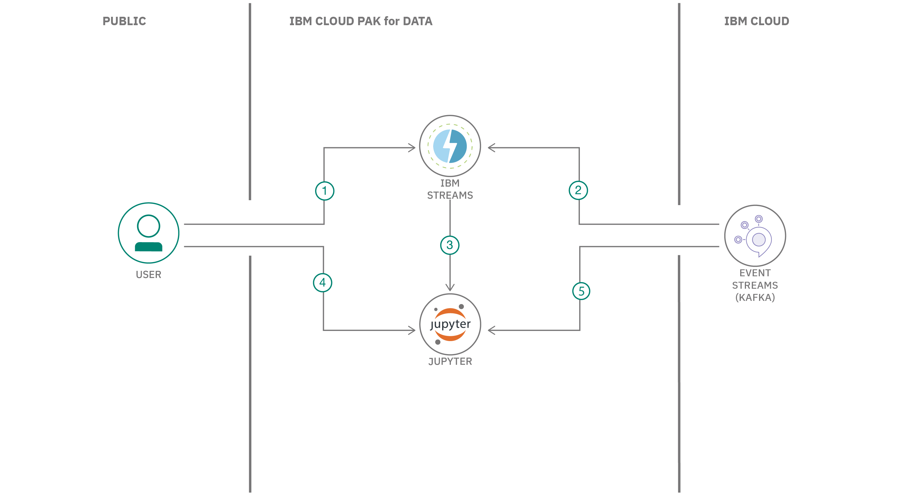

## まとめ

この開発者コード・パターンでは、リアルタイム・データ・パイプラインやストリーミング・アプリケーションの作成に使用される、最も人気のあるオープン・ソースの分散イベント・ストリーミング・プラットフォームの 1 つである Apache Kafka を使用したストリーミング・アプリケーションの作成の基本を説明します。このアプリケーションは、IBM Cloud Pak&reg; for DataのIBM Streamsを使用して構築されます。

## 説明

このパターンでは、Apache Kafka を利用したストリーミング・アプリケーションを作成するための基本的な手順を説明します。このアプリケーションは、IBM Cloud Pak for Data 上の IBM Streams を使用して構築します。IBM Streams は、ストリーミング・アプリケーションを視覚的に作成できる内蔵 IDE (Streams Flows) を提供しています。IBM Cloud Pak for Data プラットフォームは、複数のデータ・ソースとの統合、組み込みのアナリティクス、Jupyter Notebooks、機械学習などの追加サポートを提供します。

Apache Kafkaサービスには、Kafkaプラットフォーム上に構築された高スループットのメッセージバスであるIBM Event Streams on IBM Cloudを使用します。以下の例では、クリックストリーム・データ（オンライン・ショッピング・サイトを閲覧中のユーザーのクリックから取得したデータ）のソースとターゲットの両方として使用しています。

## フロー

1. ユーザーがIBM Streamsでストリーミングアプリを作成する。
1. ストリーミングアプリは、IBM Event Streamsを介してKafkaサービスを利用し、メッセージを送受信する。
1. IBM StreamsアプリからJupyterノートブックが生成される。
1. ユーザーがJupyter notebookでストリーミングアプリを実行する。
1. Jupyter notebookはIBM Event Streams経由でKafkaサービスにアクセスし、メッセージを送受信する。

##指示

[始める準備はできましたか？README](https://github.com/IBM/ibm-streams-with-kafka)では、以下の手順を説明しています。

1. レポをクローンする
1. IBMクラウド上のProvison Event Streams
1. サンプルKafkaコンソールPythonアプリの作成
1. IBM StreamsサービスをCloud Pak for Dataに追加する
1. Cloud Pak for Dataに新しいプロジェクトを作成する
1. Cloud Pak for DataでStreams Flowを作成します。
1. KafkaをソースとするStreams Flowを作成します。
1. Streams Flowオプションを使用してノートブックを生成する
1. 生成されたStreams Flowノートブックを実行する