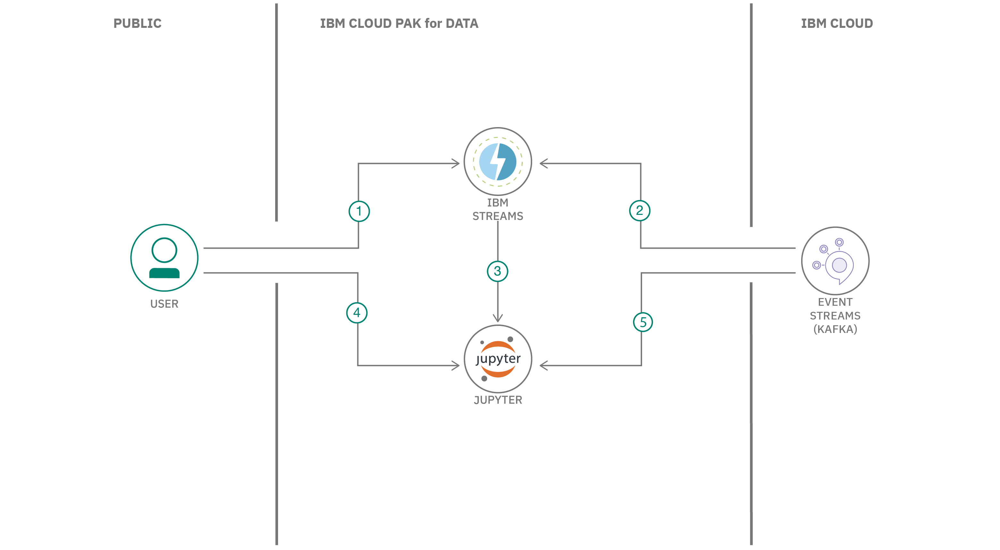

## Summary

In this developer code pattern, we walk you through the basics of creating a streaming application powered by Apache Kafka, one of the most popular open source distributed event-streaming platforms used for creating real-time data pipeline and streaming apps. The application will be built using IBM Streams on IBM Cloud Pak&reg; for Data.

## Description

In this pattern, we walk you through the basics of creating a streaming application powered by Apache Kafka. Our app will be built using IBM Streams on IBM Cloud Pak for Data. IBM Streams provides a built-in IDE (Streams Flows) that allows you to visually create a streaming app. The IBM Cloud Pak for Data platform provides additional support, such as integration with multiple data sources, built-in analytics, Jupyter Notebooks, and machine learning.

For our Apache Kafka service, we will be using IBM Event Streams on IBM Cloud, which is a high-throughput message bus built on the Kafka platform. In the following examples, we will show it as both a source and a target of clickstream data -- data captured from user clicks as they browsed online shopping websites.

## Flow

1. User creates streaming app in IBM Streams.
1. Streaming app uses Kafka service via IBM Event Streams to send/recieve messages.
1. Jupyter notebook is generated from IBM Streams app.
1. User executes streaming app in Jupyter notebook.
1. Jupyter notebook accesses Kafka service via IBM Event Streams to send/receive messages.

## Instructions

Ready to get started? The [README](https://github.com/IBM/ibm-streams-with-kafka) explains the steps to:

1. Clone the repo
1. Provison Event Streams on IBM Cloud
1. Create sample Kafka console Python app
1. Add IBM Streams service to Cloud Pak for Data
1. Create a new project in Cloud Pak for Data
1. Create a Streams Flow in Cloud Pak for Data
1. Create a Streams Flow with Kafka as source
1. Use Streams Flow option to generate a notebook
1. Run the generated Streams Flow notebook