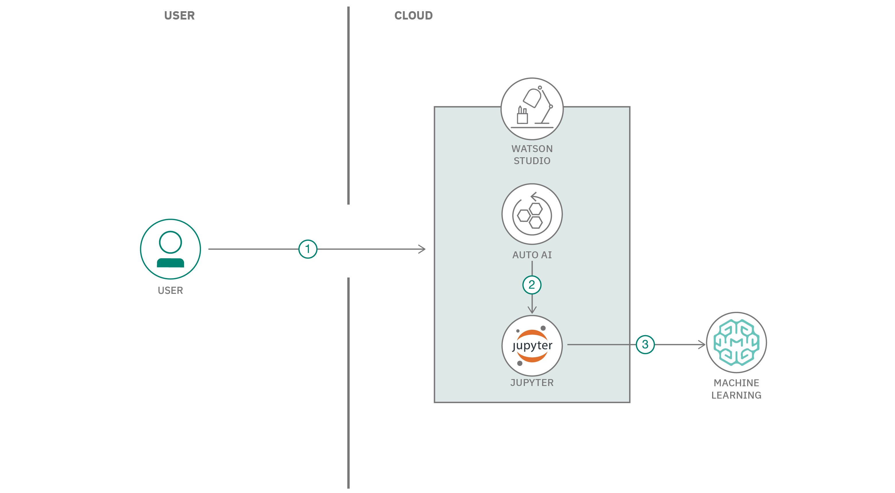

---
also_found_in:
- learningpaths/explore-autoai/
authors: ''
check_date: '2021-09-28'
completed_date: '2020-09-30'
components:
- watson-studio
draft: false
excerpt: Automatically generate a Jupyter Notebook that contains Python code of a
  machine learning model.
github:
- button_title: Get the code
  url: https://github.ibm.com/ibm-developer-eti-ai-analytics/AutoAI-code-generation
last_updated: '2020-09-30'
meta_description: Automatically generate a Jupyter Notebook that contains Python code
  of a machine learning model.
meta_keywords: watson machine learning, machine learning, python, jupyter notebook,
  models, machine learning models, autoai
meta_title: Generate a Python notebook for pipeline models using AutoAI
primary_tag: artificial-intelligence
related_content:
- slug: explore-autoai
  type: learningpaths
- slug: introduction-to-autoai
  type: blogs
- slug: build-a-predictive-model-using-tweets
  type: tutorials
subtitle: Automatically create a Jupyter Notebook that contains Python code of a machine
  learning model
tags:
- machine-learning
- python
- jupyter
title: Generate a Python notebook for pipeline models using AutoAI
---

## Summary

In this code pattern, learn how to use AutoAI to automatically generate a Jupyter Notebook that contains Python code of a machine learning model. Then, explore, modify, and retrain the model pipeline using Python before deploying the model in IBM Watson&reg; Machine Learning using Watson Machine Learning APIs.

## Description

AutoAI is a graphical tool available within IBM Watson Studio that analyzes your data set, generates several model pipelines, and ranks them based on the metric chosen for the problem. This code pattern shows extended features of AutoAI. More basic AutoAI exploration for the same data set is covered in the [Generate machine learning model pipelines to choose the best model for your problem](/tutorials/generate-machine-learning-model-pipelines-to-choose-the-best-model-for-your-problem-autoai/) tutorial.

When you have completed this code pattern, you understand how to:

* Run an AutoAI experiment
* Generate and save a Python notebook
* Execute the notebook and analyze results
* Make changes and retrain the model using Watson Machine Learning SDKs
* Deploy the model using Watson Machine Learning from within the notebook

## Flow

1. The user submits an AutoAI experiment using default settings.
1. Multiple pipeline models are generated. A pipeline model of choice from the leaderboard is saved as a Jupyter Notebook.
1. The Jupyter Notebook is executed, and a modified pipeline model is generated within the notebook.
1. The pipeline model is deployed in Watson Machine Learning using Watson Machine Learning APIs.

## Instructions

Get detailed instructions in the [readme](https://github.com/IBM/AutoAI-code-generation/blob/master/README.md) file. These instructions explain how to:

1. Run an AutoAI experiment.
1. Save the AutoAI-generated notebook.
1. Load and execute the notebook.
1. Deploy and score as a web service using a Watson Machine Learning instance.