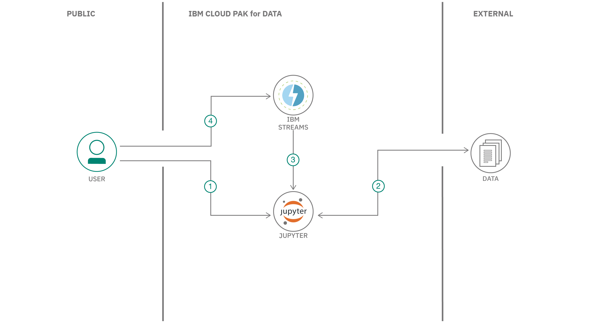

## まとめ

この開発者コードパターンでは、streamsx API を使用してストリーミング・アプリケーションを構築する Python コードを含む Jupyter Notebook を作成します。このアプリは、IBM Cloud Pak&reg; for Data の IBM Streams を使用して構築されます。

## 説明

Python API streamsxを使用すると、IBM Cloud Pak for Data上で動作するサービスであるIBM Streamsを使用するストリーミング・アプリケーションを構築することができます。IBM Cloud Pak for Data プラットフォームは、複数のデータ・ソースとの統合、組み込みのアナリティクス、Jupyter Notebooks、機械学習などの追加サポートを提供します。複数のコンピューティングリソースにプロセスを分散させることで、スケーラビリティが向上します。

このコードパターンでは、 streamsx Python APIを使用してJupyter Notebookを作成し、ストリーミングアプリケーションを構築します。このアプリは、ユーザーがショッピングサイトを閲覧する際のマウスクリックイベントを含むデータのストリームを処理します。

## フロー

1. ユーザーは、IBM Cloud Pak for Data で Jupyter Notebook を実行します。
1. クリックストリームのデータがストリーミングアプリに挿入される。
1. streamsx Python APIを使用したストリーミング・アプリがIBM Streamsサービスで実行される。
1. ユーザーがIBM Streamsサービスのジョブにアクセスしてイベントを閲覧する。

##指示

このパターンの詳細な手順は、[README](https://github.com/IBM/ibm-streams-with-python-api/blob/master/README.md)ファイルに記載されています。手順では、以下の方法を説明しています。

1. レポをクローンする。
1. IBM Streams サービスを IBM Cloud Pak for Data に追加します。
1. IBM Cloud Pak for Data で新しいプロジェクトを作成します。
1. データ・アセットをプロジェクトに追加します。
1. プロジェクトにノートブックを追加します。
1. ノートブックを実行します。
1. IBM Streamsのサービスパネルでジョブのステータスを確認する。
1. ジョブをキャンセルする。