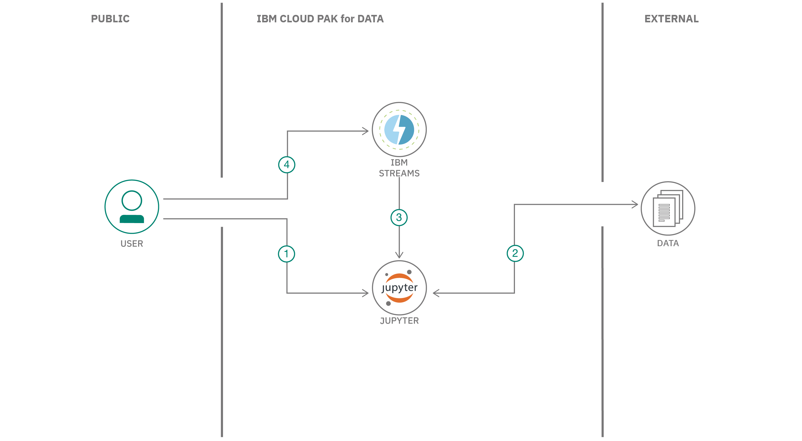

## Summary

In this developer code pattern, we will create a Jupyter Notebook that contains Python code that uses the streamsx API to build a streaming application. The app will be built using IBM Streams on IBM Cloud Pak&reg; for Data.

## Description

The Python API streamsx allows you to build streaming apps that use IBM Streams, a service that runs on IBM Cloud Pak for Data. The IBM Cloud Pak for Data platform provides additional support, such as integration with multiple data sources, built-in analytics, Jupyter Notebooks, and machine learning. Scalability is increased by distributing processes across multiple computing resources.

In this code pattern, we will build a streaming application by creating a Jupyter Notebook using the streamsx Python API. The app will process a stream of data containing mouse-click events from users as they browse a shopping website.

## Flow

1. User runs Jupyter Notebook in IBM Cloud Pak for Data.
1. Clickstream data is inserted into streaming app.
1. Streaming app using the streamsx Python API is executed in the IBM Streams service.
1. User accesses IBM Streams service job to view events.

## Instructions

Find the detailed steps for this pattern in the [README](https://github.com/IBM/ibm-streams-with-python-api/blob/master/README.md) file. The steps will show you how to:

1. Clone the repo.
1. Add IBM Streams service to IBM Cloud Pak for Data.
1. Create a new project in IBM Cloud Pak for Data.
1. Add a data asset to your project.
1. Add a notebook to your project.
1. Run the notebook.
1. View job status in IBM Streams service panel.
1. Cancel the job.