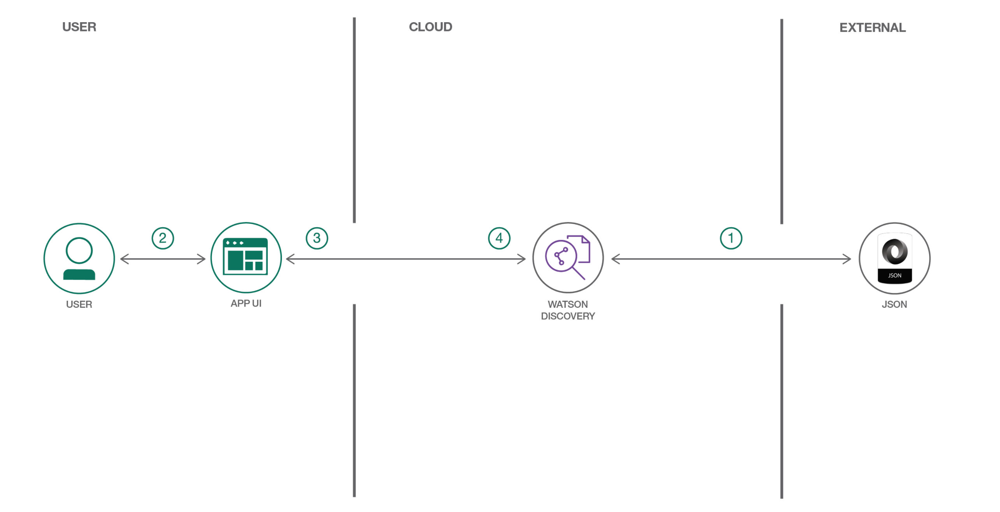

---
also_found_in:
- learningpaths/get-started-watson-discovery/
authors: ''
completed_date: '2018-02-21'
components:
- watson-discovery
demo:
- button_title: View the demo
  type: youtube
  url_or_id: 5EEmQwcjUa4
draft: false
excerpt: Walk through a working example of a web application that queries and manipulates
  data from the Watson Discovery Service. This web app contains multiple UI components
  that you can use as a starting point for developing your own Watson Discovery Service
  applications.
github:
- button_title: Get the code
  url: https://github.com/IBM/watson-discovery-ui
last_updated: '2020-03-05'
meta_description: Walk through a working example of a web application that queries
  and manipulates data from the Watson Discovery Service. This web app contains multiple
  UI components that you can use as a starting point for developing your own Watson
  Discovery Service applications.
meta_keywords: node.js, Watson Discovery
meta_title: Create an app to perform intelligent searches on data
primary_tag: artificial-intelligence
pta:
- cognitive, data, and analytics
pwg:
- watson discovery
related_links:
- title: Overview of the IBM Watson Discovery service
  url: https://www.ibm.com/watson/services/discovery/Extract value from unstructured
    data by converting, normalizing, enriching it.
- description: Download the Watson Node SDK.
  title: Watson Node.js SDK
  url: https://github.com/watson-developer-cloud/node-sdk
- description: Learn how this code pattern fits into the Cognitive discovery Reference
    Architecture.
  title: Architecture center
  url: https://www.ibm.com/cloud/garage/architectures/cognitiveDiscoveryDomain/0_1
- description: Unlock new intelligence from vast quantities of structured and unstructured
    data and develop deep, predictive insights.
  title: Cognitive for intelligence and insights from data
  url: https://www.ibm.com/cloud/garage/architectures/cognitiveArchitecture
- description: Try an app to filter and sort Airbnb Review Data for Ausin, TX
  title: Try the app
  url: https://watson-discovery-ui-demo.mybluemix.net/
runtimes:
- sdk-for-node-js
service-id: wdui
services:
- discovery
subtitle: Develop a web app to extract and visualize enriched data using Node.js and
  Watson Discovery
tags:
- node-js
title: Create an app to perform intelligent searches on data
type: default
---

**Note:** This code pattern uses Watson Discovery V1, and will not work with Discovery V2. However, you can still use it to learn the Discovery features. Future plans include updating the code pattern to work with Discovery V2.

## Summary

A standard search for a site can return too many results for someone to want to go through. However, it's possible to quickly build out a search interface for your IBM Watson Discovery instance using out-of-the-box UI components that query and manipulate the enriched data to return more relevant search results. This code pattern uses publicly available reviews on Airbnb listings to demonstrate how to use individual UI components to visualize insights. You can then easily switch out the data set to adapt it to your own use cases.

## Description

By querying and manipulating enriched data, you can build a more insightful search interface. This code pattern provides a Node.js app built on the Watson Discovery Service that does just that. The pattern demonstrates how you can use individual out-of-the-box UI components to extract and visualize the enriched data provided by the Discovery analytics engine.

The main benefit of using the Watson Discovery Service is its powerful analytics engine that provides cognitive enrichments and insights into your data. The app in this code pattern provides examples of how to showcase these enrichments through the use of filters, lists, and graphs. The key enrichments are:

* Entities: People, companies, organizations, cities, and more
* Categories: Classification of the data into a hierarchy of categories up to 5 levels deep
* Concepts: Identified general concepts that aren't necessarily referenced in the data
* Keywords: Important topics typically used to index or search the data
* Sentiment: The overall positive or negative sentiment of each document

The app uses standard search UI components such as filter lists, tag clouds, and sentiment graphs, but also more complex Discovery options such as the passages and highlight features. With these two features, the app identifies the most relevant snippets in your data based on your query and is more likely to return the data that you're searching for.

When you have completed this code pattern, you should know how to:

* Load and enrich data in the Watson Discovery Service
* Query and manipulate data in the Watson Discovery Service
* Create UI components to represent enriched data created by the Watson Discovery Service
* Build a complete web app that uses popular JavaScript technologies to feature Watson Discovery Service data and enrichments

## Flow

1. Add the Airbnb review JSON files to the Discovery collection.
1. Use the app UI to interact with the back-end server. The front-end app UI uses React to render search results and can reuse all of the views that are used by the back end for server-side rendering. The front end is using semantic-ui-react components and is responsive.
1. Discovery processes input and routes it to the back-end server, which is responsible for server-side rendering of the views displayed on the browser. The back-end server is written using Express and uses an express-react-views engine to render views that are written using React.
1. The back-end server sends user requests to the Watson Discovery Service. It acts as a proxy server, forwarding queries from the front end to the Watson Discovery Service API while keeping sensitive API keys concealed from the user.

## Instructions

Ready to put this code pattern to use? Complete details on how to get started running and using this application are in the <a href="https://github.com/IBM/watson-discovery-ui/blob/master/README.md" target="_blank" rel="noopener noreferrer">README</a>.