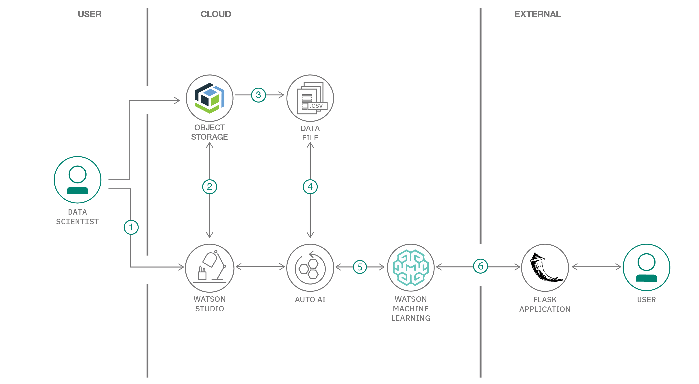

---
also_found_in:
- learningpaths/explore-autoai/
authors: ''
completed_date: '2020-06-04'
components:
- watson-studio
demo:
- button_title: Watch the demo
  type: demo
  url_or_id: https://developer.ibm.com/videos/machine-learning-tutorial-ibm-watson-autoai-data-exploration-and-visualization
draft: false
excerpt: Create a web application that uses linear regression to predict your insurance
  premium cost with IBM Watson Studio and AutoAI.
github:
- button_title: Get the code
  url: https://github.com/IBM/predict-insurance-charges-with-ai
last_updated: '2020-06-04'
meta_description: Create a web application that uses linear regression to predict
  your insurance premium cost with IBM Watson Studio and AutoAI.
meta_keywords: AutoAI, Watson Studio, linear regression, machine learning
meta_title: Create a machine learning web app to predict your insurance premium cost
primary_tag: artificial-intelligence
related_content:
- slug: automate-model-building-with-autoai
  type: tutorials
- slug: get-started-watson-studio
  type: learningpaths
- slug: whats-new-on-the-ibm-data-asset-exchange
  type: blogs
subtitle: Create a web application that uses linear regression to predict your insurance
  premium cost with IBM Watson Studio and AutoAI
tags:
- machine-learning
- python
- object-storage
title: Create a machine learning web app to predict your insurance premium cost
type: default
---

## Summary

As we see the value of gross insurance premiums worldwide continue to skyrocket past 5 trillion dollars, we know that most of these costs are preventable. For example, just by eliminating smoking and lowering your BMI by a few points might mean shaving thousands of dollars from your premium charges. In this application, we study the effects of age, smoking, BMI, gender, and region to determine how much of a difference these factors can make on your insurance premium. By using our application, customers see the radical difference their lifestyle choices make on their insurance charges. By leveraging artificial intelligence (AI) and machine learning, we help customers understand just how much smoking increases their premium by predicting how much they will have to pay within seconds.

## Description

Using IBM AutoAI, we automate all of the tasks involved in building predictive models for different requirements. You see how AutoAI generates great models quickly, which saves time and effort, and aids in a faster decision-making process. You create a model from a data set that includes the age, gender, BMI, number of children, smoking preferences, region, and charges to predict the health insurance premium cost that an individual pays.

When you have completed this code pattern, you understand how to:

* Quickly set up the services on IBM Cloud to build the model
* Ingest the data and initiate the AutoAI process
* Build different models using AutoAI and evaluate the performance
* Choose the best model and complete the deployment
* Generate predictions using the deployed model by making REST calls
* Compare the process of using AutoAI and building the model manually
* Visualize the deployed model using a front-end application

## Flow

1. The user creates an IBM Watson Studio Service on IBM Cloud.
1. The user creates an IBM Cloud Object Storage Service and adds that to Watson Studio.
1. The user uploads the insurance premium data file into Watson Studio.
1. The user creates an AutoAI Experiment to predict an insurance premium on Watson Studio.
1. AutoAI uses Watson Machine Learning to create several models, and the user deploys the best performing model.
1. The user uses the Flask web application to connect to the deployed model and predict an insurance charge.

## Instructions

Get detailed instructions in the [readme](https://github.com/IBM/predict-insurance-charges-with-ai/blob/master/README.md) file. Those steps tell you how to:

1. Download the data set.
1. Clone the repo.
1. Explore the data (optional).
1. Create IBM Cloud services.
1. Create and run AutoAI Experiment.
1. Create a deployment and test your model.
1. Create a notebook from your model (optional).
1. Run the application.