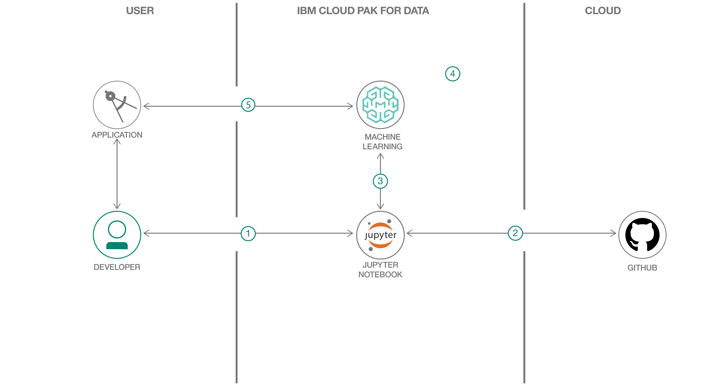

---
also_found_in:
- /learningpaths/cloud-pak-for-data-learning-path/
authors: ''
completed_date: '2019-10-04'
components:
- cloud-pak-for-data
- jupyter
- watson-machine-learning
draft: false
excerpt: IBM Cloud Pak for Dataを使用して、データ・サイエンス・パイプライン全体を通し、ビジネス上の問題を解決し、ドイツの信用リスク・データセットを使用してローンのデフォルトを予測します。
github:
- button_title: Get the code
  url: https://github.com/IBM/predict-credit-risk-with-jupyter-on-cloud-pak-for-data
ignore_prod: false
last_updated: '2021-07-22'
meta_description: IBM Cloud Pak for Dataを使用して、データ・サイエンス・パイプライン全体を通し、ビジネス上の問題を解決し、ドイツの信用リスク・データセットを使用してローンのデフォルトを予測します。
meta_keywords: IBM Cloud Pak for Data, data analysis, model building, Watson machine
  learning
meta_title: ビジネス上の問題を解決し、ドイツの信用リスクデータセットを使用してローンのデフォルトを予測することができます。
primary_tag: analytics
pta:
- cognitive, data, and analytics
pwg:
- analytics
subtitle: IBM Cloud Pak for DataのWatson Machine LearningとJupyter Notebooksを使って、負荷のデフォルトを予測する。
tags:
- analytics
- data-management
- data-science
- databases
- machine-learning
title: ビジネス上の問題を解決し、ドイツの信用リスクデータセットを使用してローンのデフォルトを予測することができます。
type: default
---

## まとめ

この開発者コード・パターンでは、IBM Cloud Pak for Data を使用してデータ・サイエンス・パイプライン全体を通し、ビジネス問題を解決し、ドイツの信用リスク・データセットを使用してローンのデフォルトを予測します。IBM Cloud Pak for Data は、インタラクティブでコラボレーション可能なクラウドベースの環境です。データ・サイエンティスト、開発者、その他データ・サイエンスに関心のある人が、ツールを使ってコラボレーション、共有、データからのインサイトの収集を行い、機械学習や深層学習モデルを構築してデプロイするのに役立ちます。

## 説明

ローンのデフォルトを予測することは、多くの金融機関やその他の関連ビジネスにとって不可欠です。このユースケースでは、私たちが構築する機械学習モデルは、「リスク」（ローン申請者の特徴から、ローンのデフォルトの可能性が高いと予測される）または「リスクなし」（申請者の入力から、ローンが完済されると予測される）の予測を返す分類モデルです。この研究室では、人気の高いライブラリやフレームワークを使って、PythonでJupyter notebookを使ってモデルを構築するアプローチをとります。

このコードパターンを完成させると、以下の方法を理解することができます。

* [Jupyter Notebooks](https://jupyter.org/)を使用して、データを読み込み、視覚化し、分析する。
* [IBM Cloud Pak for Data](https://www.ibm.com/analytics/cloud-pak-for-data) でノートブックを実行する。
* IBM Cloud Pak for Data上で[Spark MLib](https://spark.apache.org/mllib/)を使用して、機械学習モデルを構築、テスト、デプロイします。
* IBM Cloud Pak for Dataを使って、選択した機械学習モデルを本番環境にデプロイする。
* クライアントとインターフェイスするフロントエンド・アプリケーションを作成して、デプロイしたモデルの消費を開始する。

## フロー

1. ユーザーは、Jupyter Notebook を IBM Cloud Pak for Data プラットフォームにロードします。
1. [ドイツのクレジットデータ](https://github.com/IBM/predict-credit-risk-with-jupyter-on-cloud-pak-for-data/blob/main/data/german_credit_data.csv)をJupyter Notebookにロードします。GitHub repoから直接ロードするか、前のチュートリアルに従った後に仮想化データとしてロードします。
1. データを前処理し、機械学習モデルを構築し、IBM Cloud Pak for Data上のIBM Watson Machine Learningに保存します。
1. 選択した機械学習モデルを IBM Cloud Pak for Data プラットフォーム上の本番環境にデプロイし、スコアリング・エンドポイントを取得します。
1. フロントエンド・アプリケーションを使用して、モデルを信用予測に使用します。

##指示

[このコードパターンを使用する準備ができましたか？README](https://github.com/IBM/predict-credit-risk-with-jupyter-on-cloud-pak-for-data/blob/master/README.md)には、このアプリケーションを起動して使用する方法の詳細が記載されています。

1. 新しいプロジェクトを作成します。
1. 機械学習のデプロイメント用のスペースを作成する。
1. IBM Cloud Pak for Data の学習パスを利用していない場合は、データセットをアップロードします。
1. Jupyter Notebook を IBM Cloud Pak for Data にインポートします。
1. ノートブックを実行します。
1. IBM Cloud Pak for Data の UI を使用してモデルをデプロイします。
1. モデルをテストします。
1. モデルを使用するPython Flaskアプリを作成します。

## Conclusion

このコードパターンでは、IBM Cloud Pak for Data を使用し、データ・サイエンス・パイプライン全体を通して、ビジネス上の問題を解決し、ドイツの信用リスク・データセットを使用してローンのデフォルトを予測する方法を示しました。