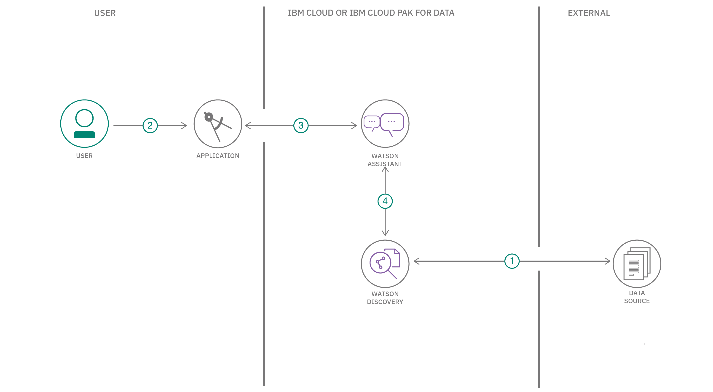

---
also_found_in:
- learningpaths/get-started-watson-discovery/
authors: ''
completed_date: '2020-03-05'
components:
- watson-discovery
- watson-assistant
- cloud-pak-for-data
- ibm-cloud-functions
demo:
- button_title: Watch the demo
  type: demo
  url_or_id: https://youtu.be/Jpr3wVH3FVA
draft: false
excerpt: Build a chatbot using the Watson Assistant search skill and Watson Discovery.
github:
- button_title: Get the code
  url: https://github.com/IBM/watson-assistant-with-search-skill
last_updated: '2021-09-21'
meta_description: Build a chatbot using the Watson Assistant search skill and Watson
  Discovery.
meta_keywords: watson, chatbot, smart document understanding, watson assistant, search
  skill
meta_title: Enhance customer helpdesks with Smart Document Understanding using the
  Watson Assistant search skill
primary_tag: artificial-intelligence
subtitle: Build a chatbot using the Watson Assistant search skill and Watson Discovery
tags:
- node-js
title: Enhance customer helpdesks with Smart Document Understanding using the Watson
  Assistant search skill
type: default
---

## Summary

In this developer code pattern, we use the typical customer care chatbot experience, but instead of relying on predefined responses the dialog provides a hook that can call out to other IBM&reg; Watson&trade; services for additional sources of information. In this case, it's an owners manual that has been uploaded to Watson Discovery.

**Note:** This code pattern includes instructions for accessing Watson services running on both <a href="https://www.ibm.com/cloud" target="_blank" rel="noopener noreferrer">IBM Cloud</a> and on any cloud with <a href="https://www.ibm.com/products/cloud-pak-for-data" target="_blank" rel="noopener noreferrer">IBM Cloud Pak for Data</a>.

## Description

The typical customer care chatbot can answer simple questions, such as store locations, hours, and directions, and maybe even make appointments. When a question falls outside of the scope of the pre-determined question set, the option is typically to tell the customer that the question isn’t valid or offer to speak to a real person.

In this code pattern, we provide another option. If the customer question is about the operation of a device, we use the search skill feature of Watson Assistant to pass the question on to the Watson Discovery service, which has been pre-loaded with the device's owners manual. So now, instead of "Would you like to speak to a customer representative?," we can return relevant sections of the owners manual to help solve the customers' problems.

To take it a step further, we use the Smart Document Understanding feature of Watson Discovery to train it on what text in the owners manual is important and what is not. This improves the answers returned from the queries.

In summary, this code pattern will:

* Create a customer care dialog skill in Watson Assistant
* Use Smart Document Understanding to build an enhanced Watson Discovery collection
* Create a Watson Assistant search skill that allows the Assistant dialog to post queries to Watson Discovery

## Flow

1. The document is annotated by using Watson Discovery SDU.
1. The user interacts with the back-end server through the app UI. The front-end app UI is a chatbot that engages the user in a conversation.
1. Dialog between the user and back-end server is coordinated using a Watson Assistant dialog skill.
1. If the user asks a product operation question, a search query is issued to the Watson Discovery service through a Watson Assistant search skill.

## Instructions

Find the detailed instructions in the <a href="https://github.com/IBM/watson-assistant-with-search-skill/blob/master/README.md" target="_blank" rel="noopener noreferrer">Readme</a> file. These steps will explain how to:

1. Clone the repository.
1. Create Watson services.
1. Configure Watson Discovery.
1. Configure the Watson Assistant service.
1. Add Watson service credentials to the environment file.
1. Run the application.